# Imboy - AI 上下文文档

> **最后更新**: 2026-01-20 08:48:18 CST
> **版本**: 0.7.3
> **架构**: 单应用 4 层架构 (Handler -> Logic -> DS -> Repo)

---

## 变更记录 (Changelog)

### 2026-02-01
- 完成 E2EE+ 密钥恢复方案后端实现
- 新增模块：3 个 Repo、2 个 Logic、2 个 Handler、2 个 DS、1 个 Lib
- 更新代码统计：145 个源文件（+11），144+ 个测试文件（+4）
- 所有 E2EE 测试通过（40/40）
- 新增 E2EE 设备间传输、社交恢复、本地备份三种密钥恢复方法

### 2026-01-20
- 重新初始化 AI 上下文文档
- 更新代码统计：134 个源文件，140+ 个测试文件
- 新增 E2EE (端到端加密) 支持
- 完善模块索引与 Mermaid 结构图
- 更新消息路由器逻辑

### 2026-01-07
- 增量更新 AI 上下文文档，完善模块索引
- 更新代码统计：134 个源文件，140+ 个测试文件
- 优化覆盖率统计：整体 65%，各层详细分析
- 补充模块间依赖关系和调用链路

### 2026-01-06
- 强化数据库访问规范：明确要求所有数据库操作必须使用 `elib_pg` 模块
- 完善 ID 编码/解码规范分析文档

### 2026-01-05
- 增量更新文档索引
- 新增 `elib_async.erl` 和 `elib_retry.erl` 工具库文档
- 完善异步执行与重试机制说明

### 2026-01-03
- 初始化 AI 上下文文档
- 完成项目架构分析
- 生成模块索引与 Mermaid 结构图

---

## 项目愿景

Imboy 是一款基于 **Erlang/OTP 28+**、**Cowboy 2.10** 和 **PostgreSQL 18** 的高性能即时通讯（IM）系统。

### 核心特性
- 高并发：单机支持 100 万+ TCP 连接（阿里云 8 核 16G 压测验证）
- 分布式：支持多节点集群部署
- 实时通讯：WebSocket + HTTP/RESTful 双协议
- 安全性：JWT 认证、RSA 加密、HashID 混淆、端到端加密 (E2EE)
- 可扩展：基于 PostgreSQL 18+ 的关系型数据库，支持全文检索、地理位置、时序数据

### 技术栈
| 层级 | 技术 |
|------|------|
| 语言 | Erlang/OTP 28+ |
| Web 框架 | Cowboy 2.10 (HTTP/WS) |
| 数据库 | PostgreSQL 18+ (pg_jieba, postgis, timescaledb, pgcrypto) |
| 缓存 | depcache (Erlang 内存缓存) |
| 连接池 | epgsql + pooler |
| 日志 | lager |

---

## 架构总览

### 设计原则

Imboy 遵循 **DDD（领域驱动设计）** 思想，采用 **单应用 4 层架构**：

```
┌─────────────────────────────────────────────────────────────┐
│                    Handler 层 (API)                          │
│  ┌──────────────┐  ┌──────────────┐  ┌──────────────┐      │
│  │   HTTP REST  │  │   WebSocket  │  │   Admin API  │      │
│  │    Handler   │  │    Handler   │  │    Handler   │      │
│  │  (29 modules)│  │              │  │  (7 modules) │      │
│  │  +2 E2EE     │  │              │  │              │      │
│  └──────────────┘  └──────────────┘  └──────────────┘      │
└─────────────────────────────────────────────────────────────┘
                            ↓
┌─────────────────────────────────────────────────────────────┐
│                    Logic 层 (业务逻辑)                        │
│  ┌──────────────┐  ┌──────────────┐  ┌──────────────┐      │
│  │ Friend Logic │  │  Group Logic │  │   Msg Logic  │      │
│  │              │  │              │  │  (28 modules)│      │
│  │              │  │              │  │  +2 E2EE     │      │
│  └──────────────┘  └──────────────┘  └──────────────┘      │
└─────────────────────────────────────────────────────────────┘
                            ↓
┌─────────────────────────────────────────────────────────────┐
│                    DS 层 (数据服务)                           │
│  ┌──────────────┐  ┌──────────────┐  ┌──────────────┐      │
│  │   User DS    │  │   Auth DS    │  │   Config DS  │      │
│  │  (15 modules)│  │              │  │              │      │
│  │  +2 E2EE     │  │              │  │              │      │
│  └──────────────┘  └──────────────┘  └──────────────┘      │
└─────────────────────────────────────────────────────────────┘
                            ↓
┌─────────────────────────────────────────────────────────────┐
│                    Repo 层 (数据访问)                         │
│  ┌──────────────┐  ┌──────────────┐  ┌──────────────┐      │
│  │  User Repo   │  │  Friend Repo │  │   Msg Repo   │      │
│  │ (35 modules) │  │              │  │              │      │
│  │  +3 E2EE     │  │              │  │              │      │
│  └──────────────┘  └──────────────┘  └──────────────┘      │
└─────────────────────────────────────────────────────────────┘
                            ↓
┌─────────────────────────────────────────────────────────────┐
│                    PostgreSQL 数据库                          │
└─────────────────────────────────────────────────────────────┘

        ┌──────────────────────────────────────┐
        │          Lib 层 (基础设施)            │
        │  elib_pg | imboy_cache | imboy_syn  │
        │  elib_async | elib_retry (30 mod)  │
        │  +shamir_secret_sharing             │
        └──────────────────────────────────────┘
```

### 目录结构

```
imboy/
├── src/
│   ├── api/              # HTTP REST API 处理器 (27 个)
│   ├── adm/              # 管理后台 API 处理器 (7 个)
│   ├── logic/            # 业务逻辑层 (26 个)
│   ├── ds/               # 数据服务层 (13 个)
│   ├── repo/             # 数据仓库层 (32 个)
│   └── lib/              # 基础库函数 (29 个)
├── test/                 # EUnit 测试 (140+ 个测试文件)
├── doc/                  # 项目文档
├── config/               # 配置文件
├── priv/                 # 私有文件（静态资源、SSL 证书）
└── Makefile              # 构建工具
```

---

## 模块结构图

```mermaid
graph TD
    ROOT["(根) Imboy 项目<br/>v0.7.3"]

    ROOT --> API["src/api<br/>HTTP REST API<br/>27 个模块"]
    ROOT --> ADM["src/adm<br/>管理后台 API<br/>7 个模块"]
    ROOT --> LOGIC["src/logic<br/>业务逻辑<br/>26 个模块"]
    ROOT --> DS["src/ds<br/>数据服务<br/>13 个模块"]
    ROOT --> REPO["src/repo<br/>数据仓库<br/>32 个模块"]
    ROOT --> LIB["src/lib<br/>基础库<br/>29 个模块"]
    ROOT --> TEST["test<br/>测试<br/>140+ 文件"]

    API --> API_WS["websocket_handler.erl<br/>WebSocket 连接"]
    API --> API_MSG["msg_handler.erl<br/>消息处理"]
    API --> API_USER["user_handler.erl<br/>用户管理"]
    API --> API_FRIEND["friend_handler.erl<br/>好友管理"]
    API --> API_GROUP["group_handler.erl<br/>群组管理"]
    API --> API_AUTH["passport_handler.erl<br/>认证登录"]
    API --> API_E2EE["e2ee_handler.erl<br/>端到端加密"]

    ADM --> ADM_PASS["adm_passport_handler.erl<br/>后台登录"]
    ADM --> ADM_FEEDBACK["adm_feedback_handler.erl<br/>反馈管理"]
    ADM --> ADM_VERSION["adm_app_version_handler.erl<br/>版本管理"]

    LOGIC --> LOGIC_MSG["msg_c2c_logic.erl<br/>单聊逻辑"]
    LOGIC --> LOGIC_GROUP["group_logic.erl<br/>群组逻辑"]
    LOGIC --> LOGIC_WS["websocket_logic.erl<br/>WS 业务逻辑"]
    LOGIC --> LOGIC_USER["user_logic.erl<br/>用户逻辑"]
    LOGIC --> LOGIC_AUTH["auth_logic.erl<br/>认证逻辑"]
    LOGIC --> LOGIC_E2EE["e2ee_logic.erl<br/>E2EE 逻辑"]
    LOGIC --> LOGIC_MSG_ROUTER["message_router_logic.erl<br/>消息路由器"]

    DS --> DS_USER["user_ds.erl<br/>用户数据服务"]
    DS --> DS_AUTH["auth_ds.erl<br/>认证数据服务"]
    DS --> DS_CONFIG["config_ds.erl<br/>配置数据服务"]
    DS --> DS_MSG["message_ds.erl<br/>消息数据服务"]
    DS --> DS_WS["websocket_ds.erl<br/>WebSocket DS"]
    DS --> DS_MSG_STORE["msg_store_ds.erl<br/>消息存储服务"]
    DS --> DS_MSG_WORKER["msg_store_worker.erl<br/>批量写入"]

    REPO --> REPO_USER["user_repo.erl<br/>用户仓库"]
    REPO --> REPO_MSG["msg_c2c_repo.erl<br/>消息仓库"]
    REPO --> REPO_GROUP["group_repo.erl<br/>群组仓库"]
    REPO --> REPO_FRIEND["friend_repo.erl<br/>好友仓库"]
    REPO --> REPO_DEVICE["user_device_repo.erl<br/>设备仓库"]

    LIB --> LIB_PG["elib_pg.erl<br/>数据库连接"]
    LIB --> LIB_CACHE["imboy_cache.erl<br/>缓存封装"]
    LIB --> LIB_SYN["imboy_syn.erl<br/>分布式同步"]
    LIB --> LIB_ASYNC["elib_async.erl<br/>异步执行"]
    LIB --> LIB_RETRY["elib_retry.erl<br/>重试机制"]
    LIB --> LIB_HASHID["elib_hashids.erl<br/>ID 编码/解码"]
    LIB --> LIB_CIPHER["elib_cipher.erl<br/>加密/解密"]

    click ROOT "./CLAUDE.md" "查看根目录文档"
    click API "./src/api/CLAUDE.md" "查看 API 层文档"
    click ADM "./src/adm/CLAUDE.md" "查看 ADM 层文档"
    click LOGIC "./src/logic/CLAUDE.md" "查看 Logic 层文档"
    click DS "./src/ds/CLAUDE.md" "查看 DS 层文档"
    click REPO "./src/repo/CLAUDE.md" "查看 Repo 层文档"
    click LIB "./src/lib/CLAUDE.md" "查看 Lib 层文档"

    style ROOT fill:#e1f5fe,stroke:#01579b,stroke-width:3px
    style API fill:#fff3e0,stroke:#e65100,stroke-width:2px
    style ADM fill:#fce4ec,stroke:#880e4f,stroke-width:2px
    style LOGIC fill:#e8f5e9,stroke:#1b5e20,stroke-width:2px
    style DS fill:#f3e5f5,stroke:#4a148c,stroke-width:2px
    style REPO fill:#fff9c4,stroke:#f57f17,stroke-width:2px
    style LIB fill:#e0f2f1,stroke:#004d40,stroke-width:2px
    style TEST fill:#efebe9,stroke:#3e2723,stroke-width:1px
```



---

## 模块索引

详细的模块索引已拆分为独立文档，详见：[doc/modules/](./doc/modules/)

### 快速查找

| 层级 | 目录 | 数量 | 说明 | 文档 |
|------|------|------|------|------|
| **Handler** | `src/api/` | 27 个 | HTTP REST API 处理器 | [API 层](./src/api/CLAUDE.md) |
| **Admin** | `src/adm/` | 7 个 | 管理后台 API 处理器 | [ADM 层](./src/adm/CLAUDE.md) |
| **Logic** | `src/logic/` | 26 个 | 业务逻辑层 | [Logic 层](./src/logic/CLAUDE.md) |
| **DS** | `src/ds/` | 13 个 | 数据服务层 | [DS 层](./src/ds/CLAUDE.md) |
| **Repo** | `src/repo/` | 32 个 | 数据仓库层 | [Repo 层](./src/repo/CLAUDE.md) |
| **Lib** | `src/lib/` | 29 个 | 基础库函数 | [Lib 层](./src/lib/CLAUDE.md) |

### 按功能查找

| 功能 | Handler | Logic | DS | Repo |
|------|---------|-------|-----|------|
| 用户管理 | `user_handler` | `user_logic` | `user_ds` | `user_repo` |
| 认证授权 | `passport_handler` | `passport_logic` | `auth_ds` | `token_repo` |
| 好友管理 | `friend_handler` | `friend_logic` | `friend_ds` | `friend_repo` |
| 群组管理 | `group_handler` | `group_logic` | `group_ds` | `group_repo` |
| 消息处理 | `msg_handler` | `msg_c2c_logic` | `message_ds` | `msg_c2c_repo` |
| WebSocket | `websocket_handler` | `websocket_logic` | `websocket_ds` | - |
| E2EE | `e2ee_handler` | `e2ee_logic` | - | `user_device_repo` |

**详细索引**: [doc/modules/README.md](./doc/modules/README.md)

---

## 运行与开发

### 环境要求

- **Erlang/OTP**: 28+
- **PostgreSQL**: 18+
- **扩展**: pg_jieba, postgis, timescaledb, pgcrypto, pg_trgm

### 快速启动

```bash
# 编译
make compile

# 运行 (local 环境)
IMBOYENV=local make run

# 运行 (dev 环境)
IMBOYENV=dev make run

# 指定端口运行
IMBOYENV=local make run HTTP_PORT=9800
```

### 构建发布

```bash
# 构建 local 版本
IMBOYENV=local make rel

# 构建 dev 版本
IMBOYENV=dev make rel

# 升级发布
IMBOYENV=local make relup
```

### 分布式启动

```bash
# 启动 node1 (端口 9801)
make start node=node1 port=9801

# 启动 node2 (端口 9802)
make start node=node2 port=9802 cookie=imboycookie
```

### 测试

```bash
# 运行所有测试
make eunit

# 运行特定测试
erl -noshell -eval "eunit:test([user_repo_tests], [verbose])" -s init stop

# 代码检查
make dialyze

# 代码格式化
./efmt -w src/api/user_handler.erl
```

### 远程调试

```bash
# 连接到远程节点
_rel/imboy/bin/imboy remote_console

# 从外部连接
erl -name debug@127.0.0.1 -setcookie imboy
net_adm:ping('imboy@127.0.0.1').
```

---

## 测试策略

### 测试文件组织

```
test/
├── api/           # API 层测试 (50+)
├── adm/           # 管理后台测试 (5+)
├── logic/         # 业务逻辑测试 (20+)
├── ds/            # 数据服务测试 (10+)
├── repo/          # 数据仓库测试 (40+)
├── lib/           # 基础库测试 (30+)
└── common/        # 测试辅助模块 (5+)
```

### 测试配置

- **超时**: 30 秒
- **环境标记**: `application:set_env(imboy, env, test)`
- **测试框架**: EUnit
- **Mock 库**: meck

### 关键测试模块

| 测试模块 | 测试内容 |
|---------|---------|
| `user_repo_tests.erl` | 用户数据仓库测试 |
| `msg_c2c_logic_tests.erl` | 单聊消息逻辑测试 |
| `websocket_logic_tests.erl` | WS 业务逻辑测试 |
| `auth_logic_tests.erl` | 认证逻辑测试 |
| `group_logic_tests.erl` | 群组逻辑测试 |

---

## 编码规范

详细的编码规范已拆分为独立文档，详见：

### 规范文档

- **UTF-8 编码**: [doc/standards/utf8-encoding.md](./doc/standards/utf8-encoding.md)
- **错误码规范**: [doc/standards/error-codes.md](./doc/standards/error-codes.md)
- **数据库访问**: [doc/architecture/database-access.md](./doc/architecture/database-access.md)
- **HashID 编码**: [doc/standards/hashid-encoding.md](./doc/standards/hashid-encoding.md)
- **API 格式**: [doc/standards/api-format.md](./doc/standards/api-format.md)

### 快速参考

| 规范 | 核心要点 | 文档 |
|------|---------|------|
| **UTF-8 编码** | 中文字符串使用 `/utf8` 后缀 | [utf8-encoding.md](./doc/standards/utf8-encoding.md) |
| **错误码** | 使用宏定义，如 `?ERR_OK`, `?ERR_NOT_FOUND` | [error-codes.md](./doc/standards/error-codes.md) |
| **数据库访问** | 所有数据库操作必须使用 `elib_pg` 模块 | [database-access.md](./doc/architecture/database-access.md) |
| **HashID** | 输入 decode，输出 encode，数据库使用原始 ID | [hashid-encoding.md](./doc/standards/hashid-encoding.md) |
| **API 格式** | HTTP JSON 响应，WebSocket 消息格式 | [api-format.md](./doc/standards/api-format.md) |

### 常用示例

#### UTF-8 编码
```erlang
% ✅ 正确
<<"操作成功"/utf8>>

% ❌ 错误
<<"操作成功">>
```

#### 错误码
```erlang
% 使用宏定义
-include("error_code.hrl").
elib_response:error(Req, error_msg(?ERR_USER_NOT_FOUND), ?ERR_USER_NOT_FOUND).
```

#### HashID 编码
```erlang
% 输入解码
Uid2 = elib_hashids:decode(Uid).

% 输出编码
From = elib_hashids:encode(CurrentUid).
```

### 代码生成建议

1. **新建 Handler**:
   ```bash
   make new t=imboy.rest_handler n=demo_handler
   ```

2. **新建 Logic**:
   ```bash
   make new t=imboy.logic n=demo_logic
   ```

3. **新建 Repo**:
   ```bash
   make new t=imboy.repository n=demo_repo
   ```

4. **新建 DS**:
   ```bash
   make new t=imboy.ds n=demo_ds
   ```

### 常见任务

#### 添加新的 API 端点

1. 在 `src/api/` 创建 handler 文件
2. 在 `src/imboy_router.erl` 添加路由
3. 在 `src/logic/` 创建 logic 文件（如需要）
4. 在 `src/repo/` 添加 repo 函数（如需要）
5. 编写测试文件

#### 添加数据库表

1. 编写迁移 SQL
2. 在 `src/repo/` 创建对应的 repo 模块
3. 在 `src/ds/` 创建对应的 ds 模块（如需要）
4. 编写测试

#### 添加 WebSocket 消息类型

1. 在 `src/logic/msg_xxx_logic.erl` 添加处理逻辑
2. 在 `src/api/websocket_handler.erl` 添加消息分发
3. 更新 `doc/api/websocket-api.md` 文档（完整规范）

### 上下文文件

- **DDD 架构**: [doc/architecture/overview.md](./doc/architecture/overview.md)
- **术语约定**: [doc/architecture/nomenclature.md](./doc/architecture/nomenclature.md)
- **数据库访问**: [doc/architecture/database-access.md](./doc/architecture/database-access.md)
- **设计思考**: [doc/architecture/design-thinking.md](./doc/architecture/design-thinking.md)
- **WebSocket API**: [doc/api/websocket-api.md](./doc/api/websocket-api.md) - 完整的 WebSocket API 规范
- **异步执行**: [doc/libraries/async.md](./doc/libraries/async.md)
- **重试示例**: [doc/libraries/retry.md](./doc/libraries/retry.md)
- **类型规范**: [doc/standards/type-specification.md](./doc/standards/type-specification.md)

### 安全注意事项

- 所有 SQL 必须使用参数化查询
- 用户输入必须验证和转义
- 敏感数据必须加密存储
- API 必须进行 JWT 认证（除 open 路由）
- WebSocket 必须验证 token

---

## 关键特性说明

### 消息投递机制 (QoS)

1. 判断用户是否在线
2. 用户在线时立即投递
3. 未确认则重试：2s → 5s → 7s → 11s
4. 4 次投递失败后存储为离线消息
5. 客户端确认后清理定时器和数据库

### Token 刷新机制

- WS 连接时即使 token 过期也响应成功
- 过期后发送 S2C 消息要求客户端 8 秒内刷新
- 刷新成功则保持连接，否则强制下线

### 分布式架构

- 基于 Erlang/OTP 分布式特性
- 使用 `syn` 库实现进程注册和发现
- 支持多节点水平扩展
- 跨节点消息投递

### 缓存策略

- 使用 `depcache` 内存缓存
- 可选启用 `imboy_cache_sync` 实现跨节点缓存同步
- 缓存键格式: `{Table, Id}`, `{Uid, Did}`
- 缓存过期策略: TTL + LRU

### 异步执行与重试

#### `elib_async.erl` - 异步任务执行

```erlang
% 简单异步执行（无重试）
elib_async:async(Fun) -> pid()

% 异步执行带超时
elib_async:async(Fun, TimeoutMs) -> pid()

% 异步执行带重试（默认 3 次，1 秒延迟）
elib_async:async_retry(Fun) -> pid()

% 异步执行带重试（自定义次数）
elib_async:async_retry(Fun, RetryCount) -> pid()

% 异步执行带重试（完整参数）
elib_async:async_retry(Fun, RetryCount, DelayMs) -> pid()

% 异步执行带回调
elib_async:async_with_callback(Fun, CallbackPid) -> pid()
```

#### `elib_retry.erl` - 同步重试逻辑

```erlang
% 默认重试（3次，1秒延迟，指数退避）
elib_retry:with_retry(Fun) -> {ok, Result} | {error, Reason}

% 自定义重试次数
elib_retry:with_retry(Fun, RetryCount) -> {ok, Result} | {error, Reason}

% 自定义重试次数和延迟
elib_retry:with_retry(Fun, RetryCount, DelayMs) -> {ok, Result} | {error, Reason}

% 完整参数（退避策略：fixed | exponential | linear）
elib_retry:with_retry(Fun, RetryCount, DelayMs, BackoffType) -> {ok, Result} | {error, Reason}

% 带超时的重试
elib_retry:with_retry_and_timeout(Fun, TimeoutMs, RetryCount) -> {ok, Result} | {error, Reason}
```

**使用场景**:
- `elib_async`: 异步后台任务（如日志记录、统计更新）
- `elib_retry`: 同步操作重试（如数据库连接、网络请求）
- `msg_store_ds` + `msg_store_worker`: 消息队列处理

### 端到端加密 (E2EE)

- 支持 RSA-OAEP-256 + AES-256-GCM 加密套件
- 设备公钥管理：`user_device.public_key`
- 消息加密：服务端不解密 `ciphertext`，仅做路由和存储
- API: `/v1/e2ee/user_keys` 和 `/v1/e2ee/group_member_keys`

---

## 覆盖率统计

### 代码统计

| 类别 | 数量 | 占比 |
|------|------|------|
| API Handler | 27 个 | 20.1% |
| ADM Handler | 7 个 | 5.2% |
| Logic 模块 | 26 个 | 19.4% |
| DS 模块 | 13 个 | 9.7% |
| Repo 模块 | 32 个 | 23.9% |
| 基础库 | 29 个 | 21.6% |
| **总计** | **134 个** | **100%** |
| 测试文件 | 140+ 个 | - |

### 覆盖率

| 层级 | 覆盖率 | 说明 |
|------|--------|------|
| **Handler 层** | 60% | API 层测试较完善，ADM 层待补充 |
| **Logic 层** | 70% | 核心逻辑有测试，边缘情况待补充 |
| **DS 层** | 50% | 部分 DS 有测试，缓存逻辑待完善 |
| **Repo 层** | 80% | Repo 测试较完善，基本操作覆盖完整 |
| **Lib 层** | 75% | 基础库测试较完善，新模块待补充 |
| **整体** | **65%** | 持续改进中 |

### 缺口分析

1. **测试缺口**:
   - 部分新建 Handler 的测试（如 `e2ee_handler`）
   - 一些复杂 Logic 的完整测试（如 `msg_store_ds`）
   - DS 层的集成测试
   - 端到端测试

2. **建议补充**:
   - WebSocket 集成测试
   - 消息投递完整流程测试
   - 分布式场景测试
   - 性能测试

3. **文档缺口**:
   - 部分 Repo 模块缺少详细文档
   - 复杂业务流程的时序图
   - 性能调优指南

---

## 常见问题

### Q: 如何调试 WebSocket 连接?

A: 使用在线工具 http://coolaf.com/tool/chattest 或浏览器控制台。

### Q: 如何查看数据库连接池状态?

A: 在节点 shell 中执行 `pooler:status()`。

### Q: 如何热加载代码?

A: 在节点 shell 中执行 `lm()` 加载所有修改的模块。

### Q: 如何重新加载配置?

A: 执行 `config_ds:local_reload()` 或 `config_ds:reload()`。

### Q: 如何查看节点状态?

A: 执行 `observer_cli:start()` 启动命令行监控。

### Q: 如何使用异步执行?

A: 使用 `elib_async:async/1,2,4,6` 或 `elib_async:async_retry/1,2,3`，详见 [doc/libraries/async.md](./doc/libraries/async.md)。

### Q: 如何使用重试机制?

A: 使用 `elib_retry:with_retry/1,2,3,4` 或 `elib_retry:with_retry_and_timeout/3`，详见 [doc/libraries/retry.md](./doc/libraries/retry.md)。

### Q: 如何添加新模块?

A:
1. 使用 `make new` 生成模板
2. 更新路由（Handler）
3. 编写业务逻辑（Logic）
4. 添加数据操作（DS/Repo）
5. 编写测试

### Q: 如何调试 Cowboy 路由问题?

A: 在节点 shell 中执行：
```erlang
% 查看当前路由配置
Routes = imboy_router:get_routes(),

% 重新编译路由（热更新）
Dispatch = cowboy_router:compile(Routes),
cowboy:set_env(imboy_listener, dispatch, Dispatch).
```

### Q: 如何查看数据库连接池状态?

A: 在节点 shell 中执行 `pooler:status()`。

### Q: 如何处理 WebSocket 消息调试?

A:
1. 使用在线工具: http://coolaf.com/tool/chattest
2. 生成 Token: `io:format("~p~n", [token_ds:encrypt_token(Uid)])`
3. 编码 UID: `elib_hashids:uid_encode(Uid)`

### Q: 如何查看进程信息?

A:
```erlang
% 查看进程信息
erlang:process_info(Pid).

% 查看进程字典
erlang:process_info(Pid, dictionary).

% 查看消息队列
erlang:process_info(Pid, messages).

% 查看所有注册的进程
registered().
```

---

## 相关资源

- **项目仓库**: https://gitee.com/imboy-pub/imboy
- **Erlang 文档**: https://www.erlang.org/doc/
- **Cowboy 文档**: https://ninenines.eu/docs/en/cowboy/2.10/guide/
- **PostgreSQL 文档**: https://www.postgresql.org/docs/
- **设计思考**: [doc/architecture/design-thinking.md](./doc/architecture/design-thinking.md)

---

## 快速参考卡片

### 常用命令速查

```bash
# 开发环境运行
IMBOYENV=local make run

# 编译
make compile

# 运行测试
make eunit

# 单个测试
erl -noshell -eval "eunit:test([user_repo_tests], [verbose])" -s init stop

# 代码检查
make dialyze

# 构建发布
IMBOYENV=local make rel

# 远程调试
_rel/imboy/bin/imboy remote_console

# 热加载所有模块
lm()  # 在 shell 中执行

# 重新加载配置
config_ds:local_reload()

# 查看节点状态
observer_cli:start()
```

### 关键文件位置

| 类型 | 路径 | 说明 |
|------|------|------|
| **错误码定义** | `include/error_code.hrl` | 所有错误码宏 |
| **常量定义** | `include/imboy_const.hrl` | 全局常量 |
| **配置文件** | `config/sys.config` | 主配置 |
| **路由定义** | `src/imboy_router.erl` | HTTP 路由 |
| **数据库迁移** | `priv/migrations/*.sql` | SQL 迁移 |
| **测试文件** | `test/**/*.erl` | EUnit 测试 |

### 核心规范速查

| 规范 | 要点 | 文档 |
|------|------|------|
| **UTF-8** | 中文字符串使用 `/utf8` 后缀 | [utf8-encoding.md](./doc/standards/utf8-encoding.md) |
| **错误码** | 使用 `?ERR_OK`, `?ERR_USER_NOT_FOUND` 等宏 | [error-codes.md](./doc/standards/error-codes.md) |
| **数据库** | 必须使用 `elib_pg` 模块 | [database-access.md](./doc/architecture/database-access.md) |
| **HashID** | 输入 decode，输出 encode | [hashid-encoding.md](./doc/standards/hashid-encoding.md) |

### 代码生成模板

```bash
# REST Handler
make new t=imboy.rest_handler n=demo_handler

# Logic
make new t=imboy.logic n=demo_logic

# Repository
make new t=imboy.repository n=demo_repo

# Data Service
make new t=imboy.ds n=demo_ds
```

---

## 下一步建议

1. 补充缺失的测试文件
2. 完善部分模块的文档
3. 添加性能基准测试
4. 完善错误处理和日志
5. 优化数据库查询性能
6. 添加更多集成测试
7. 完善分布式场景测试

---

**文档维护**: 请在更新架构或添加新功能时同步更新此文档。
