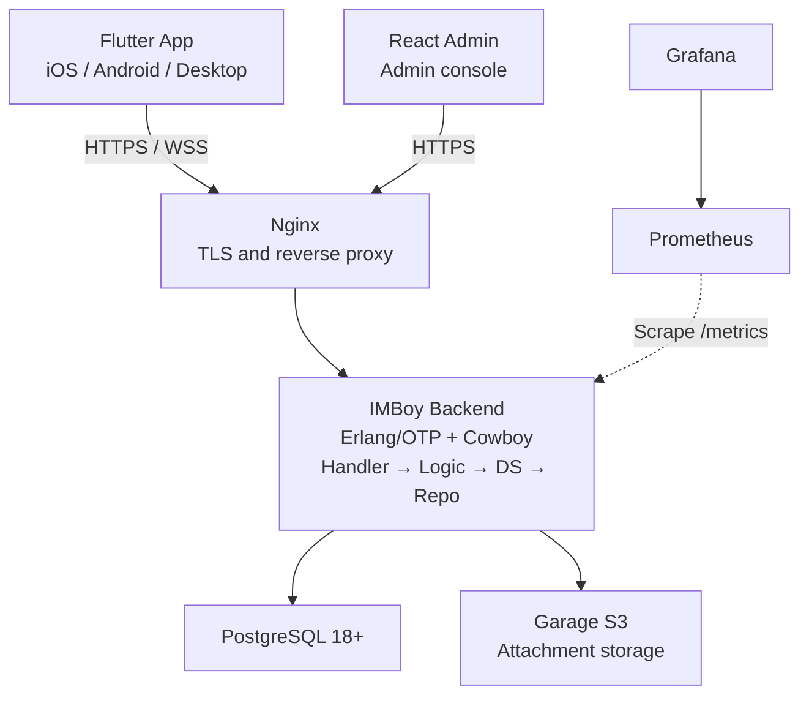

<p align="center">
  
</p>

# IMBoy Backend

[简体中文](./README.md)

IMBoy is a self-hostable instant messaging platform. This repository contains the Erlang/OTP backend, database migrations, production deployment files, and product documentation. The Flutter client and React admin console live in separate repositories.

## Features

- One-on-one chat, group chat, channels, moments, and push notifications
- HTTP APIs and persistent WebSocket connections
- Optional end-to-end encryption (E2EE)
- PostgreSQL persistence and direct uploads to Garage S3
- Single-node production deployment with Docker Compose (Helm/Kubernetes is experimental and not validated on a production cluster)

## System architecture



## Run locally

### 1. Requirements

- Erlang/OTP 28+
- GNU Make
- Docker

### 2. Initialize

```bash
bash scripts/dev_setup.sh
```

The script starts PostgreSQL 18 and creates `.env` and `config/sys.local.config`. Follow its prompt to make sure the database passwords match. Both local configuration files stay out of Git.

### 3. Build and start

```bash
make compile
IMBOYENV=local make run
```

After startup, open:

```text
http://127.0.0.1:9800/api/v1/init
```

To connect a phone to the local backend, replace `127.0.0.1` in the configuration with your computer's LAN IP address.

## Common commands

```bash
make compile                         # Compile
IMBOYENV=local make run              # Start the local server
make eunit                           # Run unit tests
make eunit-local                     # Test with local PostgreSQL
make dialyze                         # Run type analysis
make ctl ARGS="node status"          # Check node status
make ctl ARGS="db ping"              # Check the database
```

## Project map

```text
src/api/       HTTP and WebSocket request handling
src/adm/       Admin console APIs
src/logic/     Business logic
src/ds/        Data services and cache
src/repo/      PostgreSQL access
src/lib/       Shared infrastructure
priv/          Database migrations and static files
deploy/        Production deployment
docs/          Architecture, protocol, and operations docs
```

Business calls follow `Handler → Logic → DS → Repo`. A new endpoint usually needs a Handler, route, Logic code, and tests. Do not edit the vendored `erlang.mk`.

## Production deployment

The reference environment is **Debian 13 (Trixie)** (any x86_64 Linux works);
you need Docker 24+ with the Compose v2 plugin — if missing, `install.sh` offers
to install it via get.docker.com after confirmation.

### Three-step install (Community edition)

```bash
# 1) Clone the repository and enter the deploy directory
git clone <this repository> && cd imboy/deploy

# 2) First run generates the config, then edit .env to fill in 3 required variables
bash install.sh --edition community
#    edit .env: API_DOMAIN / ADMIN_DOMAIN / CERTBOT_EMAIL
#    (backend domain + admin console domain + certificate e-mail; every other
#     secret is generated automatically)

# 3) Run the same command again to finish the installation
bash install.sh --edition community
```

The first run generates `.env`, all random secrets (database passwords, JWT,
Garage object-storage credentials, …) and the RSA login key pair, then stops for
you to fill in the three things a machine cannot know. The second run performs
the pre-flight checks, starts the stack, issues the TLS certificate, waits for
health, runs the post-install self-check, and prints the Release Identity
triple with the access URLs.

The first visit to the admin console opens the `/setup` wizard to create the
super admin; or pass credentials as arguments for a headless, browser-free
deployment:

```bash
bash install.sh --edition community \
  --admin-phone 13800138000 --admin-password 'S3curePass2026' --yes
```

See `bash install.sh --help` for all options.

### Verify the installed image (Release Identity)

After installation the script prints:

```text
IMBOY_VERSION=...
IMBOY_GIT_SHA=...
IMBOY_IMAGE_DIGEST=sha256:...
```

Once official releases exist, the GitHub Release notes carry the same triple —
compare the two to confirm you installed the exact image the release gates
verified (see [RELEASES.md](./RELEASES.md)).

### Community vs Business edition

- **Community (default)**: the compose file `deploy/docker-compose.community.yml`
  ships with the repository and includes the Garage object storage (attachment
  upload works out of the box); the payment gateway is fixed off. The monitoring
  stack (Prometheus / Alertmanager / Loki / Promtail / Grafana) is off by default:

  ```bash
  docker compose -f docker-compose.community.yml --profile monitoring up -d
  ```

- **Business**: `deploy/docker-compose.prod.yml` plus the sales-policy overlay is
  not distributed with the open-source repository; obtain it through the
  commercial channel (leeyisoft@qq.com) and install with
  `bash install.sh --edition business` (the script tells you exactly how to get
  the file when it is missing).

### Upgrading

In short: edit `IMBOY_VERSION` in `deploy/.env`, then `pull` + `up -d`
(migrations run automatically by default). Version history, per-release upgrade
notes, and rollback guidance live in [RELEASES.md](./RELEASES.md).

Full manual: the [deployment guide](./deploy/README.md).

## Quick demo (one command)

```bash
cd deploy
docker compose -f docker-compose.demo.yml up -d
# after ~30s open http://127.0.0.1:9800/api/v1/init
```

Minimal two-service stack (PostgreSQL + backend), zero configuration — meant for
product evaluation and live demos.

## More documentation

- [Documentation index](./docs/README.md)
- [Backend architecture](./docs/architecture/overview.md)
- [REST API catalog](./docs/reference/rest-api-v1-catalog.md)
- [WebSocket protocol](./docs/reference/ws-protocol-contract.md)
- [Contributing](./CONTRIBUTING.md)
- [Security](./SECURITY.md)

## License

[MulanPSL-2.0](./LICENSE)
