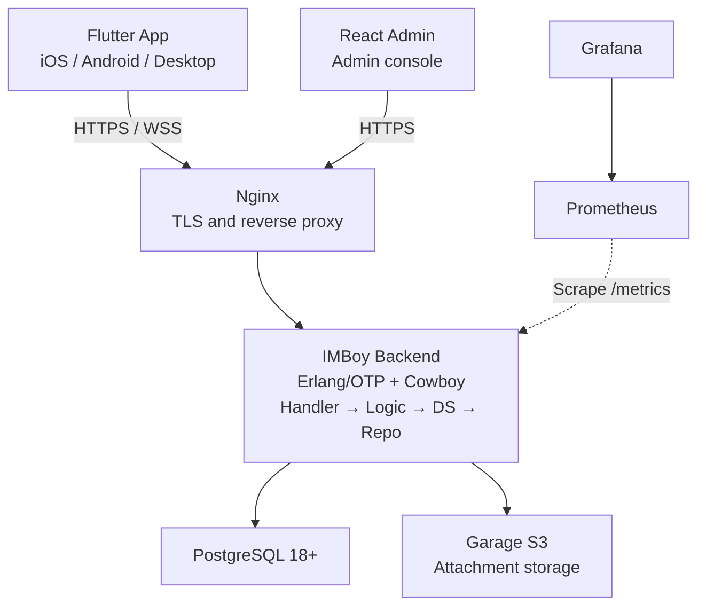

<p align="center">
  
</p>

# IMBoy Backend

[简体中文](./README.md)

IMBoy is a self-hostable instant messaging platform. This repository contains the Erlang/OTP backend, database migrations, production deployment files, and product documentation. The Flutter client and React admin console live in separate repositories.

## Features

- One-on-one chat, group chat, channels, moments, and push notifications
- HTTP APIs and persistent WebSocket connections
- Optional end-to-end encryption (E2EE)
- PostgreSQL persistence and direct uploads to Garage S3
- Single-node production deployment with Docker Compose (Helm/Kubernetes is experimental and not validated on a production cluster)

## System architecture



## Run locally

### 1. Requirements

- Erlang/OTP 28+
- GNU Make
- Docker

### 2. Initialize

```bash
bash scripts/dev_setup.sh
```

The script starts PostgreSQL 18 and creates `.env` and `config/sys.local.config`. Follow its prompt to make sure the database passwords match. Both local configuration files stay out of Git.

### 3. Build and start

```bash
make compile
IMBOYENV=local make run
```

After startup, open:

```text
http://127.0.0.1:9800/api/v1/init
```

To connect a phone to the local backend, replace `127.0.0.1` in the configuration with your computer's LAN IP address.

## Common commands

```bash
make compile                         # Compile
IMBOYENV=local make run              # Start the local server
make eunit                           # Run unit tests
make eunit-local                     # Test with local PostgreSQL
make dialyze                         # Run type analysis
make ctl ARGS="node status"          # Check node status
make ctl ARGS="db ping"              # Check the database
```

## Project map

```text
src/api/       HTTP and WebSocket request handling
src/adm/       Admin console APIs
src/logic/     Business logic
src/ds/        Data services and cache
src/repo/      PostgreSQL access
src/lib/       Shared infrastructure
priv/          Database migrations and static files
deploy/        Production deployment
docs/          Architecture, protocol, and operations docs
```

Business calls follow `Handler → Logic → DS → Repo`. A new endpoint usually needs a Handler, route, Logic code, and tests. Do not edit the vendored `erlang.mk`.

## Production deployment

```bash
cd deploy
bash install.sh
```

The script generates `.env`, ten random secrets, and the RSA login key pair, then stops
so you can fill in the three things a machine cannot know (two domains and the
certificate notification e-mail). Run the same command again afterwards: it runs the
pre-flight checks, starts the services, issues the TLS certificate, and self-checks.

> ⚠️ **`deploy/docker-compose.prod.yml` is not distributed with the open-source
> repository.** Obtain it through the commercial delivery channel
> (leeyisoft@qq.com) and place it in `deploy/`. `install.sh` tells you explicitly when
> it is missing. For evaluation only, use the minimal demo stack below — it does not
> need that file.

Production also requires domains, TLS, and strong secrets. See the full [deployment guide](./deploy/README.md).

## More documentation

- [Documentation index](./docs/README.md)
- [Backend architecture](./docs/architecture/overview.md)
- [REST API catalog](./docs/reference/rest-api-v1-catalog.md)
- [WebSocket protocol](./docs/reference/ws-protocol-contract.md)
- [Contributing](./CONTRIBUTING.md)
- [Security](./SECURITY.md)

## License

[MulanPSL-2.0](./LICENSE)
