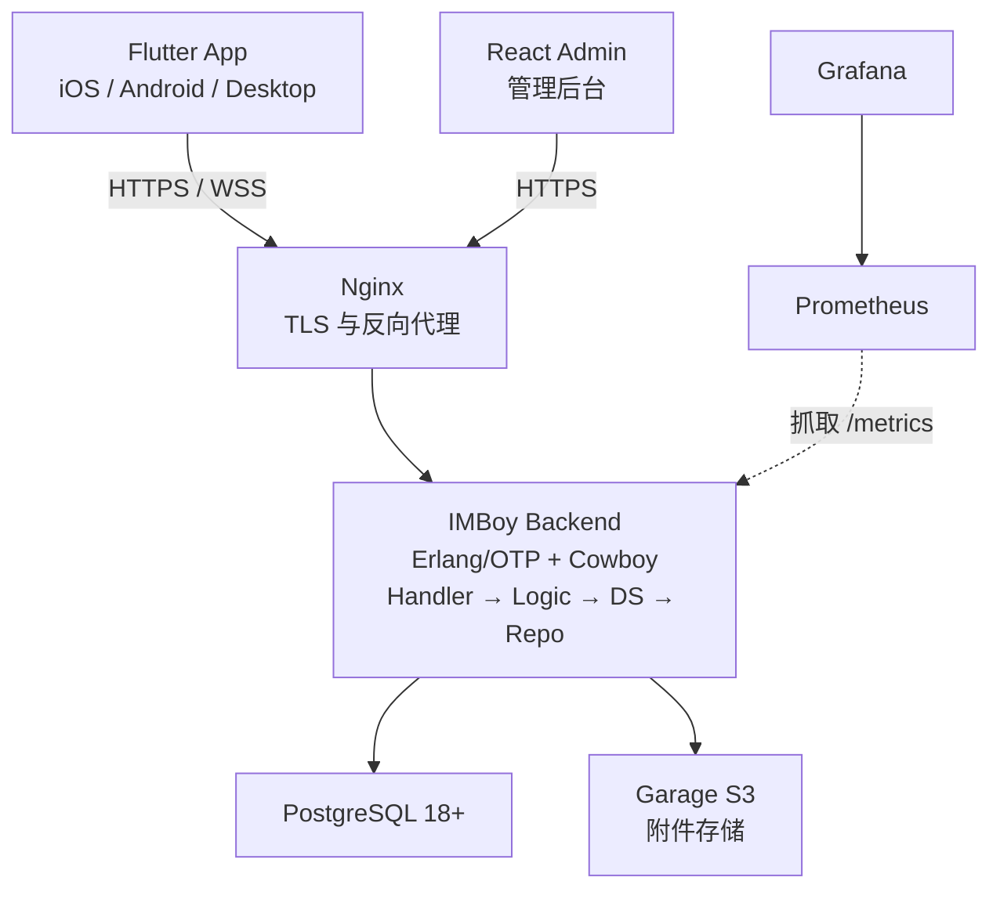

<p align="center">
  
</p>

# IMBoy 后端

[English](./README.en.md)

IMBoy 是可私有部署的即时通讯平台。本仓库包含 Erlang/OTP 后端、数据库迁移、生产部署配置和产品文档；Flutter 客户端与 React 管理后台在独立仓库中。

## 能做什么

- 单聊、群聊、频道、朋友圈和消息推送
- HTTP API 与 WebSocket 长连接
- 可选端到端加密（E2EE）
- PostgreSQL 持久化与 Garage S3 附件直传
- Docker Compose 单节点生产部署（Helm/Kubernetes 为实验性，未经生产集群验证）

## 系统架构



## 本地启动

### 1. 准备环境

- Erlang/OTP 28+
- GNU Make
- Docker

### 2. 初始化

```bash
bash scripts/dev_setup.sh
```

脚本会启动 PostgreSQL 18，并创建 `.env` 和 `config/sys.local.config`。按脚本提示核对数据库密码；这两个本地配置都不会提交到 Git。

### 3. 编译并启动

```bash
make compile
IMBOYENV=local make run
```

启动成功后访问：

```text
http://127.0.0.1:9800/api/v1/init
```

如果手机需要连接本机后端，请把配置中的 `127.0.0.1` 改为电脑的局域网 IP。

## 常用命令

```bash
make compile                         # 编译
IMBOYENV=local make run              # 启动本地服务
make eunit                           # 单元测试
make eunit-local                     # 使用本地 PostgreSQL 跑测试
make dialyze                         # 类型检查
make ctl ARGS="node status"          # 查看节点状态
make ctl ARGS="db ping"              # 检查数据库
```

## 代码入口

```text
src/api/       HTTP / WebSocket 参数处理
src/adm/       管理后台接口
src/logic/     业务逻辑
src/ds/        数据服务与缓存
src/repo/      PostgreSQL 访问
src/lib/       通用基础能力
priv/          数据库迁移与静态资源
deploy/        生产部署
docs/          架构、协议与运维文档
```

业务调用遵循 `Handler → Logic → DS → Repo`。新增接口通常需要修改 Handler、路由、Logic，并补测试；不要修改 vendored 的 `erlang.mk`。

## 生产部署

示例环境以 **Debian 13 (Trixie)** 为基准（其他 x86_64 Linux 同样适用）；需要
Docker 24+ 与 Compose v2 插件，未安装时 `install.sh` 会确认后经 get.docker.com
引导安装。

### 三步安装（社区版）

```bash
# 1) 克隆仓库并进入部署目录
git clone <本仓库地址> && cd imboy/deploy

# 2) 首跑生成配置，然后按提示编辑 .env 填 3 个必填变量
bash install.sh --edition community
#    编辑 .env：API_DOMAIN / ADMIN_DOMAIN / CERTBOT_EMAIL
#    （后端域名 + 管理后台域名 + 证书通知邮箱，其余密钥全部自动生成）

# 3) 再跑一次同一条命令，完成安装
bash install.sh --edition community
```

第一次运行会生成 `.env`、全部随机密钥（数据库口令、JWT、Garage 对象存储凭据等）
和 RSA 登录密钥对，然后停下来等人填上面 3 项机器无从知晓的信息。第二次运行依次
完成：前置检查 → 拉起服务 → 签发 TLS 证书 → 等待健康 → 部署后自检，最后打印
Release Identity 三元组与访问地址。

首次访问管理后台会自动进入 `/setup` 向导创建超级管理员；也可以直接用参数创建，
实现无浏览器纯脚本部署：

```bash
bash install.sh --edition community \
  --admin-phone 13800138000 --admin-password 'S3curePass2026' --yes
```

全部参数说明见 `bash install.sh --help`。

### 核验安装的镜像（Release Identity）

安装完成后脚本会打印三元组：

```text
IMBOY_VERSION=...
IMBOY_GIT_SHA=...
IMBOY_IMAGE_DIGEST=sha256:...
```

正式版本发布后，GitHub Release 说明会附相同的三元组——比对两者即可确认装的是
被发布门禁验证过的那个镜像（详见 [RELEASES.md](./RELEASES.md)）。

### 社区版与商务版

- **社区版**（默认）：编排文件 `deploy/docker-compose.community.yml` 随仓库分发，
  内置 Garage 对象存储（附件上传开箱可用），支付网关固定关闭。监控栈
  （Prometheus / Alertmanager / Loki / Promtail / Grafana）默认不启动，需要时：

  ```bash
  docker compose -f docker-compose.community.yml --profile monitoring up -d
  ```

- **商务版**：`deploy/docker-compose.prod.yml` + sales-policy overlay 不随开源仓
  分发，需通过商务交付渠道获取（leeyisoft@qq.com），安装命令为
  `bash install.sh --edition business`（缺文件时脚本会明确提示索取方式）。

### 升级

一句话：改 `deploy/.env` 的 `IMBOY_VERSION` 后 `pull` + `up -d`（迁移默认自动执行）。
版本历史、每版升级说明与回滚指引见 [RELEASES.md](./RELEASES.md)。

完整部署手册见 [部署指南](./deploy/README.md)。

## 快速演示（一条命令评估）

```bash
cd deploy
docker compose -f docker-compose.demo.yml up -d
# 30 秒后访问 http://127.0.0.1:9800/api/v1/init
```

最小两服务环境（PostgreSQL + 后端），零配置，适合产品评估和现场演示。
详细演示流程见 [5 分钟 Demo 脚本](./docs/business/demo-runbook.md)。

## 继续阅读

- [**在线文档站**](https://imboy-pub.github.io/imboy/)（教程 / 指南 / 参考 / 合规）
- [E2EE 协议规范](./docs/reference/e2ee-protocol-specification.md)
- [E2EE 安全简报（企业决策者）](./docs/business/e2ee-security-brief.md)
- [后端架构](./docs/architecture/overview.md)
- [REST API 目录](./docs/reference/rest-api-v1-catalog.md)
- [WebSocket 协议](./docs/reference/ws-protocol-contract.md)
- [贡献指南](./CONTRIBUTING.md)
- [安全说明](./SECURITY.md)

## 许可证

[MulanPSL-2.0](./LICENSE)
