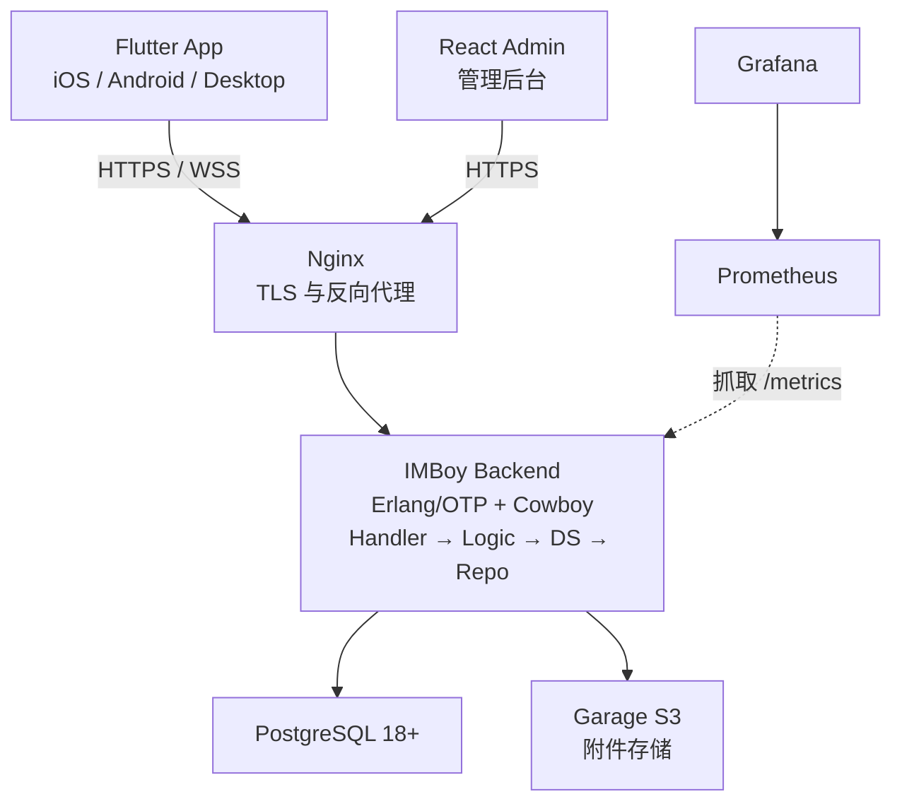

<p align="center">
  
</p>

# IMBoy 后端

[English](./README.en.md)

IMBoy 是可私有部署的即时通讯平台。本仓库包含 Erlang/OTP 后端、数据库迁移、生产部署配置和产品文档；Flutter 客户端与 React 管理后台在独立仓库中。

## 能做什么

- 单聊、群聊、频道、朋友圈和消息推送
- HTTP API 与 WebSocket 长连接
- 可选端到端加密（E2EE）
- PostgreSQL 持久化与 Garage S3 附件直传
- Docker Compose / Helm 生产部署

## 系统架构



## 本地启动

### 1. 准备环境

- Erlang/OTP 28+
- GNU Make
- Docker

### 2. 初始化

```bash
bash scripts/dev_setup.sh
```

脚本会启动 PostgreSQL 18，并创建 `.env` 和 `config/sys.local.config`。按脚本提示核对数据库密码；这两个本地配置都不会提交到 Git。

### 3. 编译并启动

```bash
make compile
IMBOYENV=local make run
```

启动成功后访问：

```text
http://127.0.0.1:9800/api/v1/init
```

如果手机需要连接本机后端，请把配置中的 `127.0.0.1` 改为电脑的局域网 IP。

## 常用命令

```bash
make compile                         # 编译
IMBOYENV=local make run              # 启动本地服务
make eunit                           # 单元测试
make eunit-local                     # 使用本地 PostgreSQL 跑测试
make dialyze                         # 类型检查
make ctl ARGS="node status"          # 查看节点状态
make ctl ARGS="db ping"              # 检查数据库
```

## 代码入口

```text
src/api/       HTTP / WebSocket 参数处理
src/adm/       管理后台接口
src/logic/     业务逻辑
src/ds/        数据服务与缓存
src/repo/      PostgreSQL 访问
src/lib/       通用基础能力
priv/          数据库迁移与静态资源
deploy/        生产部署
docs/          架构、协议与运维文档
```

业务调用遵循 `Handler → Logic → DS → Repo`。新增接口通常需要修改 Handler、路由、Logic，并补测试；不要修改 vendored 的 `erlang.mk`。

## 生产部署

```bash
cd deploy
cp .env.example .env
bash preflight.sh --docker
docker compose -f docker-compose.prod.yml up -d
```

生产环境还需要域名、TLS 和强密钥，完整步骤见 [部署指南](./deploy/README.md)。

## 快速演示

```bash
cd deploy
docker compose -f docker-compose.demo.yml up -d
# 30 秒后访问 http://127.0.0.1:9800/api/v1/init
```

最小两服务环境（PostgreSQL + 后端），适合产品评估和现场演示。
详细演示流程见 [5 分钟 Demo 脚本](./docs/business/demo-runbook.md)。

## 继续阅读

- [**在线文档站**](https://imboy-pub.github.io/imboy/)（教程 / 指南 / 参考 / 合规）
- [E2EE 协议规范](./docs/reference/e2ee-protocol-specification.md)
- [E2EE 安全简报（企业决策者）](./docs/business/e2ee-security-brief.md)
- [后端架构](./docs/architecture/overview.md)
- [REST API 目录](./docs/reference/rest-api-v1-catalog.md)
- [WebSocket 协议](./docs/reference/ws-protocol-contract.md)
- [贡献指南](./CONTRIBUTING.md)
- [安全说明](./SECURITY.md)

## 许可证

[MulanPSL-2.0](./LICENSE)
