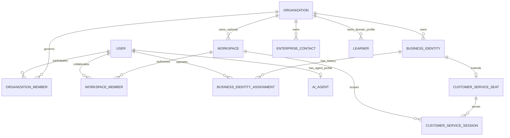
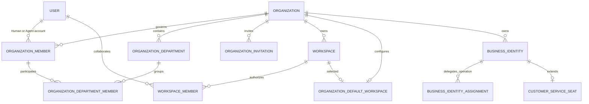

# IMBoy Enterprise Organization V1

> STATUS: `TARGET_V1_ACCEPTED`
>
> PHASE: `PHASE 2 / STEP 2 - TARGET ORGANIZATION V1 + CORE CONTRACT DESIGN`
>
> 第 1-12 节保留 STEP 1 的 CURRENT MODEL 证据快照；第 13 节起给出 Target V1 决策。
> 本文不授权实现、数据库迁移或客户端修改。冻结合同见
> `2026-09-16-enterprise-organization-v1-core-contract.md`。

## 1. Evidence Baseline

| Item | Value |
|---|---|
| Repository | `/Users/leeyi/project/imboy.pub/imboy` |
| Branch | `main` |
| HEAD | `4be8dd36829c4429fc81471151d5109598c70a21` |
| Source snapshot | dirty working tree; 2026-09-16 探测期间存在其他 Agent 的 staged/unstaged 客服与 Enterprise Business 修改 |
| Observed tracked status count | `61`（最终写文档前观测值；并发工作树可能继续变化） |
| Observed status fingerprint | `0e869b742bad8244fe57caa00e549e546360d1e5a2850cc2abaac7ebcb0b0f25` (`git status --porcelain=v1 | shasum -a 256`) |
| Step 2 decision HEAD | `1a712a6a8a7829b1785afc413d2193f24c364d70` |
| Step 2 drift check | HEAD 差异仅涉及 `moya_wechat_msg_logic` 及其测试；Organization Core 合同未漂移 |

证据标记：

- `[FACT]`：由当前代码、迁移、API 或测试直接证明。
- `[INFERENCE]`：由多个事实推导，但没有独立产品合同或端到端证据。
- `[UNKNOWN]`：当前仓库未定义，必须在 Target V1 阶段决策。
- `[RISK]`：现有合同之间可能产生故障或语义分裂，尚未在本步骤修复。

本次没有执行 migration，没有修改业务代码，没有读取或修改生产数据。普通 EUnit 与需要 PostgreSQL
fixture 的 EUnit 分开记录；缺少本地 DB 配置不能记为业务测试通过。

## 2. Current Model Summary

```text
user (current first-class account row)
├── account_type=0 human
├── account_type=1 agent -> ai_agent -> ai_agent_role/version
├── account_type=2 system_bot -> channel_webhook/channel_admin
└── account_type=3 developer bot -> bot/webhook/OAuth grant

organization
├── owner_id -> user                  (primary-owner compatibility anchor)
├── organization_member -> user       (organization governance membership)
├── workspace[*]                      (nullable organization_id)
│   └── workspace_member -> user       (independent collaboration membership)
├── organization_business_identity[*] (stable business principal)
│   ├── assignment[*] -> user          (temporal operator binding)
│   └── customer_service_seat [0..1]   (customer-service operational profile)
├── enterprise_contact[*]              (organization-owned customer relationship)
├── learner[*]                         (teaching-domain profile; optional user binding)
└── enterprise/customer-service data   (organization-owned resources)

Department: NOT_IMPLEMENTED
Employee:   NOT_IMPLEMENTED
Invitation acceptance: NOT_IMPLEMENTED for Organization
Agent Grant / Organization Scope: NOT_IMPLEMENTED
```

### 2.1 Current relationship diagram



图中没有 Department、Employee、Organization Invitation 或 Agent Grant，因为当前数据库中不存在这些实体。

## 3. Entity Semantics

### 3.1 Account / User

`[FACT]` 当前没有独立 `account` 主表承担统一身份；一等消息身份实际是 `public."user"` 行。
`account_ds` 是账号查询/服务模块，不改变该数据库事实。

当前 `user.account_type` 仍是四值运行合同：

| Value | Current meaning | Current dependency |
|---|---|---|
| `0` | Human | 默认值及普通用户路径 |
| `1` | Agent | `ai_agent_ds` 创建/绑定，Agent 发现与消息路由 |
| `2` | System Bot | `channel_webhook_ds` 创建频道 Webhook 身份并授予 `channel_admin` |
| `3` | Developer Bot | `bot_ds` 创建，`msg_c2c_logic` 识别并投递 Bot Webhook |

`[FACT]` account_type `2/3` 仍有迁移、生产调用方和测试覆盖。本阶段不能删除或重解释。

`[FACT]` `organization_member_logic:invite/4` 只确认目标 `user.id` 存在，没有限制
`account_type`。所以当前实现技术上允许 `0/1/2/3` 进入 `organization_member`。

`[UNKNOWN]` 哪些 account_type 在产品语义上允许成为 Organization Member 尚未冻结。
特别是 Agent、System Bot、Developer Bot 不能因为“数据库可写”就被认定为已支持的组织成员类型。

### 3.2 Organization

`[FACT]` `organization` 是 SaaS 租户与企业资源 owner，字段包含：

```text
id, name, owner_id, status(active|archived), branding, settings, timestamps
```

- 一个 User 可以创建多个 Organization，也可以通过 `organization_member` 加入多个 Organization。
- `organization.owner_id` 是当前主 Owner 兼容锚点。
- Organization 创建事务同时确保 Owner 有一条 `active/owner` membership。
- Owner 转移更新 `organization.owner_id`，新 Owner 变为 `owner`，原 Owner 变为 `admin`。
- Owner 转移不改变 Workspace owner/member、Group member 或其他下级授权。
- Schema 支持 `active|archived`，但当前公开 Organization API 没有 archive、restore 或 delete endpoint。
- `organization.owner_id -> user.id` 当前是 `ON DELETE CASCADE`。

`[RISK]` `organization.owner_id` 与 `organization_member(role=owner,status=active)` 是双表示结构。
触发器保持同步，但 Target V1 必须决定长期唯一真源与兼容锚点，不能继续默认二者等价。

### 3.3 Organization Membership

`[FACT]` 当前唯一组织成员真源是：

```text
organization_member(
  organization_id,
  user_id,
  role       = owner | admin | member,
  status     = active | suspended | removed,
  invited_by,
  joined_at,
  timestamps,
  PRIMARY KEY (organization_id, user_id)
)
```

当前合同：

- `active` 才能通过 Organization 及 Enterprise Business 授权事实读取。
- `suspended` 是可恢复撤权状态，不删除个人账号，不修改 Workspace Membership，也不自动结束 assignment。
- `removed` 是组织关系移除状态。
- 主 Owner member 不能被降级、suspend、remove 或 delete；必须先转移 Owner。
- 有 active Business Identity Assignment 的成员不能进入 `removed` 或被删除；数据库 guard 要求先 offboarding。
- 成员列表当前只返回 active 行，普通 API 看不到 suspended/removed 历史。

当前名为 `invite` 的操作并不创建邀请：

```text
POST /api/v1/organizations/:id/members
  -> 已注册 user lookup
  -> organization_member upsert
  -> 立即 active
```

没有 invitation 表、pending 状态、accept/reject API。相同 upsert 也承担 suspended/removed 到 active
的恢复，因此 `invited_by` 与 `joined_at` 会被重写，当前没有独立 restore 审计语义。

### 3.4 Employee / Department

`[FACT]` 当前生产 Erlang、迁移和 API 中没有以下正式实体：

```text
employee
department
department_member
organization_invitation
```

`class_staff` 是教学 Group 的 staff 关系，不是 Organization Employee。
`learner` 是 Organization-owned 教学档案，可选关联 User，也不是 Employee。

因此：

- Business Identity 不能被改名解释为 Employee。
- Organization Member 也不能在没有目标合同前被直接改名为 Employee。
- Department 层级、兼职、多部门、Department Admin 当前全部 `NOT_IMPLEMENTED`。

### 3.5 Workspace and Workspace Membership

`[FACT]` 当前数据库基数是：

```text
Organization 1 ---- 0..N Workspace
Workspace    0..1 ---- Organization
```

`workspace.organization_id` 可空：

- `NULL`：个人/历史 User-scope Workspace；
- 非空：Organization-owned Workspace。

当前行为：

- 创建 Organization Workspace 时，创建者必须是该 Organization 的 active owner/admin。
- Workspace 创建后，创建者单独成为 Workspace owner。
- Organization Member 不会自动成为 Workspace Member。
- Workspace Member 不会自动成为 Organization Member。
- Workspace Member 可以是组织外部协作者。
- Workspace Role 是 `owner|member|guest`，独立于 Organization Role。
- Organization Owner 转移不改变 Workspace Owner。
- `chat` product experience 禁止提交 `organization_id`；`workspace` product experience 要求
  显式有效 Organization。
- 当前 Enterprise Business 所谓默认 Workspace 是同 Org 下最小 active Workspace ID 的推导值，
  数据库没有正式 `default_workspace_id` 合同。

`[FACT]` 历史边界文档曾为首版产品推荐 1:1 default Workspace，但当前数据库和服务层实际保留
Organization 1:N Workspace 能力。产品入口能力和数据模型能力必须分开描述。

### 3.6 Organization Business Identity

结论：`organization_business_identity` 是选项 **C. Business Identity**。

它不是 Employee、Organization Member、Employee Profile、Business Account 或 Organization Role。

证据：

- 由 Organization 持有，`organization_id` 是资源 owner；
- 不登录、不发 JWT、不拥有个人好友；
- `function_key = sales | customer_service`，创建后不可变；
- 生命周期为 `active|retired`；
- handover 只更换当前经办 User，identity ID 与企业资源关系不变；
- 企业 conversation/contact/seat 指向 Business Identity，而不是当前 User；
- User 只出现在创建审计或 Assignment，经 User 删除时使用 `SET NULL`/约束保护，不把企业资源级联给个人。

Business Identity 是 Organization 范围实体，表中没有 `workspace_id`。Enterprise Business API 要求
`workspace_id` 是调用上下文和资源范围校验，不代表 Business Identity 属于某一个 Workspace。

### 3.7 Business Identity Assignment

结论：`organization_business_identity_assignment` 表达：

```text
User -> Business Identity 的时态经办绑定
```

它不是 Member -> Organization、Employee -> Department、Seat -> Employee、Workspace Membership 或 Role。

当前约束：

- 同一 Business Identity 同时最多一条 active assignment；
- 同一 Organization 内，一个 User 对同一 `function_key` 最多一条 active assignment；
- 同一 User 可以同时经办 `sales` 与 `customer_service`；
- Assignment 与 Identity 必须同 Organization、同 function；
- active assignment 必须有 User；ended assignment 必须有 `ended_at`；
- 历史 Assignment 不因换人重写；handover/offboarding 结束旧行并创建 successor 行。

术语风险：Enterprise Business 的资源字段 `assignee` 常指 `business_identity_id`；Assignment 表中的
`user_id` 才是 Business Identity 的当前人工经办者。后续合同必须使用不同术语。

### 3.8 Customer Service Seat and Session

当前关系：

```text
Organization
  -> Business Identity(function_key=customer_service)
      -> Customer Service Seat
      -> active Assignment -> User
```

`[FACT]` Seat 是 Business Identity 的客服运营 Profile/Capability：

- PK 是 `business_identity_id`；
- 只保存 `enabled`、`max_concurrent`、version 与审计快照；
- 不保存 owner User；
- 不是 Account、Employee、Organization Membership 或 Role；
- Identity rebind 后 Seat 原地继续存在；
- `enabled=false` 阻止新 claim，但不会自动迁移既有 active Session。

`[FACT]` Customer Service Session 强制显式绑定合法 `(organization_id, workspace_id)`，同时引用
Contact、Enterprise Conversation 与可选 Seat。Session 绑定的是 Business Identity，不是 User。

### 3.9 Customer / Learner

`enterprise_contact` 是 Organization-owned 客户关系。`imboy_user_id` 只是可选个人账号关联，
`ON DELETE SET NULL`，不是关系 owner。因此 Customer 不是 Employee，也不是 Organization Member。

`learner` 是 Organization-owned 教学域档案，`user_id` 可空，并通过 Group -> Workspace -> Organization
约束教学归属。它也不是 Organization Member 或 Employee。

### 3.10 Agent

当前 Agent 模型：

```text
user(account_type=1)
  -> ai_agent(user_id PK)
      -> provider/model/owner_uid/trigger/profile/role/capabilities
      -> ai_agent_role / ai_agent_role_version
```

`ai_agent_role` 是 Prompt、Capability、Knowledge Policy 等行为模板，不是 Organization Role。

当前缺少：

- Organization ownership/source-of-truth；
- Agent Organization Membership 产品合同；
- Workspace scope；
- Agent Grant / Delegation；
- AgentRun 的 Organization/Workspace 绑定；
- Agent 作为 Customer Service Seat 经办者的合同。

结论：Agent 写入 `organization_member` 在当前实现上是 `TECHNICALLY_PERMITTED`，但产品与权限语义是
`SEMANTICALLY_UNDEFINED`。不能把 Organization Role 直接当作 Agent Grant。

## 4. Current Concept to Organization V1 Mapping Input

本表只标记“现状能否原样识别”，不是 Target V1 的最终 KEEP/RENAME/MERGE/REPLACE 决策。

| Current Concept | Current Table/Module | Current Meaning | Keep | Rename | Merge | Replace | Organization V1 Role |
|---|---|---|---|---|---|---|---|
| User identity | `user`, `user_repo` | 一等登录/消息身份载体 | REQUIRED_BASE | NO_DECISION | NO | NO_DECISION | Account identity source |
| Organization | `organization`, `organization_logic` | SaaS tenant 与企业资源 owner | REQUIRED_BASE | NO_DECISION | NO | NO_DECISION | Organization aggregate candidate |
| Primary owner anchor | `organization.owner_id` | 主 Owner 兼容锚点 | COMPAT_REQUIRED | NO_DECISION | OWNER_CONTRACT_PENDING | NO_DECISION | 与 membership owner 的权威性待冻结 |
| Organization Membership | `organization_member` | Organization 治理成员唯一现有真源 | REQUIRED_BASE | NO_DECISION | NO | EVOLVE_CANDIDATE | Organization membership candidate |
| Workspace | `workspace` | 独立协作/资源边界，可个人或 Org-owned | REQUIRED_BASE | NO | NO | NO | Workspace aggregate |
| Workspace Membership | `workspace_member` | Workspace 独立授权关系 | REQUIRED_BASE | NO | NO | NO | Workspace authorization source |
| Business Identity | `organization_business_identity` | Org-owned 稳定业务经办主体 | REQUIRED_BASE | NO | NO | NO | Business identity, not employee |
| Business Identity Assignment | `organization_business_identity_assignment` | User 对 identity 的时态经办绑定 | REQUIRED_BASE | TERMINOLOGY_PENDING | NO | NO | Operational assignment |
| Customer Service Seat | `customer_service_seat` | Business Identity 的客服运营 Profile | REQUIRED_BASE | NO | NO | NO | CS domain extension |
| Customer Service Session | `customer_service_session` | Org+Workspace scoped 服务会话 | REQUIRED_BASE | NO | NO | NO | CS domain resource |
| Customer | `enterprise_contact` | Org-owned 客户关系 | REQUIRED_BASE | NO | NO | NO | Customer domain entity |
| Learner | `learner` | Org-owned 教学档案，可选 User binding | REQUIRED_BASE | NO | NO | NO | Teaching domain entity |
| Agent | `user` + `ai_agent` | AI-native account + 当前行为/模型配置 | REQUIRED_BASE | NO_DECISION | NO | EVOLVE_CANDIDATE | Agent contract input |
| Agent Role/Profile | `ai_agent_role[_version]` | 行为、Prompt、Capability 模板 | REQUIRED_BASE | PROFILE_TERM_PENDING | NO | NO_DECISION | Must not become Org Role |
| System Bot | `account_type=2`, `channel_webhook` | Channel webhook service identity | COMPAT_REQUIRED | FUTURE_DECISION | FUTURE_DECISION | FUTURE_DECISION | account_type migration input |
| Developer Bot | `account_type=3`, `bot` | 外部 Webhook/API 驱动服务身份 | COMPAT_REQUIRED | FUTURE_DECISION | FUTURE_DECISION | FUTURE_DECISION | account_type migration input |
| Employee | none | 不存在 | N/A | N/A | MEMBER_PROFILE_DECISION_PENDING | N/A | Target decision required |
| Department | none | 不存在 | N/A | N/A | N/A | N/A | Target design required |
| Organization Invitation | none | 不存在；当前 invite 是立即 upsert active | N/A | CURRENT_API_MISNOMER | N/A | TARGET_DECISION | Target design required |
| Agent Grant | none | 不存在 | N/A | N/A | N/A | TARGET_DECISION | Target design required |

## 5. Current Permission Layers

当前没有万能 Role，至少有以下互相独立的事实源：

| Layer | Owner / Source of truth | Scope | Input | Current output |
|---|---|---|---|---|
| Organization governance | `organization_member.role` | Organization | Org + User | owner/admin/member 治理资格 |
| Organization membership state | `organization_member.status` | Organization | Org + User | active/suspended/removed，即时撤权事实 |
| Workspace authorization | `workspace_member.role/status` | Workspace | Workspace + User | owner/member/guest 访问与治理资格 |
| Business function | `organization_business_identity.function_key` | Organization business | Business Identity | sales/customer_service 类型，不是 permission |
| Operational assignment | `organization_business_identity_assignment` | Organization business | Identity + User + time | 当前经办关系 |
| Enterprise action permission | `eb_auth_permission` + request facts | Enterprise action | Actor/member/assignment/action | allow/deny |
| Customer service operational gate | `customer_service_seat` | Seat | identity + enabled/capacity | 是否可接新 Session |
| Platform admin ACL | `adm_acl` | `/api/adm` | admin subject + action | platform allow/deny |
| Agent profile | `ai_agent_role[_version]` | Agent behavior | Agent/profile version | Prompt/capability/knowledge policy |

`[FACT]` 当前代码明确区分 Business Function、Permission 与 Governance Role。
`[UNKNOWN]` Agent Grant 与 Resource Policy 尚不存在，不能从任何现有 Role 自动推导。

## 6. Current Lifecycle and API Surface

### 6.1 Organization Core API

| API | Current behavior |
|---|---|
| `POST /api/v1/organizations` | 创建 Organization + primary Owner membership |
| `GET /api/v1/organizations/mine` | 按 active membership 列出 active/archived Organization |
| `GET /api/v1/organizations/:id` | active member 可读详情 |
| `PATCH /api/v1/organizations/:id` | active owner/admin 更新通用资料 |
| `GET /api/v1/organizations/:id/members` | owner/admin 列 active members |
| `POST /api/v1/organizations/:id/members` | 已注册 User 立即 upsert active；兼任恢复 |
| `PUT /api/v1/organizations/:id/members/:uid/role` | 修改 admin/member；不能改 primary Owner |
| `DELETE /api/v1/organizations/:id/members/:uid` | 软移除；依赖资源 guard fail-closed |
| `POST /api/v1/organizations/:id/members/transfer_owner` | 原子 Owner 转移 |

当前 Organization Core API 不包含：

- Organization archive/restore/delete；
- Invitation pending/accept/reject；
- 独立 member restore；
- Department；
- Employee/Profile；
- Organization Role definition CRUD。

### 6.2 Enterprise Business extension API

Enterprise Business 另有：

- Business Identity create/list/assign；
- Member suspend；
- Offboarding open/execute/verify/finalize/list/detail。

`suspend` 的状态写入复用 Core `organization_member_logic:suspend/3`；Offboarding 在 assignment
交接并验证无 active residual 后调用 Core remove。它们不是第二套 Organization Membership。

### 6.3 Offboarding state

```text
active member
  -> suspended                 (organization authorization revoked)
  -> handover active identity assignments
  -> verify no residual active assignment
  -> removed
```

Suspend 不删除 User、不修改 Workspace Membership、不自动结束 Assignment。数据库
`trg_organization_member_offboarding_guard` 是最终 fail-closed 裁决点。

## 7. Database Ownership and Deletion Facts

| Relationship | FK/delete behavior | Current meaning |
|---|---|---|
| `organization.owner_id -> user` | `ON DELETE CASCADE` | primary-owner compatibility anchor |
| `organization_member.organization_id -> organization` | `CASCADE` | Organization 删除时治理关系随父级 |
| `organization_member.user_id -> user` | `CASCADE` | User 删除时 membership 随个人 |
| `workspace.organization_id -> organization` | `RESTRICT` | Org 物理删除前必须解除 Workspace |
| `workspace.owner_id -> user` | `CASCADE` | 当前 Workspace owner 锚点 |
| `business_identity.organization_id -> organization` | `RESTRICT` | 企业业务资源阻止 Org 物理删除 |
| `business_identity_assignment.user_id -> user` | `SET NULL` + active check | active 经办人不能被直接删除 |
| `customer_service_seat -> business_identity` | `RESTRICT` | Seat 不脱离稳定业务身份 |
| `customer_service_session -> workspace/seat/contact/conversation` | `RESTRICT` | 会话依赖显式 Org+Workspace 与业务资源 |
| `enterprise_contact.imboy_user_id -> user` | `SET NULL` | 客户关系不由个人账号拥有 |
| `learner.organization_id -> organization` | `RESTRICT` | 教学档案阻止 Org 物理删除 |

`[RISK]` 当前账号删除执行器显式转移 Workspace/Group/Channel ownership，却没有显式处理
Organization ownership 或 Organization Membership，随后直接删除 `user`。因此：

- FK 会尝试级联 `organization.owner_id` 对应的 Organization 删除；
- Workspace、Business Identity、Learner、Offboarding、Customer Service 等 RESTRICT 关系可能阻断；
- active Assignment 的 `SET NULL + CHECK` 也可能阻断 User 删除；
- 没有现有测试证明 Organization owner 删除会被统一转移、归档或以稳定错误拒绝。

这不是本步骤的修复范围；Target V1 与 Migration Plan 必须先定义 Organization owner/account deletion 合同。

## 8. Test Evidence

### 8.1 PASS on current working tree

| Command | Result |
|---|---|
| `make eunit t=organization_member_logic_tests` | PASS, 16 tests |
| `make eunit t=organization_logic_tests` | PASS, 9 tests |
| `make eunit t=organization_repo_tests` | PASS, 4 tests |
| `make eunit t=workspace_logic_tests` | PASS, 31 tests |
| `make eunit t=eb_auth_tests` | PASS, 37 tests |
| `make eunit t=cs_application_tests` | PASS, 12 tests |
| `make eunit t=cs_auth_tests` | PASS, 31 tests |

这些 PASS 证明对应单元/Mock 合同，不证明完整 PostgreSQL migration、真实 DB isolation 或端到端产品完成。

### 8.2 UNVERIFIED database-backed suites

| Command | Result | Classification |
|---|---|---|
| `make eunit t=eb_identity_app_tests` | cancelled: `missing_config, pg_conf` | ENVIRONMENT_BLOCKED, not a business assertion failure |
| `make eunit-local EUNIT_CONFIG=config/sys.local.eb.config t=eb_identity_app_tests` | config file not found | ENVIRONMENT_BLOCKED |
| Offboarding concurrency/DB suites | not run after DB config absence was confirmed | UNVERIFIED |
| User deletion + Organization owner scenario | no focused test found or run | MISSING_COVERAGE |

## 9. Confirmed Current Contracts

1. `organization_member` 是 Organization Membership 唯一现有真源。
2. User 可以属于多个 Organization。
3. Organization 与 Workspace 是不同 scope；两个 Membership 不自动互相派生。
4. Organization 数据模型支持 1:N Workspace；Workspace 也允许个人/历史无 Organization 归属。
5. Business Identity 是 Organization-owned stable business principal，不是 Employee。
6. Business Identity Assignment 是 User 的时态经办绑定，不是 Membership 或 Role。
7. Seat 是 Customer Service 的 Operational Profile，不是身份或 Account Type。
8. Session 必须显式绑定合法 Organization + Workspace。
9. Customer 与 Learner 是各自业务域的 Organization-owned Profile，不是 Employee。
10. Agent Profile/Role 不是 Organization Role；Agent Organization Scope/Grant 尚未定义。
11. account_type `2/3` 仍是当前运行合同，只能在后续 expand/migrate/contract 阶段处理。

## 10. Unresolved Questions and STOP Blockers

以下问题在 Target Organization V1 冻结前必须回答；本文件不替用户选择：

| ID | Status | Blocker | Evidence / impact |
|---|---|---|---|
| CUR-ORG-B01 | BLOCKED_DECISION | `organization.owner_id` 与 owner membership 谁是长期唯一真源 | 当前触发器同步双表示；Migration 与 account deletion 都受影响 |
| CUR-ORG-B02 | BLOCKED_DECISION | Employee 是 Membership 本身、Membership Profile，还是不需要独立概念 | 当前不存在 Employee；错误新增会制造第二套身份 |
| CUR-ORG-B03 | BLOCKED_DECISION | Department 的层级、成员基数和管理员合同 | 当前完全不存在，不能从 CS/teaching 特例推导 |
| CUR-ORG-B04 | BLOCKED_DECISION | Organization Invitation 与 restore 是否拆分 | 当前 immediate upsert 混合加入与恢复，缺 acceptance/audit |
| CUR-ORG-B05 | BLOCKED_DECISION | Organization archive/delete 与 owner account deletion 合同 | 有 schema status，无公开生命周期 API；删除执行器未处理 Org owner |
| CUR-ORG-B06 | BLOCKED_DECISION | Agent 是否可成为成员、可否多 Org、如何 Grant/Delegate | 当前 DB 可写但语义未定义；直接复用 Org Role 会越权 |
| CUR-ORG-B07 | BLOCKED_DECISION | account_type 2/3 到最终 0/1 的 trusted binding 迁移路径 | 当前生产模块和测试仍依赖 2/3 |
| CUR-ORG-B08 | BLOCKED_DECISION | Product 首版 1:1 default Workspace 与数据层 1:N 的正式合同 | 当前 default 是最小 active ID 推导，没有存储锚点 |
| CUR-ORG-B09 | UNVERIFIED | 当前 DB-backed identity/offboarding/owner-deletion 行为 | 本地 `pg_conf` 配置不可用；不能以静态 DDL 替代运行证据 |

## 11. Step 1 Exit Status

```text
CURRENT_ORGANIZATION_MODEL = ESTABLISHED
BUSINESS_IDENTITY_SEMANTICS = CONFIRMED_C_BUSINESS_IDENTITY
MEMBERSHIP_SOURCE_OF_TRUTH = CONFIRMED_ORGANIZATION_MEMBER
WORKSPACE_MEMBERSHIP_INDEPENDENCE = CONFIRMED
CUSTOMER_SERVICE_SEAT_SEMANTICS = CONFIRMED_OPERATIONAL_PROFILE
DEPARTMENT_CURRENT_STATE = NOT_IMPLEMENTED
EMPLOYEE_CURRENT_STATE = NOT_IMPLEMENTED
AGENT_ORGANIZATION_SCOPE = NOT_FROZEN
DB_RUNTIME_EVIDENCE = PARTIAL

CORE_CONTRACT = NOT_FROZEN
ORGANIZATION_ARCHITECTURE = NOT_YET_EVALUATED
ORGANIZATION_IMPLEMENTATION_PLAN = NOT_STARTED
READY_FOR_AGENT_V3.1 = NO
```

下一步只能基于本 Current Model 进入 Target Organization V1 的 options/recommendation 设计；在
`CUR-ORG-B01..B09` 得到显式处理前，不得把本文标记为 `FROZEN`，不得进入 Agent V3.1。

## 12. Evidence Index

| Concern | Schema / migration | Runtime / API | Tests |
|---|---|---|---|
| Account types | `00000027_ai_agent.up.sql`, `00000070_bot.up.sql`, `00000071_bot_prefix_to_agent.up.sql` | `ai_agent_ds`, `channel_webhook_ds`, `bot_ds`, `msg_c2c_logic` | `ai_agent_ds_tests`, `channel_webhook_ds_tests`, `bot_ds_tests`, `bot_e2e_tests` |
| Organization | `00000095_organization_foundation.up.sql` | `organization_logic`, `organization_repo`, `organization_handler` | `organization_logic_tests`, `organization_repo_tests` |
| Organization Membership | `00000113_organization_member.up.sql`, `00000114_enterprise_business_identity.up.sql` | `organization_member_logic`, `organization_member_repo`, `organization_member_handler`, `api/paths/organization/*` | `organization_member_logic_tests` |
| Workspace independence | `00000076_workspace_foundation.up.sql`, `00000095_organization_foundation.up.sql` | `workspace_logic`, `workspace_ds`, `workspace_member_repo`, `workspace_handler` | `workspace_logic_tests`, `workspace_template_tests` |
| Business Identity / Assignment | `00000114_enterprise_business_identity.up.sql` | `eb_identity_app`, `eb_pg_identity_ext`, `eb_member_fact_pg`, `eb_auth_permission` | `eb_identity_app_tests`, `eb_member_fact_pg_tests`, `eb_auth_tests` |
| Offboarding | `00000120_enterprise_offboarding.up.sql` plus guard in `00000114` | `eb_offboarding_app`, `organization_member_logic:suspend/3`, `organization_member_logic:remove/3` | `eb_offboarding_app_tests`, `eb_offboarding_concurrency_tests` |
| Customer Service Seat / Session | `00000125_customer_service_foundation.up.sql` | `cs_seat_app`, `cs_session_app`, `cs_pg_seat`, `cs_pg_session`, `cs_auth` | `cs_application_tests`, `cs_auth_tests`, `cs_pg_tests` |
| Customer | `00000115_enterprise_contact.up.sql` | `eb_contact_app` and Enterprise Business ports/adapters | `eb_contact_app_tests` |
| Learner | `00000096_teaching_identity.up.sql` | Moya teaching logic/handlers | Moya organization/learner tests |
| Agent profile | `00000027_ai_agent.up.sql`, `00000058_ai_agent_role.up.sql` | `ai_agent_logic`, `ai_agent_ds`, `ai_agent_role_ds` | `ai_agent_ds_tests`, Agent role tests |
| Account deletion risk | FK contracts above | `user_deletion_executor`, `user_ds:delete_all_related_data/2` | `user_deletion_executor_tests`, `user_deletion_chain_tests`; no focused Organization owner scenario found |

## 13. CURRENT -> TARGET 差异总表

| Current | Target Organization V1 | Change class | Compatibility |
|---|---|---|---|
| `organization.owner_id` 与 owner membership 双表示 | owner membership 是治理真源；`owner_id` 是过渡兼容投影 | TRANSITION | 现有读 API 保持 |
| `organization_member` 是唯一现有成员关系 | 保持唯一 Membership 真源，允许 Human 与 Agent，owner/admin 仅 Human | EVOLVE | 不建第二套成员表 |
| 无 Employee | Employee 仅是 active Human member 的产品称呼/视图 | NO NEW ENTITY | 无数据迁移 |
| 无 Department | 新增最小树形 Department 与多对多 Department membership | EXPAND | 不复用教学/客服关系 |
| `POST /members` 立即 active upsert | 新增独立 Invitation；direct-add 仅保留 legacy adapter | EXPAND/DEPRECATE | 旧 API 暂不删除 |
| Organization 只有 `active|archived` DDL | 冻结 active/archive/restore；普通 API 永不物理删除 | EVOLVE | 保留现有 status 值 |
| User 删除依赖 FK 偶然结果 | 显式 preflight + fail-closed deletion orchestration | REPLACE BEHAVIOR | 未闭合前拒绝删除 |
| Agent membership 技术可写、语义未定义 | Agent 可多组织 membership；Grant/Delegation 独立且执行必查 | EXPAND | 默认禁用 Agent 经办 CS |
| `account_type=0/1/2/3` | 目标 `0=Human,1=Agent`，2/3 经 trusted binding 分阶段迁移 | EXPAND/MIGRATE | 本阶段不改枚举 |
| 默认 Workspace = 最小 active ID | 显式 `organization_default_workspace` 关系 | EXPAND | CS Session 仍显式 workspace |
| DB-backed 行为缺配置 | 建立隔离 PostgreSQL Gate | VERIFY | 不将静态 DDL 记为 PASS |

## 14. CUR-ORG-B01..B09 决策

### 14.1 CUR-ORG-B01 Owner Source of Truth

- **CURRENT**：`organization.owner_id` 与 active `organization_member(role=owner)` 双表示；trigger 从 Organization 同步 member。
- **PROBLEM**：两个可写真源会使 transfer、deletion、并发与 FK 语义分裂。
- **OPTIONS**：A=`owner_id` 真源；B=owner membership 真源；C=长期双真源。
- **RECOMMENDATION**：选择 B。`SOURCE_OF_TRUTH=organization_member`；`COMPATIBILITY_ANCHOR=organization.owner_id`；`SYNC_TRIGGER=TRANSITION`。
- **RATIONALE**：治理资格和生命周期已经集中在 membership；C 无法证明一致性；A 会让成员模型保留特例。
- **MIGRATION IMPACT**：锁定 Organization 行；校验恰好一个 active Human owner；owner transfer 原子更新 membership 和投影；以 deferred invariant 验证提交时一致；最终移除当前方向的同步 trigger。
- **API IMPACT**：保留 transfer endpoint；禁止普通 role update 产生 owner；owner transfer 是唯一写入口。
- **DB IMPACT**：`owner_id` FK 由 `CASCADE` 改为 `RESTRICT`；约束 owner account_type=0 和每 Org 恰好一个 active owner。
- **AUTHORIZATION IMPACT**：治理授权读取 active membership，不读取 `owner_id` 推导普通权限。
- **CUSTOMER_SERVICE IMPACT**：无 Seat/Session 模型变化；管理面继续消费治理事实。
- **AGENT IMPACT**：Agent 不能成为 owner/admin。
- **TEST IMPACT**：补 transfer 并发、零 owner、双 owner、owner deletion 与投影一致性 DB 测试。
- **ACCEPTANCE**：任意已提交状态恰好一个 active Human owner，且 `organization.owner_id` 与其一致。
- **STOP CONDITION**：无法以事务和 DB invariant 关闭并发双 owner 时停止 migration。

### 14.2 CUR-ORG-B02 Employee

- **CURRENT**：没有 Employee 实体；Human、member、Business Identity、Assignment、Seat 已分别存在。
- **PROBLEM**：新增 Employee 容易复制 User/Membership，并误吞经办与客服语义。
- **OPTIONS**：A=Membership 本身；B=Membership Profile；C=独立 Employee；D=V1 不引入实体。
- **RECOMMENDATION**：选择 D；产品术语 `Employee = active Human Organization Member`。确有 HR 字段后只允许新增 1:1 `organization_member_profile`。
- **RATIONALE**：当前没有独立雇佣记录、工号、合同等已验证需求；Membership 已表达组织归属。
- **MIGRATION IMPACT**：无表、无 backfill。
- **API IMPACT**：不新增 `/employees` 重复 API；成员列表可提供 `member_kind=human` 视图。
- **DB IMPACT**：无 Employee 表；未来 profile 必须 FK `(organization_id,user_id)` 到 membership。
- **AUTHORIZATION IMPACT**：Employee 称呼不产生权限。
- **CUSTOMER_SERVICE IMPACT**：Seat 和 Assignment 保持原义。
- **AGENT IMPACT**：Agent member 永不称 Employee。
- **TEST IMPACT**：合同测试禁止 Employee 表/API 复制 membership。
- **ACCEPTANCE**：任一“员工”可回溯到唯一 Human membership，无第二身份 ID。
- **STOP CONDITION**：若需求必须承载非 User 雇员或独立劳动关系，先另立 HR ADR，不在 V1 猜测。

### 14.3 CUR-ORG-B03 Department

- **CURRENT**：无 Department；`class_staff`、`learner`、Seat 都是域内关系。
- **PROBLEM**：企业目录需要部门，但不能由教学或客服特例反向定义。
- **OPTIONS**：A=不引入；B=一级部门；C=树形部门 + 多成员；D=把 Workspace 当部门。
- **RECOMMENDATION**：选择 C 的最小版本：`organization_department` 自引用 `parent_id`，`organization_department_member` 多对多；不承载资源权限。
- **RATIONALE**：树与兼职是企业目录的稳定最小模型；Workspace 是协作/授权边界，不能兼任部门。
- **MIGRATION IMPACT**：纯 expand，无历史数据猜测或自动映射。
- **API IMPACT**：新增 Department CRUD、move/archive、member add/remove、department-admin 管理 API。
- **DB IMPACT**：同 Org 复合 FK；禁止自环/祖先环；同一 membership 在同一部门唯一；部门采用 active/archived。
- **AUTHORIZATION IMPACT**：Department admin 是本部门目录管理权限，不是 Organization Role，不授予 Workspace/业务资源权限。
- **CUSTOMER_SERVICE IMPACT**：Department 不决定 Seat、Assignment、路由或 Session。
- **AGENT IMPACT**：Department membership 不扩大 Agent Grant。
- **TEST IMPACT**：补跨 Org、环、并发 move、multi-department、archive 非级联授权测试。
- **ACCEPTANCE**：多级树和兼职可表达，且删除/归档部门不改变 Membership 或 Workspace 权限。
- **STOP CONDITION**：若实现需要修改 `class_staff`、learner 或 Seat 语义则停止。

### 14.4 CUR-ORG-B04 Organization Invitation

- **CURRENT**：`POST /members` 立即 active upsert，同时承担首次加入与恢复。
- **PROBLEM**：Invite、accept、restore 没有独立生命周期、审计和幂等语义。
- **OPTIONS**：A=继续 direct-add；B=在 membership 增 pending；C=独立 invitation。
- **RECOMMENDATION**：选择 C；V1 仅邀请已注册 User，状态 `pending|accepted|rejected|expired|revoked`，token/code 只存 digest。
- **RATIONALE**：Invitation 是意图/凭证，不是既成 Membership；独立表避免污染成员真源。
- **MIGRATION IMPACT**：expand 新表；旧 direct-add 保留为 legacy adapter，停止供新客户端使用；不伪造历史邀请。
- **API IMPACT**：新增 create/list/accept/reject/revoke；suspended member 走 restore；removed member 重新加入需新 invitation。
- **DB IMPACT**：记录 organization、target_user、inviter、expiry、status、digest、timestamps；限制同 Org/target 的未终结邀请唯一。
- **AUTHORIZATION IMPACT**：创建/撤销需 active owner/admin；accept 只允许目标 User；所有操作审计。
- **CUSTOMER_SERVICE IMPACT**：不改变 offboarding；CS onboarding 先完成 membership accept。
- **AGENT IMPACT**：Agent invitation 必须显式 target account_type=1，不能经 Human API 暗入。
- **TEST IMPACT**：补过期、撤销、重放、并发 accept、目标不匹配、active/suspended/removed 分支。
- **ACCEPTANCE**：accept 最多创建/恢复一次 membership；重复请求返回同一结果且不重复副作用。
- **STOP CONDITION**：token 无法 hash、作用域绑定或一次性消费时停止公开 API。

### 14.5 CUR-ORG-B05 Lifecycle and Deletion

- **CURRENT**：Organization DDL 有 active/archived；无 lifecycle API；User 删除未显式编排 Organization owner。
- **PROBLEM**：`owner_id ON DELETE CASCADE` 与下游 RESTRICT 可产生不可预测业务结果。
- **OPTIONS**：A=物理删除；B=仅 archive；C=archive 后异步硬删。
- **RECOMMENDATION**：V1 选择 B。`active <-> archived`；普通 API 不提供物理删除；User deletion 全程 fail closed。
- **RATIONALE**：现有企业、教学、CS 资源有审计和保留要求，硬删没有已验证闭包。
- **MIGRATION IMPACT**：Owner FK 改 RESTRICT；补 deletion preflight/orchestrator；不回删历史数据。
- **API IMPACT**：新增 archive/restore 与 deletion-preflight；账号删除返回稳定 blocker 列表。
- **DB IMPACT**：禁止 owner cascade；保留下游 RESTRICT；历史 assignment 的 user 可 `SET NULL`，active 不允许。
- **AUTHORIZATION IMPACT**：archived Org 拒绝新写，允许有权限的只读/恢复动作。
- **CUSTOMER_SERVICE IMPACT**：归档阻止新 Session/claim；现有记录不删除。
- **AGENT IMPACT**：归档阻止新 AgentRun；owner 删除前转移/退役其 Agent。
- **TEST IMPACT**：覆盖 owner/admin/member、Workspace owner、active Assignment、CS operator、Agent owner 删除。
- **ACCEPTANCE**：任何 User 删除结果由显式 preflight 决定，不由 FK 顺序偶然决定。
- **STOP CONDITION**：仍存在会级联删除 Organization 的 User 删除路径时禁止上线。

### 14.6 CUR-ORG-B06 Agent Membership, Scope, Grant and Delegation

- **CURRENT**：Agent 可被写入 membership，但产品、Grant、AgentRun scope 未定义。
- **PROBLEM**：直接将 Organization Role 当 capability 会让 Runtime 越权。
- **OPTIONS**：A=Agent 不入 Org；B=Agent 共用 membership；C=独立 agent membership。
- **RECOMMENDATION**：选择 B；Agent 可多 Org，只能 `role=member`。Grant/Delegation 为独立合同。
- **RATIONALE**：Account 已统一，Membership 表达归属；能力授权需要独立、可撤销、资源化边界。
- **MIGRATION IMPACT**：先引入通用 Agent registry/binding 与 Grant，再开放 Agent membership 写 API。
- **API IMPACT**：Agent membership 使用受限专用 command；Agent Grant API 归 Agent Domain，不塞入 Organization role API。
- **DB IMPACT**：membership 共表；未来 Grant 引用 agent、organization、可选 workspace、capability、delegator 与 lifecycle。
- **AUTHORIZATION IMPACT**：执行有效权限是 active memberships、active Grant、Resource Policy 和 immutable AgentRun context 的交集。
- **CUSTOMER_SERVICE IMPACT**：Agent 可经显式 Assignment 操作 Seat，但在 CS adapter 与测试通过前默认拒绝。
- **AGENT IMPACT**：Profile、Prompt、LLM、Tool 参数、Runtime 都不能扩大 Grant；每次 Tool 调用重检。
- **TEST IMPACT**：补跨 Org/Workspace、grant revoke、delegator offboard、prompt/tool 参数越权、CS deny-by-default。
- **ACCEPTANCE**：缺任一 scope/grant/policy 时 fail closed；审计同时记录 actor Agent 与 delegating principal。
- **STOP CONDITION**：若 Agent V3.1 不能消费 immutable Org/Workspace context 或逐 Tool 校验，合同判 BLOCKED。

### 14.7 CUR-ORG-B07 account_type 2/3 Migration

- **CURRENT**：`0=Human,1=Agent,2=System Bot,3=Developer Bot`，2/3 有创建、路由和测试依赖。
- **PROBLEM**：account_type 混合“身份类别”与 origin/runtime/transport 等运行维度。
- **OPTIONS**：A=永久四值；B=立即改 0/1；C=expand/backfill/switch/cleanup。
- **RECOMMENDATION**：选择 C，目标 `0=Human,1=Agent`。
- **RATIONALE**：统一 Agent 身份但保留 trusted binding；立即迁移会破坏路由和防伪合同。
- **MIGRATION IMPACT**：先建通用 Agent product/binding，停止创建 2/3，再 backfill、切换读写与删除 legacy 分支。
- **API IMPACT**：API 以后返回 origin/runtime/transport/binding/ownership/scope/trigger，不靠 account_type 细分 Bot。
- **DB IMPACT**：本阶段零变更；未来 CHECK 收缩必须在零 2/3 行及零 legacy caller 后执行。
- **AUTHORIZATION IMPACT**：System/Developer trusted 身份由可验证 binding 表达，不能因变成 1 而失去防伪。
- **CUSTOMER_SERVICE IMPACT**：Seat 仍不是 account_type；无需迁移 Seat。
- **AGENT IMPACT**：不能把所有 2/3 强塞进当前 LLM-specific `ai_agent`。
- **TEST IMPACT**：双读、消息路由、Webhook/OAuth、伪造身份、rollback 与零 legacy branch 证据。
- **ACCEPTANCE**：迁移后 2/3 行为等价、trusted binding 可验证、旧枚举零读写。
- **STOP CONDITION**：任一生产创建/路由仍只认 2/3 时不得收缩 CHECK。

### 14.8 CUR-ORG-B08 Default Workspace

- **CURRENT**：Organization 1:N Workspace；默认值由最小 active Workspace ID 推导。
- **PROBLEM**：删除、并发创建和上下文解析会导致默认漂移。
- **OPTIONS**：A=显式存储；B=继续推导；C=只定义入口默认。
- **RECOMMENDATION**：选择 A，以 `organization_default_workspace(organization_id PK, workspace_id)` 关系表存储，避免实体 FK ownership 环。
- **RATIONALE**：默认是产品配置，不是排序副作用；不改变 1:N 数据模型。
- **MIGRATION IMPACT**：expand 表；仅在唯一可证明时 backfill 现有最小 active Workspace，否则留空并人工/产品设置。
- **API IMPACT**：Organization detail 返回可空 default；新增 set/clear；Workspace archive 要求 replace-or-clear。
- **DB IMPACT**：复合 FK 保证 workspace 同 Org；每 Org 最多一个；变更锁 Organization 行。
- **AUTHORIZATION IMPACT**：仅 active owner/admin 可变更；默认不授予 membership。
- **CUSTOMER_SERVICE IMPACT**：Session 永远显式保存 workspace_id，不运行时重解析默认。
- **AGENT IMPACT**：AgentRun 创建时解析一次并持久化，运行中不漂移。
- **TEST IMPACT**：补首个 Workspace、并发设置、跨 Org、archive、rename、owner transfer、AgentRun 稳定性。
- **ACCEPTANCE**：任一默认要么为空，要么指向同 Org active Workspace；无排序推导读取。
- **STOP CONDITION**：若调用方继续把“最小 ID”作为授权事实则停止 contract switch。

### 14.9 CUR-ORG-B09 DB Runtime Evidence

- **CURRENT**：单元合同部分 PASS；DB suite 因 `missing_config, pg_conf` / 本地 config 不存在而阻塞。
- **PROBLEM**：静态 DDL 无法证明 trigger、FK、并发和 rollback 行为。
- **OPTIONS**：A=以 DDL 推断 PASS；B=等待生产；C=隔离 PostgreSQL runtime gate。
- **RECOMMENDATION**：选择 C；当前分类保持 `ENVIRONMENT_BLOCKED / UNVERIFIED`。
- **RATIONALE**：可重复隔离数据库是 migration 前门禁，生产不可作为试验场。
- **MIGRATION IMPACT**：ORG-09 先建立 fixture/marker，再执行 migration up/down 和行为断言。
- **API IMPACT**：无；API 验收不能替代 DB gate。
- **DB IMPACT**：覆盖 owner、membership、offboarding、assignment、Seat/Session、Workspace FK、User deletion、Invitation。
- **AUTHORIZATION IMPACT**：验证 suspended/removed/archived 与跨租户 fail-closed。
- **CUSTOMER_SERVICE IMPACT**：CS 架构兼容可 PASS，运行兼容仍 UNVERIFIED。
- **AGENT IMPACT**：Agent 合同可冻结，Grant/AgentRun 实现留给 Phase 3。
- **TEST IMPACT**：每条断言记录 HEAD、migration head、命令、exit code 与输出。
- **ACCEPTANCE**：隔离 PG 从空库 migrate 到 head，所有指定正反例 PASS，down/rollback 有证据。
- **STOP CONDITION**：无隔离 DB 或 fixture marker 时禁止执行 destructive DB 测试、禁止宣称 PASS。

## 15. Target Organization V1



| Entity | Purpose / owner / scope | Lifecycle / source of truth | Authorization meaning | NOT responsible for |
|---|---|---|---|---|
| User | Human/Agent 一等 Account identity | User repository | 只证明 actor 身份 | Organization/Workspace 权限 |
| Organization | 企业租户与资源 owner | active/archived；organization row | 租户边界 | 登录身份、Workspace membership |
| Organization Membership | Account 与 Org 的治理归属 | active/suspended/removed；本表 | governance role + membership state | Tool capability、Workspace access |
| Employee | active Human member 的产品视图 | 由 membership 投影 | 无新增权限 | 独立身份/表 |
| Department | Org 内目录树 | active/archived；department row | department-local administration | Resource authorization |
| Department Membership | membership 到 department 多对多 | active/remove；关系表 | 目录归属 | Org/Workspace role |
| Invitation | 加入意图与一次性凭证 | pending -> terminal；invitation row | 无既成成员权 | Restore 或 Membership |
| Workspace | 个人或 Organization-owned 协作边界 | workspace row | 资源 scope | Department |
| Workspace Membership | User/Agent 到 Workspace 的独立授权 | workspace_member | workspace role | Org membership |
| Business Identity | Org-owned 稳定业务主体 | active/retired | function 分类 | Employee/Account/Role |
| Assignment | Account 对 Business Identity 的时态经办 | assignment history | operational binding | governance membership |
| CS Seat | customer_service identity 的运营 profile | enabled/disabled | claim gate | Employee/Account/Role |
| CS Session | 显式 Org+Workspace 客服资源 | session state | session operation scope | 默认 Workspace 推导 |
| Customer / Learner | 各业务域 Org-owned profile | 各自表 | 域内语义 | Organization member |
| Agent | `account_type=1` AI-native identity | Agent product model | actor identity | 自动权限 |
| Agent Grant/Delegation | Agent 的最大执行边界 | Agent Domain 真源 | capability + scope | Org role/Profile |

## 16. Permission / Identity Layer Model

```text
Authenticated User/Agent identity
  -> Organization Membership state + governance role
  -> Workspace Membership state + workspace role
  -> Business Function (classification only)
  -> Operational Assignment
  -> Enterprise Action Permission / CS Gate
  -> Agent Grant + Delegation (Agent only)
  -> Resource Policy at execution time
```

各层独立、取交集、默认拒绝。Organization owner/admin 不能自动读取全部 Workspace；Department admin
不能自动读业务资源；Agent Profile 不能产生权限；Business Function 和 Seat enabled 不是 Role。

## 17. Organization Lifecycle and ORG-DELETE-CONTRACT

```text
create -> active <-> archived
physical delete -> NOT EXPOSED BY V1 API
```

- archive：拒绝新成员接受、新 Workspace/业务资源创建、新 CS Session 与 AgentRun；保留审计与只读恢复路径。
- restore：仅 active Human owner 可执行；恢复不自动恢复 suspended members、Assignments、Seats 或 Grants。
- owner transfer：目标必须是同 Org active Human member；串行锁 Org；原子切换 owner membership 与兼容投影。
- member suspend：即时撤销 Org 授权，不自动结束独立 Workspace membership；后续 offboarding 处理 assignment/grant。
- member remove：必须无 active Assignment、未持有 owner、无未解决的域级阻塞。
- User deletion：owner 先 transfer；Workspace owner 先 transfer/archive；active Assignment 先 handover/end；CS operator 走 Assignment；Agent owner 先 transfer/retire；active membership 先 offboard。任一未满足即稳定拒绝。

## 18. Migration Contract

| ID | Transition | Expand / Backfill / Verify / Switch / Cleanup | Rollback |
|---|---|---|---|
| M01 | Owner truth | 加 deferred invariant 与 RESTRICT；校验/修复唯一 owner；切 transfer command；最后移除旧同步 trigger | contract switch 前移除新约束；不丢 membership |
| M02 | Membership | 保留现表；增加 account-kind/owner invariants 与显式 restore | 关闭新写入口，不删除历史 |
| M03 | Invitation | 新表；无历史伪造；新客户端切 API；旧 direct-add 观测归零后移除 | 停新 API，Membership 不回滚 |
| M04 | Department | 新表空启用；不从教学/CS backfill | 删除空新表；有数据后只 disable feature |
| M05 | Agent scope | 先 Agent registry/Grant，再开放 Agent membership；逐 Tool 验证 | 禁用 Agent membership/Grant，不改 Human membership |
| M06 | account_type | generic binding -> stop-create -> backfill -> switch -> 收缩 CHECK | contract switch 前回旧读；保留 binding 数据 |
| M07 | Default Workspace | 新关系表；可证明时 backfill；切读取；移除 min-ID 推导 | 回旧读，不删除关系表 |
| M08 | User deletion | preflight/orchestrator + owner RESTRICT；补全 blocker | 回旧 executor 仅在证明无 owner cascade 风险时允许 |
| M09 | CS compatibility | 保持 Identity/Assignment/Seat/Session；验证 suspend/offboarding | 禁用 Organization 新功能，不改 CS 数据 |

所有 Migration 都要求：`Precondition -> Expand -> Backfill -> Verify -> Contract switch -> Cleanup`。
只有 M01/M06/M08 可能需要短期 dual-read/dual-write；必须有期限、指标和删除条件。

## 19. Architecture Decision Records

| ADR | Decision | Status |
|---|---|---|
| ADR-ORG-001 | owner membership 为真源，`organization.owner_id` 为过渡投影 | ACCEPTED |
| ADR-ORG-002 | V1 不引入 Employee 实体 | ACCEPTED |
| ADR-ORG-003 | 最小树形 Department + 多对多成员，不授予资源权限 | ACCEPTED |
| ADR-ORG-004 | 独立 Organization Invitation，禁止与 Membership/Restore 混用 | ACCEPTED |
| ADR-ORG-005 | active/archive/restore；普通 API 无物理删除；User deletion fail closed | ACCEPTED |
| ADR-ORG-006 | Agent 共用 Membership，Grant/Delegation 独立 | ACCEPTED |
| ADR-ORG-007 | account_type 2/3 分阶段收敛到 1，trusted binding 承载差异 | ACCEPTED |
| ADR-ORG-008 | 显式 default Workspace 关系，不使用最小 ID 推导 | ACCEPTED |

每项 Context、Current Evidence、Options、Decision、Why、Rejected Alternatives、Migration/CS/Agent
Impact 与 Acceptance，分别由第 14 节同编号决策完整记录；本表是其索引，不建立第二份相互漂移的 ADR 文档。

### ADR-ORG-001 Owner Source of Truth

- **Context**：Owner 存在 row 字段和 membership 双表示，转移与删除需要单一权威。
- **Current Evidence**：迁移 `00000113` 的同步/保护 trigger；`organization_member_logic` 的 transfer command；Owner FK 当前 CASCADE。
- **Options**：`owner_id` 真源；membership 真源；永久双真源。
- **Decision**：membership 真源，`owner_id` 为过渡兼容投影。
- **Why**：所有治理角色和状态在 membership 内才能形成一致生命周期。
- **Rejected Alternatives**：字段真源保留 owner 特例；双真源无法关闭竞态。
- **Migration Impact**：deferred invariant、RESTRICT、串行 transfer、旧 trigger 退场。
- **CS Impact**：管理授权继续读 active governance facts，无模型变化。
- **Agent Impact**：owner/admin Human-only，Agent member-only。
- **Acceptance**：ORG-A01。

### ADR-ORG-002 Employee Model

- **Context**：仓库不存在 Employee，但已有 User、Membership、Assignment、Seat。
- **Current Evidence**：源码/DDL/API 无 Employee；Business Identity 与 Seat 已有独立确切语义。
- **Options**：Membership 本身；Membership Profile；独立 Employee；V1 不引入实体。
- **Decision**：不引入实体；Employee 是 active Human member 的产品视图。
- **Why**：没有已验证 HR 生命周期需求，新增实体只会复制身份。
- **Rejected Alternatives**：独立实体重复 User/Membership；立即 Profile 属于 speculative schema。
- **Migration Impact**：无 DB migration；未来 HR 需求另立 ADR。
- **CS Impact**：Seat/Assignment 不被重解释。
- **Agent Impact**：Agent member 不称 Employee。
- **Acceptance**：Employee view 使用原 membership key，无第二 identity。

### ADR-ORG-003 Department Model

- **Context**：企业目录需要部门，现有教学/客服关系不能泛化。
- **Current Evidence**：无 Department；`class_staff`、learner、Seat 均有域内语义。
- **Options**：不引入；一级部门；树形多成员；Workspace 兼任。
- **Decision**：最小树形部门 + 多对多 membership + 局部 admin，不授资源权限。
- **Why**：覆盖层级与兼职，同时维持 Workspace/权限边界。
- **Rejected Alternatives**：一级模型未来破坏迁移；Workspace 兼任混淆目录和授权；域表泛化破坏现有语义。
- **Migration Impact**：新表空启用，无猜测 backfill。
- **CS Impact**：不影响 Seat、路由、Session。
- **Agent Impact**：Department 不扩大 Grant。
- **Acceptance**：ORG-A03。

### ADR-ORG-004 Invitation Model

- **Context**：当前 invite 实际是 immediate active upsert，并混合 restore。
- **Current Evidence**：Organization member handler/logic 无 pending/accept/reject 表或 API。
- **Options**：继续 direct-add；Membership pending；独立 Invitation。
- **Decision**：独立 invitation lifecycle，V1 target 为已注册 User。
- **Why**：加入意图、成员事实和恢复是不同状态机与审计事件。
- **Rejected Alternatives**：direct-add 长期术语错误；membership pending 污染成员真源。
- **Migration Impact**：expand 新表；legacy adapter 观测归零后移除。
- **CS Impact**：CS onboarding 等 membership accept 后开始。
- **Agent Impact**：Agent invite 使用受限路径，不复用 Human 假设。
- **Acceptance**：ORG-A04。

### ADR-ORG-005 Organization Lifecycle

- **Context**：status 支持 archived，但无公开 lifecycle API；User 删除可能级联 Org。
- **Current Evidence**：Organization Owner FK CASCADE；Workspace/Business/Teaching/CS 多处 RESTRICT。
- **Options**：物理删除；仅 archive；archive 后异步硬删。
- **Decision**：V1 active/archive/restore，普通 API 不物理删除，User deletion fail closed。
- **Why**：当前资源闭包和保留规则不足以证明硬删安全。
- **Rejected Alternatives**：物理删除风险不可接受；异步硬删没有保留/审计需求依据。
- **Migration Impact**：Owner RESTRICT、preflight/orchestrator、归档 write guards。
- **CS Impact**：禁新 Session/claim，历史保留。
- **Agent Impact**：禁新 Run，owner Agent 先 transfer/retire。
- **Acceptance**：ORG-A05/A10。

### ADR-ORG-006 Agent Membership and Grant Boundary

- **Context**：DB 可容纳 Agent membership，但没有产品权限合同。
- **Current Evidence**：`organization_member` 不限 account_type；`ai_agent_role` 是行为 Profile，不是 Org Role。
- **Options**：Agent 不入 Org；共用 membership；独立 Agent membership。
- **Decision**：共用 membership且 member-only；Grant/Delegation 独立归 Agent Domain。
- **Why**：归属可共用，执行权限必须资源化、可撤销并逐 Effect 检查。
- **Rejected Alternatives**：禁止入 Org 无法表达企业 Agent；独立表复制 lifecycle；Org Role 当 Grant 会越权。
- **Migration Impact**：先通用 Agent registry/Grant，再开放 Agent membership/Assignment。
- **CS Impact**：Agent operator 默认关闭到集成 Gate PASS。
- **Agent Impact**：提供 Phase 3 的 immutable scope 与 fail-closed 输入合同。
- **Acceptance**：AG-ORG-A01..A10。

### ADR-ORG-007 Account Type Migration

- **Context**：2/3 分别编码 System/Developer Bot，目标身份模型只保留 Human/Agent。
- **Current Evidence**：channel webhook、bot/OAuth、消息路由和测试仍创建/分支 2/3。
- **Options**：永久四值；立即重写；分阶段 expand/backfill/switch/cleanup。
- **Decision**：分阶段迁移到 0/1，以 trusted binding 和独立维度保留差异。
- **Why**：既统一身份，又不丢失防伪、transport 和 runtime 行为。
- **Rejected Alternatives**：永久四值继续混合维度；立即重写破坏生产合同。
- **Migration Impact**：generic binding、stop-create、backfill、router switch、最后收缩 CHECK。
- **CS Impact**：Seat 不涉及 account_type migration。
- **Agent Impact**：Bot 归 Agent 产品概念，但不强制成为 LLM `ai_agent`。
- **Acceptance**：ORG-A11。

### ADR-ORG-008 Default Workspace

- **Context**：模型是 Org 1:N，产品默认却由最小 active ID 推导。
- **Current Evidence**：Workspace 有 nullable organization_id；无 default FK/setting；Enterprise Business 当前按最小 ID 解析。
- **Options**：显式存储；继续推导；只在入口层定义。
- **Decision**：使用独立 `organization_default_workspace` 关系显式存储。
- **Why**：默认是配置，不是排序副作用；关系表避免 ownership FK 环。
- **Rejected Alternatives**：推导在删除/并发下漂移；纯入口定义不能供 CS/Agent 稳定解析。
- **Migration Impact**：expand + 可证明 backfill + caller switch，1:N 不变。
- **CS Impact**：Session 继续显式 scope，不动态读取默认。
- **Agent Impact**：仅 Run 创建时解析，持久化后不漂移。
- **Acceptance**：ORG-A09。

## 20. Acceptance Matrix

| ID | Precondition | Action | Expected | Evidence required |
|---|---|---|---|---|
| ORG-A01 | Org active | 并发 owner transfer | 恰好一个 active Human owner，投影一致 | PG concurrency test |
| ORG-A02 | Human active member | 查询 Employee view | 返回同一 membership identity | API + DB assertion |
| ORG-A03 | 部门树存在 | 跨 Org add / 创建环 | fail closed | DB/API negative tests |
| ORG-A04 | pending invitation | 重复 accept | 一条 active membership，无重复副作用 | PG idempotency test |
| ORG-A05 | owner 未 transfer | 删除 User | 稳定 blocker，不删 Org | deletion E2E + DB count |
| ORG-A06 | active Org member | 无 Workspace membership 访问 Workspace | denied | auth test |
| ORG-A07 | active Agent member | 无 Grant 调 Tool | denied and audited | Agent contract test |
| ORG-A08 | Seat + Assignment | suspend member | Org 权限撤销；Seat 不变；offboarding required | CS integration test |
| ORG-A09 | 显式 default Workspace | archive default | 原子 replace-or-clear | PG transaction test |
| ORG-A10 | archived Org | 创建 Session/AgentRun | denied | CS/Agent integration tests |
| ORG-A11 | 2/3 legacy identities | migration rehearsal | 行为等价且 trusted binding 可验证 | router/webhook regression |
| ORG-A12 | 空隔离 PG | migrate up/down/up | schema + invariants 全 PASS | command log + exit 0 |

## 21. Multi-Agent File Ownership

| Area | Organization | Customer Service | Agent | Parallel safe |
|---|---|---|---|---|
| Core contract docs | OWNER | READ_ONLY | READ_ONLY | NO |
| `organization*`, member logic/repo/API | OWNER | ADAPTER_ONLY | ADAPTER_ONLY | NO |
| Workspace Organization relation/default | OWNER | READ_ONLY | ADAPTER_ONLY | NO |
| Account type / user deletion | SHARED_CONTRACT owner | READ_ONLY | ADAPTER_ONLY | NO |
| Department / Invitation | OWNER | READ_ONLY | READ_ONLY | YES after schema freeze |
| Business Identity / Assignment / offboarding | READ_ONLY | OWNER (Enterprise/CS track) | ADAPTER_ONLY | NO for shared files |
| Seat / Session / CS auth | READ_ONLY | OWNER | ADAPTER_ONLY | YES after contract freeze |
| Agent registry/Profile/Grant/AgentRun | READ_ONLY | READ_ONLY | OWNER | YES after contract freeze |
| migration sequence / router / permission registry | INTEGRATION OWNER | ADAPTER_ONLY | ADAPTER_ONLY | NO |

同一业务文件只能有一个 OWNER。`organization`、membership、workspace relation、account、permission、
migration、router 和 central registry 在集成 Agent 合并前都视为 conflict zone。

## 22. Final Gate

```text
TARGET_ORGANIZATION_V1 = GO
ORGANIZATION_ARCHITECTURE = GO
CORE_CONTRACT = FROZEN_CORE_CONTRACT
PERMISSION_LAYER = FROZEN
WORKSPACE_RELATION = FROZEN_ORG_1_TO_N_MEMBERSHIP_INDEPENDENT
CUSTOMER_SERVICE_COMPATIBILITY = PASS_ARCHITECTURE
CUSTOMER_SERVICE_RUNTIME_VERIFICATION = UNVERIFIED_ENVIRONMENT_BLOCKED
AGENT_CONTRACT = PASS
MIGRATION_READY = READY_FOR_IMPLEMENTATION
MIGRATION_STRATEGY = READY
MIGRATION_EXECUTION = NOT_STARTED_ENVIRONMENT_BLOCKED
DB_RUNTIME_EVIDENCE = ENVIRONMENT_BLOCKED
ORGANIZATION_IMPLEMENTATION_PLAN = READY_NOT_EXECUTED
READY_FOR_AGENT_V3.1 = YES
```

`READY_FOR_AGENT_V3.1=YES` 仅授权进入 Agent V3.1 架构与计划阶段。它不表示 Organization 已实现、
DB migration 已验证、Customer Service 可发布或 Hirð 已达到 Production Ready。

## 23. STOP / Remaining Blockers

以下项不阻止进入 Agent V3.1 架构/计划，但阻止 Organization 实施或发布结论：

1. `DB_RUNTIME_EVIDENCE=ENVIRONMENT_BLOCKED`：缺少可用 `pg_conf`/隔离 PostgreSQL fixture；ORG-09 必须先 PASS。
2. `IMPLEMENTATION=NOT_STARTED`：所有 Target 表、API、约束和 adapter 仍只是计划。
3. Customer Service 的 Phase 1 结论仍为 local product/release `NO-GO`；本轮只证明架构兼容。
4. account_type 2/3 迁移依赖 Agent V3.1 的通用 Agent product/binding 合同，当前不得执行。
5. Agent 经办 Business Identity/Seat 的正向路径保持 disabled，直到 Grant/HITL/CS integration Gate PASS。

若实施探测否定任何冻结 invariant，必须 STOP 并以新源码/DB 证据重开相应 ADR，不得在 worker 中静默改合同。
