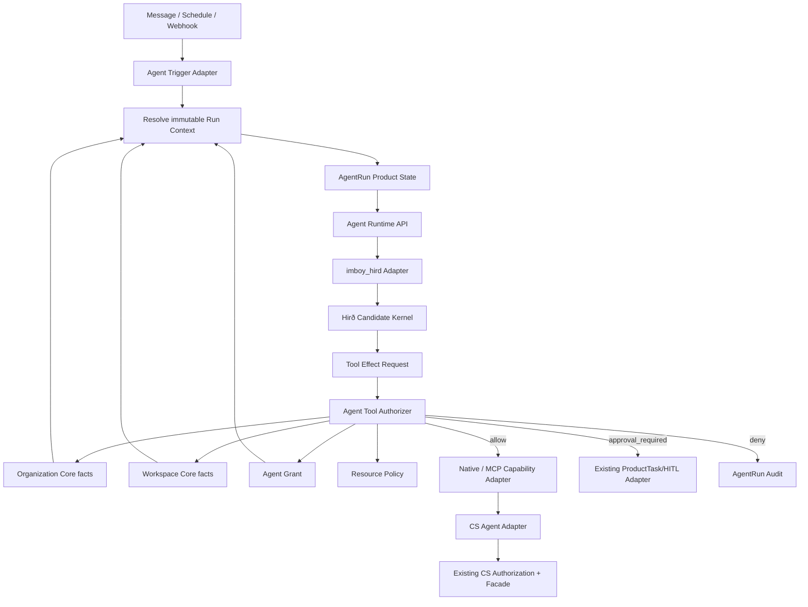
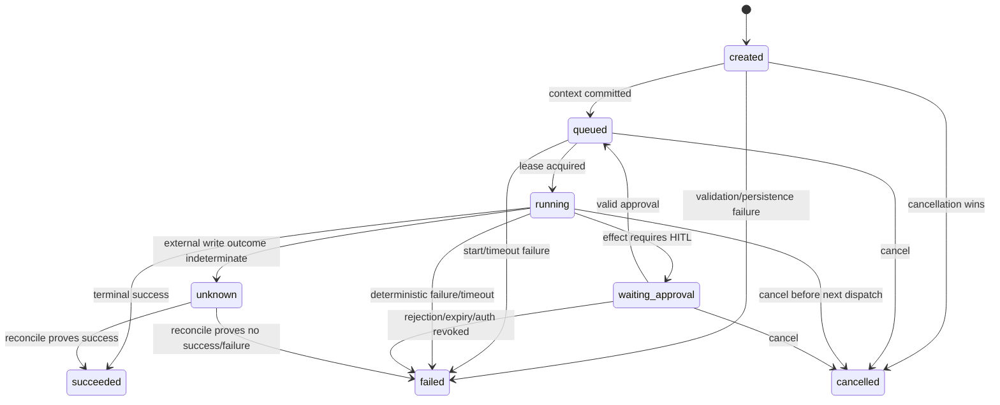

# IMBoy Agent Runtime V3.1 Architecture

> STATUS: `FROZEN_SIX_INTERFACE_CONTRACT`
>
> SCOPE: `Agent Membership / Agent Grant / Delegation / AgentRun / Tool Permission / CS Agent`
>
> ORGANIZATION CONTRACT: `READ_ONLY_CONSUMER`
>
> HIRD STATUS: `CANDIDATE_RUNTIME_KERNEL`
>
> IMPLEMENTATION: `NOT_STARTED`
>
> BASELINE HEAD: `ed7ed983ec150b182a0c72563472ef17260f0315`

本文只冻结 Agent V3.1 与 Organization、Workspace、Tool、Customer Service 之间的六个接口。
Organization、Department、Employee、Membership、Organization Role、Workspace Role 的定义全部引用既有
Organization V1 合同，本文不重新设计。

## 1. Authority and Evidence

### 1.1 Normative inputs

1. `docs/architecture/2026-09-16-enterprise-organization-v1-core-contract.md`
2. `docs/architecture/2026-09-16-enterprise-organization-agent-contract.md`
3. `docs/architecture/2026-09-16-enterprise-organization-v1.md`
4. `docs/adr/0007-feature-slice-architecture.md`
5. `docs/architecture/feature-slice-rules.md`

冲突优先级：冻结的 Organization Core Contract 高于本文；当前源码/DDL/测试高于历史路线图；本文高于
尚未实施的 Agent 计划。

### 1.2 V3 baseline classification

仓库内没有找到可核验的 Agent Runtime V3.0 权威架构文件。因此：

```text
V3_BASELINE_MISSING = YES
V3_1_BASELINE = current source
                + current migrations
                + current tests
                + frozen Organization Agent Contract
```

本文不得被解释为对某份不存在的 V3.0 文档逐字升级。

### 1.3 Current evidence

| Evidence | Current fact | V3.1 consequence |
|---|---|---|
| `src/logic/ai_agent_runtime.erl` | presence-only `gen_server`，只把 active Agent 注册进 `syn` | 不是 AgentRun Runtime；保留为兼容组件，不能承载新授权 |
| `src/logic/ai_agent_tool_loop.erl` | `applicable/2=false`，`run/5={error,disabled_v1}` | Gate 通过前保持 fail-closed |
| `ai_agent` / `ai_agent_role_version` | Profile、Prompt、模型与行为能力声明 | 不是 Grant，不能授权 Tool |
| `agent_task*` | 群场景 ProductTask/HITL 状态与审批载体 | `ProductTask != AgentRun`，禁止改名复用 |
| `mcp_client_grant` | 外部 MCP client 到 tool 的接入开关 | `MCP Client Grant != Agent Grant` |
| `barrel_mcp_tasks` | MCP protocol task | `MCP Task != AgentRun` |
| `organization_member` | Account 到 Organization 的唯一 Membership 真源 | Agent 共表、可多 Org、只能 `member` |
| `workspace_member` | 独立 Workspace 授权真源 | Org membership 不自动产生 Workspace access |
| `cs_auth` | active member + Assignment + CS permission + enabled Seat | CS Agent 必须叠加 Agent Grant/Resource Policy |
| Hirð HEAD `453bb371...` | pre-1.0 experimental；生成 Erlang/BEAM并依赖手写 runtime | 只能通过 Spike/Gate 成为候选 kernel |

2026-09-16 focused EUnit 基线：

```text
ai_agent_runtime_tests             2 passed; emitted DB-less runtime crash report
ai_agent_tool_loop_tests           2 passed
ai_agent_policy_tests              2 passed
mcp_authz_gate_tests               8 passed
cs_auth_tests                     31 passed
organization_member_logic_tests  16 passed
command exit                       0
```

这些结果只证明旧边界当前可复现，不证明本文件中的新接口已经实现。

## 2. Scope and Non-goals

### 2.1 In scope

```text
Agent Membership
Agent Grant
Delegation
AgentRun
Tool Permission
CS Agent
```

为使六接口可运行，本文件只定义最小必要的 Trigger 输入、持久化、审计、恢复、HITL 和 Runtime Adapter
交点。

### 2.2 Explicit non-goals

- 不设计或修改 Organization、Department、Employee、Organization Membership lifecycle。
- 不迁移 `account_type=2/3`；仅保持未来 `0=Human, 1=Agent` 兼容方向。
- 不把 `ai_agent_role`、Profile capability、Organization Role 或 Workspace Role 改成 Agent Grant。
- 不重写 Customer Service 状态机、Seat、Business Identity 或 Assignment。
- 不把 MCP 变成 Runtime，不把 MCP Task 变成 AgentRun。
- 不删除当前 `ai_agent_runtime`、`agent_task` 或 MCP 代码。
- 不在本阶段执行 migration、实现 Runtime、启动 Hirð 生产流量。
- 不承诺 Exactly Once 外部世界语义；只提供可验证的幂等账本与 at-most-once dispatch gate。

## 3. Frozen Identity and Permission Invariants

```text
Account
├── Human  user.account_type=0
└── Agent  user.account_type=1
```

```text
Agent Profile
!= Organization Membership Role
!= Workspace Membership Role
!= Agent Grant
!= Delegation
!= Business Identity Assignment
!= Customer Service Seat
```

```text
ProductTask != AgentRun != MCP Task
```

有效 Tool 权限是以下事实的实时交集：

```text
enabled Agent identity/profile
∩ active Organization + active Agent Organization Membership(member)
∩ active Workspace + active Agent Workspace Membership (when workspace-scoped)
∩ current active Agent Grant
∩ Grant capability/action/resource constraints
∩ current Resource Policy
∩ Tool risk/HITL policy
∩ CS operational gate (only for CS tools)
```

任一事实缺失、读取失败、版本无法解析或 scope 不一致，结果必须是 `deny`。Profile、Prompt、LLM 输出、
Tool 参数、Runtime 配置、Hirð effect declaration 均不能扩大 Grant。

## 4. Target Architecture



### 4.1 Source placement

新增 Agent 业务代码进入：

```text
src/features/agent/
├── agent_facade.erl
├── agent_sup.erl                    # 仅在确有长期进程时创建
├── domain/
├── application/
├── interfaces/
└── infrastructure/
    └── hird/                        # Hirð anti-corruption adapter
```

- `src/lib/` 是 Core/Kernel 的现有落盘位置；不再创建 `src/core/`。
- `features/agent` 是 Agent Product/Runtime 业务边界，不是 Organization Core。
- 存量 `src/logic/ai_agent_*`、`src/ds/ai_agent_*`、`src/repo/ai_agent_*` 原地保留，通过明确 adapter
  渐进接入；本计划不做目录大搬迁。
- `imboy_hird` 只可出现在 Agent infrastructure；其他业务模块不得直接调用 `hird_*`。

## 5. Current to Target Mapping

| Current concept | Target decision | Action | Must not become |
|---|---|---|---|
| `user(account_type=1)` | Agent Identity | KEEP | Profile 或 Grant |
| `ai_agent` | AI Agent Profile compatibility model | KEEP/ADAPTER | 通用 Agent registry 或授权真源 |
| `ai_agent_role_version.capabilities` | 行为/模型能力声明 | KEEP | Tool permission |
| `organization_member` | Agent Organization Membership 真源 | READ via Core contract | Agent 域复制表 |
| `workspace_member` | Agent Workspace Membership 真源 | READ via Core contract | Grant 隐式替代品 |
| `mcp_client_grant` | MCP client 接入授权 | KEEP | Agent Grant |
| `agent_task` | ProductTask/HITL compatibility carrier | KEEP/ADAPTER | AgentRun |
| `agent_hub_audit` | legacy Agent Hub chain | KEEP | AgentRun scope/effect ledger |
| `ai_agent_runtime` | presence compatibility process | KEEP until migration | Product Runtime |
| `ai_agent_tool_loop` | fail-closed kill switch | KEEP CLOSED | 未授权 Tool loop |
| `cs_auth` | CS 业务授权真源 | KEEP | Agent Grant authorizer |
| Hirð runtime | candidate execution kernel | SPIKE/ADAPTER | Product identity/policy owner |

## 6. Interface 1: Agent Membership

### 6.1 Ownership

```text
SOURCE_OF_TRUTH = organization_member + workspace_member + organization/workspace status
OWNER = Organization Core / Workspace Core
AGENT DOMAIN = read-only consumer
```

### 6.2 Read contract

Agent Application 依赖 `agent_membership_port`，由 infrastructure adapter 调用冻结的 Core facts：

```erlang
resolve_organization_membership(OrganizationId, AgentId)
  -> {ok, #{status := active, role := member, version := Version}}
   | {error, not_found | inactive | invalid_agent_role | unavailable}.

resolve_workspace_membership(OrganizationId, WorkspaceId, AgentId)
  -> {ok, #{status := active, role := Role, version := Version}}
   | {error, not_found | inactive | cross_organization | unavailable}.

resolve_organization_state(OrganizationId)
  -> {ok, #{status := active, version := Version}}
   | {error, archived | not_found | unavailable}.
```

### 6.3 Invariants

- Agent 使用共享 `organization_member`，不建 `agent_organization_member`。
- Agent 可属于多个 Organization，每个 membership 独立。
- Agent Organization role 只能是 `member`；owner/admin 必须 Human。
- Agent Domain 不直接写 Organization/Workspace 表。
- membership suspend/remove：阻止新 Run，并使进行中 Run 的下一次 Tool authorization 拒绝。
- Organization/Workspace fact unavailable：fail closed，不使用缓存旧值放行。

## 7. Interface 2: Agent Grant

### 7.1 Purpose and source of truth

Agent Grant 是指定 Human principal 向指定 Agent 授予的最大可执行边界。它不是 Profile capability，也不是
Organization/Workspace membership 的替代品。

```text
SOURCE_OF_TRUTH = Agent Domain agent_grant aggregate
DEFAULT = DENY
WORKSPACE SCOPE = none | explicit workspace ids
WILDCARD ALL WORKSPACES = FORBIDDEN in V3.1
```

### 7.2 Frozen Grant Schema Contract

AG31-02 不得重新选择表结构，只能证明以下合同可迁移、可回滚、满足并发约束，或以实证触发 STOP/ADR：

#### `agent_grant`

| Column | Type/nullable | Contract |
|---|---|---|
| `id` | bigint PK | TSID |
| `agent_id` | bigint NOT NULL | FK `user(id) ON DELETE RESTRICT`；运行时要求 `account_type=1` |
| `organization_id` | bigint NOT NULL | FK `organization(id) ON DELETE RESTRICT` |
| `delegator_user_id` | bigint NOT NULL | FK `user(id) ON DELETE RESTRICT`；运行时要求 Human |
| `workspace_scope_kind` | text NOT NULL | `none | explicit` |
| `status` | text NOT NULL | 存储态只有 `active | revoked` |
| `valid_from` | timestamptz NOT NULL | 不晚于 `expires_at` |
| `expires_at` | timestamptz NOT NULL | 到期不依赖后台任务才能拒绝 |
| `revoked_at` | timestamptz NULL | 仅 revoked 非空 |
| `revoked_by_user_id` | bigint NULL | FK `user(id) ON DELETE RESTRICT`；与 revoked_at 同空/同非空 |
| `version` | integer NOT NULL | `>=1`；所有 mutation CAS |
| `idempotency_key` | text NOT NULL | 同 Org + delegator 范围唯一 |
| `created_at/updated_at` | timestamptz NOT NULL | 审计时间 |

约束与索引：

```text
UNIQUE (organization_id, id)
UNIQUE (organization_id, delegator_user_id, idempotency_key)
CHECK workspace_scope_kind IN ('none','explicit')
CHECK status IN ('active','revoked')
CHECK expires_at > valid_from
CHECK revoked columns match status
INDEX (agent_id, organization_id, status, expires_at)
INDEX (delegator_user_id, organization_id, status)
```

API 有效态由时间实时计算为 `pending | active | expired | revoked`；`expired` 不存入 status，避免漏跑定时任务
导致权限继续有效。

#### `agent_grant_workspace`

```text
PRIMARY KEY (grant_id, workspace_id)
FOREIGN KEY (organization_id, grant_id)
  -> agent_grant(organization_id, id) ON DELETE CASCADE
FOREIGN KEY (organization_id, workspace_id)
  -> workspace(organization_id, id) ON DELETE RESTRICT
INDEX (workspace_id, grant_id)
```

`workspace_scope_kind=none` 时必须零行；`explicit` 时必须至少一行。该跨表条件在 Grant command 的同一事务
内锁定 Grant 并验证，isolated PostgreSQL 并发测试是发布前硬门。

#### `agent_grant_capability`

```text
grant_id       bigint NOT NULL REFERENCES agent_grant(id) ON DELETE CASCADE
capability     text NOT NULL
action         text NOT NULL
resource_type  text NOT NULL
constraint_json jsonb NOT NULL DEFAULT '{}'
PRIMARY KEY (grant_id, capability, action, resource_type)
CHECK non-empty capability/action/resource_type
```

`constraint_json` 只能收窄资源，不允许表达否定后再由其它字段扩大。未知 key 必须在发行与执行阶段都拒绝，
不能忽略。Capability catalog 归 Agent Tool Contract，不从 Profile 自动生成。

#### `agent_grant_event`

```text
id              bigint PRIMARY KEY
grant_id        bigint NOT NULL REFERENCES agent_grant(id) ON DELETE RESTRICT
event_type      text NOT NULL CHECK IN ('issued','revoked','expiry_observed')
actor_kind      text NOT NULL CHECK IN ('human','system')
actor_user_id   bigint NULL REFERENCES user(id) ON DELETE SET NULL
from_version    integer NULL
to_version      integer NOT NULL
detail_json     jsonb NOT NULL DEFAULT '{}'   # only sanitized metadata
idempotency_key text NOT NULL UNIQUE
created_at      timestamptz NOT NULL
INDEX (grant_id, created_at, id)
```

Event append-only；UPDATE/DELETE 被 DB guard 拒绝。Grant create/revoke 与 event 在同一事务提交，审计失败则
mutation 回滚。

### 7.3 Grant issue/revoke contract

发行 Grant 必须验证：

1. Agent 是 `account_type=1` 且启用。
2. Agent 是同 Org active member 且 role=`member`。
3. delegator 是同 Org active Human member。
4. delegator 当前有权委托每个 capability/action/resource。
5. 所有 workspace 都属于同 Org，Agent 与 delegator 的必要 Workspace membership 均 active。
6. validity window 合法，capability/action 来自版本化目录。

撤销使用 expected version + 幂等 key；撤销后下一次 Tool 调用立即拒绝。历史 Run 保留 grant id/version 快照，
但快照不具有继续放行的权力。

## 8. Interface 3: Delegation

### 8.1 V3.1 decision

V3.1 不创建独立 `agent_delegation` Aggregate。当前需求可由：

```text
agent_grant.delegator_user_id
+ agent_grant scope/capability/lifecycle
+ append-only agent_grant_event lineage
```

完整表达。只有出现多级转授权或一份 Delegation 派生多个独立 Grant 的真实需求时，才通过新 ADR 引入
独立 Delegation 实体。

### 8.2 Principal and actor

```text
principal = 承担授权责任的 Human delegator
actor     = 实际执行的 Agent
```

- Agent 不是 delegator 的同义替身。
- V3.1 禁止 Agent 再委托给另一个 Agent。
- delegator 的权限被暂停/移除后，已发行 Grant 不自动假定继续有效；authorizer 必须按 capability policy
  决定实时撤销或进入人工复核，默认策略是 deny。
- 所有 Run、Effect、CS action audit 必须同时记录 principal 与 actor。

## 9. Interface 4: AgentRun

### 9.1 Definition

AgentRun 是一次 Runtime 执行实例，由 Message/Schedule/Webhook Trigger 创建。

```text
ProductTask = 用户可见、可分解、可审批的业务任务
AgentRun    = 一次 Runtime 执行实例
MCP Task   = MCP protocol task
```

三者可以通过 ID 关联，但不能共表、改名或共享状态机。

### 9.2 Immutable context

Run 创建时验证并持久化：

```text
run_id
agent_id
organization_id
workspace_id (only nullable for explicitly organization-scoped capability)
grant_id
grant_version_at_start
delegating_principal_id
trigger_type: message | schedule | webhook
trigger_id
runtime_type
context_digest
idempotency_key
```

默认 Workspace 只可用于创建 Run 时解析候选值；写入 Run 后不得随默认值变化。Prompt、LLM 或 Tool 参数不得
改变 persisted scope。

### 9.3 Frozen AgentRun FSM

存储状态只允许：

```text
created | queued | running | waiting_approval |
succeeded | failed | cancelled | unknown
```



未列出的边全部非法。`succeeded/failed/cancelled` 为终态；`unknown` 禁止执行新 Effect，只能由显式 reconcile
命令转成 `succeeded|failed`。timeout 不是独立状态，映射为 `failed` + `reason_code=timeout`。Grant revoke 或
membership suspend 不重写历史 Run；下一次授权失败后以稳定 reason 进入 `failed`，或由 Human cancel。

并发策略：

- 每条迁移为 `UPDATE ... WHERE id=? AND status IN (...) AND version=?` CAS。
- 每次成功迁移与 `agent_run_event` 在同一事务提交。
- `running` 使用 `lease_owner/lease_expires_at/attempt`；获取/续租为 DB 条件更新。
- 节点重启只允许一个 worker 抢到过期 lease；进程锁、ETS、全局注册均不能作为真源。

### 9.4 Frozen Run/Effect Schema Contract

#### `agent_run`

| Column | Contract |
|---|---|
| `id` | bigint PK TSID |
| `agent_id` | FK `user(id) RESTRICT` |
| `organization_id` | FK `organization(id) RESTRICT` |
| `workspace_id` | nullable；非空时 composite FK 到同 Org Workspace |
| `grant_id` | FK `agent_grant(id) RESTRICT` |
| `grant_version_at_start` | 审计快照，不用于绕过实时重检 |
| `delegating_principal_id` | FK `user(id) RESTRICT` |
| `trigger_type` | `message | schedule | webhook` |
| `trigger_id` | text，服务端来源标识 |
| `runtime_type` | text，首版 `mock | hird` |
| `status/reason_code/version` | FSM 状态、稳定原因、CAS version |
| `context_digest/idempotency_key` | 非空 digest/key |
| `lease_owner/lease_expires_at/attempt` | worker lease；attempt `>=0` |
| timestamps | created/queued/started/finished/updated |

关键约束/索引：

```text
UNIQUE (agent_id, organization_id, trigger_type, trigger_id, idempotency_key)
UNIQUE (organization_id, id)
CHECK status is the frozen eight-state enum
CHECK trigger_type IN ('message','schedule','webhook')
CHECK terminal state requires finished_at
INDEX (status, lease_expires_at) WHERE status IN ('queued','running')
INDEX (agent_id, organization_id, created_at DESC)
INDEX (grant_id, status)
```

#### `agent_run_event`

Append-only，字段为 `id/run_id/from_status/to_status/reason_code/actor_kind/actor_id/detail_json/
idempotency_key/created_at`。`UNIQUE(run_id,idempotency_key)`；detail 只存 sanitized metadata。

#### `agent_effect`

| Column | Contract |
|---|---|
| `id/run_id/sequence` | PK id；`UNIQUE(run_id,sequence)` |
| `tool_id/capability/action` | 版本化 Tool descriptor |
| `resource_digest/args_digest` | 只存 digest，不存敏感原文 |
| `status` | `created|denied|waiting_approval|authorized|dispatching|succeeded|failed|unknown` |
| `authorization_reason` | 稳定 reason code |
| `approval_ref` | nullable；批准时绑定 digest/version |
| `grant_version_checked` | 最后授权检查版本 |
| `external_idempotency_key` | `UNIQUE(tool_id,external_idempotency_key)` |
| `result_digest/failure_code` | sanitized outcome |
| timestamps/version | CAS + lifecycle timestamps |

Effect 所有状态写入使用 CAS；`dispatching` 必须在调用 adapter 前持久化。该表是 dispatch/reconcile ledger，
不是业务结果真源，也不能存 credential、完整 Prompt、完整 Tool 参数或敏感结果。

## 10. Interface 5: Tool Permission

### 10.1 Single authorization entry

所有 Native Tool、MCP Tool 与 CS Tool 在 dispatch 前必须调用同一个 Agent authorizer：

```erlang
authorize(AgentRunContext, ToolDescriptor, ResourceContext)
  -> {allow, DecisionContext}
   | {approval_required, ApprovalContext}
   | {deny, ReasonCode}.
```

`ToolDescriptor` 至少包含稳定 tool id、capability、action、risk level、side-effect class；
`ResourceContext` 必须由服务端 adapter 从参数解析并交叉验证，不能相信 LLM 提供的 Org/Workspace。

### 10.2 Decision order

```text
1. validate Run non-terminal and immutable context
2. validate Agent enabled
3. re-read Organization state + Membership
4. re-read Workspace ownership + Membership when required
5. re-read current Grant and version/lifecycle
6. match capability/action/resource constraints
7. evaluate domain Resource Policy
8. evaluate Tool risk and HITL policy
9. evaluate CS gate for CS tools
10. persist decision before dispatch
```

任何读取异常、未知 tool、未知 risk、未知 constraint、scope mismatch、过期或版本冲突均 deny。

### 10.3 Approval and side effects

- `approval_required` 只返回审批请求，Run 进入 `waiting_approval`，不得 dispatch。
- 可通过 adapter 关联现有 `agent_task`/未来 ProductTask，但不复用其表作为 AgentRun。
- approval 必须绑定 `run_id + effect_id + args_digest + grant_version`；参数变化后旧批准失效。
- dispatch 前再次授权；批准不能覆盖已撤销 Grant、已暂停 membership 或已归档 Org。
- side-effect key 唯一；状态从 `authorized -> dispatching -> succeeded|failed|unknown`。
- 外部系统支持幂等 key 时，只能用同一 key 重试，并以查询/返回结果收敛 ledger。
- 外部系统不支持幂等 key 时，IMBoy 只能保证 **at-most-once dispatch attempt**：进入 `dispatching` 后若
  crash/timeout 且结果不可知，必须写 `unknown`，禁止自动重发，转 reconcile 或 HITL。
- 不声明外部副作用 exactly-once。数据库事务、Hirð replay、消息重投均不能把未知外部结果变成 exactly-once。

### 10.4 Native and MCP boundary

```text
Agent Tool Permission
  -> Native Capability Adapter
  -> domain facade

Agent Tool Permission
  -> MCP Adapter
  -> MCP client/session/protocol gate
```

MCP 自身授权是额外的协议/客户端门，不能替代 Agent Grant；社区 profile 下现有 MCP compatibility
行为也不能降低 Agent Tool Permission 的 fail-closed 规则。

## 11. Interface 6: CS Agent

### 11.1 Integration boundary

不为 `cs_auth` 新增公开 HTTP Agent credential，不允许 Agent 直读/写客服表。

```text
Agent Runtime
  -> Agent Tool Authorizer
  -> CS Agent Authorization Adapter
  -> existing Customer Service Facade
  -> existing CS application/domain/infrastructure
```

### 11.2 Required intersection

Agent 执行客服动作必须同时满足：

```text
active Agent identity
∩ active Org membership(member)
∩ active Workspace membership
∩ active customer_service Business Identity Assignment
∩ enabled Customer Service Seat
∩ existing CS action permission
∩ explicit Agent Grant for the exact CS capability/action/resource
∩ Resource Policy
∩ HITL policy for write/high-risk action
```

- Seat 仍属于 Business Identity 的运营属性。
- Agent 只是当前 operator，不是 Seat owner、Employee、CS Role 或 Organization Role。
- Session 继续显式绑定 Organization + Workspace；Agent 不得用默认 Workspace 替代 Session scope。
- CS audit 保留业务 actor，同时关联 AgentRun/effect/grant/principal；不得把 Agent 伪装成 Human operator。
- 正向 Agent operator 路径默认 disabled，直到 CS Agent integration Gate 全部 PASS。

## 12. Runtime API and Supervisor Boundary

### 12.1 Stable Runtime API

业务 Trigger 只调用 `agent_facade`/Agent application，不直接调用 Hirð：

```erlang
start_run(Trigger, CandidateContext) -> {ok, RunId} | {error, Reason}.
cancel_run(RunId, ActorContext) -> ok | {error, Reason}.
resume_after_approval(RunId, EffectId, Decision) -> ok | {error, Reason}.
get_run(RunId, ViewerContext) -> {ok, RunView} | {error, Reason}.
```

### 12.2 Two supervisor roles

```text
IMBoy Agent Supervisor
  owns product worker lifecycle, leases, recovery, shutdown, metrics

Hirð generated Supervisor
  owns actors generated for one runtime instance/run according to compiled program
```

两者不能互相冒充。进程名必须带 tenant/org/agent/run scope 或使用 pid/registry key；禁止固定全局注册名导致
多 AgentRun 冲突。Hirð crash/restart 不改变 DB Product State，必须通过 Runtime Adapter 回报结果。

### 12.3 `imboy_hird` anti-corruption layer

```text
Runtime API -> imboy_hird -> hird_* runtime
```

`imboy_hird` 负责 DTO、生命周期、Tool handler、Model adapter、audit bridge、cancel/timeout 映射；它不能拥有
Organization、Grant、Permission、CS、Memory 或 ProductTask 数据。

## 13. Data Ownership and Migration Contract

| Data | Owner | Existing/new | Migration rule |
|---|---|---|---|
| Agent identity | Account Core | existing | 本阶段不迁 2/3 |
| AI Agent profile | Agent | existing | 保留兼容，不授权 |
| Org/Workspace membership | Org/Workspace Core | existing | Agent 只读 |
| Agent Grant/workspace/capability/event | Agent | new | `AGENT_MIGRATION_SLOT_GRANT` |
| AgentRun/event/effect | Agent | new | `AGENT_MIGRATION_SLOT_RUN` |
| CS adapter DB | CS/Agent | normally none | 仅有必要时 `AGENT_MIGRATION_SLOT_CS_ADAPTER` |
| ProductTask/HITL | Product task owner | existing/adapter | 不改成 Run |
| MCP client grant/task | MCP | existing | 不合并 |

实际编号必须在实施时通过共享 migration ledger 原子预留。已知 `00000126*` 可能由并行 Customer Service
计划占用，因此本文和实施计划禁止硬编码下一个编号。

Migration 执行顺序：

```text
snapshot -> allocate symbolic slots -> expand -> isolated PG up/down/up
-> deploy read/write code disabled -> verify/backfill (if any)
-> enable readonly run -> enable approval-required write
-> compatibility verification -> cleanup only after zero legacy callers
```

## 14. Security and Failure Contract

| Failure | Required behavior |
|---|---|
| Org/Workspace fact timeout | deny; no stale allow |
| Grant missing/revoked/expired | deny and audit |
| delegator no longer eligible | deny by default; manual re-issue |
| Run terminal/cancelled/timed out | deny all new effects |
| approval digest mismatch | deny; request new approval |
| duplicate trigger | return same Run; no second side effect |
| duplicate effect | return persisted terminal result or reconcile; no redispatch |
| dispatch outcome unknown | no blind retry for write tools |
| node restart | recover from DB lease/event; one worker only |
| Hirð runtime unavailable | Run fails/retries under product policy; never bypass authorizer |
| authorization/audit persistence failure | fail closed before every Tool dispatch |
| sensitive data in args/result | store digest/sanitized metadata only |

## 15. Hirð Candidate Gate

所有 Gate 初始状态均为 `NOT_RUN`。只有 G01-G20 全部以同一 pinned fingerprint 和同一 IMBoy candidate
通过，才能把 Hirð 状态提交新 ADR 评估；本文不能直接宣布 Production Runtime。

| ID | Gate | Required evidence |
|---|---|---|
| G01 | reproducible build | clean worktree build hashes/commands |
| G02 | pinned version/fingerprint | commit, runtime file hashes, compiler/runtime compatibility |
| G03 | OTP lifecycle | start/stop/shutdown under IMBoy supervisor |
| G04 | multi-AgentRun | concurrent isolated runs |
| G05 | no registration conflict | repeated agent/run names do not collide |
| G06 | no global-state isolation issue | audit/replay/handlers have per-run scope |
| G07 | tenant/org/agent/run isolation | negative cross-scope tests |
| G08 | model/tool context isolation | no context bleed across runs |
| G09 | permission fail-closed | authorizer unavailable/deny blocks dispatch |
| G10 | HITL fail-closed | no approval, stale approval, digest mismatch all block |
| G11 | crash recovery | actor/runtime crash and bounded recovery |
| G12 | cancel recovery | cancel survives crash/restart |
| G13 | timeout recovery | timeout stops subsequent effects |
| G14 | node restart recovery | DB-backed single recovery owner |
| G15 | duplicate side-effect prevention | repeated trigger/effect does not redispatch |
| G16 | deterministic replay | exact recording replays consistently |
| G17 | replay without external services | outbound calls proven zero |
| G18 | readonly Tool E2E | membership/grant/policy/audit full chain |
| G19 | approval-required write Tool E2E | approval binding and post-approval recheck |
| G20 | concurrency/memory/log-sensitive-data | load, leak, log and retention evidence |

## 16. Acceptance Matrix

| ID | Precondition | Action | Expected | Evidence |
|---|---|---|---|---|
| AG31-A01 | Agent has active Org membership only | create Tool-capable Run | denied without Grant | API/application test |
| AG31-A02 | Agent has Grant in Org A | submit Org B context | denied and audited | negative integration test |
| AG31-A03 | Grant names Workspace A | replace tool resource with Workspace B | denied before dispatch | authorizer test |
| AG31-A04 | valid Run | revoke Grant before next Tool | next Tool denied | concurrency PG test |
| AG31-A05 | valid Run | suspend Org membership | new Run and next Tool denied | Org/Agent contract test |
| AG31-A06 | valid Run | remove Workspace membership | workspace Tool denied | Workspace integration test |
| AG31-A07 | Profile/Prompt claims broader scope | call outside Grant | denied | injection test |
| AG31-A08 | duplicate trigger | create Run twice | same Run id, one execution | PG idempotency test |
| AG31-A09 | duplicate effect | dispatch same idempotency key | one external dispatch | fake adapter test |
| AG31-A10 | approval required | approve changed args | old approval rejected | HITL digest test |
| AG31-A11 | running node dies | lease expires and recovery starts | one recovery owner, no duplicate effect | node/recovery test |
| AG31-A12 | Agent assigned to CS identity, no CS Grant | operate session | denied | CS integration test |
| AG31-A13 | all CS facts valid | execute allowed CS read | success with actor/principal/run audit | CS E2E |
| AG31-A14 | CS write requires approval | call without approval | no CS facade mutation | CS/HITL E2E |
| AG31-A15 | archived Org | message/schedule/webhook trigger | no Run created | trigger integration tests |
| AG31-A16 | MCP client allowed, Agent Grant missing | Agent calls MCP Tool | denied | combined MCP/Agent test |
| AG31-A17 | Agent Grant allowed, MCP client denied | Agent calls MCP Tool | denied | combined MCP/Agent test |
| AG31-A18 | replay mode | replay recorded Run | zero external Model/Tool/CS calls | replay harness |
| AG31-A19 | logs/audit collected | secret/PII scan | no credential/full sensitive payload | security gate |
| AG31-A20 | two orgs and multiple Runs | concurrent execution | no process/context/audit collision | isolation/load test |

## 17. Architecture Decisions

| ADR | Decision | Status |
|---|---|---|
| ADR-AG31-001 | Membership 复用 Organization/Workspace 真源，Agent Domain 只读 | ACCEPTED |
| ADR-AG31-002 | Agent Grant 独立于 Profile/Role/MCP Grant | ACCEPTED |
| ADR-AG31-003 | V3.1 Delegation 由 Grant + event lineage 表达，不新建 Aggregate | ACCEPTED |
| ADR-AG31-004 | AgentRun 独立于 ProductTask/MCP Task | ACCEPTED |
| ADR-AG31-005 | 所有 Tool 经过单一 fail-closed authorizer | ACCEPTED |
| ADR-AG31-006 | CS Agent 走内部 adapter，不新增公开 Agent credential | ACCEPTED |
| ADR-AG31-007 | IMBoy Supervisor 与 Hirð generated Supervisor 分工并存 | ACCEPTED |
| ADR-AG31-008 | Hirð 保持 candidate，G01-G20 后另行生产裁决 | ACCEPTED |

## 18. Final Gate

```text
SIX_INTERFACE_CONTRACT = FROZEN
ORGANIZATION_CONTRACT_CONSUMPTION = PASS_READ_ONLY
ORGANIZATION_REDESIGN = NO
AGENT_MEMBERSHIP_CONTRACT = PASS
AGENT_GRANT_CONTRACT = PASS
DELEGATION_CONTRACT = PASS
AGENTRUN_CONTRACT = PASS
TOOL_PERMISSION_CONTRACT = PASS
CS_AGENT_CONTRACT = PASS_ARCHITECTURE_IMPLEMENTATION_DISABLED
SOURCE_PLACEMENT = FROZEN_FEATURE_SLICE
MIGRATION_READY = SYMBOLIC_SLOTS_READY_NUMBERS_UNALLOCATED
DB_RUNTIME_EVIDENCE = NOT_RUN_FOR_V3_1
HIRD_PRODUCTION_RUNTIME = NO
IMPLEMENTATION_PLAN = REQUIRED
READY_FOR_AGENT_V3_1_IMPLEMENTATION = PHASED_GO
```

`PHASED_GO` 只表示六接口和实施顺序足够明确：可先执行 AG31-00，并在 migration ledger 与 isolated
PostgreSQL 就绪后执行独立的 expand 工作。AG31-01 及其下游必须等待 Organization ORG-06 fact API
实施并 PASS；任何实际 CS Agent 正向流量、写 Tool 或 Hirð runtime 切换仍必须通过对应 Task 与 Gate。
不得用本架构文档替代运行证据。
