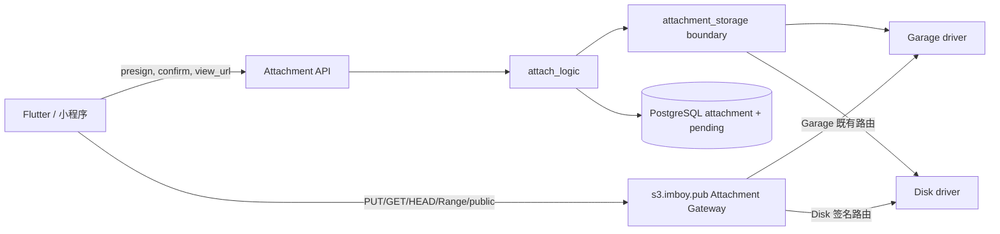
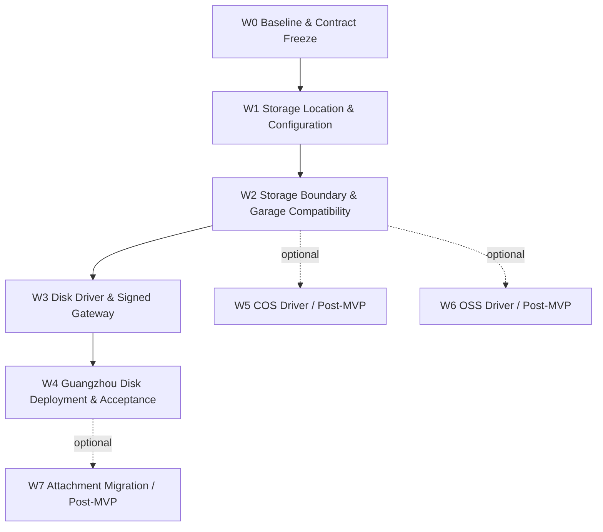

# IMBoy 附件可插拔存储架构与 Disk 一期实施验收计划

> **本次执行合同级精修摘要（2026-09-25）**
>
> 1. 固定 `https://s3.imboy.pub` 为一期 Attachment Gateway，域名语义与存储 driver 解耦；
> 2. 冻结只接受 `storage_location + operation_context` 的最小 driver contract；
> 3. 增加覆盖 presign、PUT、stat、private/public URL、delete、multipart 的操作矩阵；
> 4. 固定 pending 生命周期及“先持久化 location，后签发 URL”的 fail-closed 顺序；
> 5. 固定 Disk HMAC canonical request、测试向量与防重放条件；
> 6. 增加可断点续跑的无人值守状态机和单 AC/单波次重试上限；
> 7. 将 Range、RSS、磁盘余量等验收改为机器可判定 Oracle；
> 8. 不改变一期范围：Garage 仅做 compatibility baseline，COS/OSS/W7 仍为 Post-MVP，
>    W2 仍以删除 `elib_oss.erl` 且 `src/test` 零引用为硬门。
>
> **状态**：PLAN / READY_FOR_REVIEW，尚未实施
>
> **基线仓库**：`/Users/leeyi/project/imboy.pub/imboy`
>
> **BASE_SHA**：`749c436fbc938e27263b8142e3df3598d3f4ca71`
>
> **日期**：2026-09-25
>
> **目标**：建立供应商无关的 `attachment_storage` 内部边界，以现有
> `https://s3.imboy.pub` 作为与 driver 解耦的 Attachment Gateway，保持客户端附件协议
> 不变；广州一期生产只交付 `driver=disk`。Garage 是默认配置、既有能力基线、历史附件
> 兼容来源和回滚目标，不是一期新增交付能力。COS/OSS 属于可选 Post-MVP。
>
> **决策依据**：[ADR 0008](../adr/0008-pluggable-attachment-storage.md)

## 1. 目标与一期范围

本计划不把 `s3_driver` 作为配置名，因为 `disk` 不是 S3。采用：

```erlang
{attachment_storage, #{
    driver => disk, %% garage | disk | cos | oss
    ...
}},
```

切换配置只决定**新上传**的目标；每条附件记录保存实际存储位置，旧附件继续从原位置
读取。Garage 切到 disk 后不需要立即迁移历史数据，回滚也只改变后续新上传；已写入
disk 的附件仍按行内位置读取。

广州一期 DONE 定义是：供应商无关边界建立、Garage compatibility regression 通过、
Disk production capability 完成、广州 `driver=disk` 的部署/重启/备份恢复/真实附件闭环
通过。它不是“Garage + Disk 双驱动一起交付”。

```text
                    attachment_storage
                           │
                 ┌─────────┴─────────┐
                 │                   │
              Garage                Disk
              BASELINE             TARGET
              默认配置              广州一期
              回归测试              生产部署
              历史附件              新上传
              回滚目标              新能力
```

一期生产路径固定为 `W0 -> W1 -> W2 -> W3 -> W4`。W5 COS、W6 OSS、W7 迁移工具均为
`OPTIONAL / POST-MVP`；缺少真实第三方 bucket、凭据或授权不得阻塞广州 Disk 一期，也不得
用 mock 将 COS/OSS 标记为 LIVE PASS。

## 2. 当前源码事实

| 事实 | 当前位置 | 影响 |
|---|---|---|
| 客户端协议为 presign → 原始 PUT → confirm | `attach_handler.erl`、Flutter `attachment_api.dart` | disk 也必须返回可 PUT 的 URL，避免客户端升级 |
| 业务层直接调用历史 Garage/S3 模块 | `attach_logic.erl` → `elib_oss.erl` | 建立 Storage Boundary，迁移调用者后删除历史模块 |
| confirm 会核实对象大小和 MIME | `attach_logic:verify_and_save/5` | driver 统一提供 `stat` |
| 私有下载先查 DB ACL，再生成 URL | `attach_logic:view_url/2` | driver 选择必须发生在 ACL 通过之后 |
| 公共资源当前可直拼 public URL | `elib_oss:public_url_for_key/1` | 由统一边界按实际 location 生成，disk 改走 public gateway |
| 删除散落在注销、企业留存、孤儿清理等路径 | 多个 logic 模块调用 `elib_oss:delete_object` | 所有 I/O 必须收敛到 Storage Boundary，逐项回归 |
| pending 已记录 bucket，未记录 driver | `attach_pending_repo` | presign 与 confirm 跨配置切换会选错后端 |
| pending 写入失败目前不阻断 presign | `attach_logic:presign/5` | 新设计中会丢失 driver 与上传授权，必须改为 fail-closed |
| `attachment.path` 保存 object_key | attachment 表及客户端消息 | object_key 保持不变，位置元数据另列保存 |
| 现有公网附件访问基址为 `https://s3.imboy.pub` | `config/sys.config.example`、生产 Nginx vhost | 一期保留域名，但把它定义为 Attachment Gateway，不再等同于 S3 provider |
| 单文件上限 100 MB | `elib_oss:max_file_size/0`、Flutter | disk 上传必须流式，不得新增第二份 100 MB 内存副本 |
| 另有 multipart→服务端临时文件→Garage 链路 | `attachment_upload_logic.erl` | 也必须经 Storage Boundary 按 pending driver 分派，不能只改 presigned PUT |

在当前基线，`rg -n -- "elib_oss" src test` 有 271 行文本命中、涉及 32 个文件。该数字只
作为 W0 初始盘点，实施者必须在自己的 BASE_SHA 重新采样；W2 出口要求命中数为 0。

## 3. 目标架构



### 3.1 Storage Boundary

一期不做完整 Attachment Feature Slice 搬迁，先使用仓库已支持递归编译的窄边界目录：

```text
src/lib/attachment_storage/
├── attachment_storage.erl
├── attachment_storage_driver.erl
├── attachment_storage_garage.erl
└── attachment_storage_disk.erl
```

W5/W6 真正启动时才分别增加 COS/OSS driver，不在一期创建空模块或占位实现。业务层只
调用 `attachment_storage`，不得直接调用具体 driver，也不得读取 Garage/Disk/COS/OSS
配置。provider endpoint、credential、磁盘 root、签名 secret、bucket 默认值等只能由
driver/infrastructure 从启动时已校验的配置读取。

`attachment_storage_driver` 的一期最小合同固定为：

```erlang
-type storage_location() :: #{
    driver := garage | disk | cos | oss,
    container := binary() | undefined,
    object_key := binary()
}.

-type operation_context() :: #{
    operation := presign_put | put_file | stat | private_url | public_url | delete,
    request_id := binary(),
    actor_id => integer(),
    scope => binary(),
    mime_type => binary(),
    expected_size => non_neg_integer(),
    expires_at => pos_integer(),
    source_path => file:filename_all()
}.

-callback presign_put(storage_location(), operation_context()) ->
    {ok, binary()} | {error, term()}.
-callback put_file(storage_location(), operation_context()) ->
    ok | {error, term()}.
-callback stat(storage_location(), operation_context()) ->
    {ok, #{size := non_neg_integer(), content_type := binary()}} | {error, term()}.
-callback private_url(storage_location(), operation_context()) ->
    {ok, binary()} | {error, term()}.
-callback public_url(storage_location(), operation_context()) ->
    {ok, binary()} | {error, term()}.
-callback delete(storage_location(), operation_context()) ->
    ok | {error, term()}.
```

`operation_context` 中除 `operation`、`request_id` 外均为按操作选填的 provider-neutral
字段；不允许出现 endpoint、region、access key、secret、bucket 配置、`root_dir` 或
provider client。`container` 是对象实际位置的一部分，不是运行配置。ACL、owner 和 scope
判定在调用 boundary 前完成；driver 不重新实现业务授权。

`elib_oss.erl` 是内部历史模块，不是公共 API，也不是兼容层。Provider I/O 调用迁入
`attachment_storage`；其中混杂的 MIME、object key、owner、file category 等纯策略函数
迁回现有业务归属模块，只有仍有多个调用者时才增加一个最小的 provider-neutral helper。
W2 完成后删除 `elib_oss.erl`，不保留 deprecated wrapper。

### 3.2 Operation Contract Matrix

下表是一期全部附件 I/O 的冻结清单。W0 必须把真实调用点映射到每一行；出现未登记的
上传、读取或删除路径时立即 `NO_GO`，不得在业务模块旁路增加 driver 分支。

| Operation | 入口与调用者 | Boundary contract | Location 来源 | 一期路由与完成 Oracle |
|---|---|---|---|---|
| presign PUT | `attach_handler -> attach_logic` | `presign_put(Location, Ctx)` | 先生成完整 location 并成功写入 pending | Garage 返回既有签名 URL；Disk 返回 Gateway upload URL；响应字段不变 |
| client PUT | 客户端对 `put_url` 裸 PUT | 不二次调用业务层 | URL 已绑定 pending location | Garage 走既有 Gateway/S3 路由；Disk 走 Gateway 签名 upload；成功后对象可 `stat` |
| stat/confirm | `attach_logic:confirm` | `stat(Location, Ctx)` | 只读 pending location | size/MIME 一致后写 attachment 并删除 pending；不得读 active driver |
| private URL | ACL 通过后的 `view_url` | `private_url(Location, Ctx)` | attachment 行 | Garage 保持既有行为；Disk 返回 Gateway download URL |
| private GET/HEAD/Range | 客户端访问 private URL | URL 已绑定 attachment location | 签名 URL | Disk Gateway 验 HMAC 后流式响应；Range Oracle 见 AC-18/19 |
| public URL | presign/confirm/view 的 public 分支 | `public_url(Location, Ctx)` | pending/attachment location | 返回 Gateway URL；不把 provider endpoint 持久化或暴露为业务事实 |
| public GET/HEAD/Range | 匿名客户端访问 public URL | Gateway 查库，不由业务层传 driver 配置 | confirmed public attachment 行 | 仅 confirmed + public 可读；private/pending/not-found 均拒绝 |
| delete | 注销、留存、孤儿清理、业务删除 | `delete(Location, Ctx)` | attachment/pending 行或已冻结清理清单 | 按行内 driver 分派；所有调用点有 fake-driver 计数证据 |
| multipart | `attachment_upload_logic` 临时文件完成 | `put_file(Location, Ctx#{source_path => ...})` | pending location | Garage/Disk 均按 pending driver 写入；成功后删除临时文件，失败保留稳定错误标签并清理 |

`confirm` 本身不是 driver callback；它是 `pending location -> stat -> attachment transaction`
的业务编排。GET/HEAD/Range 也不是业务层重新选择 driver，而是 Gateway 根据已签 URL 或
confirmed public 行访问已确定的 location。

### 3.3 AttachmentStorageLocation

业务代码使用明确的存储位置值，而不是传递零散 driver/bucket/key：

```erlang
-type storage_location() :: #{
    driver := garage | disk | cos | oss,
    container := binary() | undefined,
    object_key := binary()
}.
```

数据库一期仍保留 `storage_driver`、`storage_bucket`、`path`，避免纯命名引起额外迁移；
domain API 将 `storage_bucket` 映射为 `container`，`path` 映射为 `object_key`。disk 的
container 为 `undefined`。三者描述对象“在哪里”，driver 实现描述“如何访问”。

数据库不得保存 `s3.imboy.pub`、未来的 `attachments.imboy.pub`、provider endpoint、
presigned URL 或任意访问域名。域名属于 Gateway/runtime 配置，location 才是持久化事实。

### 3.4 Attachment Gateway 与访问域名

一期继续使用现有 `https://s3.imboy.pub`，但将其定义为 **Attachment Gateway**：名字是
历史兼容事实，不代表后端必须是 S3。它负责将稳定访问入口路由到 Garage 或 IMBoy Disk
Gateway；业务表和消息 payload 都不感知域名。

一期约束：

1. Disk 的 PUT、GET、HEAD、单 Range 和 public 读取都通过 `s3.imboy.pub`；
2. Garage 保持现有域名、签名和路由行为，作为 compatibility baseline；
3. driver 切换不改变 Flutter 的 presign/confirm/view_url 请求或响应字段；
4. `attachments.imboy.pub` 仅是未来可选的域名演进方向，一期不申请 DNS/证书、不切流、
   不修改客户端，也不把它写入数据库；
5. Gateway base URL 只能来自运行配置；切换域名时无需迁移 attachment/pending 数据。

### 3.5 不变的客户端契约

```text
GET  /api/v1/attachment/presign -> put_url + object_key + expires_at
PUT  <put_url>                  -> 2xx
POST /api/v1/attachment/confirm -> object_key (+ attachment_id)
GET  /api/v1/attachment/view_url -> url
GET  <url>                      -> bytes / range bytes
```

不得要求 Flutter 根据 driver 分支，不得把 access key、secret key 或真实磁盘路径返回
给客户端。

### 3.6 Disk Gateway 端点

```text
PUT  https://s3.imboy.pub/api/v1/attachment/storage/upload?key=...&mime=...&exp=...&op=upload&sig=...
GET  https://s3.imboy.pub/api/v1/attachment/storage/download?key=...&exp=...&op=download&sig=...
HEAD https://s3.imboy.pub/api/v1/attachment/storage/download?key=...&exp=...&op=download&sig=...
GET  https://s3.imboy.pub/api/v1/attachment/public?key=...
HEAD https://s3.imboy.pub/api/v1/attachment/public?key=...
```

上传/下载短时 URL 不使用 App JWT，因为现有 Flutter 的裸 Dio 会刻意移除
Authorization；它们使用独立 HMAC 签名。public 端点只允许数据库中已 confirm 且
`scope=public` 的记录。

### 3.7 Disk HMAC Canonical Request

Disk 私有 upload/download URL 使用 HMAC-SHA256。验签前先对 query 做严格解析：upload
只允许 `key,mime,exp,op,sig`，download 只允许 `key,exp,op,sig`；缺失、重复或额外字段，
以及未知 `op`、无效 UTF-8、NUL、非法 percent-encoding、非十进制 `exp` 均拒绝。`key`
只 percent-decode 一次，再执行与磁盘路径相同的 object key 规范化；upload 请求的
`Content-Type` 必须与 canonical content-type 一致。

Canonical bytes 固定为六行 UTF-8，行间为单个 LF，末尾**没有**换行：

```text
IMBOY-ATTACHMENT-HMAC-V1
<UPPERCASE_HTTP_METHOD>
<operation: upload|download>
<base64url(normalized_object_key UTF-8 bytes, no padding)>
<expires_at Unix seconds in canonical decimal>
<lowercase content-type for upload; empty for download>
```

签名为 `lowercase_hex(HMAC-SHA256(signing_secret, canonical_bytes))`，使用常量时间比较。
服务端必须校验 `expires_at > now` 且不超过配置允许的最大 TTL。GET、HEAD 分别签名；Range
是 GET 的 header，不进入 canonical request，因此同一 GET URL 可以请求完整内容或单
Range。public URL 不使用 HMAC，但必须查库验证 confirmed public 行。

冻结测试向量（仅用于测试，严禁作为生产 secret）：

```text
test_material    = concat("0123456789abcdef", "0123456789abcdef")
method           = PUT
operation        = upload
normalized_object= u42/file/20260925/report.pdf
encoded_object   = dTQyL2ZpbGUvMjAyNjA5MjUvcmVwb3J0LnBkZg
expires_at       = 1790294400
content-type     = application/pdf
signature        = 9149d4d960ce5fc91dee94e625a7cc95953a668af8eacad75dc8f2edf23a7874
```

method、operation、normalized object key、expiry、upload content-type 任一变化都必须验签
失败；upload URL 不得用于 download，GET URL 不得用于 HEAD，改 key 或延长 expiry 不得
重放。

### 3.8 Disk 写入规则

1. key 必须通过现有 `owner_of_key` 与 pending 所有权校验；
2. 规范化后目标路径必须仍位于 `root_dir`；
3. 拒绝空段、`.`、`..`、绝对路径、NUL、反斜杠和符号链接逃逸；
4. 在目标同目录创建唯一 `.part` 文件，限制读取总量为 100 MB；
5. 写完执行 sync，并以同文件系统 rename 原子发布；
6. URL 有效期内允许同一未 confirm key 重试；confirm 后返回 `409`，禁止覆盖；
7. 失败删除 `.part`，周期任务清理超时临时文件；
8. 每次上传前检查 `min_free_bytes`，不足返回 `507 Insufficient Storage`。

### 3.9 Disk 读取规则

- 私有资源沿用 `attach_logic:authorize` 后才签发下载 URL；
- 支持完整 GET、HEAD 和一个 `Range: bytes=start-end`，合法范围返回 `206`；
- 非法或多区间 Range 返回 `416`；
- 设置 `Content-Type`、`Content-Length`、`Accept-Ranges`、`ETag`；
- 不在错误响应中暴露绝对路径；
- 未找到与无权访问继续保持外部不可枚举语义。

## 4. 数据与配置契约

### 4.1 配置

配置结构以 ADR 0008 为准。新增环境变量：

| 变量 | 必需条件 | 说明 |
|---|---|---|
| `IMBOY_ATTACHMENT_STORAGE_DRIVER` | 总是 | `garage/disk/cos/oss` |
| `IMBOY_ATTACHMENT_GATEWAY_BASE_URL` | 总是 | 一期固定 `https://s3.imboy.pub`；仅运行配置，不入库 |
| `IMBOY_ATTACHMENT_DISK_ROOT_DIR` | driver=disk | 容器内绝对路径 |
| `IMBOY_ATTACHMENT_DISK_SIGNING_SECRET` | driver=disk | 独立随机密钥，至少 32 字节 |
| `IMBOY_ATTACHMENT_DISK_MIN_FREE_BYTES` | driver=disk，可选 | 默认 5 GiB |
| `IMBOY_COS_*` | driver=cos | endpoint/region/private+public bucket/public URL/SecretId/SecretKey |
| `IMBOY_OSS_*` | driver=oss | endpoint/region/private+public bucket/public URL/AccessKey |

兼容策略：现有 `{garage, #{...}}` 和 `IMBOY_GARAGE_*` 至少保留一个发布周期；默认
driver 为 `garage`。启动时校验 active driver 和数据库中仍被 attachment/pending 引用的
driver；全新 disk 数据库不要求 Garage 密钥，但存在 Garage 历史行却缺配置时必须失败。

### 4.2 数据库迁移

建议使用下一可用迁移号，执行前必须重新扫描 `priv/migrations/`，不得预占过期编号。

```sql
ALTER TABLE attachment
  ADD COLUMN storage_driver varchar(16) NOT NULL DEFAULT 'garage',
  ADD COLUMN storage_bucket varchar(255);

ALTER TABLE attach_pending
  ADD COLUMN storage_driver varchar(16) NOT NULL DEFAULT 'garage',
  ALTER COLUMN bucket DROP DEFAULT,
  ALTER COLUMN bucket DROP NOT NULL;
```

迁移脚本还需按 scope 回填 `storage_bucket`，并对 `attachment.storage_bucket` 与
`attach_pending.bucket` 增加同一 CHECK 约束：Garage/COS/OSS 的 bucket 必须非空，disk
的 bucket 必须为 NULL。回填完成后移除 `storage_driver` 的
`DEFAULT 'garage'`，迫使所有新写路径显式提供 driver。down migration 只有在不存在非
Garage 行时才允许执行，否则 fail-closed。

迁移和 repo contract 必须保证数据库只保存 `storage_driver`、`storage_bucket/container`、
`path/object_key` 等 location 字段；不得增加 gateway/provider URL 字段，也不得把 presigned
URL 写入 `attachment.path`、`attachment.url`、pending 或消息 payload。

### 4.3 Pending 生命周期与 fail-closed 顺序

pending 是 presign 与 confirm 之间唯一可信的 location 快照。以下是逻辑状态，不要求
一期额外增加状态列；持久状态必须能由数据库行和对象探测结果重建。`URL_ISSUED` 是瞬态，
恢复时任何 PERSISTED 行都按“URL 可能已签发”处理，直至 confirm 或 expiry：

```text
ALLOCATED（仅内存，已生成 location）
    -> PERSISTED（attach_pending 已持久化完整 location）
    -> URL_ISSUED（driver 成功签名后才向客户端返回 put_url）
    -> OBJECT_PRESENT（PUT 成功，可由 stat 观察）
    -> CONFIRMED（attachment 写入且 pending 在同一事务删除）
    -> EXPIRED（TTL 清理；删除仍按 pending location 分派）
```

强制时序：

1. 业务层校验 owner/scope/MIME/size，生成不可变 `AttachmentStorageLocation`；
2. 先持久化 pending 的 driver、container、object_key、owner、scope、MIME、expiry；
3. 只有 pending insert/commit 成功后，才调用 `presign_put(Location, Ctx)`；
4. 只有签名成功后，才返回既有 `{put_url, object_key, expires_at}` 响应；
5. pending 写入失败时不得调用 driver；签名失败时不得返回 URL，并尝试删除刚写入的
   pending；补偿删除失败则保留给 TTL 清理并记录不含 secret 的稳定错误标签；
6. confirm 必须按 object_key+owner 锁定并读取 pending location，再调用 `stat`；禁止读取
   当前 active driver 或重新推导 container；
7. `stat`、size/MIME 校验和 attachment 写入任一失败时保留 pending 供安全重试；
8. confirm 成功时在同一数据库事务写 attachment location 并删除 pending；重复 confirm
   返回既有幂等结果，不得创建第二条 attachment；
9. TTL 清理、失败补偿和 multipart 都必须使用 pending 行内 location，配置切换不改变
   已签发上传的落点。

任一故障注入用例如果观察到“没有持久化 location 却返回 URL”、pending driver 与最终
attachment driver 不一致，或 active driver 切换改变已存在 pending 的处理结果，立即
`NO_GO`。

## 5. 实施波次与所有权

实施必须在独立 worktree/任务分支完成。当前共享工作树已有不属于本计划的未跟踪文档，
不得 stash、reset、clean、覆盖或纳入提交。每张卡只提交列出的 owned paths；发现重叠先
停下并交接。



| Wave | 必须前置 | 必须 PASS 的 AC | 失败/暂停行为 |
|---|---|---|---|
| W0 | BASE_SHA 与只读基线可采样 | AC-01、AC-02 | 未知 I/O 或契约无法冻结即 NO_GO |
| W1 | W0 PASS | AC-03、04、05、05B、06、06A、07A、07B、07C | 数据/location/pending 任一不一致即 NO_GO |
| W2 | W1 PASS | AC-08、09、10、10A、10B、11、11A、11B | `elib_oss` 未删除或有残余引用即 NO_GO |
| W3 | W2 PASS | AC-12、12A、13、14、15、16、17、18、19、20、21、22 | 安全、Gateway 或资源 Oracle 失败按状态机分类 |
| W4 | W3 PASS；生产写前需用户授权 | AC-23、24、25、26、27、28、31 | 缺授权 WAITING_USER_AUTH；缺设备/机器 BLOCKED_EXTERNAL |
| W5/W6 | W2 PASS；Optional/Post-MVP | AC-29 / AC-30 | 无真实 bucket 只能 BLOCKED_EXTERNAL，绝不阻塞 W4 |
| W7 | W4 PASS；Optional/Post-MVP | AC-32、33、34 | 不执行不影响一期；删除来源必须另行授权 |

### W0 Baseline & Contract Freeze

- **Owned paths**：源码只读；证据目录
  `docs/archive/evidence/attachment-storage/<UTC>-<BASE_SHA12>-<RUN_ID>/`
- **工作**：记录 BASE_SHA、分支、状态；枚举全部 `elib_oss` 调用者、路由、配置注入、
  pending/attachment schema、Flutter PUT/GET 约束；核对私有桶、公开桶、Website API 和
  `s3.imboy.pub` 反向代理现状；把真实调用点逐项映射到本计划 Operation Contract Matrix；
  冻结 driver contract、pending 时序、HMAC v1 测试向量和 Gateway 路由清单。
- **检查**：`make compile`、附件相关 EUnit、Flutter 附件单测只作基线，不修缺陷。
- **出口**：`AC-01`、`AC-02`；任何未知 I/O 路径、无法解释的数据库 URL 字段或不一致
  客户端契约均为 `NO_GO`，先修订计划再继续。

### W1 Storage Location & Configuration

- **Owned paths**：`config/sys.config.example`、`src/lib/imboy_env.erl`、
  `src/imboy_app.erl`、新迁移、attachment/pending repo+ds 及对应测试。
- **工作**：解析 driver；对 active+已引用 driver fail-fast；迁移并回填存量 Garage 行；
  增加 Gateway runtime 配置但不入库；按 4.3 的时序先固化 pending location 再签发 URL；
  confirm 固化 attachment location；实现失败补偿、幂等 confirm、TTL 清理与 down
  migration 守卫。
- **出口**：`AC-03` 至 `AC-07C`。

### W2 Storage Boundary & Garage Compatibility

- **Owned paths**：`src/lib/attachment_storage/`、全部 `elib_oss` 调用者、对应测试、
  `src/lib/CLAUDE.md`；最终删除 `src/lib/elib_oss.erl` 和旧测试文件。
- **工作**：创建 behaviour 和统一入口；将现有 Garage I/O 迁入 Garage driver；所有上传、
  stat、URL、删除和 multipart 路径改走 boundary；纯 MIME/key/category 策略迁到其业务
  归属；用 contract test 锁定每项 callback 只接收 location+provider-neutral context；业务
  模块不得读 provider 配置或调用具体 driver；Garage private/public 完成基线回归；删除
  `elib_oss.erl`，不保留 wrapper。
- **硬门**：`! rg -n -- "elib_oss" src test` 返回成功且输出为空；`test ! -e
  src/lib/elib_oss.erl`；Garage baseline regression 和既有附件 E2E 均通过。
- **出口**：`AC-08`、`AC-09`、`AC-10`、`AC-10A`、`AC-10B`、`AC-11`、`AC-11A`、
  `AC-11B`。

### W3 Disk Driver & Signed Gateway

- **Owned paths**：Disk driver、HMAC 模块、Disk Gateway handler、`src/imboy_router.erl`、
  OpenAPI、Gateway 路由配置及对应单元/集成/资源测试。
- **工作**：让 Disk 的 PUT/GET/HEAD/Range/public 全部经 `s3.imboy.pub`；实现 HMAC v1、
  流式 PUT、原子 rename、stat/delete、public scope 查库、路径穿越/符号链接/过期与篡改
  签名/磁盘不足守卫；confirm 后不可覆盖；不得修改 Flutter 协议。
- **出口**：`AC-12` 至 `AC-22`。

### W4 Guangzhou Disk Deployment & Acceptance

- **Owned paths**：`deploy/`、`scripts/`、运维文档和相关测试。
- **工作**：disk profile 不启动 Garage；挂载 `${DATA_DIR}/attachments`；目录属主与
  `0700` 权限；preflight 校验绝对路径、可写性、余量和备份目标；备份/恢复同时覆盖 DB
  与文件；增加 disk smoke；广州生产配置固定 `attachment_storage.driver=disk`；验证
  Garage 历史对象与 Disk 新对象可同时读取。本阶段不新增 Garage 交付拓扑，也不把社区
  Compose 的已知公开桶初始化缺口混入 Disk 主线。
- **授权门**：本地 preflight 和只读检查完成后，在首次生产写操作前转为
  `WAITING_USER_AUTH`，写入 checkpoint 后立即停止；只有用户明确授权本次广州目标、操作
  和候选 SHA 才能继续。缺授权不是 `RETRYABLE`，不得轮询等待或自行部署。
- **出口**：全新机安装、重启、备份、删除数据后恢复、再次下载均通过；`AC-23` 至
  `AC-28` 及 `AC-31`。生产部署仍需用户单独授权。

### W5 COS Driver（Optional / Post-MVP）

- **Owned paths**：COS driver、provider 配置、契约测试、COS 运维文档。
- **工作**：实现 virtual-hosted-style SigV4；禁止对 2024 后新 bucket 使用 path-style；
  验证 PUT/stat/GET/Range/delete 与 Content-Type。
- **出口**：本地向量只作为 contract evidence，不产生独立状态或 LIVE PASS；真实广州
  Region 测试 bucket 通过后 AC-29 才可 `PASS` 并标记 `COS_LIVE_PASS`，缺 bucket 时为
  `BLOCKED_EXTERNAL`。本阶段不阻塞 `GZ_DISK_PASS`。

### W6 OSS Driver（Optional / Post-MVP）

- **Owned paths**：OSS driver、provider 配置、契约测试、OSS 运维文档。
- **工作**：实现 OSS 原生 V4 或显式的 S3 compatibility 模式，不把 Garage 的
  `AWS4/.../s3/aws4_request` 无条件复用为 OSS 原生签名；验证完整操作集。
- **出口**：本地向量只作为 contract evidence，不产生独立状态或 LIVE PASS；真实测试
  bucket 通过后 AC-30 才可 `PASS` 并标记 `OSS_LIVE_PASS`，缺 bucket 时为
  `BLOCKED_EXTERNAL`。本阶段不阻塞 `GZ_DISK_PASS`。

### W7 Attachment Migration（Optional / Post-MVP）

- **Owned paths**：`scripts/migrate_attachment_storage.*`、迁移测试和运行手册。
- **工作**：分页扫描来源 driver；复制到目标；按 size+hash 校验；单行事务更新位置；
  默认保留来源对象；显式 `--delete-source` 只能在二次扫描零差异后运行；可中断续跑。
- **出口**：断点续跑、失败回滚和 dry-run 通过；`AC-32` 至 `AC-34`。

## 6. 验收清单

### 配置与兼容

| ID | 验收条件 | Oracle |
|---|---|---|
| AC-01 | 全部附件 I/O 调用点已登记并映射到 Operation Contract Matrix | 保存 `rg` 原始结果、调用点清单和矩阵映射；未映射计数必须为 0 |
| AC-02 | 基线测试结果绑定 BASE_SHA | 证据含 SHA、命令、exit code、测试数 |
| AC-03 | 缺省配置仍选择 Garage | 启动与现有测试通过 |
| AC-04 | 未知 driver 启动失败 | 错误包含稳定原因且无 secret |
| AC-05 | 全新空库的 disk 不要求 Garage 凭据 | 清空 Garage env 后 disk 启动通过 |
| AC-05B | 存在 Garage 历史行时缺 Garage 配置必须失败 | readiness/启动错误稳定且不泄密 |
| AC-06 | 存量 attachment 回填 Garage，driver/bucket 组合合法 | SQL count：非法组合为 0 |
| AC-06A | 数据库只保存 storage location，不保存访问 URL/域名 | 对 `attachment.path/url/storage_bucket`、`attach_pending.object_key/bucket` 及附件消息 object-key 字段查询 `http://`、`https://`、`s3.imboy.pub`、`attachments.imboy.pub`，命中数均为 0 |
| AC-07A | pending 写入成功前绝不签发或返回 put_url | 注入 insert/commit 失败；driver `presign_put` 调用计数为 0，响应无 URL，对象与 pending 均无新增 |
| AC-07B | presign 后切配置，confirm 仍用原 driver | 集成测试构造切换窗口并通过 |
| AC-07C | pending 生命周期、补偿和幂等 confirm 符合 4.3 | 对 insert、sign、PUT 后 stat、attachment transaction、补偿 delete 逐点故障注入；location 不漂移、成功 confirm 仅一行、可重试状态可重建 |

### Storage Boundary 与 Garage Compatibility Regression

| ID | 验收条件 | Oracle |
|---|---|---|
| AC-08 | Garage baseline private/public regression | 既有 presign→PUT→confirm→view→delete 字节与状态语义不退化 |
| AC-09 | Garage ACL regression | public/private/c2c/group/channel/moment/teaching 既有 ACL 套件全绿 |
| AC-10 | Storage boundary delete dispatch | 所有物理删除按行内 location 分派；静态门禁 + fake driver 计数 |
| AC-10A | Driver callback 只接收 location + provider-neutral context | behaviour/contract test 覆盖 6 个 callback；业务层传参和类型中 provider 配置字段命中数为 0 |
| AC-10B | Operation Contract Matrix 无旁路 | fake driver 对 presign、put_file、stat、private/public URL、delete 逐项精确计数；业务代码直接调用具体 driver 的静态命中数为 0 |
| AC-11 | Client contract regression | OpenAPI diff 中 presign/confirm/view_url 的 method、path、请求参数和响应字段零破坏变化；Flutter 现有测试全绿 |
| AC-11A | Multipart storage routing regression | Garage/disk 均按 pending location 分派并保留既有故障标签 |
| AC-11B | 历史模块完全退役 | `elib_oss` 在 `src test` 零引用且文件不存在，无 deprecated wrapper |

### Disk Production Capability

| ID | 验收条件 | Oracle |
|---|---|---|
| AC-12 | 无 Garage 进程也能完成 Disk 上传闭环 | 停止 Garage 后完成真实 presign→PUT→confirm→view→GET→delete；上传与下载 SHA-256 相同，删除后 404 |
| AC-12A | `s3.imboy.pub` 是与 driver 解耦的 Attachment Gateway | Disk 的 put/private/public URL host 均严格等于 `s3.imboy.pub`；Gateway 后端为 Disk；DB 域名命中 0；运行配置、DNS/路由清单和实际返回 URL 均未启用 `attachments.imboy.pub` |
| AC-13 | 100 MiB 边界内流式写盘，100 MiB+1 拒绝 | 隔离 BEAM 进程无并发流量；预热后以 100 ms 采样 `/proc/<pid>/status` VmRSS，8 MiB/s 上传 100 MiB，连续 3 次 `peak-baseline <= 48 MiB`；100 MiB+1 返回 413，响应后 5 秒内正式文件和 `.part` 均不存在；保存全部样本 |
| AC-14 | 合法 PUT 重试幂等，confirm 后覆盖返回 409 | 集成测试 |
| AC-15 | Disk HMAC v1 canonical request 不可跨操作或篡改重放 | 冻结测试向量签名精确等于 `9149d4d960ce5fc91dee94e625a7cc95953a668af8eacad75dc8f2edf23a7874`；逐项修改 method/op/key/exp/content-type/signature 均为 401/403；GET 签名用于 HEAD、upload 用于 download 均失败且无文件变化 |
| AC-16 | `../`、编码穿越、反斜杠、绝对路径、NUL 全拒绝 | 参数化攻击测试 |
| AC-17 | 符号链接不能逃逸 root_dir | 临时目录集成测试 |
| AC-18 | 下载支持 GET、独立签名 HEAD 和单 Range | 使用固定 1,048,576-byte fixture：GET=200 且整文件 SHA-256 相同；HEAD=200、body 0 bytes 且 Length/Type/ETag 与 GET 相同；`bytes=0-0` 和 `bytes=100-199` 均为 206，Content-Range/Length 精确且响应 SHA-256 等于源切片 |
| AC-19 | 越界、倒序和多 Range 确定性拒绝 | 对 N=1,048,576，`bytes=N-N`、`bytes=200-100`、`bytes=0-1,3-4` 均返回 416 和 `Content-Range: bytes */N`，不得返回附件字节 |
| AC-20 | 无 ACL 用户不能获得私有下载 URL | 403/统一业务错误 |
| AC-21 | public gateway 只服务 confirmed public 行 | private/pending/not-found 均拒绝 |
| AC-22 | 磁盘低于保留量拒绝新 PUT，不影响读取 | 注入 available=`reserve-1` 时 PUT=507、无正式文件/`.part`；注入 available=`reserve+1` 时同请求可成功；两种状态下既有对象 GET SHA-256 不变 |

### 广州 Disk 运维验收与 Post-MVP

| ID | 验收条件 | Oracle |
|---|---|---|
| AC-23 | disk profile 不创建/依赖 Garage 容器 | Compose service 列表无 Garage；运行时进程/容器检查无 Garage；AC-12 闭环仍通过 |
| AC-24 | 容器重建后附件仍在 | 上传→重建→下载字节一致 |
| AC-25 | DB+disk 一致点备份可恢复 | 删除后恢复，抽样和 count 一致 |
| AC-26 | 磁盘 80% 告警、低于 reserve 拒绝上传 | 指标/告警测试 |
| AC-27 | 日志不含 secret、sig、文件内容和绝对 root | gitleaks + Canary 扫描 |
| AC-28 | 广州两账号真机图片/文件/音视频闭环 | DEVICE evidence；无真机则 BLOCKED_EXTERNAL |
| AC-29 | 可选 COS 完整操作集在真实 bucket 通过 | COS_LIVE_PASS；不阻塞 Disk 一期 |
| AC-30 | 可选 OSS 完整操作集在真实 bucket 通过 | OSS_LIVE_PASS；不阻塞 Disk 一期 |
| AC-31 | Garage 历史对象与 Disk 新对象同时可读 | 切换前写 Garage fixture、切换后写 Disk fixture；同一候选服务分别下载且 SHA-256 匹配，DB location driver 分别为 garage/disk |
| AC-32 | 迁移 dry-run 零写入且计数准确 | before/after SQL + object count |
| AC-33 | 迁移中断后续跑不重复损坏 | fault injection + resume |
| AC-34 | 删除来源前二次校验，默认永不删除来源 | 命令行为测试 |

## 7. 最小测试命令集

实施者应按仓库实际测试入口调整模块名，但不得降低这些层级：

```bash
git rev-parse HEAD
git status --short
make compile
make eunit
make dialyze
make security-gate
bash -n scripts/*.sh deploy/*.sh
docker compose -f deploy/docker-compose.community.yml config >/dev/null
! rg -n -- "elib_oss" src test
test ! -e src/lib/elib_oss.erl
git diff --check
```

定向测试至少包括：

```bash
make eunit EUNIT_MODS='attachment_storage_contract_tests attach_pending_lifecycle_tests attachment_gateway_hmac_tests attachment_gateway_range_tests attachment_storage_disk_tests attach_logic_tests'
bash scripts/garage_e2e_test.sh
bash scripts/test/run_group_attachment_acl_pg.sh
```

Flutter 无需改代码是设计目标，但必须跑兼容回归：

```bash
cd ../imboyapp
flutter test test/unit_test/store/attachment_api_test.dart
flutter test test/unit_test/page/chat/chat/attachment_handler_test.dart
```

真实 HTTP E2E 分两种语义记录：Garage 只证明 compatibility regression，Disk 才证明
一期 production capability。两者均记录 presign 响应字段、PUT 状态、confirm 结果、
view URL host、Range 响应、下载 SHA-256、delete 后 404；Disk 的 URL host 必须等于
`s3.imboy.pub`。不得记录完整签名 URL、query string 或凭据。

## 8. 无人值守执行状态机、证据与终态

### 8.1 唯一执行状态

广州一期 `RUN_SCOPE` 固定为 `W0-W4`。W5-W7 不在本次运行中创建状态，也不标记为
`SKIPPED`；只有另行启动 Post-MVP run 时才进入同一状态机。

每个 AC 和每个波次都只能处于下列一个状态；不得使用 `PARTIAL`、`UNKNOWN`、`SKIPPED`
或自造状态替代分类：

| 状态 | 进入条件 | 允许动作 | 退出条件 |
|---|---|---|---|
| `RUNNING` | 当前 AC 已选定，前置波次 PASS，候选 SHA 未漂移 | 只操作 owned paths，运行本 AC 命令并写证据 | 转 PASS、RETRYABLE、BLOCKED_EXTERNAL、WAITING_USER_AUTH 或 NO_GO |
| `PASS` | 当前 AC 的全部 Oracle 机器判定为真且证据完整；波次 PASS 还要求其全部必需 AC PASS | 冻结证据和 candidate SHA；进入下一波次 | 已 PASS 内容发生 SHA/环境漂移时必须回到 RUNNING 重验 |
| `RETRYABLE` | 已定位为范围内可修复缺陷或可复现的瞬时本地故障，且未超过重试上限 | 做一次最小修复或环境复位，增加 attempt 后重跑同一 AC | 修复后回 RUNNING；耗尽上限转 NO_GO |
| `BLOCKED_EXTERNAL` | 缺少非授权类外部条件，如目标机不可达、真机不可用、Post-MVP 真实 bucket 缺失 | 写 blocker、最后成功 checkpoint 和恢复条件后停止 | 外部条件恢复并重新采样后回 RUNNING |
| `WAITING_USER_AUTH` | 下一动作是生产部署、push、真实数据迁移、源对象删除或其他需要用户授权的外向/不可逆操作 | 写明 target、action、candidate SHA、回滚点后立即停止；禁止轮询和自动重试 | 用户对同一 target/action/SHA 明确授权后回 RUNNING；授权范围变化则重新建 checkpoint |
| `NO_GO` | 安全/ACL/数据完整性/客户端契约失败，发现计划外 I/O，重试耗尽，或证据不可信 | 停止当前及后续波次，保留现场和恢复说明 | 只能由新的修订计划或用户明确决定重新开始 |

允许的自动流转：

```text
RUNNING -> PASS
RUNNING -> RETRYABLE -> RUNNING
RUNNING -> BLOCKED_EXTERNAL -> RUNNING（外部条件恢复后）
RUNNING -> WAITING_USER_AUTH -> RUNNING（明确授权后）
RUNNING -> NO_GO
PASS(Wn) -> RUNNING(Wn+1)
```

### 8.2 自动修复与重试上限

- **单 AC**：首次执行不计 repair；最多允许 `2` 次自动修复，每次只能修改该波次 owned
  paths，并必须先跑该 AC 的最小复现再跑完整 Oracle。第三次仍失败即 `NO_GO`。
- **单波次**：首次 wave gate 不计 retry；最多允许 `2` 次自动重跑。若失败可归属某个
  AC，同时消耗该 AC 的 repair 额度；第三次 wave gate 仍失败即 `NO_GO`。
- 相同 error fingerprint 连续出现且没有新证据时，不得空转；直接保留剩余额度并转
  `NO_GO`，或按真实原因转 `BLOCKED_EXTERNAL`/`WAITING_USER_AUTH`。
- `WAITING_USER_AUTH` 和 `BLOCKED_EXTERNAL` 不消耗修复次数，也不得自动轮询。恢复后从
  checkpoint 继续当前 AC，不得跳过未 PASS 的 AC。
- 任一自动修复需要跨波次、修改未授权仓库、改变 Flutter 协议、启用 COS/OSS/W7、部署
  生产或删除数据时，均不得执行；转 `WAITING_USER_AUTH` 或 `NO_GO`。

### 8.3 Checkpoint 与证据合同

每次运行创建唯一且不可覆盖的：

```text
RUN_ROOT=docs/archive/evidence/attachment-storage/<UTC>-<BASE_SHA12>-<RUN_ID>/
```

至少包含：

```text
run.json                         # base/candidate SHA、分支、工作树、环境摘要、总状态
checkpoints/current.json         # 当前 wave、AC、state、attempt、下一动作、恢复条件
waves/W0.json ... waves/W4.json  # 波次 AC 集、gate 命令、状态与证据索引
acs/AC-*/attempt-*.json          # 命令、exit、Oracle 结构化结果、开始/结束时间
logs/<command-id>.log            # 脱敏原始输出
SHA256SUMS                       # 上述证据文件哈希
```

每次状态变化后原子更新 checkpoint。每条命令必须记录 `base_sha`、`candidate_sha`、命令、
工作目录、开始/结束 UTC、exit code、测试数、关键 Oracle、attempt 和日志 SHA-256。日志须
移除 credential、完整签名 URL/query、附件内容和真实用户数据，但不能只保留人工摘要。

恢复执行时必须重新采样 HEAD、dirty state、端口、进程、数据库迁移头和目标环境；若
candidate SHA 与 checkpoint 不同，当前波次所有受影响 AC 回到 `RUNNING`。不得覆盖旧
RUN_ROOT，不得把旧 PASS 证据复制成新候选证据。

### 8.4 交付判定

- W0-W3 全部 `PASS` 才可标记 `LOCAL_DISK_CANDIDATE_PASS`：其中必须包含 Garage
  baseline regression、Disk 本地 E2E、Gateway/HMAC/Range/RSS Oracle，以及
  `elib_oss` 零引用并删除；
- W4 全部 `PASS` 才可标记 `GZ_DISK_PASS`：广州目标完成重启、备份恢复、Garage 历史
  对象读取和真实客户端 Disk 新附件闭环；
- W4 缺生产授权时，总状态必须是 `WAITING_USER_AUTH`；可以保留
  `LOCAL_DISK_CANDIDATE_PASS`，但 `RELEASE=NO_GO`；
- 缺机器或真机等非授权外部条件时为 `BLOCKED_EXTERNAL`，同样 `RELEASE=NO_GO`；
- W5/W6 只有真实供应商 bucket 通过才能分别标记 `COS_LIVE_PASS` / `OSS_LIVE_PASS`；mock
  只能作为本地 contract evidence，不得产生 LIVE PASS，也不影响 Disk 一期 PASS；
- W7 仍为 Post-MVP，不执行不影响 Disk 一期；
- 任一必需 AC 为 `NO_GO` 时，波次与发布均为 `NO_GO`。

`HTTP 200`、mock 测试、源代码存在、Compose 能解析或截图均不能单独证明附件闭环通过。

## 9. 回滚、停止条件与发布边界

### 回滚

1. 配置切回 `garage` 只改变后续新上传；已写 disk 的行仍由 disk driver 读取；
2. 保留 disk volume 和 signing secret，直到确认没有引用它的 attachment/pending 行；
3. 数据库 down migration 发现非 Garage 行必须拒绝执行；
4. 迁移工具默认不删来源，回滚只需把行位置改回已校验存在的来源；
5. Gateway 域名不在数据库内，回滚 driver 不需要改写 attachment/pending URL；
6. 发布前同时备份 PostgreSQL、Garage 与 disk 目录，并在 checkpoint 记录恢复命令和
   备份 SHA-256。

### 硬停止条件

- path traversal、符号链接逃逸、ACL 绕过、confirm 后覆盖任一复现；
- HMAC canonical 测试向量不一致，或 method/op/key/expiry 可被篡改重放；
- Disk URL 不经 `s3.imboy.pub`、访问域名被写入业务表，或实现要求修改 Flutter 协议；
- 配置切换导致历史附件不可读或 pending 上传落错驱动；
- disk 写盘不是流式、磁盘满会产生 0 字节正式文件、失败残留不可回收；
- 日志/证据泄露 secret、完整签名 URL、附件内容或真实用户数据；
- `elib_oss.erl` 或其任何 `src/test` 引用仍存在，却宣称 W2 完成；
- COS/OSS 只通过 mock 却被标记为 live pass；
- 单 AC 或单波次超过自动修复/重试上限；
- candidate SHA、数据库迁移头或目标环境漂移后仍复用旧 PASS 证据；
- 执行生产部署、真实数据迁移、源对象删除、push 或发布前未取得用户单独授权；此时在
  动作发生前进入 `WAITING_USER_AUTH`，若已越权执行则立即 `NO_GO`。

## 10. 提交拆分

验证通过后按功能做本地提交，不混入共享工作树其他改动：

1. `feat(storage): persist attachment storage location and pending lifecycle`
2. `refactor(storage): establish boundary and retire elib_oss`
3. `feat(storage): add disk driver and signed attachment gateway`
4. `feat(deploy): add Guangzhou disk gateway profile`
5. `feat(storage): add cos attachment driver`（真实验收前不进入支持矩阵）
6. `feat(storage): add oss attachment driver`（真实验收前不进入支持矩阵）
7. `feat(storage): add resumable attachment migration`

Git author/committer 使用命令级 `leeyi <leeyisoft@qq.com>`。本计划不授权 push、部署、
生产迁移、真实第三方调用或删除来源对象。

## 11. 本轮不做

- 不在本文档任务中实现驱动代码或执行数据库迁移；
- 不在一期创建 COS/OSS 空模块、占位 driver 或假支持；
- 不启用、切流或要求客户端使用 `attachments.imboy.pub`；
- 不更改 Flutter 附件 API method、path、请求参数或响应字段；
- 不把 disk 宣称为多节点 HA 存储；
- 不自动搬迁或删除任何历史 Garage 对象；
- 不引入新的 AWS SDK，除非原生 OTP 实现经验证无法正确支持目标供应商；
- 不修改附件大小上限、E2EE descriptor、scope ACL 或消息 payload；
- 不把 `cos`/`oss` 的配置占位等同于已支持。
