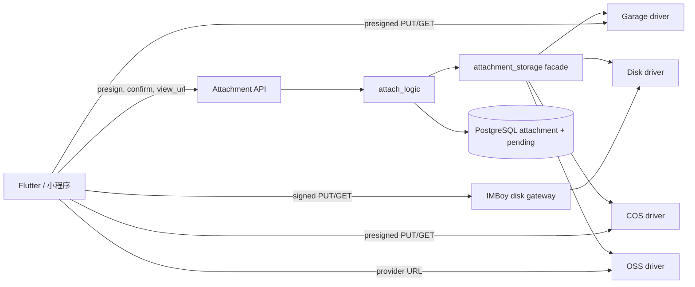
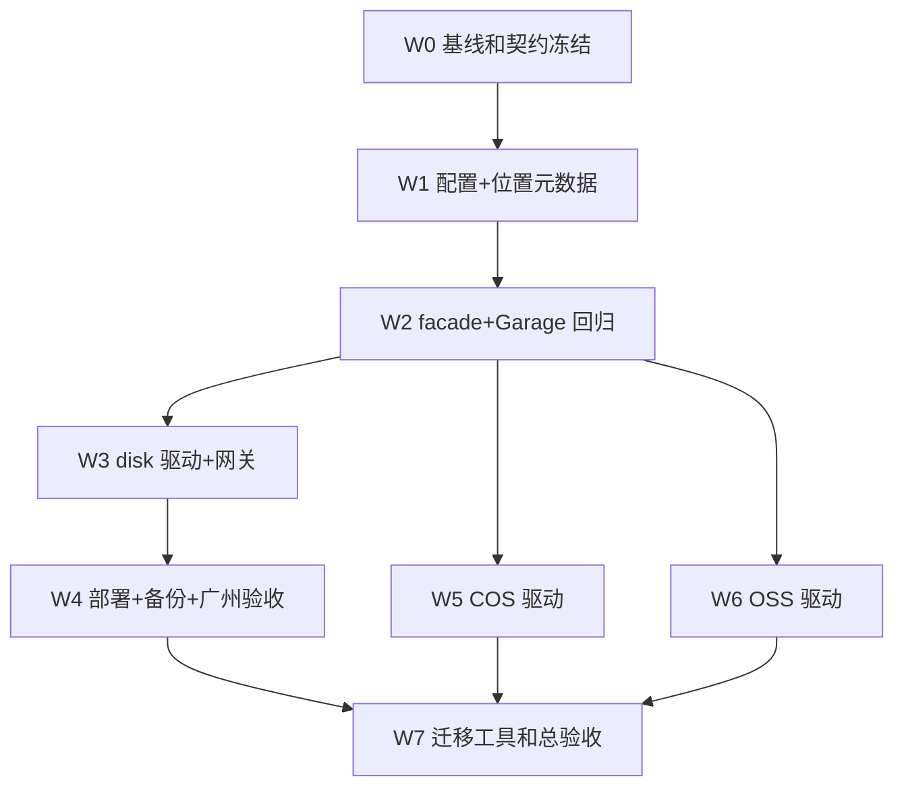

# IMBoy 附件多存储驱动实施与验收计划

> **状态**：PLAN / READY_FOR_REVIEW，尚未实施
>
> **基线仓库**：`/Users/leeyi/project/imboy.pub/imboy`
>
> **BASE_SHA**：`12a289be5893d0a5236fc03879fa32720ece9fc5`
>
> **日期**：2026-09-25
>
> **目标**：保持客户端附件协议不变，在 `sys.config` 中通过
> `attachment_storage.driver = garage | disk | cos | oss` 选择新上传的存储；
> 广州单机首先交付 `disk`，Garage 保持默认且零回归。
>
> **决策依据**：[ADR 0008](../adr/0008-pluggable-attachment-storage.md)

## 1. 结论先行

本计划不把 `s3_driver` 作为配置名，因为 `disk` 不是 S3。采用：

```erlang
{attachment_storage, #{
    driver => disk, %% garage | disk | cos | oss
    ...
}},
```

切换配置只决定**新上传**的目标；每条附件记录保存实际 driver/bucket，旧附件继续从
原位置读取。这样 Garage 切到 disk 后不需要立刻搬历史数据，回滚也只需把新上传开关
切回，已写入 disk 的附件仍可按记录读取。

广州一期的 DONE 定义是 `garage + disk` 双驱动可切换、历史数据兼容、真实文件闭环和
备份恢复通过。`cos`、`oss` 必须在各自真实测试 bucket 完成外部验收后才可标记支持；
没有凭据时只能是 `BLOCKED_EXTERNAL`，不得用 mock 冒充供应商通过。

## 2. 当前源码事实

| 事实 | 当前位置 | 影响 |
|---|---|---|
| 客户端协议为 presign → 原始 PUT → confirm | `attach_handler.erl`、Flutter `attachment_api.dart` | disk 也必须返回可 PUT 的 URL，避免客户端升级 |
| 业务层直接调用 Garage/S3 实现 | `attach_logic.erl` → `elib_oss.erl` | 需要单一 facade，不能在每个调用点加 driver 分支 |
| confirm 会核实对象大小和 MIME | `attach_logic:verify_and_save/5` | driver 统一提供 `stat` |
| 私有下载先查 DB ACL，再生成 URL | `attach_logic:view_url/2` | driver 选择必须发生在 ACL 通过之后 |
| 公共资源当前可直拼 public URL | `elib_oss:public_url_for_key/1` | 混合驱动时必须改为后端 public gateway |
| 删除散落在注销、企业留存、孤儿清理等路径 | 多个 logic 模块调用 `elib_oss:delete_object` | facade 必须覆盖全部调用者，逐项回归 |
| pending 已记录 bucket，未记录 driver | `attach_pending_repo` | presign 与 confirm 跨配置切换会选错后端 |
| pending 写入失败目前不阻断 presign | `attach_logic:presign/5` | 新设计中会丢失 driver 与上传授权，必须改为 fail-closed |
| `attachment.path` 保存 object_key | attachment 表及客户端消息 | object_key 保持不变，位置元数据另列保存 |
| 单文件上限 100 MB | `elib_oss:max_file_size/0`、Flutter | disk 上传必须流式，不得新增第二份 100 MB 内存副本 |
| 另有 multipart→服务端临时文件→Garage 链路 | `attachment_upload_logic.erl` | 也必须经 facade 按 pending driver 分派，不能只改 presigned PUT |

## 3. 目标架构



### 3.1 不变的客户端契约

```text
GET  /api/v1/attachment/presign -> put_url + object_key + expires_at
PUT  <put_url>                  -> 2xx
POST /api/v1/attachment/confirm -> object_key (+ attachment_id)
GET  /api/v1/attachment/view_url -> url
GET  <url>                      -> bytes / range bytes
```

不得要求 Flutter 根据 driver 分支，不得把 access key、secret key 或真实磁盘路径返回
给客户端。

### 3.2 新增 disk 内部端点

```text
PUT  /api/v1/attachment/storage/upload?key=...&mime=...&exp=...&sig=...
GET  /api/v1/attachment/storage/download?key=...&exp=...&sig=...
HEAD /api/v1/attachment/storage/download?key=...&exp=...&sig=...
GET  /api/v1/attachment/public?key=...
```

上传/下载短时 URL 不使用 App JWT，因为现有 Flutter 的裸 Dio 会刻意移除
Authorization；它们使用独立 HMAC 签名。public 端点只允许数据库中已 confirm 且
`scope=public` 的记录。

### 3.3 disk 写入规则

1. key 必须通过现有 `owner_of_key` 与 pending 所有权校验；
2. 规范化后目标路径必须仍位于 `root_dir`；
3. 拒绝空段、`.`、`..`、绝对路径、NUL、反斜杠和符号链接逃逸；
4. 在目标同目录创建唯一 `.part` 文件，限制读取总量为 100 MB；
5. 写完执行 sync，并以同文件系统 rename 原子发布；
6. URL 有效期内允许同一未 confirm key 重试；confirm 后返回 `409`，禁止覆盖；
7. 失败删除 `.part`，周期任务清理超时临时文件；
8. 每次上传前检查 `min_free_bytes`，不足返回 `507 Insufficient Storage`。

### 3.4 disk 读取规则

- 私有资源沿用 `attach_logic:authorize` 后才签发下载 URL；
- 支持完整 GET、HEAD 和一个 `Range: bytes=start-end`，合法范围返回 `206`；
- 非法或多区间 Range 返回 `416`；
- 设置 `Content-Type`、`Content-Length`、`Accept-Ranges`、`ETag`；
- 不在错误响应中暴露绝对路径；
- 未找到与无权访问继续保持外部不可枚举语义。

## 4. 数据与配置契约

### 4.1 配置

配置结构以 ADR 0008 为准。新增环境变量：

| 变量 | 必需条件 | 说明 |
|---|---|---|
| `IMBOY_ATTACHMENT_STORAGE_DRIVER` | 总是 | `garage/disk/cos/oss` |
| `IMBOY_ATTACHMENT_DISK_ROOT_DIR` | driver=disk | 容器内绝对路径 |
| `IMBOY_ATTACHMENT_DISK_SIGNING_SECRET` | driver=disk | 独立随机密钥，至少 32 字节 |
| `IMBOY_ATTACHMENT_DISK_MIN_FREE_BYTES` | driver=disk，可选 | 默认 5 GiB |
| `IMBOY_COS_*` | driver=cos | endpoint/region/private+public bucket/public URL/SecretId/SecretKey |
| `IMBOY_OSS_*` | driver=oss | endpoint/region/private+public bucket/public URL/AccessKey |

兼容策略：现有 `{garage, #{...}}` 和 `IMBOY_GARAGE_*` 至少保留一个发布周期；默认
driver 为 `garage`。启动时校验 active driver 和数据库中仍被 attachment/pending 引用的
driver；全新 disk 数据库不要求 Garage 密钥，但存在 Garage 历史行却缺配置时必须失败。

### 4.2 数据库迁移

建议使用下一可用迁移号，执行前必须重新扫描 `priv/migrations/`，不得预占过期编号。

```sql
ALTER TABLE attachment
  ADD COLUMN storage_driver varchar(16) NOT NULL DEFAULT 'garage',
  ADD COLUMN storage_bucket varchar(255);

ALTER TABLE attach_pending
  ADD COLUMN storage_driver varchar(16) NOT NULL DEFAULT 'garage',
  ALTER COLUMN bucket DROP DEFAULT,
  ALTER COLUMN bucket DROP NOT NULL;
```

迁移脚本还需按 scope 回填 `storage_bucket`，并对 `attachment.storage_bucket` 与
`attach_pending.bucket` 增加同一 CHECK 约束：Garage/COS/OSS 的 bucket 必须非空，disk
的 bucket 必须为 NULL。回填完成后移除 `storage_driver` 的
`DEFAULT 'garage'`，迫使所有新写路径显式提供 driver。down migration 只有在不存在非
Garage 行时才允许执行，否则 fail-closed。

## 5. 实施波次与所有权

实施必须在独立 worktree/任务分支完成。当前共享工作树已有不属于本计划的未跟踪文档，
不得 stash、reset、clean、覆盖或纳入提交。每张卡只提交列出的 owned paths；发现重叠先
停下并交接。



### ST-00 基线与契约冻结

- **Owned paths**：只读；证据目录 `docs/archive/evidence/attachment-storage-<UTC>/`
- **工作**：记录 BASE_SHA、分支、状态；枚举全部 `elib_oss` 调用者、路由、配置注入、
  pending/attachment schema、Flutter PUT/GET 约束；核对私有桶、公开桶、Website API 和
  反向代理现状；生成 driver×operation×scope 矩阵。
- **检查**：`make compile`、附件相关 EUnit、Flutter 附件单测只作基线，不修缺陷。
- **出口**：`AC-01`、`AC-02`；任何未知写/删调用点则 `BLOCKED_SCOPE`。

### ST-01 配置、迁移与位置元数据

- **Owned paths**：`config/sys.config.example`、`src/lib/imboy_env.erl`、
  `src/imboy_app.erl`、新迁移、attachment/pending repo+ds 及对应测试。
- **工作**：解析 driver；对 active+已引用 driver fail-fast；迁移并回填存量 Garage 行；
  presign 必须先成功固化 pending driver/bucket 才返回 URL；confirm 固化 attachment
  driver/bucket；down migration 守卫。
- **出口**：`AC-03` 至 `AC-07B`。

### ST-02 存储 facade 与 Garage 零回归

- **Owned paths**：新 `attachment_storage` behaviour/facade、Garage driver、
  `elib_oss.erl` 兼容入口、现有调用者和测试。
- **工作**：把 PUT/stat/GET URL/delete 统一分派；所有删除路径使用行内 driver；保留
  对外函数直到调用收敛；禁止业务模块直接读 provider 配置；Garage 的 private/public
  两种 scope 都必须走真实闭环；multipart 服务端上传也必须读取 pending driver，不能只
  验证默认私有桶和 presigned PUT。
- **出口**：Garage 单测和真实 Garage E2E 与基线一致，`AC-08` 至 `AC-11`。

### ST-03 disk 驱动与签名网关

- **Owned paths**：disk driver、签名模块、disk handler、路由、OpenAPI、单元/集成测试。
- **工作**：流式 PUT、原子 rename、stat/delete、GET/HEAD/Range、public scope 网关、
  路径穿越/符号链接/过期签名/篡改签名/磁盘不足守卫；confirm 后不可覆盖。
- **出口**：`AC-12` 至 `AC-22`。

### ST-04 部署、备份与广州单机验收

- **Owned paths**：`deploy/`、`scripts/`、运维文档和相关测试。
- **工作**：disk profile 不启动 Garage；挂载 `${DATA_DIR}/attachments`；目录属主与
  `0700` 权限；preflight 校验绝对路径、可写性、余量和备份目标；备份/恢复同时覆盖 DB
  与文件；增加 disk smoke。同步补齐社区 Compose 的 `imboy-public` 初始化、Website API
  和公开读反向代理，并验证该公开面只暴露明确标记为 public 的对象。
- **出口**：全新机安装、重启、备份、删除数据后恢复、再次下载均通过；`AC-23` 至
  `AC-28`。生产部署仍需用户单独授权。

### ST-05 COS 驱动

- **Owned paths**：COS driver、provider 配置、契约测试、COS 运维文档。
- **工作**：实现 virtual-hosted-style SigV4；禁止对 2024 后新 bucket 使用 path-style；
  验证 PUT/stat/GET/Range/delete 与 Content-Type。
- **出口**：本地向量通过只算 `LOCAL_PASS`；真实广州 Region 测试 bucket 通过才算
  `COS_LIVE_PASS`，否则 `BLOCKED_EXTERNAL`。

### ST-06 OSS 驱动

- **Owned paths**：OSS driver、provider 配置、契约测试、OSS 运维文档。
- **工作**：实现 OSS 原生 V4 或显式的 S3 compatibility 模式，不把 Garage 的
  `AWS4/.../s3/aws4_request` 无条件复用为 OSS 原生签名；验证完整操作集。
- **出口**：本地向量通过只算 `LOCAL_PASS`；真实测试 bucket 通过才算
  `OSS_LIVE_PASS`，否则 `BLOCKED_EXTERNAL`。

### ST-07 可选迁移工具与总验收

- **Owned paths**：`scripts/migrate_attachment_storage.*`、迁移测试和运行手册。
- **工作**：分页扫描来源 driver；复制到目标；按 size+hash 校验；单行事务更新位置；
  默认保留来源对象；显式 `--delete-source` 只能在二次扫描零差异后运行；可中断续跑。
- **出口**：混合 driver、断点续跑、失败回滚和 dry-run 通过；`AC-29` 至 `AC-34`。

## 6. 验收清单

### 配置与兼容

| ID | 验收条件 | Oracle |
|---|---|---|
| AC-01 | 当前全部上传、读取、删除调用点已登记 | 调用矩阵与 `rg` 结果一致 |
| AC-02 | 基线测试结果绑定 BASE_SHA | 证据含 SHA、命令、exit code、测试数 |
| AC-03 | 缺省配置仍选择 Garage | 启动与现有测试通过 |
| AC-04 | 未知 driver 启动失败 | 错误包含稳定原因且无 secret |
| AC-05 | 全新空库的 disk 不要求 Garage 凭据 | 清空 Garage env 后 disk 启动通过 |
| AC-05B | 存在 Garage 历史行时缺 Garage 配置必须失败 | readiness/启动错误稳定且不泄密 |
| AC-06 | 存量 attachment 回填 Garage，driver/bucket 组合合法 | SQL count：非法组合为 0 |
| AC-07A | pending 写入失败时不返回 put_url | 故障注入后无可用 URL、无对象残留 |
| AC-07B | presign 后切配置，confirm 仍用原 driver | 集成测试构造切换窗口并通过 |

### Garage 与 facade

| ID | 验收条件 | Oracle |
|---|---|---|
| AC-08 | Garage private/public 均完成 presign→PUT→confirm→view→delete | 两种 scope 字节一致且删除后 404 |
| AC-09 | public/private/c2c/group/channel/moment/teaching ACL 不变 | 现有 ACL 套件全绿 |
| AC-10 | 所有物理删除经 facade 按记录 driver 分派 | 静态门禁 + fake driver 调用计数 |
| AC-11 | 客户端响应字段无破坏性变化 | OpenAPI diff + Flutter 现有测试 |
| AC-11A | multipart 上传按 pending driver 分派 | Garage/disk 集成测试与故障标签断言 |

### disk 功能与安全

| ID | 验收条件 | Oracle |
|---|---|---|
| AC-12 | 无 Garage 进程也能完成 disk 上传闭环 | 真实 HTTP 字节比对 |
| AC-13 | 100 MB 边界内流式写盘，超限拒绝 | RSS 不随文件形成第二份等量增长；100 MB/100 MB+1 用例 |
| AC-14 | 合法 PUT 重试幂等，confirm 后覆盖返回 409 | 集成测试 |
| AC-15 | 过期、篡改、错 op 签名全部拒绝 | 401/403 且无文件残留 |
| AC-16 | `../`、编码穿越、反斜杠、绝对路径、NUL 全拒绝 | 参数化攻击测试 |
| AC-17 | 符号链接不能逃逸 root_dir | 临时目录集成测试 |
| AC-18 | 下载支持 GET/HEAD/单 Range | 200/206、headers、字节片段一致 |
| AC-19 | 非法/多 Range 返回 416 | 集成测试 |
| AC-20 | 无 ACL 用户不能获得私有下载 URL | 403/统一业务错误 |
| AC-21 | public gateway 只服务 confirmed public 行 | private/pending/not-found 均拒绝 |
| AC-22 | 磁盘低于保留量拒绝新 PUT，不影响读取 | 可注入 disk-free oracle 测试 |

### 运维、云厂商与迁移

| ID | 验收条件 | Oracle |
|---|---|---|
| AC-23 | disk profile 不创建/依赖 Garage 容器 | Compose config + 进程检查 |
| AC-24 | 容器重建后附件仍在 | 上传→重建→下载字节一致 |
| AC-25 | DB+disk 一致点备份可恢复 | 删除后恢复，抽样和 count 一致 |
| AC-26 | 磁盘 80% 告警、低于 reserve 拒绝上传 | 指标/告警测试 |
| AC-27 | 日志不含 secret、sig、文件内容和绝对 root | gitleaks + Canary 扫描 |
| AC-28 | 广州两账号真机图片/文件/音视频闭环 | DEVICE evidence；无真机则 BLOCKED_EXTERNAL |
| AC-29 | COS 完整操作集在真实 bucket 通过 | COS_LIVE_PASS |
| AC-30 | OSS 完整操作集在真实 bucket 通过 | OSS_LIVE_PASS |
| AC-31 | 混合 Garage+disk 历史对象同时可读 | 配置切换集成测试 |
| AC-32 | 迁移 dry-run 零写入且计数准确 | before/after SQL + object count |
| AC-33 | 迁移中断后续跑不重复损坏 | fault injection + resume |
| AC-34 | 删除来源前二次校验，默认永不删除来源 | 命令行为测试 |

## 7. 最小测试命令集

实施者应按仓库实际测试入口调整模块名，但不得降低这些层级：

```bash
git rev-parse HEAD
git status --short
make compile
make eunit
make dialyze
make security-gate
bash -n scripts/*.sh deploy/*.sh
docker compose -f deploy/docker-compose.community.yml config >/dev/null
git diff --check
```

定向测试至少包括：

```bash
make eunit EUNIT_MODS='attachment_storage_tests attachment_storage_disk_tests attach_logic_tests'
bash scripts/garage_e2e_test.sh
bash scripts/test/run_group_attachment_acl_pg.sh
```

Flutter 无需改代码是设计目标，但必须跑兼容回归：

```bash
cd ../imboyapp
flutter test test/unit_test/store/attachment_api_test.dart
flutter test test/unit_test/page/chat/chat/attachment_handler_test.dart
```

真实 HTTP E2E 必须对 `garage` 与 `disk` 各运行一次，并记录：presign 响应字段、PUT
状态、confirm 结果、view URL、Range 响应、下载 SHA-256、delete 后 404。不得记录完整
签名 URL 或凭据。

## 8. 证据规则与终态

每条命令保存：`base_sha`、`candidate_sha`、工作树状态、命令、开始/结束时间、exit code、
测试数、关键 oracle、日志 SHA-256。证据目录必须唯一，不能覆盖旧结果。

终态只能使用：

- `LOCAL_CANDIDATE_PASS`：编译、静态门禁、单测和本地 Garage+disk E2E 全部通过；
- `GZ_DISK_PASS`：在广州目标拓扑完成重启、备份恢复和真实客户端闭环；
- `COS_LIVE_PASS` / `OSS_LIVE_PASS`：各自真实供应商 bucket 通过；
- `PARTIAL`：MVP 通过但云厂商或设备证据缺失；
- `BLOCKED_EXTERNAL`：缺真实机器、设备、bucket 或用户授权；
- `NO_GO`：任一安全、数据完整性、回滚或历史附件兼容 AC 失败。

`HTTP 200`、mock 测试、源代码存在、Compose 能解析或截图均不能单独证明附件闭环通过。

## 9. 回滚、停止条件与发布边界

### 回滚

1. 配置切回 `garage` 只改变后续新上传；已写 disk 的行仍由 disk driver 读取；
2. 保留 disk volume 和 signing secret，直到确认没有引用它的 attachment/pending 行；
3. 数据库 down migration 发现非 Garage 行必须拒绝执行；
4. 迁移工具默认不删来源，回滚只需把行位置改回已校验存在的来源；
5. 发布前同时备份 PostgreSQL、Garage 与 disk 目录。

### 硬停止条件

- path traversal、符号链接逃逸、ACL 绕过、confirm 后覆盖任一复现；
- 配置切换导致历史附件不可读或 pending 上传落错驱动；
- disk 写盘不是流式、磁盘满会产生 0 字节正式文件、失败残留不可回收；
- 日志/证据泄露 secret、完整签名 URL、附件内容或真实用户数据；
- 需要修改 Flutter 对外协议才能切换 driver；
- COS/OSS 只通过 mock 却被标记为 live pass；
- 执行生产部署、真实数据迁移、源对象删除、push 或发布前未取得用户单独授权。

## 10. 提交拆分

验证通过后按功能做本地提交，不混入共享工作树其他改动：

1. `feat(storage): persist attachment storage location`
2. `refactor(storage): route garage operations through facade`
3. `feat(storage): add signed disk attachment driver`
4. `feat(deploy): add disk attachment storage profile`
5. `feat(storage): add cos attachment driver`（真实验收前不进入支持矩阵）
6. `feat(storage): add oss attachment driver`（真实验收前不进入支持矩阵）
7. `feat(storage): add resumable attachment migration`

Git author/committer 使用命令级 `leeyi <leeyisoft@qq.com>`。本计划不授权 push、部署、
生产迁移、真实第三方调用或删除来源对象。

## 11. 本轮不做

- 不在本文档任务中实现驱动代码或执行数据库迁移；
- 不把 disk 宣称为多节点 HA 存储；
- 不自动搬迁或删除任何历史 Garage 对象；
- 不引入新的 AWS SDK，除非原生 OTP 实现经验证无法正确支持目标供应商；
- 不修改附件大小上限、E2EE descriptor、scope ACL 或消息 payload；
- 不把 `cos`/`oss` 的配置占位等同于已支持。
