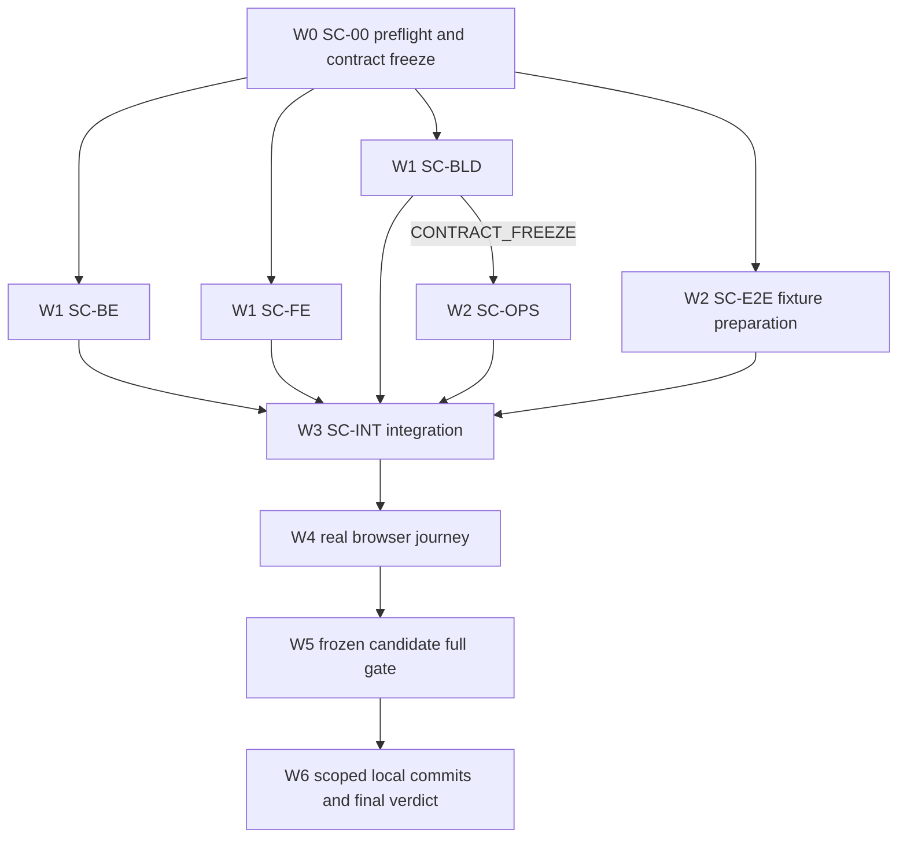

# IMBoy 客服坐席工作台嵌入商城管理后台 V2 实施计划

> 日期：2026-09-28
> 状态：`READY_FOR_ZCODE_EXECUTION` / `EXECUTION_NOT_STARTED`
> 本地候选目标：`LOCAL_CANDIDATE_PASS`
> 生产、发布、push：`NOT_AUTHORIZED`
> Git 根：`imboy/`、`imboyadmin/`；`/Users/leeyi/project/imboy.pub` 不是 Git 仓库
> 被替代设计：`docs/plans/2026-09-28-customer-service-seat-console-embed-mall-admin-plan-v1.md`
> SHA 文件：同目录同名 `.sha256`

## 1. 决策摘要

V2 采用以下最小可行终态，后续实现不得重新扩张：

1. 商城管理后台直接嵌入一个 `<iframe>`；V1 不新增 `seat-loader.js`，不做动态尺寸、主题、SDK 或 `postMessage`。
2. iframe 地址固定为 `https://cs.imboy.pub/seat/<public_seat_console_id>`；公开 ID 不是凭证。
3. 坐席工作台继续使用现有 QR 登录、Seat JWT 内存 vault、队列、SSE、消息和附件代码；不复制第二套工作台。
4. Seat 前端作为 `mode=seat` 并入现有 `dist-widget/` 和 `imboy_widget` 静态发布物；不新增目录、镜像、容器、域名、证书、端口或仓库。
5. `cs.imboy.pub` 精确反代坐席客户端已存在的四组同源 API 路径；不引入运行时 `apiBase/wsBase`，不放宽到全部 `/api/v1/*`。
6. 一工作区最多一个 active console；平台运营在“网站接入”页的工作区区块创建、编辑 origin、复制 iframe、停用接入。
7. 停用只保证新加载 404，不撤销已签发 Seat JWT；需要立即停人时使用既有 Seat suspend/revoke 能力。
8. V1 定位为 QR 登录的 Pilot/Beta。免扫码 SSO handoff 是独立 V1.x，不在本计划预埋半成品字段或接口。

### 1.1 直接 iframe 代码合同

平台生成的默认片段如下；`PUBLIC_ID` 由服务端返回，商家可按页面布局调整高度，但不得把任何凭证写入标记：

```html
<iframe
  src="https://cs.imboy.pub/seat/PUBLIC_ID"
  title="IMBoy 客服工作台"
  sandbox="allow-scripts allow-same-origin allow-downloads"
  referrerpolicy="no-referrer"
  style="width:100%;height:100vh;border:0"
></iframe>
```

V1 不生成 script loader。宿主若有 CSP，商家必须自行把 `https://cs.imboy.pub` 加入 `frame-src`；IMBoy 不尝试绕过宿主 CSP。

## 2. 完成定义与状态边界

只有以下条件同时成立，A0 才可输出 `LOCAL_CANDIDATE_PASS`：

- 全部 Required Acceptance 在同一组冻结 candidate SHA 上为 PASS。
- Backend、Admin、静态产物、网关和真实浏览器旅程形成闭环；没有以源码存在、HTTP 200、mock、截图或 exit 0 代替业务 oracle。
- 每条命令记录命令、退出码、非零 test/oracle count、skipped count、日志路径和 SHA-256。
- 两个 Git 根分别干净；仅包含本计划授权的本地提交，不吸收用户或其他会话改动。
- `LOCAL_CANDIDATE_PASS` 不推导 `PRODUCTION_PASS`、`RELEASE_PASS` 或线上已生效。

终态枚举：

| 状态 | 含义 |
|---|---|
| `READY_FOR_ZCODE_EXECUTION` | 计划、资源发现、恢复状态机和验收合同机械完整，尚未执行 |
| `BLOCKED_PREFLIGHT` | 活动协调器、租约、迁移号、WIP、端口或 DB 冲突未解除 |
| `IMPLEMENTATION_PARTIAL` | 已有实现，但至少一个 Required Acceptance 为 FAIL/PENDING |
| `LOCAL_CANDIDATE_PASS` | 当前冻结候选的全部本地 Required Acceptance 通过 |
| `BLOCKED_ENVIRONMENT` | 必需工具或本地运行环境不可用，且不能由任务内安全修复 |
| `PRODUCTION_NOT_AUTHORIZED` | 未获目标明确的生产授权；本计划正常终态之一 |

## 3. 范围

### 3.1 In Scope

- Backend migration `00000153`、console repository/application/platform API/public frame。
- Admin 工作区级 console 管理区块及 iframe 代码生成。
- Admin 移除 `/customer-service/workspace` 公开路由，但保留并复用 `seat/**` 源码。
- `mode=seat` 构建、稳定 JS/CSS 别名、manifest/verify/跨仓资产配对。
- 现有 `imboy_widget` 静态镜像与 `cs.imboy.pub` 网关增量。
- 真实 PostgreSQL、真实 HTTP、真实 Chromium 的本地集成验收。
- 验证通过后的分仓本地提交与可恢复集成。

### 3.2 Out of Scope

- 长效 browser token、URL token、JWT storage、共享匿名坐席身份。
- SSO handoff、商城服务端凭证、外部身份映射、refresh token、设备绑定。
- App 改动、Seat entitlement/计费、工作台主题、动态高度、SDK。
- 新服务、域名、证书、端口、数据库、对象存储或消息队列。
- push、PR、远端分支、镜像发布、生产部署、生产迁移、真实商家通知。
- 修复与本计划 Acceptance 无关的存量失败或用户 WIP。

## 4. 当前事实基线

计划生成时的只读基线：

| 根 | HEAD | 状态 |
|---|---|---|
| `imboy` | `9c797377574e33eaf8becd7d966a3033729c165a` | 有两个无关未跟踪 TSID 计划文件，必须保留 |
| `imboyadmin` | `9d54d2198a2d214293d2012047b349dc932d34cf` | clean |

基线会漂移，执行时以 SC-00 双采样为准。当前迁移文件最高为 `00000152`，但其首行错误写成 `00000153`；SC-00 必须把“文件名版本”和“注释漂移”分开记录。未经新采样不得直接占用 153。

已有真源必须优先复用：

| 能力 | 真源 |
|---|---|
| Origin 严格规范化 | `cs_widget:normalize_origin/1` |
| Hosted public frame | `cs_widget_handler` 的 `/w/:public_widget_id` 合同 |
| Seat API 路径白名单 | `imboyadmin/src/modules/customer_service/seat/seatApiClient.ts` |
| QR 登录 | `qrLoginSession.ts` + 公共 passport QR 端点 |
| Seat JWT 内存 vault | `seatAuthStore.ts` |
| Widget hash/稳定别名 | `widget-manifest.mts`、`widget-verify.mts` |
| 跨仓资产配对 | 两仓现有 Widget pairing 门 |
| 静态运行时 | `dist-widget/`、`Dockerfile.widget`、`imboy_widget` |
| 真实客服 E2E | `tests/e2e/customer-service-p2/**` 及 QR helper |

## 5. 目标架构

```mermaid
flowchart LR
  Admin[IMBoy 平台运营后台] -->|CRUD console| AdmAPI[/api/adm/customer-service/seat-consoles]
  Admin -->|复制 iframe| Merchant[商城管理后台]
  Merchant -->|frame src| Frame[cs.imboy.pub/seat/public_id]
  Frame -->|动态 CSP frame-ancestors| Backend[现有 imboy backend]
  Frame -->|JS/CSS| Static[现有 imboy_widget]
  Frame -->|同源 QR/Seat/Enterprise API| Gateway[cs.imboy.pub nginx]
  Gateway --> Backend
  Gateway --> Static
```

### 5.1 数据模型

迁移名：`00000153_customer_service_seat_console.{up,down}.sql`，最终编号由 SC-00 预留结果决定；若 153 已被占用，A0 只改计划绑定和任务卡，不静默抢号。

`customer_service_seat_console` 最小字段：

| 字段 | 合同 |
|---|---|
| `id` | bigint TSID 主键 |
| `organization_id` | 组织 FK，delete restrict |
| `workspace_id` | 工作区 FK；必须与 organization 一致 |
| `public_seat_console_id` | text，当前 TSID 十进制 string；全局唯一；公开非 secret |
| `allowed_origins` | jsonb 非空数组；写前由 `cs_widget:normalize_origin/1` 逐项规范化和去重 |
| `status` | `active` 或 `revoked` |
| `revoked_at` | 与 status 一致性约束 |
| `created_by_user_id` | 可空审计 actor FK |
| `version` | 乐观版本，初始 1 |
| `created_at/updated_at` | UTC 时间 |

约束：

- `public_seat_console_id` 全局唯一。
- `(organization_id, workspace_id) WHERE status='active'` partial unique。
- origin 数量、单项长度和总长度必须有应用层上限；非法 scheme、通配、userinfo、path、query、fragment、空白和控制字符全部拒绝。
- down migration 在表非空时 fail-closed，不静默删除已分发的公开 ID。
- 不新增 secret、key digest、SSO 字段或 console-to-seat session 绑定。

### 5.2 Backend 路由

平台面：

```text
GET  /api/adm/customer-service/seat-consoles?organization_id&workspace_id
POST /api/adm/customer-service/seat-consoles
PUT  /api/adm/customer-service/seat-consoles/:id
POST /api/adm/customer-service/seat-consoles/:id/revoke
```

- GET 使用 `customer_service:read`；其余使用 `customer_service:write`。
- POST 创建当前工作区唯一 active console；冲突为 409。
- PUT 只更新 `allowed_origins`，不改变 public ID、scope 或 status。
- revoke 幂等；返回公开投影，不泄露内部字段。
- 所有请求显式携带 organization/workspace，服务端同语句重验 scope。

公开 frame：

```text
GET /seat/:public_seat_console_id
```

- public ID 非法、缺失、不存在或 revoked 均统一 404，避免状态枚举。
- 非 GET 为 405；credential-like query 为 400。
- 响应 `Cache-Control: no-store`、`Referrer-Policy: no-referrer`。
- 只对 `/seat/*` 豁免 XFO；CSP `frame-ancestors` 由该 console 的规范化 origin 列表逐项生成，空列表为 `'none'`。
- 文档只含挂载点、公开 ID、稳定 CSS 和 JS 路径；不含 org/workspace、JWT、secret、runtime API base。
- CSP 至少约束 `default-src`、`script-src`、`style-src`、`img-src`、`connect-src`、`object-src`、`base-uri`、`form-action` 和 `frame-ancestors`。

### 5.3 Seat 静态构建

- 新增 `mode=seat` 薄入口，只挂载现有 `SeatWorkspacePage`；不复制 workbench。
- 产物并入 `dist-widget/`；现有 `build:widget` 继续作为部署唯一入口并包含 seat build。
- hash JS/CSS/chunk 继续位于 `/assets/`，immutable。
- manifest 阶段从 seat HTML 入口解析真实 hash JS/CSS，并复制为：
  - `/seat-assets/cs-seat.v1.js`
  - `/seat-assets/cs-seat.v1.css`
- 两个稳定别名均为 `no-cache, must-revalidate`，不得 immutable。
- manifest、verify 和两仓 pairing 同时登记 JS/CSS；任何一侧缺失或漂移非零退出。
- `dist-widget/` 不得出现 `.map`、secret、JWT、Admin API client、Admin auth store 或 `/api/adm` 字符串。

### 5.4 cs 网关

Backend 代理面只增加或收敛为：

```text
/seat/*
/api/v1/cs/*
/api/v1/passport/qr_login/*
/api/v1/enterprise/conversations/*
/api/v1/enterprise/organizations/*
```

Static 代理面增加：

```text
/seat-assets/*
```

纪律：

- 不代理全部 `/api/v1/*`。
- Seat SSE 与 Widget SSE 均关闭 proxy buffering/cache，并保留长连接 timeout。
- `/seat-assets/*` 缓存头由静态容器下发；网关不叠加冲突头。
- `/seat/*` 的 XFO/CSP 只由 backend route-shape 和动态 frame 响应管理。
- 现有 `/w/*`、Widget API、loader 和资产行为必须回归不变。

### 5.5 Admin 交互

在“网站接入”页：

1. 保留组织/工作区选择器。
2. 在选择器之后、网站 installation 表格之前增加“客服工作台接入”区块。
3. 区块只显示当前工作区的一条 active console；不在每个网站行放第二个按钮。
4. 支持创建、编辑允许来源、复制 iframe、停用。
5. 文案使用“一工作区一个接入代码，坐席各自扫码登录”，不得写“一岗一码”。
6. 复制只需 read 权限；创建、编辑、停用需要 write 权限。
7. 从 Admin Router 移除 `/customer-service/workspace`，并更新所有路由/menu/E2E 断言；Seat 源码与独立构建入口保留。

## 6. 安全与负例合同

以下任一出现即 Required Acceptance FAIL：

- snippet、URL、HTML、manifest、日志、DOM attribute、browser storage 中出现 JWT、secret、shop key、服务端凭证或长期 token。
- origin 未经 backend 规范化直接进入 CSP。
- unknown query/data/postMessage 能改变 frame/API/static origin 或路径。
- Admin Cookie 被发送到 Seat API，或 Seat JWT 被发送到 `/api/adm`。
- cs 网关代理全部 `/api/v1/*`。
- revoked frame 返回可区分的 401/403/410，或已撤销记录仍可新加载。
- 把 console revoke 误报为已终止现有 Seat JWT/SSE。
- iframe 在 evil origin 成功渲染工作台。
- 产物存在 source map、内联 secret 或未登记网络地址。

## 7. 执行与并行合同

### 7.1 协调器与并发上限

- A0 是唯一协调器、共享文件裁决者、integration 分支所有者和最终本地提交者。
- `MAX_ACTIVE_AGENTS=4`，包含 A0；最多三个非协调器并行。
- 每个 writer 使用独立 worktree、独立 task branch、独立 evidence 目录；不得直接写主工作树。
- Worker 不是代码库唯一参与者，必须保护并适配其他会话改动，禁止 reset/clean/stash/checkout 覆盖。
- A0 不得接管 foreign worktree、process、port、DB、container、lease 或设备。
- 任何共享路径冲突先暂停较晚卡，记录 `BLOCKED_SHARED_OVERLAP`，不得靠最后写入者覆盖。

### 7.2 RUN_ROOT

```bash
RUN_ID="seat-console-embed-$(date -u +%Y%m%dT%H%M%SZ)-$RANDOM"
RUN_ROOT="/Users/leeyi/project/imboy.pub/.Codex/runs/$RUN_ID"
```

必须建立：

```text
RUN_ROOT/
  control/plan.snapshot.md
  control/plan.sha256
  control/baseline.json
  control/capabilities.json
  control/leases.json
  control/resources.json
  control/migration-reservation.json
  control/waves.json
  control/acceptance-ledger.json
  control/candidate-manifest.json
  control/state.json
  control/state-transitions.jsonl
  control/recovery-ledger.jsonl
  cards/<CARD_ID>/RESULT.json
  cards/<CARD_ID>/commands.jsonl
  cards/<CARD_ID>/logs/*
  final/verdict.json
  final/report.md
```

每个 `RESULT.json` 至少含：card、status、base SHA、candidate SHA、owned paths、commands、exit code、test count、oracle count、skipped count、evidence SHA、defects、`failure_class`、`root_cause`、`attempt`、`retry_budget_remaining`、`recovery_action`、`recovery_result`、blocked reason、next unlock。未知原因必须写 `UNKNOWN`，不得留空或改写成环境问题。

`acceptance-ledger.json` 每条固定含：Acceptance ID、card、required、status、candidate SHA、command/evidence 引用、oracle/count、`failure_class`、`root_cause`、`attempt`、`retry_budget_remaining`、`recovery_action`、`recovery_result`、owner 和 `next_unlock`。PASS 条目的 failure/recovery 字段写 `null`；FAIL/BLOCKED 条目不得缺字段，PENDING 不得进入最终报告。

### 7.3 路径所有权

| 卡 | Owner | 独占路径 | 禁止路径 |
|---|---|---|---|
| SC-00 | A0 | `RUN_ROOT/control/**`、计划快照、worktree/lease 编排 | 业务源码 |
| SC-BE | Backend writer | reservation 决定的 migration pair；新 seat-console domain/application/store/handler/tests；必要的 `cs_actions`、facade、router、route-shape 精确行 | deploy、Admin、App |
| SC-FE | Admin UI writer | `api/seatConsoles*`、`CsWidgetInstallationsPage*`、`App.tsx` 精确路由、相关 unit tests | vite、package scripts、manifest、deploy |
| SC-BLD | Admin build writer | seat entry；`vite.config.ts`；`package.json` build scripts；manifest/verify/pairing；`docker/widget/nginx.conf`；构建测试 | Admin 页面/API、Backend |
| SC-OPS | Ops writer | `deploy/nginx/templates/cs-widget.conf.template`、cs deploy verify/unit tests、部署文档必要增量 | Backend业务、Admin业务 |
| SC-E2E | E2E writer | 新 seat embed config/spec/fixture；现有 P2 helper 的最小参数化 | 业务实现、生产脚本 |
| SC-INT/GATE | A0 | 两仓 integration worktree、ledger、最终报告、本地提交 | foreign WIP、生产 |

若实现必须越过独占路径，worker 只提交 handoff 建议，由 A0 或对应 owner 应用。

### 7.4 SC-00 Resource Discovery Contract

SC-00 必须在不少于 10 秒的间隔内执行两次同构采样，并把原始输出和规范化结果分别写入 `cards/SC-00/logs/discovery-{1,2}/` 与 `control/resources.json`。最小探针固定为：

```bash
git -C <repo> rev-parse HEAD
git -C <repo> status --porcelain=v2 --branch
git -C <repo> worktree list --porcelain
ps -axo pid,ppid,pgid,lstart,command
lsof -nP -iTCP -sTCP:LISTEN
docker ps --no-trunc --format '{{json .}}'
find /Users/leeyi/project/imboy.pub/.Codex/runs -maxdepth 3 -print
find /Users/leeyi/project/imboy.pub/.Codex/coordination -maxdepth 4 -print
```

- `resources.json` 每项固定含 `kind`、`id`、`owner_run_id`、`owner_card`、`status`、`fingerprint`、`evidence_path`、`observed_at`；无法证明归属的资源一律标记 `foreign`，不得杀进程、删 worktree、抢端口、复用 DB 或容器。
- Docker、PostgreSQL 或协调目录不存在时，探针本身不得伪造空结果；写入 capability 缺失并按 7.6 分类。
- 两次采样的 HEAD、index、owned-path WIP、worktree、reservation、监听端口和 scratch DB fingerprint 必须相同；可解释的 foreign 变化也要记录 owner 和影响。否则 `SAFE_TO_START=NO`。
- 发现旧 run 时只允许读取其 durable control 文件；没有 `COMPLETED` 或正式 pause handoff 的 run 视为 active。对话中的“已暂停”不能替代控制文件。

### 7.5 Migration Reservation Contract

迁移编号不是聊天约定。A0 在业务 writer 启动前使用工作区共享协调目录原子预约：

```text
/Users/leeyi/project/imboy.pub/.Codex/coordination/migration-reservations/imboy/<8-digit-number>.lock/owner.json
```

1. 先以迁移文件名、scratch/目标 DB migration head、所有 active reservation 三方计算最小可用编号。
2. 使用原子 `mkdir <number>.lock` 获取唯一所有权；目录已存在即重新发现，不覆盖 `owner.json`，不凭时间自动抢占。
3. `owner.json` 固定含 `run_id`、`plan_sha256`、`repo_base_sha`、`number`、`slug`、`owner_card`、`acquired_at`、`heartbeat_at`、`status` 和 `migration_pair_sha256`；镜像摘要写入 `control/migration-reservation.json`。
4. up/down 文件建立后写入成对 SHA；执行 migration 前再次核对 reservation、文件名、文件头、DB head 与 candidate SHA。同编号异 hash 或 owner 不一致立即 `HARD_STOP`。
5. 只有集成提交已包含该迁移，或确认未创建迁移文件且无 DB 副作用时，A0 才能把 reservation 标记 `integrated` 或 `released`。未知/陈旧 reservation 不自动删除，输出 `NEXT_UNLOCK`。

计划中的 `00000153` 只是当前候选号；最终文件名和所有任务卡必须使用 reservation 结果，禁止静默抢号或只改一处。

### 7.6 Environment Capability Preflight

`control/capabilities.json` 是能力真源。每项固定含 `capability`、`required_by`、`probe_command`、`status=AVAILABLE|MISSING|DENIED|DEGRADED`、`version`、`evidence_path` 和 `fallback`。SC-00 至少探测：

- Git/worktree、`rg`、`jq`、`shasum`、`make`、Erlang/rebar3。
- Bun/Node、frozen install 可用性、Playwright 与本机 Chromium；禁止执行时临时联网下载浏览器掩盖缺失。
- PostgreSQL client/readiness，以及创建独占 scratch DB 的权限；不得连接或修改生产 DB。
- Docker/Compose 和本地 cs nginx/image dry-run 能力。
- 可分配的本 run 动态端口、证书/host fixture 和证据目录写权限。

Required 卡所需能力为 `MISSING`/`DENIED` 且无计划内等价 fallback 时，卡为 `BLOCKED_ENVIRONMENT`；不得用静态检查、mock、HTTP 200 或跳过测试降级为 PASS。`DEGRADED` 只有在 Acceptance 明确允许且 oracle 等价时才能继续。

### 7.7 Unattended Recovery State Machine

`control/state.json` 是当前状态真源，所有转移追加到 `state-transitions.jsonl`；每条含 `timestamp`、`from`、`to`、`reason`、`card`、`worker`、`attempt`、`candidate_sha`、`operation_id` 和 `evidence_path`。重启后必须先 reconcile Git/DB/OS 实况与 durable control 文件，禁止从聊天记录猜状态。

```text
INIT -> DISCOVERING -> BASELINING -> READY -> DISPATCHING -> EXECUTING
EXECUTING -> INTEGRATING -> VERIFYING -> COMMITTING -> COMPLETED
任一非终态 -> RECOVERING -> 前一安全状态 | BLOCKED | HARD_STOP
```

故障分类固定为 `TRANSIENT`、`WORKER_CRASH`、`WORKER_STALL`、`ENVIRONMENT`、`TEST_FAILURE`、`CODE_FAILURE`、`LEASE_CONFLICT`、`BASELINE_DRIFT`、`SECURITY_VIOLATION`、`PROTECTED_WIP`、`SCOPE_EXPANSION`、`UNKNOWN`。恢复规则：

| 类别 | 自动动作 | 上限/终态 |
|---|---|---|
| TRANSIENT | 保存日志后重跑同一 command | 每 command 最多 2 次 retry，15s/60s backoff |
| WORKER_CRASH / WORKER_STALL | 封存 diff/日志/进程证据，回收仅本 run lease，换新 worker id | 每 card 最多 3 个总 attempt |
| ENVIRONMENT | 只重建本 run worktree/cache/scratch DB/动态端口 | 每 resource 最多 2 次；耗尽 `BLOCKED_ENVIRONMENT` |
| TEST_FAILURE / CODE_FAILURE | 回到 owner 修根因；新 commit/SHA 后再验 | 不允许对同 SHA 盲重跑；计入 card attempt |
| LEASE_CONFLICT / BASELINE_DRIFT / PROTECTED_WIP | 停止受影响卡并重新发现 | 不自动接管 foreign 资源；无法消除则 `BLOCKED_PREFLIGHT` |
| SECURITY_VIOLATION / SCOPE_EXPANSION | 立即冻结相关 writer 和候选 | `HARD_STOP`，不得降 Acceptance |
| UNKNOWN | 保留现场，执行一次只读 reconcile | 仍未知则 `BLOCKED`，不得归为 transient |

每次 recovery 写 `recovery-ledger.jsonl`，至少含 failure class、root cause、before/after fingerprint、预算扣减、动作和结果。单卡阻塞不妨碍无依赖的卡继续；SC-00、共享合同、候选完整性或安全故障阻塞整个 run。任何重试预算持久化且只减不增，会话/A0 重启不得重置。

## 8. 依赖波次



- W1 最多三个 writer 并行：SC-BE、SC-FE、SC-BLD。
- SC-BLD 先产出 `control/build-contract.json`（入口、URL、stable/hash 资产、manifest key、缓存头）并记录 `CONTRACT_FREEZE` hash；SC-OPS 可据此开始，不等待 BLD 全卡 PASS，但 SC-INT 前仍要求二者 L1 PASS。
- SC-E2E 在 W2 只能进入 `FIXTURE_ONLY`：创建 host/config/helper 和静态合同测试；只有 `SC-INT=PASS` 且 candidate manifest 已冻结后，才可转为 `EXECUTE` 并启动真实服务/浏览器旅程。
- A0 只在所有上游卡为 PASS 时集成；不得 cherry-pick FAIL/PENDING 卡。
- Worker 只跑 L0/L1；真实 PostgreSQL/HTTP/browser 是 L2；最终每仓 L3 只跑一次。

## 9. 任务卡与 Acceptance

### SC-00 基线、租约与合同冻结

依赖：无。Owner：A0。只读业务仓。

| ID | Required Acceptance |
|---|---|
| SC-00-A01 | 两次间隔采样两个仓的 HEAD/index/status/worktree；稳定或漂移已归属 |
| SC-00-A02 | 记录全部活动 agent/process/worktree/branch/port/DB/container；无未交接共享冲突 |
| SC-00-A03 | 计划实际 SHA 等于相邻 `.sha256`；快照写入 RUN_ROOT |
| SC-00-A04 | 迁移最高文件名、DB head、foreign reservation 三方一致；为本 run 预留唯一编号 |
| SC-00-A05 | 记录并保护 `imboy` 两个无关 TSID 未跟踪文件；不纳入任何 diff/commit |
| SC-00-A06 | 两仓 baseline compile/test 命令可运行；存量失败有独立日志和分类 |
| SC-00-A07 | leases/waves/acceptance ledger 无路径重叠、无重复 Acceptance ID |
| SC-00-A08 | 输出 `SAFE_TO_START=YES`；否则终止为 `BLOCKED_PREFLIGHT` 并给 NEXT_UNLOCK |
| SC-00-A09 | 两次 Resource Discovery 同构采样完成；resources schema 完整，未知归属均为 foreign |
| SC-00-A10 | migration reservation 经共享目录原子获取；编号、owner、plan SHA 和三方 head 一致 |
| SC-00-A11 | capabilities 全量探测；Required 能力无伪 fallback、无未分类 MISSING/DENIED |
| SC-00-A12 | state/recovery/transition ledger 初始化并自检；只允许 `INIT -> DISCOVERING -> BASELINING -> READY` |

停止条件：任何活动协调器或 worktree 持有本计划写路径且无正式 handoff；迁移号或 scratch DB 归属不明；baseline 在两次采样间漂移。

### SC-BE Backend 数据、管理面与 public frame

依赖：SC-00 PASS。

| ID | Required Acceptance |
|---|---|
| SC-BE-A01 | migration up/down、partial unique、scope FK、status/revoked 一致性、非空 down 保护通过真 PG 往返 |
| SC-BE-A02 | origin 复用 `cs_widget:normalize_origin/1`；六类非法输入和数量/长度超限全部拒绝 |
| SC-BE-A03 | list/create/update/revoke 的 org/workspace scope、权限、409、幂等和公开投影通过 |
| SC-BE-A04 | PUT 更新 origin 后 public ID 不变；revoke 后可创建新 active console |
| SC-BE-A05 | `/seat/:public_id` 对合法 active 返回 200；missing/invalid/revoked 统一 404；非 GET 405；credential query 400 |
| SC-BE-A06 | CSP frame-ancestors 逐 origin；空列表 `'none'`；CRLF/通配/path/userinfo 无法进响应头 |
| SC-BE-A07 | frame HTML 仅含公开 ID、稳定 JS/CSS、挂载点；零 org/workspace/token/secret/runtime base |
| SC-BE-A08 | XFO 豁免只新增 `/seat/*` 精确 route shape；Admin/API/其他页面保持原策略 |
| SC-BE-A09 | console revoke 只声明“阻止新加载”；现有 Seat JWT 语义未被暗改 |
| SC-BE-A10 | TSID JSON 出站 string；新增模块通过 feature architecture/module boundary |

最小命令：

```bash
make compile
make migrations-check
make eunit-local t=cs_seat_console_app_tests
make eunit-local t=cs_seat_console_pg_tests
make eunit-local t=cs_seat_console_handler_tests
make eunit-local t=cs_route_contract_tests
make arch-check
make security-gate
git diff --check
```

### SC-FE Admin 管理区块与 iframe 代码

依赖：SC-00 PASS；使用冻结 API/字段合同，不等待 Backend 实现。

| ID | Required Acceptance |
|---|---|
| SC-FE-A01 | 页面位置为 scope picker 后、installation 表前；工作区切换同步换 console query key |
| SC-FE-A02 | 空态/create/edit/copy/revoke 四态完整；read/write 权限闸准确 |
| SC-FE-A03 | `buildSeatEmbedCode` 输出唯一 iframe；public ID/origin 非法时 fail-closed |
| SC-FE-A04 | snippet 含 title、sandbox、referrerpolicy 和稳定尺寸；零 script loader、secret、token、org/workspace |
| SC-FE-A05 | PUT 编辑 origin 后 snippet/public ID 不变；revoke 文案不承诺终止已有会话 |
| SC-FE-A06 | 投影走白名单和敏感键熔断；TSID 使用 EntityId/string，不转 number |
| SC-FE-A07 | 文案为“一工作区一个接入代码，坐席各自扫码登录” |
| SC-FE-A08 | Admin Router 移除 `/customer-service/workspace`；侧边栏和路由合同无死引用 |
| SC-FE-A09 | 现有 Website Widget CRUD/分页/复制行为回归不变 |

最小命令：

```bash
bun test --isolate src/modules/customer_service/api/seatConsoles.test.ts
bun test --isolate src/modules/customer_service/pages/CsWidgetInstallationsPage.test.tsx
bun test --isolate src/components/layout/sidebarEnterpriseMenu.test.ts
bun run typecheck
bun run lint
git diff --check
```

### SC-BLD Seat 构建与静态发布物

依赖：SC-00 PASS。

| ID | Required Acceptance |
|---|---|
| SC-BLD-A01 | `mode=seat` 入口只挂现有 SeatWorkspacePage，不导入 Admin Router/auth/client |
| SC-BLD-A02 | `bun run build:widget` 同时生成 Widget 和 Seat，仍只输出 `dist-widget/` |
| SC-BLD-A03 | seat hash JS/CSS 与稳定 `seat-assets/cs-seat.v1.{js,css}` 同字节配对 |
| SC-BLD-A04 | `/assets/*` immutable；`/seat-assets/*` no-cache；manifest/health no-store |
| SC-BLD-A05 | manifest/checksum/health 覆盖 Seat 文件并可重复验证；相同输入 files hash 一致 |
| SC-BLD-A06 | 两仓 pairing 同时验证 Seat JS/CSS 与 Backend 常量，无双真源常量 |
| SC-BLD-A07 | 产物零 `.map`、零 secret/token、零 `/api/adm`、零 Admin Cookie/store 引用 |
| SC-BLD-A08 | 现有 loader/widget assets、Dockerfile.widget、healthcheck 和 Widget verify 回归不变 |
| SC-BLD-A09 | `build-contract.json` 在实现前冻结并有 hash；OPS 消费值与最终产物/manifest 一致 |

最小命令：

```bash
bun run build:widget
bun run verify:widget
bun run verify:widget-pairing
test -z "$(find dist-widget -type f -name '*.map' -print -quit)"
git diff --check
```

产物负例扫描必须使用仓内结构化 verifier；不得仅以宽泛 `rg token` 误报公开文案为 secret。

### SC-OPS 网关、部署验证与文档增量

依赖：SC-BLD 的 `CONTRACT_FREEZE`，不等待 BLD 全卡 PASS；可与 SC-E2E `FIXTURE_ONLY` 并行。SC-INT 前仍要求 SC-BLD 与 SC-OPS 各自 L1 PASS。

| ID | Required Acceptance |
|---|---|
| SC-OPS-A01 | `/seat/*` 动态 frame 和 `/seat-assets/*` 静态资产路由正确 |
| SC-OPS-A02 | 四组 Seat API 精确代理齐全；不存在全 `/api/v1/*` 代理 |
| SC-OPS-A03 | Seat/Widget SSE buffering off、cache off、timeout 正确；普通 JSON 不误套 SSE 配置 |
| SC-OPS-A04 | 网关不覆盖 frame CSP/XFO/cache；静态容器缓存头与 manifest 一致 |
| SC-OPS-A05 | cs deploy artifact verifier 要求 Seat JS/CSS；缺任一文件 fail-closed |
| SC-OPS-A06 | existing Widget dry-run、rollback、overlay/community compose 不回归 |
| SC-OPS-A07 | 文档只描述本地候选和部署方法，不声称生产已更新 |

最小命令：

```bash
bash scripts/test/cs_deploy_unit_test.sh
bash scripts/test/customer_service_deploy_test.sh
bash scripts/check_widget_asset_pairing.sh
bash deploy/widget/dryrun.sh --dist ../imboyadmin/dist-widget
git diff --check
```

Docker/image 不可用时不得把静态检查冒充 dry-run PASS；记录 `BLOCKED_ENVIRONMENT`。

### SC-E2E 真实浏览器旅程

依赖：`FIXTURE_ONLY` 可在 W2 开始；业务断言和任何真实 journey 执行必须等 `SC-INT=PASS` 与 candidate manifest 冻结。

必须复用现有 P2 QR helper、真实 backend 和 scratch PG；不得用 `page.route` mock 核心 API。

| ID | Required Acceptance |
|---|---|
| SC-E2E-A01 | allowed `shop.test` iframe 加载并显示可扫描 QR SVG；公开 ID 和请求路径正确 |
| SC-E2E-A02 | evil origin 的 iframe 被浏览器实际 CSP 拦截；不是只读取响应头字符串 |
| SC-E2E-A03 | QR create/subscribe/confirm 真实闭环；Admin Cookie 不放行，Seat JWT 不落 storage/URL |
| SC-E2E-A04 | 登录后加载 seat contexts 和队列，claim 会话，发送文本，SSE 收敛 |
| SC-E2E-A05 | 附件 presign、PUT、confirm、发送、预览和下载在 sandbox iframe 内闭环 |
| SC-E2E-A06 | 更新 origin 无需替换 snippet；旧 origin 被拒，新 origin 可嵌 |
| SC-E2E-A07 | revoke 后新 iframe 404；已打开会话行为与“仅阻止新加载”文档一致 |
| SC-E2E-A08 | `/customer-service/workspace` 不再提供工作台；Admin 运营页面仍正常 |
| SC-E2E-A09 | Console/Page error、network failure、request failure 中无 token/secret/PII 泄漏 |
| SC-E2E-A10 | 真跨 origin iframe 的 sandbox 精确为 `allow-scripts allow-same-origin allow-downloads`；QR/请求/附件下载可用，top-navigation/popup/form 等未授权能力被浏览器实际阻止 |

命令：

```bash
bunx playwright test --config=playwright.customer-service-seat-embed.config.ts
```

证据至少含 Playwright HTML/JSON、trace、允许/拒绝 origin 截图、API/SSE oracle、数据库前后状态和候选 SHA。截图不能替代 API/DB oracle。

### SC-INT 集成

依赖：SC-BE、SC-FE、SC-BLD、SC-OPS 的 L1 PASS；SC-E2E fixture 可合并但未执行结论。

| ID | Required Acceptance |
|---|---|
| SC-INT-A01 | A0 按 Backend -> Admin -> Ops/E2E 顺序集成，无未解决冲突或 foreign diff |
| SC-INT-A02 | migration、route、asset alias、manifest、nginx 五方字面和行为一致 |
| SC-INT-A03 | scratch PG 从前一版本 up 到候选并完成 console CRUD/frame 往返；down 非空保护生效 |
| SC-INT-A04 | 本地 HTTP 经 cs 网关访问 QR、Seat、Enterprise API；四组路径均有非零 oracle |
| SC-INT-A05 | 受影响 L0/L1 在 integration SHA 上重跑；worker SHA 证据不冒充 integration SHA |

### SC-GATE 冻结候选最终门

依赖：SC-E2E PASS。冻结 Backend/Admin candidate SHA 后执行；门中不得再改源码。

Backend L3：

```bash
make compile
make migrations-check
make contract-check
make arch-check
make security-gate
make widget-asset-pairing-check ADMIN_REPO_DIR=/ABS/PATH/TO/ADMIN_INTEGRATION
make eunit-local
git diff --check
```

Admin L3：

```bash
bun install --frozen-lockfile
bun run lint
bun run typecheck
bun test --isolate
bun run build
bun run build:widget
bun run verify:widget
bun run verify:widget-pairing
bunx playwright test --config=playwright.customer-service-seat-embed.config.ts
git diff --check
```

Required Acceptance：

| ID | Required Acceptance |
|---|---|
| SC-GATE-A01 | 每条门 exit=0，test/oracle count>0，skipped 已分类且无 Required skip |
| SC-GATE-A02 | final manifest 绑定 plan SHA、两仓 candidate SHA、migration head、artifact SHA |
| SC-GATE-A03 | 两仓 status 只含任务 owned paths；用户 WIP 保持字节和状态不变 |
| SC-GATE-A04 | Acceptance ledger 无 PENDING；Required 全 PASS；FAIL/BLOCKED 计数为 0 |
| SC-GATE-A05 | 最终报告明确 `PRODUCTION_NOT_AUTHORIZED`，无线上完成声明 |

## 10. 本地提交与集成

仅在 SC-GATE PASS 后，A0 使用命令级身份：

```bash
git -c user.name=leeyi -c user.email=leeyisoft@qq.com \
    -c author.name=leeyi -c author.email=leeyisoft@qq.com \
    -c committer.name=leeyi -c committer.email=leeyisoft@qq.com commit ...
```

建议提交边界：

| 仓 | 提交 |
|---|---|
| `imboy` | `feat(cs): add workspace seat console embed contract` |
| `imboy` | `ops(cs): route hosted seat console through cs gateway` |
| `imboyadmin` | `feat(cs): manage workspace seat console embeds` |
| `imboyadmin` | `build(cs): package and verify seat console runtime` |

测试随对应功能提交，不建立脱离功能的“补测试”提交。只 stage owned paths；提交前后记录 `git diff --cached --name-status`。不得 push、tag、发布或部署。

若需要把 integration 提交落入 main：

1. 重新双采样 main HEAD/status/index。
2. main 自 baseline 后有任何 foreign commit 或 owned path WIP，则停止为 `BLOCKED_MAIN_DRIFT`。
3. 只允许 fast-forward 或明确可审计的非交互 cherry-pick；禁止 reset、force、rebase foreign branch。
4. main 落地后在 main SHA 重跑受影响 focused gate；完整 L3 不重复，除非候选内容改变。

## 11. 回滚与恢复

- 代码回滚：按仓反向 revert 本任务提交；不得 reset main。
- 网关/静态产物：本计划不部署。未来生产回滚必须使用既有 cs release/current symlink 或旧镜像 tag，不手改线上目录。
- DB：空表可执行 down；有行时 down 必须失败并要求人工决定。代码回滚允许暂时保留未消费的新表。
- Console revoke 不等于 Seat JWT revoke；安全事件先 suspend 具体 seat，再处理 console。
- RUN_ROOT、ledger、manifest、日志和 report 保留；只删除经证明属于本 run 且 clean、已集成的 worktree，分支仅用 `git branch -d`。
- 恢复必须走 7.7 状态机；同根因最多修复两轮，第三次仍失败，卡终止为 FAIL/BLOCKED，不降低 Acceptance 或删除负例。

## 12. 最终报告格式

A0 最终只报告：

1. Plan SHA、Backend/Admin baseline 与 candidate SHA。
2. Required Acceptance 总数及 PASS/FAIL/BLOCKED/PENDING 数。
3. Backend/Admin/PG/HTTP/browser/asset/deploy-dryrun 各自状态和证据路径。
4. 本地提交列表、每个提交路径清单、两个仓最终 status。
5. 未完成项的精确 blocker、owner、NEXT_UNLOCK。
6. `LOCAL_CANDIDATE_PASS` 或诚实的非 PASS 终态。
7. 固定声明：`PRODUCTION=NOT_AUTHORIZED`、`PUSH=NOT_AUTHORIZED`、`RELEASE=NO_GO`。

禁止使用“基本完成”“看起来正常”“应该可以”。

## 13. A0 启动合同

将本节交给执行会话时，A0 必须先读完整计划和相邻 SHA，不得从实施直接开始：

```text
你是本计划唯一 A0。目标是在不触碰生产、不 push、不接管 foreign 资源、不吸收用户 WIP 的前提下，按 SC-00 -> W1 -> W2 -> SC-INT -> SC-E2E -> SC-GATE 完成本地候选。MAX_ACTIVE_AGENTS=4 且包含 A0。所有 writer 必须使用隔离 worktree、排他路径租约和 RUN_ROOT 证据；worker 只跑 L0/L1，A0 在冻结候选上只跑一次 L3。首次回复只报告 Plan expected/actual SHA、两次 Resource Discovery、capabilities、活动协调器/worktree/process/DB/port/container 冲突、原子 migration reservation、RUN_ROOT、leases/waves/state/recovery ledger、SC-00-A01..A12 和 SAFE_TO_START。SC-00 未 PASS 不得写业务文件。运行中严格执行 7.7 状态机、故障分类和只减不增 retry budget；重启先 reconcile，不从对话猜状态。任何 Required Acceptance 不得用源码存在、HTTP 200、mock、截图、exit 0 或历史报告代替真实 oracle。最终只能输出 LOCAL_CANDIDATE_PASS 或精确的 FAIL/BLOCKED 状态，并固定报告 PRODUCTION_NOT_AUTHORIZED、PUSH_NOT_AUTHORIZED、RELEASE=NO_GO。
```

## 14. 可选 ECC Orchestrate 派工命令

本机检测为 ECC plugin 安装。以下命令是按卡派工的可选入口；A0 仍受本计划的 worktree、租约、并发和 Acceptance 合同约束，不得把 sequential chain 当成跨卡依赖替代品。

### Step 1 - SC-00 基线与合同冻结

```bash
/ecc:orchestrate custom "ecc:planner,ecc:architect,ecc:code-reviewer" "[Plan: docs/architecture/2026-09-28-customer-service-seat-console-embed-mall-admin-implementation-plan-v2.md#step-1] 按 7.4-7.7 只读双采样资源、探测能力、原子预约迁移号，创建 RUN_ROOT、lease/wave/acceptance/state/recovery ledger 并冻结 iframe/API/asset 合同；Acceptance: SC-00-A01..A12 全 PASS；迁移和共享资源有唯一 owner；仅 READY 且 SAFE_TO_START=YES 后开放 writer"
```

### Step 2 - SC-BE Backend 实现

```bash
/ecc:orchestrate custom "ecc:tdd-guide,ecc:database-reviewer,ecc:code-reviewer,ecc:security-reviewer" "[Plan: docs/architecture/2026-09-28-customer-service-seat-console-embed-mall-admin-implementation-plan-v2.md#step-2] 在 SC-BE 独占路径实现 seat console migration、scope CRUD、PUT origins、revoke 与 /seat/:public_id 动态 frame，复用 origin 规范化和现有 customer-service 分层；Acceptance: 真 PG up/down 与冲突/非空保护通过；frame CSP/XFO/404/400 正负例通过；focused EUnit、arch/security gate 全绿；Out of scope: deploy、Admin、SSO、生产"
```

### Step 3 - SC-FE Admin 管理区块

```bash
/ecc:orchestrate custom "ecc:tdd-guide,ecc:typescript-reviewer" "[Plan: docs/architecture/2026-09-28-customer-service-seat-console-embed-mall-admin-implementation-plan-v2.md#step-3] 在网站接入页 scope picker 后新增工作区级 seat console 创建/编辑/复制 iframe/停用区块，移除 Admin 内 /customer-service/workspace 路由但保留 Seat 源码；Acceptance: read/write 权限和 scope 切换测试通过；snippet 零 secret 且 public ID 更新稳定；Widget installation 回归不变；Out of scope: vite、manifest、Backend、SSO"
```

### Step 4 - SC-BLD Seat 静态构建

```bash
/ecc:orchestrate custom "ecc:tdd-guide,ecc:build-error-resolver,ecc:typescript-reviewer" "[Plan: docs/architecture/2026-09-28-customer-service-seat-console-embed-mall-admin-implementation-plan-v2.md#step-4] 增加 mode=seat 并把 Seat 运行时并入 dist-widget，扩展 manifest/verify/pairing 和静态 nginx，生成稳定 cs-seat.v1.js/css 与 hash 资产；Acceptance: build:widget/verify/pairing 全绿；缓存策略和 JS/CSS 字节配对正确；产物零 map/secret/Admin auth 引用；Out of scope: Admin 页面、Backend 业务、生产镜像发布"
```

### Step 5 - SC-OPS 网关与部署验证

```bash
/ecc:orchestrate custom "ecc:tdd-guide,ecc:code-reviewer,ecc:security-reviewer" "[Plan: docs/architecture/2026-09-28-customer-service-seat-console-embed-mall-admin-implementation-plan-v2.md#step-5] 扩展 cs vhost 和本地部署 verifier：代理 /seat、四组精确 Seat API、SSE 与 /seat-assets，并保持 Widget/rollback/overlay 行为不变；Acceptance: 两支 deploy unit test、asset pairing 和本地 dryrun 通过；不存在全 /api/v1 代理或冲突安全头；Out of scope: SSH、生产发布、证书和第三方通知"
```

### Step 6 - SC-E2E 真实浏览器验收

```bash
/ecc:orchestrate custom "ecc:tdd-guide,ecc:e2e-runner" "[Plan: docs/architecture/2026-09-28-customer-service-seat-console-embed-mall-admin-implementation-plan-v2.md#step-6] W2 仅准备 fixture，SC-INT PASS 后复用 P2 QR helper、真实 Backend/scratch PG 执行允许/恶意宿主 iframe 旅程，覆盖 QR、队列、消息/SSE、附件、origin、revoke 和 sandbox 权限；Acceptance: SC-E2E-A01..A10 全 PASS；核心 API 零 mock；浏览器/DB oracle 绑定候选 SHA；Out of scope: 生产、真商家账号、App 改动"
```

### Step 7 - SC-INT/SC-GATE 冻结候选

```bash
/ecc:orchestrate custom "ecc:code-reviewer,ecc:security-reviewer" "[Plan: docs/architecture/2026-09-28-customer-service-seat-console-embed-mall-admin-implementation-plan-v2.md#step-7] A0 按依赖集成通过的任务卡，冻结双仓 candidate SHA，在 integration 上执行真 PG/HTTP/browser L2 和每仓一次 L3，生成 manifest、ledger、报告与分仓本地提交；Acceptance: Required ledger 无 FAIL/BLOCKED/PENDING；两个仓仅 owned paths 且用户 WIP 不变；最终只报 LOCAL_CANDIDATE_PASS 或精确非 PASS，并声明生产/push/release 未授权"
```
