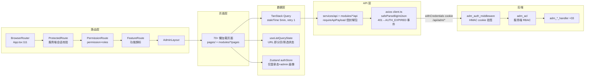

# imboyadmin 前端深度架构评审 / Admin Frontend Architecture Review

> **评审对象**: `imboyadmin/`（React 19.2 + TypeScript + Vite + Radix UI + Zustand + TanStack Query/Table，bun 包管理）
> **评审方式**: Fact-based 只读评审，全部结论附 `文件:行号` 证据
> **评审日期**: 2026-07-22
> **版本**: imboy-admin-frontend 1.0.0-alpha.15（imboyadmin/package.json:4）

---

## 0. 架构总览

**一句话评价**：这是一个分层清晰、约定执行度高于平均水平的管理后台——TanStack Query 独占服务端状态、Zustand 只存登录态、URL 承载列表状态、TSID/分页/信封三大契约有统一约定并大面积落地；主要风险集中在 `safeParseBigIntJson` 的正则改写会被用户内容触发整页失败、后端 admin cookie 无过期/默认密钥兜底、以及权限门 fail-open 降级设计。

---

## 1. 整体架构与目录组织

**职责划分**
- `src/pages/`（约 40 组页面）+ `src/modules/`（channels/groups/identity/finance/moments/messages/ops_governance/social_graph/plugin_management 等 10 个业务模块，各带 `api/`、`index.ts`、`public.ts` 边界文件）。
- `src/services/api/`：跨模块共享 API（client/rbac/stats/storage/sso/mcpGovernance 等 30+ 文件）。
- `src/stores/`：仅 1 个 `authStore.ts`——Zustand 的职责被刻意压缩到"登录态 + 当前管理员画像"，其余全部服务端状态走 TanStack Query。这是正确的职责划分（对照 `useAdminPermission.ts:38-52` 的 query 用法）。

**路由**
- react-router-dom 7（imboyadmin/package.json:36），单文件集中式路由 `App.tsx:107-732`，全部页面 `lazy()` 代码分割（App.tsx:16-88），Suspense fallback + ErrorBoundary + TopLoadingBar 齐备（App.tsx:110-113）。

**优点**
1. 模块化边界（`modules/*/public.ts` 导出面收敛）+ knip 死代码检查纳入 `check` 脚本（imboyadmin/package.json:19-20）。
2. QueryClient 全局默认 `staleTime: 5min, retry: 1`（App.tsx:90-97），避免过度重试放大后端故障。
3. `useListQueryState`（hooks/useListQueryState.ts:43-99）把 page/size/filters 全部落 URL，可分享、可回退，且 `replace: true` 默认不污染历史栈——18/18 列表页已迁移（imboyadmin/CLAUDE.md 变更记录 2026-06-11），实测 41 个页面文件引用。

**问题**
- `App.tsx` 733 行接近文件上限，路由与权限声明（permission + roles 双写）在 70+ 个 Route 上逐条重复，且同一套 roles 数组又在 `sidebarSchema.ts:80-91` 第二次声明、后端 `adm_index_handler:role_acl/1` 第三次声明——三处手工同步，存在漂移风险（**P3**）。

**风险等级：P3**

---

## 2. API 层

**设计**（services/api/client.ts）
- `BASE_URL = import.meta.env.VITE_API_BASE_URL || '/api/adm'`（imboyadmin/src/services/api/client.ts:6），开发态 vite proxy `^/api/adm(?=/|$)` → 127.0.0.1:9800（vite.config.ts:41-44）。
- 统一信封：响应拦截器对 `data.code !== 0` 直接 reject 为 `ApiError`（imboyadmin/src/services/api/client.ts:96-102）；`requireApiPayload` 在 payload 缺失时抛错以暴露契约回归（imboyadmin/src/services/api/responseAdapter.ts:46-52）。
- 401 通过 `AUTH_EXPIRED_EVENT` 自定义事件解耦网络层与路由跳转（imboyadmin/src/services/api/client.ts:10-23,113-115），ProtectedRoute 订阅该事件执行 logout（ProtectedRoute.tsx:36-47）——干净的解耦。
- `endpointCandidates.ts:32-40` 提供 `tryWithFallback` 端点降级探测（404/405/501 时换候选端点），用于前后端版本错位期的兼容。

**TSID 处理**
- axios `transformResponse` 全局注册 `safeParseBigIntJson`（imboyadmin/src/services/api/client.ts:60-70），16 位以上整数在 `JSON.parse` 前加引号转 string（safeParseBigIntJson.ts:19-22）。
- 类型层 `EntityId` 在 `src/types/*.ts` 出现 40 处；`billing.ts:5` 明文注释约定。抽查 `Number(id)` 违规：仅 `AdminListPage.tsx:126`、`adminConfig.ts:69` 两处，均为角色 ID（小整数，非 TSID），**不构成违规**。覆盖率结论：**全覆盖（经全局 transformResponse 兜底，个别遗漏字段也会被转 string）**。

**P1 问题：safeParseBigIntJson 会被字符串内容误触发，导致整个响应解析失败**
- 正则 `/(?<=[:,[\s])(-?\d{16,})(?=[,\]}\s])/g`（safeParseBigIntJson.ts:20）只看前后单字符，无法区分"JSON 值位置的整数"和"字符串字面量内部的数字"。
- 反例：`{"content":"call 1234567890123456, ok"}`——数字前是空格、后是逗号，均命中字符类 → 被改写成 `"call "1234567890123456", ok"` → 非法 JSON → `JSON.parse` 抛错 → transformResponse 的 catch 返回**原始字符串**（imboyadmin/src/services/api/client.ts:65-68）→ 响应拦截器把 string 直接放行（imboyadmin/src/services/api/client.ts:90-92）→ 页面侧 `requireApiPayload` 抛 "Missing payload" → **整页数据加载失败**。
- 管理后台恰恰要展示任意用户生成内容（MessageListPage、FeedbackListPage、MomentListPage），16 位数字（如银行卡号、订单号）出现在消息正文里是现实场景。
- 单测未覆盖该形态：`safeParseBigIntJson.test.ts:19-24` 只测了"独立被引号包裹的数字"，没有"数字嵌在长文本中间"的用例。
- 根治方向：改用 JSON 词法级处理（如逐 token 扫描跳过字符串字面量），或后端对 TSID 字段统一输出 string（OpenAPI 契约已对账，见项目记忆）。

**风险等级：P1（safeParseBigIntJson）；其余 P3**

---

## 3. 权限与登录

### 3.1 前端 RBAC：**有，且是三层门**

| 层 | 组件 | 逻辑 | 证据 |
|---|---|---|---|
| 会话 | `ProtectedRoute` | 首进必打 `/current` 服务端验证，不信任本地持久化 | ProtectedRoute.tsx:16-30 |
| 权限 | `PermissionRoute` | `permission`（细粒度字符串）+ `roles`（角色白名单）双约束 | PermissionRoute.tsx:12-24 |
| 旗标 | `FeatureRoute` | 功能开关（channel/moment/e2ee/group_task 等） | App.tsx:172-174, 482-484 |

`useAdminPermission` 的解析顺序：`/rbac/me` 的 permissions → sidebar 配置的角色模板 permissions → **降级为角色级放行**（useAdminPermission.ts:75-97）。

**P2 问题：权限门 fail-open by design**
- `useAdminPermission.ts:93-97`：当 `/rbac/me` 与 sidebar 配置**均不可用且已加载完成**时，细粒度权限校验降级为仅角色匹配（代码自带 `SECURITY(H11)` 注释与 console.warn）。加载中返回 false 防闪开（useAdminPermission.ts:89-93），设计是自觉的，但生产上若 `/rbac/me` 故障，运营角色（role 2）将获得其角色白名单内所有页面的访问权，细粒度收权失效。
- **纵深缓解**：后端 `adm_acl.erl:34-53`（`ensure_permission/3`、`ensure_any_permission/3`）在 33 个 `adm_*_handler` 侧做服务端权限校验（如 `adm_finance_handler.erl:546`），前端降级不等于后端放行。前端 RBAC 定位为 UX 门，权威在服务端——这个纵深是成立的。

### 3.2 登录链路
- 密码：`encryptLoginPassword` = RSA-OAEP(SHA-256) 加密 `md5(明文)`（passwordCrypto.ts:60-94），MD5 预哈希是后端存储协议要求（passwordCrypto.ts:80-82 注释），加密失败时**直接报错拒绝提交，无明文回退**（LoginPage.tsx:165-170）——正确。
- CSRF：登录带 `csrf_token`（imboyadmin/src/modules/identity/api/auth.ts:7-12，来自 `/passport/meta`）；登录后写请求依赖 SameSite=Lax cookie + 后端 CORS 白名单 + `X-Requested-With` 强制预检的三层设计（imboyadmin/src/services/api/client.ts:45-57 注释完整记录）。
- 已知"登录 5 坑"（域名/902 误路由/CSP/cookie path/密码 md5）在当前代码中均有对应防线：BASE_URL 可配（imboyadmin/src/services/api/client.ts:6）、CSP 显式列出 connect-src（imboyadmin/index.html:7）、密码协议注释固化（passwordCrypto.ts:80-82）。

### 3.3 后端 admin 会话机制（纵深评估，跨仓引用 imboy/）

**P1 问题：admin cookie 签名密钥存在硬编码默认值（裁决：P1，非 P0）**
- `imboy/src/adm/adm_auth_middleware.erl:218-221`（`signing_key/0`）：`config_ds:env(adm_cookie_secret, <<"imboy-adm-cookie">>)`——若生产部署漏配 `adm_cookie_secret`，签名密钥就是源码里的公开常量，可为任意 uid 伪造 cookie 获得管理员会话。**更正**：启动期**有** fail-fast 校验——`imboy_app.erl:311-321` 的 `validate_runtime_config/0` 在 strict env 下 `ensure_required_secret(adm_cookie_secret)`，漏配即拒绝启动。故本项降为 **P1**：兜底存在，但依赖 `is_strict_env(runtime_env())` 判定正确，误配 `IMBOYENV` 致 strict 判定错误时默认值仍会穿透，且与"cookie 无过期/不可吊销"叠加放大。
- **P1 叠加**：cookie 签名 = `HMAC-SHA256(Uid, secret)`（adm_auth_middleware.erl:181-183），**不含时间戳/过期/随机数**——同一 uid 的签名永久不变：无会话过期、登出后旧 cookie 仍有效（登出仅清客户端 cookie）、无法单独吊销某次会话，唯一失效手段是轮换全局密钥。
- 建议：启动时强制校验 `adm_cookie_secret` 已配置且非默认值；签名负载加入 `uid|expires_at`，验签时校验过期。

### 3.4 billing_handler 权限缺口（已知问题复核）
- `imboy/src/api/billing_handler.erl`（293 行）经 grep 确认**无任何 `current_uid`/`adm_acl`/权限校验调用**，`/api/v1/billing/*`（imboy_router.erl:524-527）任意合法 JWT 可操作任意 tenant——与项目记忆一致（缓修中）。
- **与 admin 前端的关系**：admin 财务页面走的是 `/api/adm/finance/*`（`adm_finance_handler.erl:546` 有 `adm_acl:ensure_permission`），**admin 面不受此缺口影响**；缺口在 C 端 API 面，纵深结论：admin 链路完整，v1 billing 链路缺 authz（**P1，后端**）。

**风险等级：P1（默认密钥，有 fail-fast 兜底但依赖 strict 判定）/ P1（cookie 无过期、billing authz）/ P2（fail-open）**

---

## 4. 分页与表格

**约定**：统一 `DataTablePagination`、默认 `size:10`、筛选变化重置 `page=1`（imboyadmin/CLAUDE.md）。

**抽查结果：遵守度高**
- `DEFAULT_PAGE_SIZE = 10` 单一出处（lib/pagination.ts:1）；`DataTablePagination` 内含非法 pageSize 兜底（DataTable.tsx:215）。
- 52 个文件使用 `DataTablePagination`；82 个页面文件出现 `page: 1` 重置（共 247 处）。
- 逐页抽查：`UserListPage.tsx:187,198,213`（筛选/搜索/换 size 均重置 page:1）、`WalletListPage.tsx:115,123,132,136`（含 `onPageSizeChange` 与 `resetParams`）——均符合约定。
- 残留本地 `useState(page)` 的列表页：grep 未命中（0 个），URL-state 迁移已完成。

**风险等级：P3（无实质问题）**

---

## 5. 表单验证

**现状：react-hook-form + zod 仅覆盖 2 个页面**
- `zodResolver` 只出现在 `LoginPage.tsx:132`（loginSchema，LoginPage.tsx:19）和 `SetupPage.tsx:80`（setupSchema）。
- 其余全部表单（AnnouncementFormDialog、SetChannelPriceDialog、CreateRoleDrawer、群组 11 个管理页的增改弹窗等）走手写受控 state + 手工校验，无 schema 化验证。zod 已在依赖里（imboyadmin/package.json:40），`vendor-form` chunk 也已预留（vite.config.ts:26），但未推广。
- 影响：校验规则分散、错误提示风格不一致、无类型推导复用。后端有参数校验兜底（如 `adm_finance_handler.erl:604-629` 的 `parse_required_id/bin`），不构成安全问题，属一致性/可维护性缺口。

**风险等级：P2**

---

## 6. 构建与部署

**构建**（vite.config.ts）
- `manualChunks` 按库族手工分包 12 个 vendor chunk（vite.config.ts:17-33），`build = tsc -b && vite build`（imboyadmin/package.json:8）类型检查前置——合理。

**Dockerfile**
- 多阶段 bun 构建 + nginx:alpine 运行（Dockerfile:16, 36），SPA history 回退、静态资源一年强缓存、/health 健康检查齐备。
- **P2**：镜像内 nginx conf **无任何安全响应头**（无 CSP/X-Frame-Options/X-Content-Type-Options，Dockerfile:43-64 的 printf 配置块），安全头完全依赖外层 `imboy/deploy/nginx/templates/imboy.conf.template:180-185`。若买家绕过官方 nginx 模板直接暴露该容器（Dockerfile 头部注释 `docker run -p 80:80` 正是这种用法），将裸奔。

**CSP 双源漂移（P2）**
- `imboyadmin/index.html:7` meta CSP：`script-src 'self'`（严格）、`connect-src 'self' https://pro.imboy.pub`——**把生产域名硬编码进了开源仓库**，私有化买家自建域名时 meta CSP 的 connect-src 与其后端不符（同源部署时 'self' 兜住，跨域部署 API 会被浏览器拦）。
- `imboy/deploy/nginx/templates/imboy.conf.template:185` header CSP：`script-src 'self' 'unsafe-inline'`（比 meta 宽松）。两处策略不一致，最终生效为两者交集，维护上易失配。
- meta CSP 无法承载 `frame-ancestors`（规范限制），点击劫持防护靠 nginx 模板的 `X-Frame-Options SAMEORIGIN`（imboy.conf.template:180）补齐——链路成立，但同样依赖"必须用官方 nginx 模板"这一前提。

**部署编排**
- Git 跟踪 Helm 的 `deployment-admin.yaml`/`service-admin.yaml` 与 `imboy/scripts/deploy.sh`；本机虽有包含 `imboy_admin` 服务的生产 Compose 草稿，但它被 `imboy/.gitignore:43` 排除，买家和 CI 无法从仓库复现，不能作为已交付能力证据。

**风险等级：P2**

---

## 7. 测试

**单测（bun test）**
- `src/` 内 119 个 `*.test.ts(x)`，覆盖 lib 工具（safeParseBigIntJson/money/passwordCrypto/csvExport/pemValidation 各有专测）、api 层（client.interceptor/client.authEvent/responseAdapter/rbac 等）、authStore、useAdminPermission、及大部分 Page 组件测试——**广度好**。
- 缺口：`safeParseBigIntJson.test.ts` 未覆盖"数字嵌入字符串文本"破坏性用例（见 §2）；无覆盖率门禁（package.json scripts 无 coverage 目标）。

**E2E（Playwright）**
- 9 个 spec（tests/e2e/：login-comprehensive、admin-rbac、user-management、report-center、channel-messages、group-task、setup-flow、prod-health-check 等），打真实后端（playwright.config.ts webServer + `.env.e2e`）。
- **P3**：凭证缺失时 `test.skip` 静默跳过（tests/e2e/support/adminAuth.ts:31-39）——CI 未注入 `IMBOY_ADMIN_E2E_ACCOUNT/PASSWORD` 时 E2E 覆盖率实际为 0 且不报错，容易产生"E2E 是绿的"错觉。建议 CI 主流水线强制注入凭证或对 skip 数量设阈值报警。

**风险等级：P2（bigint 用例缺口）/ P3（E2E 条件跳过）**

---

## 8. 时间处理（6 位微秒 Safari 坑）

**已系统性修复的部分**
- `lib/utils.ts:15-30` `formatDate`：显式注释并截断微秒 `.replace(/(\.\d{3})\d+/, '$1')`，解析失败兜底 `'-'`；`formatOptionalDate`（utils.ts:8-13）同路。这是坑的根治入口。

**未收口的旁路（P2）**
以下站点绕过 `formatDate` 直接 `new Date(...)`，若后端字段是 6 位微秒 RFC3339 字符串，Safari 仍会 Invalid Date：
- `src/pages/settings/MutedUsersPage.tsx:189` — `new Date(user.mute_until).toLocaleString('zh-CN')`，无微秒截断、无 NaN 兜底。
- `src/pages/dashboard/DashboardPage.tsx:186` — `new Date(activity.timestamp).toLocaleString(...)`。
- `src/components/shared/NotificationPanel.tsx:110` — `new Date(ts).toLocaleDateString('zh-CN')`。
（`DataTable.tsx:235` 的 `dataUpdatedAt` 是本地毫秒数，安全。）

各页自写的归一化函数（`FeedbackListPage.tsx:55-75`、`AuditLogPage.tsx:95-108`、`GroupGovernanceLogPage.tsx:27-34`、`GroupScheduleManagePage.tsx:38-46`）做了秒/毫秒双支持与 `' '→'T'` 替换，但**均未复刻微秒截断**——它们依赖入参恰好不是微秒格式。结论：**坑已在公共入口根治，但未强制收口，存在 4+ 个旁路点**。建议 eslint 自定义规则或 grep 门禁：页面代码禁止直接 `new Date(字符串)`，一律走 `formatDate/formatOptionalDate`。

**风险等级：P2**

---

## 9. 问题汇总表

| # | 等级 | 问题 | 证据 | 建议 |
|---|------|------|------|------|
| 1 | **P1** | admin cookie 签名密钥有硬编码默认值 `imboy-adm-cookie`；已有 `validate_runtime_config/0` fail-fast 兜底（imboy_app.erl:311-321），但依赖 `is_strict_env` 判定，误配 IMBOYENV 可穿透 | imboy/src/adm/adm_auth_middleware.erl:218-221 | 建议移除硬编码默认值，直接依赖 fail-fast（无默认即崩） |
| 2 | **P1** | admin cookie 签名不含过期时间：会话永不过期、登出不吊销、无法单独失效 | imboy/src/adm/adm_auth_middleware.erl:181-183 | 签名负载加入 expires_at 并验签校验 |
| 3 | **P1** | `safeParseBigIntJson` 正则会误改写字符串内部的 16+ 位数字 → 非法 JSON → 整页数据加载失败（管理端展示 UGC 必然踩中） | imboyadmin/src/lib/safeParseBigIntJson.ts:19-22; imboyadmin/src/services/api/client.ts:60-70 | 换 token 级解析或后端 TSID 统一输出 string；先补破坏性单测 |
| 4 | **P1** | `/api/v1/billing/*` 零 authz，任意 JWT 可操作任意 tenant（后端已知缓修；admin 面走 adm_finance_handler 不受影响） | imboy/src/api/billing_handler.erl（全文无权限调用）; imboy_router.erl:524-527 | 接前端前补 mandate/owner 校验 |
| 5 | P2 | 前端权限门 fail-open：`/rbac/me` 与 sidebar 配置均不可用时降级为角色级放行 | imboyadmin/src/hooks/useAdminPermission.ts:93-97 | 生产监控 `/rbac/me` 可用性；或改 fail-closed + 明确报错页 |
| 6 | P2 | 微秒时间坑未收口：4 处页面绕过 `formatDate` 直接 `new Date()` | MutedUsersPage.tsx:189; DashboardPage.tsx:186; NotificationPanel.tsx:110 | lint 门禁强制走 formatDate |
| 7 | P2 | zod + react-hook-form 仅覆盖 Login/Setup 两页，其余表单手写校验 | 全仓 zodResolver 仅 LoginPage.tsx:132、SetupPage.tsx:80 | 增量推广：新表单必须 schema 化 |
| 8 | P2 | CSP 双源漂移 + 生产域名硬编码进 meta CSP；Docker 镜像内 nginx 无安全头 | imboyadmin/index.html:7; Dockerfile:43-64; imboy/deploy/nginx/templates/imboy.conf.template:185 | CSP 单源化（构建时注入域名）；镜像 nginx 补基础安全头 |
| 9 | P3 | E2E 凭证缺失时静默 skip，CI 可能长期 0 覆盖仍全绿 | tests/e2e/support/adminAuth.ts:31-39 | CI 强制注入凭证或 skip 阈值报警 |
| 10 | P3 | 路由 roles/permission 在 App.tsx、sidebarSchema.ts、后端 role_acl 三处手工同步 | App.tsx:127 等 70+ 处; sidebarSchema.ts:80-91 | 以后端 `/rbac` 配置为单一来源生成 |
| 11 | P3 | `responseAdapter` 静默归一 `list→items` 旧分页格式，掩盖契约漂移 | imboyadmin/src/services/api/responseAdapter.ts:3-33 | 后端契约收敛后移除并加告警 |

---

## 10. 值得肯定的设计（保持）

1. **状态职责划分教科书级**：Zustand 只存登录态（authStore.ts 全文 38 行），持久化时主动脱敏 PII（authStore.ts:22-35）；服务端状态 100% TanStack Query；列表状态 100% URL（useListQueryState）。
2. **TSID 纪律**：全局 transformResponse 兜底 + `EntityId` 类型约定 + 零 `Number(TSID)` 违规。
3. **认证解耦**：401 → CustomEvent → 路由守卫，网络层不 import 路由（imboyadmin/src/services/api/client.ts:112-115 / ProtectedRoute.tsx:36-47）。
4. **登录安全**：RSA-OAEP 加密传输、加密失败不降级明文（LoginPage.tsx:165-170）、CSRF 三层设计有完整注释（imboyadmin/src/services/api/client.ts:45-50）。
5. **服务端 RBAC 收敛**：`adm_acl.erl` 把原先散落 11 个 handler 的权限校验统一（adm_acl.erl:9-16 注释），前端门失效时后端仍兜底。
