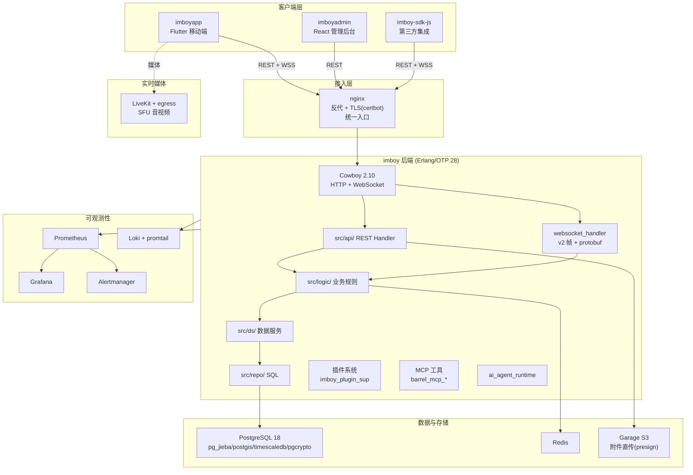

# IMBoy 架构评审（Architecture Review）

> Fact-based Review · 只读评审，不改代码 · 版本基线：三仓 `1.0.0-alpha.15`
> 评审日期：2026-07-22 · 覆盖仓库：`imboy`（Erlang/OTP 后端）、`imboyapp`（Flutter）、`imboyadmin`（React 管理后台）
> 本文件为顶层总纲，各领域详见同目录 `backend-review.md` / `flutter-review.md` / `admin-review.md` / `database-review.md` / `protocol-review.md` / `security-review.md` / `performance-review.md` / `testing-review.md` / `code-quality-review.md`；债务与风险汇总见 `tech-debt.md` / `risk-report.md`。

---

## 0. 工作区与仓库归属（Critical Structure Fact）

`~/project/imboy.pub/` **不是 git 仓库**，只是聚合工作区（umbrella workspace）。真实 git 仓库：

| 仓库 | 语言/框架 | 职责 | 规模（源文件） |
|---|---|---|---|
| `imboy/` | Erlang/OTP 28 + Cowboy 2.10 | HTTP/WS 后端主服务 + 产品主仓 | 477 个 `.erl`（含生成的 `imboy_pb.erl` 6018 行） |
| `imboyapp/` | Flutter 3.8+ / Dart | iOS/Android 移动客户端 | 799 个 `.dart`（含 i18n 生成 ~48k 行） |
| `imboyadmin/` | React 19.2 + Vite + Radix + Zustand | Web 管理后台 | 345 个 `.ts/.tsx` |
| `erlang_migrate/` | Erlang | 自研多库迁移库（gitee 独立仓） | — |
| `imboy-sdk-js/` | TypeScript | 官方 JS/TS SDK `@imboy/sdk` | 16 源文件 |
| `imboy-plugin-marketplace/` | JSON | GitOps 插件注册中心 | — |

> 注：`imboyadmin` 根级 AI 上下文历史上曾记为 "Vue"，实测栈为 **React 19.2**（`imboyadmin/package.json` 依赖 `react@^19.2.0`、`react-router-dom@^7.13.0`、`zustand`、`@tanstack/react-query`）。本评审以事实为准。

---

## 1. 系统架构图（System Architecture）

**目标部署拓扑**：本机被 Git 忽略的生产 Compose 草稿包含 12 个服务：`imboy_backend`、`imboy_admin`、`imboy_nginx`、`imboy_certbot`、`imboy_redis`、`imboy_livekit`、`imboy_egress`、`imboy_prometheus`、`imboy_alertmanager`、`imboy_loki`、`imboy_promtail`、`imboy_grafana`；它只能用于本机现状取证，不能证明买家可从仓库复现。Git 当前可验证的部署入口是 `imboy/deploy/helm/`，生产反代模板为 nginx。

---

## 2. 后端 OTP Supervision Tree

`imboy_sup.erl` 顶层 supervisor 挂载 18 个 child spec（`imboy/src/imboy_sup.erl`，实测 `^\s+id =>` 非注释行 18 条；下图节点数与之一致）：

```mermaid
graph TD
    ROOT["imboy_sup<br/>(one_for_one)"]
    ROOT --> US["user_server<br/>用户在线态"]
    ROOT --> CACHE["imboy_cache<br/>KV 缓存"]
    ROOT --> CSYNC["imboy_cache_sync<br/>缓存同步"]
    ROOT --> DOMEV["imboy_domain_event<br/>领域事件总线<br/>(早于业务 worker)"]
    ROOT --> MSGSUP["msg_store_sup<br/>(supervisor)"]
    ROOT --> BURN["msg_burn_logic<br/>阅后即焚"]
    ROOT --> UDEL["user_deletion_logic<br/>账号注销"]
    ROOT --> LIC["license_notice_worker<br/>(默认禁用)"]
    ROOT --> BILL["billing_invoice_worker<br/>(默认禁用)"]
    ROOT --> OTK["olm_otk_cleanup_worker<br/>(默认禁用)"]
    ROOT --> LOGIN["login_attempt_ds<br/>登录尝试限流"]
    ROOT --> METRIC["elib_metric<br/>指标采集"]
    ROOT --> PLD["imboy_plugin_loader"]
    ROOT --> PSUP["imboy_plugin_sup<br/>(supervisor)"]
    ROOT --> AIRT["ai_agent_runtime"]
    ROOT --> MCPREG["barrel_mcp_registry"]
    ROOT --> MCPSESS["barrel_mcp_session"]
    ROOT --> MCPTOOLS["imboy_mcp_tools"]
```

**观察（待各领域 agent 证实/补充）**：
- 领域事件总线 `imboy_domain_event` 显式排在业务 worker 之前启动，注释说明"确保 logic 外壳 publish 时总线已就绪"——启动顺序耦合是刻意设计。
- 多个 worker（license/billing/otk cleanup）默认禁用，需 `sys.config` 显式开启——符合"最小惊讶 + 不打扰"原则。
- 顶层混入 MCP / AI Agent / 插件三套扩展子系统，后端已从纯 IM 演进为"IM + Agent 平台"，顶层 supervisor 职责偏重（详见 backend-review）。

---

## 3. 后端四层架构（ADR-0001）

`imboy/docs/adr/0001-four-layer-architecture.md` 定义单向依赖：`api → logic → ds → repo`，由 `scripts/check_module_boundaries` 做 CI 门禁。`src/` 目录印证分层：`api/`、`adm/`、`logic/`、`ds/`、`repo/`、`domain/`、`lib/`、`mcp/`、`plugins/`。

分层遵守度、穿层违规的实证结论以 `backend-review.md` 与 `code-quality-review.md` 为准。

---

## 4. 客户端架构分层

- **imboyapp**（`imboyapp/lib/`）：`app_core/`、`capabilities/`、`component/`、`config/`、`modules/`、`page/`、`plugins/`、`service/`、`store/`、`theme/`、`utils/` + `i18n/`。MVVM + Repository，Riverpod 状态，sqflite 本地库（schema v23）。详见 `flutter-review.md`。
- **imboyadmin**（`imboyadmin/src/`）：`pages/`、`components/`、`modules/`、`services/`、`stores/`、`hooks/`、`lib/`、`types/`。React Router 7 + Zustand（客户端态）+ TanStack Query（服务端态）。详见 `admin-review.md`。

---

## 5. ADR 现状

仅 3 条 ADR（`imboy/docs/adr/`）：四层架构、数据库迁移、插件路由命名空间。相对于系统已承载 E2EE、支付、LiveKit、MCP/AI Agent、插件市场等重决策，**架构决策记录严重欠缺**（详见 `tech-debt.md`）。

---

## 6. 跨仓风险与债务汇总

全量台账见 `risk-report.md`（P0–P3 逐条含证据），可执行路线见 `tech-debt.md`。此处只给结论。

### 6.1 头号根因（5 个方向独立收敛）

**IMBoy 的正确性大量依赖约定 / 注释 / 纪律，而非 schema 约束 / 类型 / lint / CI 硬门。** 后端、Flutter、Admin、数据库、测试评审各自独立得出同一判断：autoDispose 陷阱只在注释防御、DDL schema 四处手工同步已矛盾、鉴权豁免 4 处平行 path 维护、钱包不变量只写注释未下沉 schema、覆盖率目标无阈值门……

**乐观面**：这是"未收口"而非"不会做"——库内到处是"正确范本 + 未推广"并存态（`agent_rate_limiter` 并发 ETS 表 write_concurrency、`recharge_order_repo:271` 钱包守卫、`webrtc_ws_logic` ACK 预编码、`check_module_boundaries`+xref=0 门禁样板）。把已有范本与 ratchet 框架推广即可，成本可控。

**次级根因**：横切变更无单一真相源——2026-07 一次路由前缀硬切独立引发 3 个 P0/P1（下表 P0-1、billing 越权、setup 401 同源）。

### 6.2 P0 阻断项（4 项，发布前必清）

| # | 域 | 一句话 | 证据 |
|---|---|---|---|
| P0-1 | 后端 | `auth_middleware:34` 的 `/v1/` 前缀永不匹配 `/api/v1/*` → 支付回调/webhook 免签失效(生产 902 拒)+设备签名门静默失效（**已读码复核**） | `src/api/auth_middleware.erl:34-36` |
| P0-2 | 性能 | `user_server` 单 gen_server 串行全站上下线，重连风暴积压 | `src/logic/user_server.erl:94-127` |
| P0-3 | 性能 | 每消息每设备 ACK 定时器经 `imboy_cache` 封装落到 `depcache` 单 gen_server 同步 call（`imboy_cache` 是封装层，非直接调 depcache） | `src/ds/message_ds.erl:154` |
| P0-4 | 法务 | `flutter_vodozemac` AGPL-3.0 与闭源售卖冲突未裁决 | `imboyapp/pubspec.yaml:221-222` |

### 6.3 P1 汇总（24 项，按域）

- **认证授权**：billing 9 端点对象级越权(IDOR)、首启向导 401 不可达、adm cookie 硬编码密钥(裁决 P1)、admin 前端权限 fail-open
- **集群/可靠性**：syn 远端 Pid+start_timer 集群崩溃、启动重试仅扫前 100 条、本地 DB v23 降级静默失败
- **数据/资金**：钱包冻结资金可花掉、全链路无 statement_timeout(双 agent 命中)、raw 逃生门无校验、hypertable 去重键含时间戳
- **协议契约**：C2S_SERVER_ACK 丢 type、`endsWith('_ACK')` 大小写脆弱、SDK 5 项契约漂移、app protobuf 幻影枚举
- **前端质量**：autoDispose 无 lint 门禁(67 Notifier)、safeParseBigIntJson 正则整页拒服、DDL 三镜像漂移
- **代码质量**：20 处静默吞错(7 处阅后即焚)、chat_page.dart 2234 行
- **性能**：C2G 同步扇出、投递管道 JSON 中间格式、离线 5000 行超量读、msg_store_worker 单 worker
- **测试**：三仓覆盖率无阈值门、admin E2E 零进 CI、mock 协议边界反模式漏掉 5 个真 bug、坏死 integration_test.yml

### 6.4 正面结论（架构真金）

- **后端四层分层纪律是真金**：`api→repo` 直调 0 处、`ds/repo` 反向 0 处，全仓仅 1 处破窗，`check_module_boundaries.sh` 机制化——架构宣称与实现罕见一致。
- **消息链路是全仓质量最高部分**：存储优先(staging→异步正式表 SKIP LOCKED)、ACK 竞态双保险、v2 帧三端字节级对齐。
- **密码学基本面扎实**：JWT exp 强制、支付 owner_uid 红线、E2EE 零明文私钥、SQL 全参数化、密钥未入库、Flutter Keychain+sqlcipher+生产证书严格。
- **迁移体系良好偏优**：strict 乱序检测+advisory lock+单文件事务+down 全覆盖，迁移文件自带事故复盘注释。
- **可观测栈完整**：Prometheus/Grafana/Loki/Alertmanager 齐备。

### 6.5 结构性债务（需专题，见 tech-debt.md §3）

E2EE 三代共存 / 后端演进为 IM+Agent 平台顶层职责过重 / TimescaleDB 生命周期链隐性负债 / Flutter 三套运行时并存中间态 / SDK 事实性失联。

---

## 7. 评审文档索引

| 文档 | 内容 |
|---|---|
| `backend-review.md` | 后端 OTP/路由/WS/REST/认证/E2EE/存储/插件 |
| `database-review.md` | 表结构 ER、迁移体系、Repo SQL、事务、索引 |
| `flutter-review.md` | 客户端分层、Riverpod、网络、本地库、E2EE、设计系统 |
| `admin-review.md` | React 架构、API 契约、权限、构建部署、测试 |
| `protocol-review.md` | REST/WS 三端契约一致性、各业务流序列图 |
| `security-review.md` | 认证授权、注入、密码学、密钥、支付安全 |
| `performance-review.md` | 后端并发、DB、WS 热路径、客户端性能 |
| `testing-review.md` | 三仓测试覆盖、CI 门禁、测试反模式 |
| `code-quality-review.md` | 规模超标、分层违规、死代码、错误处理 |
| `tech-debt.md` | 技术债务清单（可执行优化路线） |
| `risk-report.md` | 风险台账（P0-P3 全量排序） |
