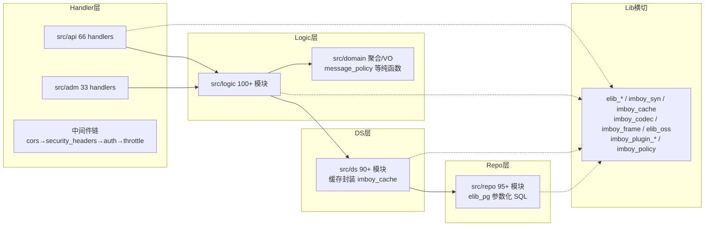

# imboy 后端深度架构评审 / Backend Architecture Review

> 评审日期：2026-07-22 | 版本基线：1.0.0-alpha.15（`ebin/imboy.app` vsn）
> 评审方式：Fact-based 只读代码评审（未运行编译/测试），全部结论附 文件:行号 证据。
> 范围：OTP 结构、路由、WebSocket、REST 4 层架构、认证权限、缓存、E2EE、推送、存储、配置、插件系统。

---

## 0. 全局视图

### 0.1 OTP Supervision Tree

启动入口 `imboy_app:start/2`（src/imboy_app.erl:12-107）：env 覆盖 → 配置校验 → 密钥就绪 → License → 迁移 → syn/TSID/ETS 初始化 → **先启 Cowboy listener（:92-98）→ 后启 imboy_sup（:99）**。

```mermaid
graph TD
    APP[imboy_app<br/>application] --> LISTENER["cowboy listener<br/>imboy_listener / imboy_listener_tls<br/>（在 imboy_sup 之前启动!）"]
    APP --> SUP[imboy_sup<br/>one_for_one 10/60s]

    SUP -.->|"init/1 副作用"| POOLER["pooler 应用 + pg 连接池<br/>imboy_sup.erl:24-26"]
    SUP --> CACHE[imboy_cache<br/>depcache worker]
    SUP --> DEBUS[imboy_domain_event<br/>领域事件总线 gen_server]
    SUP --> METRIC[elib_metric<br/>Prometheus 指标 gen_server]
    SUP --> PLOADER[imboy_plugin_loader<br/>transient worker]
    SUP --> PSUP[imboy_plugin_sup<br/>supervisor one_for_one 5/10s]
    SUP --> LOGINDS[login_attempt_ds<br/>登录失败 ETS gen_server]
    SUP --> USRV[user_server<br/>上下线异步队列 gen_server]
    SUP --> MSUP[msg_store_sup<br/>supervisor one_for_one 10/60s]
    SUP --> BURN[msg_burn_logic<br/>消息自毁定时 worker]
    SUP --> UDEL[user_deletion_logic<br/>注销清理定时 worker]
    SUP --> LIC[license_notice_worker]
    SUP --> BILLW[billing_invoice_worker]
    SUP --> OTKW[olm_otk_cleanup_worker]
    SUP --> AIRT[ai_agent_runtime<br/>transient]
    SUP --> MCPR[barrel_mcp_registry<br/>transient]
    SUP --> MCPS[barrel_mcp_session<br/>transient]
    SUP --> MCPT[imboy_mcp_tools<br/>transient]
    SUP -->|dsync_enabled=true| CSYNC[imboy_cache_sync]

    PSUP --> RREG[imboy_router_registry<br/>插件路由 ETS gen_server]
    PSUP --> WSREG[imboy_ws_action_registry<br/>WS action ETS gen_server]
    PSUP --> CH[channel_sup<br/>imboy_plugin_generic_sup]
    PSUP --> MO[moment_sup]
    PSUP --> LO[location_sup]
    PSUP --> GC[group_collab_sup]

    MSUP --> MSDS[msg_store_ds<br/>staging 队列 gen_server]
    MSUP --> MSW["msg_store_worker<br/>gen_statem idle/draining"]
```



证据：src/imboy_sup.erl:36-260；src/imboy_plugin_sup.erl:36-49；src/ds/msg_store_sup.erl:34-62；src/ds/msg_store_worker.erl:85-121（gen_statem）。

### 0.2 模块依赖（4 层架构）



### 0.3 核心调用链

**HTTP 请求生命周期**：

```
Client → cowboy_router (imboy_app.erl:63)
       → cors_middleware → security_headers_middleware
       → auth_middleware:execute (auth_middleware.erl:19)
           ├─ /api/adm/* → adm_auth_middleware（cookie HMAC + IP 白名单 + RBAC 后置）
           ├─ /v1/*     → auth_middleware_api_v1  ⚠️ 死分支，永不匹配（见 P0-1）
           └─ _ 默认    → verify_sign(902 设备签名) + auth_ds:condition(JWT)
                          → Env.handler_opts 注入 current_uid / current_did (auth_ds.erl:193-201)
       → throttle_middleware（api_per_user/api_per_ip）
       → cowboy_handler → *_handler:init/2 → *_logic → *_ds → *_repo → elib_pg → PostgreSQL
```

**WS 消息生命周期（C2C 发送）**：

```
握手: GET /api/v1/ws → websocket_handler:init/2 (websocket_handler.erl:25)
      throttle_ws 限流(:77) → 子协议协商 imboy.v2/protobuf/json (websocket_ds.erl:49-53)
      → websocket_ds:auth (JWT 校验, websocket_ds.erl:76) → websocket_init 上线
      → user_logic:online → imboy_syn:join(?CHAT_SCOPE) + user_server 异步查离线消息
入帧: {binary,Msg} → v2? imboy_codec:unwrap_v2_frame → dispatch_v2_frame(:240)
      {text,Msg}   → handle_json_message(:483)
      → msg_per_user 限流 → decode → convert_v1_to_v2 → validate_message
      → message_router_logic:route (message_router_logic.erl:34)
      → msg_c2c_logic:c2c (msg_c2c_logic.erl:39)
        ① msg_rate_logic 消息级限流(:45) ② friend/denylist 决策(:55-58)
        ③ 同步 stage 到 staging 表 (:196) ④ self() ! SERVER_ACK (:278)
        ⑤ 异步 enqueue → msg_store_worker 批量写正式表(FOR UPDATE SKIP LOCKED)
        ⑥ 异步投递 imboy_message_helper:encode_and_send → message_ds:send_next
           → imboy_syn:list_by_uid → 按 elib_retry_config 节奏 erlang:start_timer 重投
        ⑦ 离线推送 push_notification_logic:maybe_push_for_c2c
确认: CLIENT_ACK → cancel_timer + broadcast_ack_cancel(跨节点 syn) + msg_delivery 按设备标记
```

---

## 1. OTP 结构（imboy_app / imboy_sup / workers）

### 职责
应用启动、fail-fast 配置校验、监督树管理 17+ 个常驻子进程。

### 设计
- 单 application、单顶层 supervisor（one_for_one, intensity 10/60s，imboy_sup.erl:259）。
- 生产环境 fail-fast 校验齐全：jwt_key/postgre_aes_key/adm_cookie_secret/solidified_key/password_salt/RSA 文件/api_auth_switch/弱密码黑名单/支付凭据（imboy_app.erl:311-340）。
- 关键 ETS 表由长驻进程持有：`msg_rate_logic:init_table`、`agent_rate_limiter:init_table` 显式在 app 启动期建表，注释明确说明惰性建表会被短命 WS 进程带走（imboy_app.erl:38-45）——这是正确且有防御意识的做法。

### 优点
- 严格环境判定：未知/空 IMBOYENV 一律按生产处理（imboy_app.erl:650-651，imboy_env.erl:56-70），fail-safe。
- worker 重启语义区分 permanent/transient 有据可查（如 PluginLoader transient 的 MEDIUM-2 修复注释，imboy_sup.erl:169-179）。
- dev 环境 RSA 密钥自动生成并落盘持久化，注释解释了客户端公钥缓存约束（imboy_app.erl:540-609）。

### 问题
1. **Cowboy listener 先于监督树启动**：`start_clear/start_tls` 在 imboy_app.erl:92-98 执行，`imboy_sup:start_link()` 在 :99。listener 起来后即可接收请求，但此时 depcache（imboy_cache）、pooler 连接池（imboy_sup.erl:24-26 才建池）、login_attempt_ds ETS 均未就绪——启动窗口内的早到请求会因缓存/池不存在而 500/crash。滚动重启或崩溃恢复时窗口重现。
2. **supervisor init/1 有副作用**：`application:start(pooler)` + `pooler:new_pool(PgConf)` 写在 imboy_sup:init（imboy_sup.erl:24-26）。池创建失败会让整棵树起不来且错误定位模糊；连接池也不受任何 supervisor 子规约监督（pooler 自己的树在，但"建池"这个动作无重试语义）。
3. `stop/1` 里 `http_tls` 分支（imboy_app.erl:120-122）与 start 侧不对称——start 侧只有 `quic|tls|默认` 三分支（:54-98），不存在 `http_tls` 启动路径，属遗留死分支。

### 代码证据
imboy_app.erl:92-99（listener 先于 sup）；imboy_sup.erl:24-26（init 副作用）；imboy_app.erl:118-127（stop 分支不对称）。

### 风险等级
问题 1：**P2**（启动/滚动发布窗口的可用性毛刺）；问题 2：P2；问题 3：P3。

---

## 2. 路由（imboy_router / imboy_router_registry）

### 职责
静态路由表（Main/ApiV1/Adm 三段 + 测试路由按环境注入）；插件动态路由 ETS 注册表 + cowboy dispatch 热更。

### 设计
- 静态表约 400 条路由集中在一个 842 行的 `get_routes/0`（imboy_router.erl:11-841）。
- 免鉴权白名单 `open/0`（:888-933）与可选认证 `option/0`（:876-882）以**精确 path binary 列表**维护。
- 插件路由：`imboy_router_registry` 强约束 path 必须 `^/api/v[0-9]+/<plugin_name>/`（imboy_router_registry.erl:196-213），register/unregister 自动 `cowboy:set_env` 热更 dispatch（:110-134）。
- 测试路由仅非生产注册（imboy_router.erl:952-964），默认按生产处理（:944-948），安全。

### 优点
- 通配路由顺序陷阱有显式注释防御（refund 在 `:order_no` 之前，imboy_router.erl:425-428、706-707）。
- 插件命名空间强校验 + dispatch 热更降级安全（reload 失败只 warning 不崩，imboy_router_registry.erl:110-134）。

### 问题
1. **open/option 白名单机制与动态路由天然脱节**（已知问题的代码确认）：auth 中间件只查 `imboy_router:open/0` 静态列表（auth_middleware.erl:40-41），插件经 registry 注册的路由无法声明免鉴权/可选鉴权——所有插件路由被迫走"902 签名 + JWT"全量门。当前无插件需要开放路由，属设计上限而非缺陷。
2. 带变量段的路径（`:gateway`、`:token`）无法进 open/0 精确列表，只能在中间件里硬编码前缀字符串（auth_middleware_api_v1.erl:27-33）——而该中间件是死代码（见 §3 P0-1），前缀豁免实际失效。
3. `get_routes/0` 单函数 842 行，远超项目自身 <800 行文件、<50 行函数规范；每次插件 register 触发全表重编译（cowboy_router:compile 400+ 条），量级尚可但集中度过高。

### 代码证据
imboy_router.erl:11-841、888-933；imboy_router_registry.erl:196-213；auth_middleware.erl:40-41。

### 风险等级
问题 2 归入 P0-1 计（见 §3）；问题 1/3：P3。

---

## 3. 认证与权限（auth_middleware* / auth_ds / token_ds / passport_logic / adm_*）

### 职责
三条认证链：客户端 API（902 设备签名 + JWT）、/api/v1（本应由 auth_middleware_api_v1 处理）、管理端（HMAC cookie + IP 白名单 + RBAC）。

### 设计
- JWT：jwerl HS256，`sub`(tk/rtk) + `exp`(300s leeway) + `uid` + 可选 `did`（E2EE-013 设备绑定，token_ds.erl:112-129）。refreshtoken 不可当 access token 用（auth_ds.erl:100-101）。
- 设备签名：HMAC-SHA256/512(`did|vsn|cos|pkg`)，常数时间比较（auth_ds.erl:80-84）。
- 管理端：cookie `adm_user_id` + HMAC-SHA256 签名 `adm_user_sig`，独立 `adm_cookie_secret`，legacy cookie 生产强制禁用（adm_auth_middleware.erl:146-160），IP 白名单前置（:32-36）。RBAC 经 `adm_acl`/handler 内 `ensure_permission`（adm_admin_handler.erl:63-241、adm_role_handler.erl:38-162），26/33 个 adm handler 有权限点。

### 优点
- current_uid/current_did 统一经中间件注入 handler_opts（auth_ds.erl:193-201），业务层不解析 token。
- E2EE 写端点设备所有权守卫 fail-closed（olm_handler.erl:322-354），并有纯谓词导出供 EUnit 直测。
- 登录：账号维度暴破锁定（passport_logic.erl:279-281）+ 密码 RSA 传输（user_logic.erl:74）+ 登录审计异步落库（passport_logic.erl:291-301）。

### 问题

**P0-1【本次评审最高危发现】`auth_middleware` 的 `/v1/` 分支与真实路径不匹配，`auth_middleware_api_v1` 整体为死代码。**

- auth_middleware.erl:34-36 用 `<<"/v1/", _Tail/binary>>` 匹配才委托给 auth_middleware_api_v1；但 2026-07-07 路由硬切后全部业务路径为 `/api/v1/*`（imboy_router.erl:14-16 注释、全表），`cowboy_req:path` 返回完整 `/api/v1/...`，**永远不能匹配 `/v1/` 前缀**。全仓 grep 确认 auth_middleware_api_v1:execute 仅此一处调用；nginx 反代不改写路径（config/nginx-imboy.conf:62-63 `location / { proxy_pass http://127.0.0.1:9800; }`）。同 commit 系列只修了 `/api/adm/`（auth_middleware.erl:30-33，commit bbc52524），漏了 `/api/v1/`。
- 后果 A（**资金链路阻断**）：`/api/v1/payment/callback/:gateway`（imboy_router.erl:518）与 `/api/v1/webhook/channel/:token`（:442-444）的免签名/免 JWT 豁免只存在于死代码 auth_middleware_api_v1.erl:27-33。实际请求落入 auth_middleware 默认分支（:39-61）：路径不在 open/0 → 生产强制 `api_auth_switch=on`（imboy_app.erl:449-461）→ `auth_ds:verify_sign`；第三方支付服务器不带 `sign` 头 → `do_verify_sign(undefined,...)=false`（auth_ds.erl:76-77）→ 902 stop。**生产环境支付回调与频道 incoming webhook 100% 被拒**（支付 sandbox/mock 模式不走真实回调所以未暴露）。
- 后果 B（**签名门静默失效**）：auth_middleware_api_v1.erl:40-53 的本意是对 `/api/v1/ws`、`/api/v1/init`、`/api/v1/refreshtoken`、`/api/v1/passport/*` 这些"JWT-open 但仍需设备签名"的端点强制 verify_sign。死代码后，默认分支里这些路径命中 open/0（imboy_router.erl:902-926）→ `InOpenLi=true` → **verify_sign 被整体跳过**（auth_middleware.erl:49-53）。登录/注册/WS 握手失去 902 设备签名防线，降低了撞库与脚本滥用门槛。
- 顺带：auth_middleware.erl:27-29 的 `<<"/adm/", ...>>` 分支同样是硬切遗留死分支（现行路由全为 `/api/adm/*`）。

**P1-2 billing_handler 全端点零归属校验（已知问题，本次代码确认并量化）。**
- billing_handler.erl 全文件（:70-253）无一处 `current_uid`（对比同层 wallet_handler.erl:65 起每个 action 都取 current_uid）。`subscription_id`/`tenant_id`/`invoice_no` 全部取自客户端入参（:72-73、:93、:119、:149-152、:228-229）。任意持有效 JWT 的用户可：订阅/续费/取消**任意** tenant 的套餐、给任意 subscription 上报用量（`report_usage` :147-169，可恶意打爆他人配额触发 quota_exceeded 拒服务）、生成并"支付"任意订阅的账单（invoice_pay 走 payment_gateway 真实扣款路径，billing_handler.erl:226-241）。
- 同类扩大排查结论：src/api 下其余无 current_uid 的 handler（agent_card/app_feature/app_version/brand/index/metrics/passport/qr_login_sse/auth_oidc/ai_agent_handler 等）均为公开只读或登录前端点，语义正确；**billing_handler 是唯一"认证后可写但不校验归属"的 handler**。ai_agent_handler list 为设计上的 owner 无关只读（imboy_router.erl:107-108 注释），可接受。

**P1-3 首启初始化向导被管理端中间件拦死。**
- `/api/adm/setup/status|init` 在 imboy_router:open/0 白名单（imboy_router.erl:930-932，注释"部署后首次访问必须免鉴权"）。但 `/api/adm/*` 整族被 auth_middleware.erl:30-33 委托给 adm_auth_middleware，后者**从不查询 imboy_router:open/0**，其自身白名单只有 static 与 passport 两族（adm_auth_middleware.erl:19-30），setup 落入 `_` 分支要求 admin cookie（:31-43）→ 全新部署无任何管理员 cookie → 401（:299-320）。首启向导（adm_setup_handler 自带"配置 flag + 表存在性"双防线，adm_setup_handler.erl:10-11）在生产不可达。该回归由 bbc52524（/api/adm 收口到 adm_auth_middleware）引入——收口前 /api/adm/setup 走默认分支是查 open/0 的。

**P2-4 JWT 无服务端吊销通道。**
- token_ds:decrypt_token 只验签名与 exp（token_ds.erl:55-97），无 jti/黑名单/版本号。admin `force_logout`、`device/kick` 只能断 WS 在线连接；已签发的 access/refresh token 在有效期内持续可用，封禁用户（status=0）后其存量 token 仍能通过 auth_ds:verify_token（该函数不查 user.status，auth_ds.erl:95-104）访问全部 REST API 直至过期。

**P2-5 密码哈希非慢哈希。**
- elib_password:generate 为单轮 HMAC-SHA512(pwd, random-salt)（elib_password.erl:28-31），无 bcrypt/argon2/PBKDF2 代价因子；且保留 legacy MD5(pwd+salt) 验证回退（:41-50）。DB 泄露场景下可高速离线暴力破解。

**P2-6 登录暴破保护 IP 维度失效。**
- do_login_verify 硬编码 `Ip = <<>>`（passport_logic.erl:276-277，注释自认"IP 在此层不可用"），login_security_logic 的 IP 维度锁定形同虚设；叠加 P0-1 后果 B（passport 签名门失效），撞库防线只剩账号维度锁定 + throttle passport_per_ip（而后者依赖 throttle_middleware 正常挂载）。

**P3-7 管理端 cookie 比较非常数时间。**
- verify_admin_cookie 用 `Expected =:= UidSig`（adm_auth_middleware.erl:186-189）；对 HMAC 输出做时序攻击不现实，但项目在 auth_ds.erl:82 已示范 `crypto:hash_equals`，应统一。

### 代码证据
见上文逐条内嵌。

### 风险等级
P0-1：**P0**（资金回调阻断 + 签名防线静默失效，一处根因两类后果）；P1-2：**P1**（越权写他人计费对象 + 真实扣款路径）；P1-3：**P1**（全新部署阻断）；P2-4/5/6：**P2**；P3-7：**P3**。

---

## 4. WebSocket（websocket_handler / websocket_ds / websocket_logic / imboy_frame 协议）

### 职责
握手（限流→子协议协商→JWT）、v2 帧（IB magic）/protobuf/JSON 三协议共存、CLIENT_ACK 状态机、投递帧编码适配。

### 设计
- 子协议优先级 `imboy.v2 > imboy-protobuf > imboy-json > text`（websocket_ds.erl:49-53）；State 记录 `{protocol, framing}`，同步响应统一 `reply_frame/2` 按连接协议编帧（websocket_handler.erl:806-821），修复过 v2 裸 protobuf 丢帧头问题。
- v2 帧：HEARTBEAT/ACK(uint64)/NACK/MSG_C2C/C2G/C2S 分派（:240-294）；协议错误回 ERROR 帧不再静默丢弃（T14，:233-236、:290-294）；ACK 方向编码在 flags bit4-3（:247-249，修复过硬编码 C2C 的 bug）。
- v2 投递 payload 强制 JSON 原文而非 protobuf bytes，注释完整记录了 protobuf-dart base64 化导致 E2EE 密文解析失败的事故根因（:875-893）——高质量的契约防回归注释。
- ACK：`validate_ack_params` 校验 DID 与连接一致（:676-705），含 WEBRTC 类型豁免防重投死循环的事故注释（:678-681）。

### 优点
- token 过期/无效握手显式回 401 + `x-token-error` 头（websocket_ds.erl:83-125），修复过 4401 非法状态码与 204 静默问题。
- 错误路径全部结构化回帧（route_unexpected_result 分支，websocket_handler.erl:517-523），不崩连接。
- DID 缺失时限流 fallback 到对端 IP（:67-75），防聚合限流洞。

### 问题
1. **`kick_device` 返回值形状非法**：websocket_handler.erl:599-608 返回 `{reply, {text,...}, {close, 4000, Reason}, State}`——cowboy_websocket 合法形态是 `{reply, FrameOrFrames, State}` / `{reply, ..., State, hibernate}`。此返回把 `{close,4000,Reason}` 放在 State 位、State 放在 hibernate 位，cowboy 无匹配子句 → WS 进程 crash。副作用上连接确实断了（"踢出生效"），但 close code 4000 与 reason 永远到不了客户端，且每次踢设备都在服务端产生一次 crash report。正确写法应为 `{reply, [{text, Json}, {close, 4000, Reason}], State}`。
2. **限流规则加固不完整**：imboy_app:init_throttle_rates 只显式 setup `api_per_user/api_per_ip/passport_per_ip`（imboy_app.erl:300-309），其注释明确说明"启动时序问题会导致 rate_not_set"；但 WS 依赖的 `throttle_ws`（websocket_handler.erl:77）与 `msg_per_user`（:161、:196、:278）未纳入加固，仅靠 sys.config:345-355 的 rates 自动 setup。一旦命中同一时序问题，`throttle:check` 返回 `rate_not_set`（≠limit_exceeded）→ WS 消息限流 fail-open。
3. **双套消息限流并存**：throttle `msg_per_user`（60/min，sys.config:355）与 `msg_rate_logic:check_and_record`（自动禁言语义，msg_c2c_logic.erl:45）串联在同一条 C2C 路径上，两套阈值/禁言语义无单一真相源，运维排障时容易归因错误。
4. Opt0 中 `num_acceptors/max_connections/enable_connect_protocol`（websocket_handler.erl:56-66）不是 cowboy_websocket 的合法 opts（前两者是 ranch transport 选项，后者是 HTTP 协议选项），全部被忽略——无害但误导读者以为连接数不设限已配置。
5. token 允许经 query string 传递（`?token=`，websocket_handler.erl:44-47）：URL 会进入访问日志/代理日志，token 泄露面扩大（Web 端 EventSource/WS 无法带 header 属常见妥协，但应在反代日志侧脱敏）。

### 代码证据
见上文逐条内嵌。

### 风险等级
问题 1：**P2**（功能"碰巧可用"但契约破损 + 噪音 crash）；问题 2：P2；问题 3/4/5：P3。

---

## 5. 在线状态与多设备投递（imboy_syn / message_ds / msg_delivery）

### 职责
syn 封装（?CHAT_SCOPE 按 Uid 分组，meta={DType,DID}）、按设备重投链、离线消息阈值推拉、跨节点 ACK 取消广播。

### 设计
- QoS：消息先落 staging（存储优先），在线设备按 `elib_retry_config` 节奏重投；`send_next_loop` 支持 DID 白/黑名单过滤，投递前双重检查 `{ack_received,...}` 缓存防重复投递（message_ds.erl:100-158）；定时器 Ref 存 depcache、TTL 单位（秒）错用毫秒的历史 bug 已修并留注释（:151-154，websocket_logic.erl:55-58）。
- 离线：`check_and_notify_offline_msgs/2` 按设备维度读 C2C/S2C 未确认消息（T03/P0-1），超阈值(默认10)只发 pull 通知（message_ds.erl:357-413）。
- 跨节点 ACK：syn:members 广播 `{ack_cancel,...}` + 本地立即执行，失败降级本地（imboy_syn.erl:190-219，websocket_logic.erl:30-45）。

### 优点
- ACK 竞态处理完整：先置 ack_received 标志再 cancel timer（websocket_logic.erl:52-58）；落库后二次清理已全确认消息（msg_store_worker.erl:215-216 maybe_clean_delivered）。
- 重试链续排的白名单语义修复有详细注释（websocket_handler.erl:555-559）。

### 问题
1. **跨节点投递会 badarg 崩溃**：`imboy_syn:do_publish` 与 `message_ds:send_next_loop` 均用 `erlang:start_timer(Delay, Pid, Msg)` 直接对 syn 返回的成员 Pid 定时投递（imboy_syn.erl:166、:172；message_ds.erl:121、:150）。`erlang:start_timer/3` 的 Dest 为 pid 时**必须是本地进程**（OTP 文档约束），syn 是跨节点注册表，集群模式下 members 含远端 Pid → start_timer 抛 badarg，炸掉调用方（发送者的 WS 进程或 async 投递进程），该用户消息投递中断。单节点部署无影响，但项目宣称"基于 syn 跨节点消息投递"（CLAUDE.md 分布式特性），此实现与目标矛盾。`broadcast_ack_cancel` 用 `Pid ! Message`（imboy_syn.erl:208-210）跨节点是安全的——两条路径行为不一致恰好印证问题。
2. 推送在线判定 `imboy_syn:count_user(ToUid)`（push_notification_logic.erl:78）是"任一设备在线即不推"，多设备场景下离线设备既收不到实时投递（它不在线）也收不到推送——依赖重连后离线拉取补偿，语义可接受但推送到达率受损，属产品权衡应有文档。

### 代码证据
imboy_syn.erl:161-173；message_ds.erl:95-159；push_notification_logic.erl:76-88。

### 风险等级
问题 1：**P1**（集群部署下核心投递路径崩溃；单节点为 P3 潜伏）；问题 2：P3。

---

## 6. 消息持久化（msg_store_sup / msg_store_worker / staging）

### 职责
staging 表同步备份 → gen_statem 批量搬运到正式表（c2c/c2g/s2c/c2s）→ 可选归档（conv_seq 永久存储）。

### 设计
- gen_statem 双态 idle/draining，1s tick 或 kick 触发，每批 100 条，`FOR UPDATE SKIP LOCKED` 抢占 + 30s 租约（分布式安全），指数退避 1s→60s（msg_store_worker.erl:44-51、:147-179、:276-288）。
- 归档失败只记日志不阻塞（:190-202，最终一致性）；staging payload 的 JSON 引号包装还原有专门函数与事故注释（E2EE nonce mismatch，:290-306）。

### 优点
- "先同步 stage、后异步正式写"的丢消息防线正确（msg_c2c_logic.erl:190-263）；duplicate 幂等只补 ACK 不重投（:270-274）。
- 持久化重放与投递重试边界分离的设计理由写得很清楚（msg_c2c_logic.erl:280、:336-337）。

### 问题
1. `do_write(c2g,...)` 从 payload JSON 里重新解析 `to` 取 Gid（msg_store_worker.erl:227-229），`maps:get(<<"to">>, PayloadMap)` 无默认值——staging 行 payload 缺 `to` 时 badkey 崩掉本行处理进入重试，60s 后永续重试形成无效阻塞记录（poison message），无最大重试次数/死信剔除。
2. 单 worker 串行批处理（msg_store_sup 只挂一个 msg_store_worker，msg_store_sup.erl:41-59）；吞吐上限 ~100 条/秒级别批次，高峰期 staging 积压时无并行扩展手段（SKIP LOCKED 已为多 worker 铺路却只起一个）。

### 代码证据
msg_store_worker.erl:158-179（无最大重试上限）、:227-229；msg_store_sup.erl:41-59。

### 风险等级
问题 1：P2（无效阻塞记录永续重试，浪费但不丢数据——staging 行仍在）；问题 2：P3（`ponytail` 式留白，可接受，扩容路径已预留）。

---

## 7. REST API 4 层架构遵守度（Handler→Logic→DS→Repo）

### 抽查方法
全量 grep `_repo:` 于 api/adm 层、`_ds:` 于 handler 层（白名单 auth/config/token/websocket_ds 为文档许可的横切 DS），并核对 scripts/check_module_boundaries.sh 的 allowlist 策略（明确禁止 handler→repo 白名单化）。

### 结论
**总体遵守度高。** 全部 66 个 api handler 中仅发现：
- 违规 handler→repo：`adm_feedback_handler` 直接调 `feedback_repo:tablename()` 拼 SQL（adm_feedback_handler.erl:147、:189）——唯一 handler 层触碰 repo 的实例（e2ee_handler 的命中仅为注释，e2ee_handler.erl:326）。
- 边缘 handler→ds：agent_task_demo_handler(group_ds)、auth_oidc/channel_webhook(login_attempt_ds)、metrics(user_ds)、qr_login*(qr_login_event_ds)、websocket_handler(message_ds)——多为限流/事件流等基础设施 DS，与文档许可精神一致但未列入白名单文档。
- logic→repo 跳层 6 处：ai_agent_runtime、ai_agent_logic、e2ee_trust_logic、mcp_governance_logic、red_packet_logic、transfer_logic（grep -l `_repo:` src/logic）。其中 red_packet/transfer 属资金模块，跳过 DS 缓存层是有意为之（资金不走缓存），但项目文档写死"Logic→DS→Repo"未记录此豁免。
- DS 层自越界：config_ds 直接调 elib_pg（src/ds/config_ds.erl:118、:156-167、:186、:214-225），违反 ds/CLAUDE.md"DS 不直接调用 elib_pg"的自定规则。

### 风险等级
adm_feedback_handler：P2（越层 + 手拼 SQL 集中点）；logic→repo 与 config_ds：P3（补文档豁免或收口）。

---

## 8. Session / Cache（imboy_cache / depcache / imboy_cache_sync）

### 职责
depcache（zotonic vendored）封装：memo/set/get/flush，TTL 秒粒度；可选 dsync 跨节点广播同步。

### 设计
- `{Table, Id}` 键约定；`{local_cache,_}` 键不广播（imboy_cache.erl:163-174）；dsync 默认关闭。
- 无独立 session 存储：REST 无状态（JWT 即 session），WS session 即 syn 注册项，管理端 session 即签名 cookie——三态并存但各自简单，合理。

### 优点
- TTL 单位错误的两处历史 bug（40000 秒 ≈11h 膨胀、毫秒当秒放大 1000 倍）均已修复并留有量化注释（websocket_logic.erl:55-58；message_ds.erl:151-154）。

### 问题
1. depcache 進程在 start_link 返回 `{ok, self()}` 而非 depcache 真实 Pid（imboy_cache.erl:54-62，`_ = depcache:start_link(...)` 丢弃返回值）——supervisor 实际监督的是一个立即空转的进程壳，depcache 崩溃时 imboy_sup 无感知、不会重启缓存（depcache 自身 named 进程死后所有 imboy_cache 调用将 noproc 崩调用方）。这是监督树的真实盲区。
2. ACK 定时器 Ref 存 depcache（跨消息共享的全局缓存）而非 WS 进程 State——单机语义正确（timer 在本进程 fire），但 Ref 经 dsync 广播到其它节点毫无意义（reference 不可跨节点 cancel），dsync 开启时属噪音数据。

### 代码证据
imboy_cache.erl:44-62；websocket_logic.erl:62-79。

### 风险等级
问题 1：**P2**（缓存进程脱离监督，故障不可自愈）；问题 2：P3。

---

## 9. E2EE 后端（e2ee_* / olm_* / trust / backup / compliance）

### 职责
RSA 老通道（user_keys/group_member_keys，decrypt-only 读历史）、Olm 身份/OTK/fallback/claim、Device Trust 审计、4S 加密备份、合规密钥分发。

### 设计
- 零知识边界：服务端只存公钥侧与密文，路由不解密（CLAUDE.md 契约；e2ee_logic.erl:6-11 导出面仅 keys/notifications）。
- Olm 写端点三重守卫：e2ee_enabled capability gate（olm_handler.erl:50-62）→ JWT → 设备所有权 fail-closed（:322-354，legacy 无绑定 token 直接拒绝）。
- OTK claim 为消耗性读取，批量 claim 有 per-device 结果/失败分离（:249-280）；OTK 单次上报上限 100 与 logic 层对齐（:19）。
- Trust 决策：服务端只验 Ed25519 actor 签名 + append-only trust_audit + 广播，不落 trust_state（B.3.3 设计，e2ee_trust_logic.erl）。

### 优点
- E2EE-013 的"不信 body device_id、只认 token did"原则贯穿所有 crypto 写端点；纯谓词 `device_write_decision/2` 可单测（olm_handler.erl:341-354）。
- 帧层保护：v2 投递 payload 拒绝 protobuf bytes 化避免密文损坏（websocket_handler.erl:875-885）。

### 问题
1. `get_identity`/`list_devices`/`claim` 对目标用户无任何关系校验（olm_handler.erl:200-217、:232-246、:297-314）——任意登录用户可枚举任意 uid 的设备列表与身份公钥、**消耗任意用户的 OTK 池**（claim 是破坏性读取）。恶意用户循环 claim 可耗尽受害者 OTK，迫使会话回退 fallback key（安全性降级但不破密）。Matrix 同类端点也是全局可读，但 OTK 消耗应有好友关系门或 per-claimer 限流（agent_rate_limiter 只覆盖 LLM 触发）。
2. RSA 老通道与 Olm 新通道并存期，`user_keys` 同样全局可读（e2ee_logic.erl:15-19 无关系校验）——公钥语义可接受，与问题 1 合并观察。

### 代码证据
olm_handler.erl:200-217、:297-314；e2ee_logic.erl:15-19。

### 风险等级
问题 1（OTK 耗尽向量）：**P2**；问题 2：P3。

---

## 10. Push 离线推送链路

### 职责
push token 注册/注销、C2C/C2G 发送后异步判定离线并经 push_notification_ds（JPush）推送。

### 设计
- 入口内联在 C2C/C2G 投递旁路（msg_c2c_logic.erl:344-347），elib_async fire-and-forget，不阻塞主链。
- 生产环境启用 push 时强制 jpush 凭据存在（imboy_app.erl:343-352）。
- E2EE 消息推送正文固定"发来一条加密消息"（push_notification_logic.erl:139），不泄密文。

### 问题
1. **DND（免打扰）零接线**：`user_dnd_rule_ds`/`user_dnd_rule_repo` 存在且入编译清单（ebin/imboy.app modules），但全仓无任何 logic 引用（grep user_dnd_rule 于 src/logic 与 push_notification_ds 均无命中）；`maybe_push_for_c2c/c2g` 无 DND/静音判断（push_notification_logic.erl:76-107）。ds/CLAUDE.md 亦标注 handler/logic"待建"。用户免打扰设置对推送无效（如果客户端已有该设置入口则为功能缺陷，否则为死设施）。
2. 在线判定粒度见 §5 问题 2（任一设备在线即全体不推）。

### 代码证据
push_notification_logic.erl:76-107；grep 结果（user_dnd_rule 无 logic 层引用）。

### 风险等级
问题 1：P2（若客户端已暴露 DND 设置）/P3（若纯死设施）；问题 2：P3。

---

## 11. Storage（Garage S3 presign：attach_handler / attach_logic / elib_oss）

### 职责
按 scope（public/private/c2c/group/channel/moment）选桶、presigned PUT/GET、confirm HEAD 核实落库、view_url 读鉴权。

### 设计
- 写归属 = object_key `u<Uid>/` 前缀 + can_upload scope 权限；读归属 = authorize/2 六分支（attach_logic.erl:6-14 设计注释与 docs/architecture/resource-access-control.md 对应）。
- confirm 三防线：owner_of_key 前缀归属（:71-83）→ HEAD 核实真实 size/type 覆盖客户端自报值（:88-109）→ 超限/类型非法即删对象。
- view_url fail-closed：归属查询失败拒签不降级（:193-206）；受限资源统一 600s GET；go-fastdfs 历史附件（`/` 前缀）回退兼容（:212-222）。

### 优点
- 这是全仓边界设计最完整的模块之一：上传权与访问权分离、服务端真值覆盖、fail-closed，三条原则都有代码与注释兑现。
- moment scope 的"上传放行、读时按帖子 ACL 卡"权衡有明确注释（:172-176）。

### 问题
1. `can_upload(private/public/moment)` 无限速与配额（:150-153、:175-176）——任意登录用户可无限 presign+上传占满存储（仅 max_file_size 单文件限制）；billing 用量计量（billing_meter）未接存储维度。
2. presign PUT 1h 有效期内同 key 可重复 PUT 覆盖（对象 key 含文件名，elib_oss:build_object_key），confirm 后再次 PUT 同 key 可替换已核实内容而绕过 HEAD 核实（攻击面：自己的文件自己换，危害限于绕过 size/type 复核）。

### 代码证据
attach_logic.erl:30-53、:70-109、:148-178。

### 风险等级
问题 1：P2（存储 DoS/成本攻击）；问题 2：P3。

---

## 12. 配置三层架构（sys.*.config / imboy_env / config_ds）

### 职责
三层：sys.{IMBOYENV}.config 文件 → `IMBOY_*` OS 环境变量运行时覆盖（imboy_env:override_from_env，imboy_app.erl:14 最先执行）→ DB config 表（config_ds:get/set，AES 加密敏感值）。

### 优点
- 优先级清晰且在 imboy_env.erl:3-46 有完整的变量清单文档；`current/0` 未设置按 prod fail-safe（imboy_env.erl:54-70）。
- sys.config 中敏感项全部为空占位（sys.config:249-288 jwt_key/postgre_aes_key/password_salt 均 `<<>>`），配合生产 fail-fast，无密钥入库风险。
- config 表敏感值 pgcrypto AES-CBC 落库（src/ds/config_ds.erl:207-225）。

### 问题
1. `config_ds:local_reload` 用 `code:root_dir() ++ "/../../config/..."` 相对路径推导（src/ds/config_ds.erl:90-101），仅对 dev 目录布局成立，release 部署下指向错误——工具函数仅限本地使用但无环境守卫。
2. config_ds 层级越界见 §7。
3. `aes_encrypt` 的 UPDATE SQL 在 value 已加密判断上依赖 `aes_cbc_` 字符串前缀魔法（:207-209），无版本化信封格式，未来换算法需全表迁移。

### 风险等级
均 P3。

---

## 13. 插件系统（imboy_plugin_loader / _sup / _registry / router_registry / ws_action_registry）

### 职责
启动期扫描 priv/plugins/*/plugin.config 写 persistent_term；4 个生产插件 sup 骨架；路由/WS action 双注册表；lifecycle（install/enable/disable/upgrade）经 adm_plugin_handler（12 处 adm_acl 权限点，src/adm/adm_plugin_handler.erl grep 计数）。

### 优点
- 故障域隔离原则落实：loader transient（崩溃不拖垮树，imboy_sup.erl:169-179）；plugin sup one_for_one 兄弟隔离（imboy_plugin_sup.erl:10-11）；registry 未启动时路由构建优雅降级 []（imboy_router.erl:848-855）。
- 路由命名空间强校验 + 签名验证（imboy_plugin_signature 复用于 trust API）；WS action 注册表带 builtin fallback（message_router_logic.erl:136-150），单测环境不依赖 ETS。

### 问题
1. `route_spec_to_cowboy` 的 `required_feature` 声称"透传到 Opts 供 auth_middleware 做 feature gate 判定"（imboy_router.erl:857-867），但 auth_middleware/auth_middleware_api_v1 全文无 required_feature 处理（grep 证实 feature gate 实际散落在各 handler 内调 imboy_plugin_registry:required_feature，如 location_handler.erl:29、group_schedule_handler.erl:37）——中间件级 gate 是未兑现的注释契约，插件 route 的 required_feature 字段实际无人消费。
2. 4 个插件 sup 均为空骨架（imboy_plugin_sup.erl:15-17 自述"Phase 1 切片 1"），监督树上 6 个常驻进程（4 sup + 2 registry）服务于尚未存在的 worker——前瞻性结构，当前为纯开销（很小，可接受）。

### 风险等级
问题 1：P3（文档-代码契约漂移，易误导插件作者）；问题 2：P3。

---

## 14. 管理端（adm 层横向观察）

- RBAC 覆盖面良好：26/33 handler 含 adm_acl/ensure_permission 调用；敏感面（finance/plugin/admin/role）均有权限点（如 adm_finance_handler、adm_plugin_handler 12 处）。
- adm_admin_handler / adm_role_handler 自带 ensure_permission 实现（adm_admin_handler.erl:451-471），与 adm_acl 并存两套权限解析——DRY 缺口，权限缓存键 `{adm_user_permission, Id}` 的失效路径需两处同步。**P3**。
- IP 白名单为前缀字符串匹配非真 CIDR（adm_auth_middleware.erl:256-269，注释自知可换 inet_cidr）；`"10.0.0."` 式前缀可用但 `"10.0.0.0/24"` 写法会静默不匹配。**P3**。

---

## 15. 问题汇总表

| 编号 | 模块 | 问题 | 等级 | 证据 |
|---|---|---|---|---|
| F-01 | 认证中间件 | `<<"/v1/",...>>` 分支永不匹配 `/api/v1/*`，auth_middleware_api_v1 整体死代码：①支付回调/频道 webhook 被 902 签名门阻断（生产不可用）②passport/ws/init/refreshtoken 设备签名校验静默失效 | **P0** | auth_middleware.erl:34-36; auth_middleware_api_v1.erl:27-53; imboy_router.erl:518,442; auth_ds.erl:76-77; imboy_app.erl:449-461; nginx-imboy.conf:62-63 |
| F-02 | billing | billing_handler 全部 9 个认证后端点零 current_uid/归属校验，任意 JWT 可操作任意 tenant 的订阅/用量/账单（invoice_pay 走真实扣款） | **P1** | billing_handler.erl:70-253（全文件无 current_uid） |
| F-03 | 管理端认证 | `/api/adm/setup/*` 首启向导在 open/0 白名单但 adm_auth_middleware 不查 open/0，无 setup 豁免分支 → 全新部署 401 不可达 | **P1** | imboy_router.erl:930-932; auth_middleware.erl:30-33; adm_auth_middleware.erl:19-44 |
| F-04 | 分布式投递 | erlang:start_timer 对 syn 返回的远端 Pid 定时投递 → 集群下投递语义存疑（节点不可达时定时消息丢失；是否抛异常需 OTP 版本实测，不断言 badarg 崩溃）| **P2**(集群,待实测)/P3(单机) | imboy_syn.erl:166,172; message_ds.erl:121,150 |
| F-05 | OTP 启动 | Cowboy listener 先于 imboy_sup 启动，缓存/连接池未就绪窗口内接受请求 | P2 | imboy_app.erl:92-99; imboy_sup.erl:24-26 |
| F-06 | 缓存 | imboy_cache:start_link 返回 self() 丢弃 depcache 真实 Pid，depcache 崩溃脱离监督不自愈 | P2 | imboy_cache.erl:44-62 |
| F-07 | WebSocket | kick_device 返回 `{reply, Frame, {close,..}, State}` 非法形状，依赖进程 crash 实现断连，close code/reason 永不可达客户端 | P2 | websocket_handler.erl:599-608 |
| F-08 | 认证 | JWT 无 jti/黑名单/服务端吊销；封禁用户（status=0）存量 token 到期前 REST 全可用（verify_token 不查 user.status） | P2 | token_ds.erl:55-97; auth_ds.erl:95-104 |
| F-09 | 认证 | 密码哈希为单轮 HMAC-SHA512 非慢 KDF，另保留 legacy MD5 回退 | P2 | elib_password.erl:28-31,41-50 |
| F-10 | 认证 | do_login_verify 硬编码 Ip=<<>>，登录暴破 IP 维度锁定失效 | P2 | passport_logic.erl:276-277 |
| F-11 | 限流 | init_throttle_rates 加固缺 throttle_ws/msg_per_user，时序问题下 WS 限流 fail-open | P2 | imboy_app.erl:300-309; websocket_handler.erl:77,161 |
| F-12 | E2EE | Olm claim/list_devices 无关系校验与 per-claimer 限流，任意用户可枚举设备并耗尽他人 OTK 池 | P2 | olm_handler.erl:200-217,232-246,297-314 |
| F-13 | 消息持久化 | msg_store_worker 无最大重试上限/死信剔除；c2g 写路径 payload 缺 `to` 键即成无效阻塞记录永续重试 | P2 | msg_store_worker.erl:158-179,227-229 |
| F-14 | 存储 | private/public/moment scope 上传无配额/速率限制，登录用户可占满存储 | P2 | attach_logic.erl:150-153,175-176 |
| F-15 | 推送 | user_dnd_rule_* 为零接线死设施，推送链路不检查免打扰 | P2/P3 | push_notification_logic.erl:76-107（无 DND 调用） |
| F-16 | 分层 | adm_feedback_handler 直接引用 feedback_repo（handler→repo 唯一违规） | P2 | adm_feedback_handler.erl:147,189 |
| F-17 | 分层 | logic→repo 跳层 6 模块（含资金模块）；config_ds 直连 elib_pg 违反自定 DS 规则 | P3 | grep src/logic; src/ds/config_ds.erl:118,156-167,214-225 |
| F-18 | 路由 | auth_middleware `<<"/adm/",...>>` 分支为硬切遗留死分支；imboy_app stop/1 的 http_tls 分支无对应启动路径 | P3 | auth_middleware.erl:27-29; imboy_app.erl:118-127 |
| F-19 | WebSocket | Opt0 携带非法 ws opts（num_acceptors 等）被静默忽略；token 可经 query string 泄入日志 | P3 | websocket_handler.erl:56-66,44-47 |
| F-20 | 插件 | route_spec 的 required_feature 声称由 auth_middleware 消费，实际中间件无任何处理（契约漂移） | P3 | imboy_router.erl:857-867; auth_middleware.erl 全文 |
| F-21 | 管理端 | admin cookie 校验非常数时间比较；IP 白名单非真 CIDR；两套 ensure_permission 并存 | P3 | adm_auth_middleware.erl:186-189,256-269; adm_admin_handler.erl:451-471 |
| F-22 | 限流 | throttle msg_per_user 与 msg_rate_logic 双套消息限流语义并存无单一真相源 | P3 | websocket_handler.erl:161; msg_c2c_logic.erl:45 |

---

## 16. 总体评价

**架构成熟度高于同规模自研 IM 的平均水平**：4 层边界有脚本化守护且实测违规极少；消息链路"存储优先 + 幂等 + ACK 竞态处理"设计正确且带高质量事故注释；E2EE 设备绑定 fail-closed、存储访问控制 fail-closed 两条安全原则贯彻到位；生产配置 fail-fast 覆盖面完整。

**最大的系统性风险不在单点代码，而在"路由前缀硬切"这类横切变更的回归面**：F-01/F-03/F-18 三个发现同源于 2026-07 的 `/api` 前缀统一硬切——中间件的 path 匹配散落四处字符串前缀，没有单一路由真相源可供硬切时机械核对，也没有一条集成测试覆盖"支付回调免签名可达"这类跨中间件契约。建议将 open/option/免签名豁免统一收敛为路由表上的声明式属性（route Opts 里已有 required_feature 先例），由中间件读 Opts 而非平行维护 path 列表。
