# IMBoy 数据库层深度评审 / Database Layer Review

> 评审日期：2026-07-22 | 评审对象：`imboy/priv/migrations/`（47 号位迁移）、`src/repo/`（92 模块）、`src/lib/elib_pg*.erl`、`erlang_migrate/`
> 方法：纯静态取证（只读迁移文件与源码，未连接任何数据库）。所有结论均附 `文件:行号` 证据。
> 环境：PostgreSQL 18 + pg_jieba + postgis + timescaledb + pgcrypto；Erlang/OTP 后端经 epgsql + pooler 访问。

---

## 1. 全局 ER 图（按域分组，只画核心表与关键关系）

> 全库共 **120 张表**（可复现口径：`grep -rhiE 'CREATE TABLE' priv/migrations/*.up.sql` → 120 条语句，去重唯一表名亦 120，二者相等即无表重复创建）。口径注：若改扫 `*.sql`（含 down 文件）或按 public schema 过滤，会得 106–123 不等——本文以 **up.sql 唯一 CREATE TABLE = 120** 为准。
> 绝大多数域**有意不建外键**（仅频道/朋友圈/反馈域在迁移 9 中补了 33 条 FK），图中虚线表示"逻辑引用（无 FK 约束）"。

```mermaid
erDiagram
    %% ============ 用户域 ============
    "user" ||--o| user_setting : "user_id"
    "user" ||--o{ user_device : "user_id (uk_userid_deviceid)"
    "user" ||--o| fts_user : "trg_user_fts 触发器同步"
    "user" ||--o| geo_people_nearby : "user_id (postgis)"
    "user" ||--o{ user_collect : "user_id"
    "user" ||--o{ user_denylist : "user_id"
    "user" ||--o{ push_token : "user_id"
    "user" ||--o{ user_log : "uid (hypertable)"

    %% ============ 好友/会话域 ============
    "user" ||--o{ user_friend : "from_user_id (uk_fromuid_touid)"
    user_friend }o--|| user_friend_category : "category_id"
    "user" ||--o{ conversation : "uk_cvt_userid_type_peerid"
    conversation ||--o| conversation_pin : "逻辑引用"
    conversation ||--o| conversation_delete : "逻辑引用"

    %% ============ 群组域 ============
    "group" ||--o{ group_member : "uk_gid_uid"
    "group" ||--o{ group_notice : "group_id"
    "group" ||--o{ group_file : "group_id"
    "group" ||--o{ group_album : "group_id"
    group_album ||--o{ group_album_photo : "album_id"
    "group" ||--o{ group_task : "group_id"
    group_task ||--o{ group_task_assignment : "uk(task_id,user_id)"
    "group" ||--o{ group_vote : "group_id"
    group_vote ||--o{ group_vote_option : "uk(vote_id,option_id)"
    group_vote_option ||--o{ group_vote_record : "逻辑引用"
    "group" ||--o{ group_schedule : "group_id"
    "user" ||--o{ user_group : "uk_ug_uid_gid"

    %% ============ 消息域（TimescaleDB hypertable） ============
    msg_c2c }o..|| "user" : "from_id/to_id"
    msg_c2g }o..|| "group" : "to_id=gid"
    msg_c2g ||--o{ msg_c2g_timeline : "msg_id (hypertable,30d保留)"
    msg_store ||--|| msg_store_seq : "conv_key (conv_seq 游标)"
    msg_delivery }o..|| user_device : "(msg_kind,msg_id,to_uid,to_did) PK"
    msg_c2c ||--o{ msg_read : "hypertable"
    msg_s2c }o..|| "user" : "to_id"
    msg_c2s }o..|| "user" : "to_id"

    %% ============ E2EE 域 ============
    user_device ||--o| olm_identity : "uk(user_id,device_id)"
    olm_identity ||--o{ olm_one_time_key : "uk(user_id,device_id,key_id)"
    olm_identity ||--o| olm_fallback_key : "uk(user_id,device_id)"
    user_device ||--o{ trust_audit : "append-only + event_id 幂等"
    "user" ||--o{ e2ee_key_backups : "Matrix 4S 风格备份"
    "user" ||--o{ e2ee_social_shards : "分片(部分废弃)"
    compliance_key ||..o| "user" : "仅存公钥(迁移46后)"

    %% ============ 支付域 ============
    "user" ||--|| wallet : "wallet_user_id_key UNIQUE"
    wallet ||--o{ wallet_transaction : "wallet_id; reference_no 幂等UNIQUE"
    "user" ||--o{ recharge_order : "order_no UNIQUE"
    recharge_order ||..o| payment_transaction : "biz_order_no"
    payment_transaction }o..|| "user" : "uniq(gateway,gateway_payment_no)"
    "user" ||--o{ transfer_order : "转账"
    "user" ||--o{ red_packet : "红包"
    red_packet ||--o{ red_packet_receive : "领取"
    billing_plan ||--o{ billing_subscription : "单活订阅"
    billing_subscription ||--o{ billing_usage : "按 metric/period upsert"
    billing_subscription ||--o{ billing_invoice : "invoice_no UNIQUE"
    "user" ||--o{ agent_payment_mandate : "AI 代付授权"

    %% ============ 频道域（有真实 FK，ON DELETE CASCADE） ============
    channel ||--o{ channel_admin : "FK CASCADE"
    channel ||--o{ channel_message : "FK CASCADE"
    channel_message ||--o{ channel_message_view : "FK CASCADE"
    channel ||--o{ channel_subscription : "FK CASCADE"
    channel ||--o{ channel_order : "FK; uniq pending 订单"
    channel ||--o{ channel_price : "FK CASCADE"
    channel ||--o{ channel_webhook : "迁移35"
    channel ||--o{ channel_comment : "迁移25"

    %% ============ 朋友圈域（有真实 FK） ============
    moment_post ||--o{ moment_comment : "FK CASCADE"
    moment_post ||--o{ moment_like : "FK; uk(post,user)"
    moment_post ||--o{ moment_post_acl : "FK; uk(post,uid,acl_type)"
    moment_post ||--o{ moment_timeline : "FK; uk(recipient,post)"
    moment_post ||--o{ moment_report : "FK; uk(post,reporter)"

    %% ============ AI/插件/治理域 ============
    ai_agent }o..|| "user" : "owner"
    mcp_client ||--o{ mcp_client_grant : "工具授权"
    mcp_client ||--o{ mcp_audit_log : "审计"
    "user" ||--o{ report_ticket : "举报工单"
    report_ticket ||--o{ report_action_log : "处理日志"
```

### 域划分与表数（120 表，up.sql 唯一 CREATE TABLE）

| 域 | 代表表 | 约数 |
|---|---|---|
| 系统/基础设施 | config, system_datacenter(+log), system_id_segment(+stats), app_version(+policy/log), app_ddl, announcement, attachment, verification_code, adm_user/adm_role, admin_operation_logs, sensitive_word, review_queue, sso_config/sso_identity, feedback(+reply), user_log | ~22 |
| 用户 | user, user_setting, user_device, user_collect, user_tag(+relation), fts_user, geo_people_nearby, user_dnd_rule, user_denylist, push_token | ~11 |
| 好友/会话 | user_friend(+category), conversation(+pin/delete) | 5 |
| 群组 | group, group_member, group_log, group_notice, group_random_code, user_group(+category), group_tag/schedule(+2)/file/album(+3)/task(+1)/vote(+2) | ~19 |
| 消息 | msg_c2c, msg_c2g(+timeline), msg_c2s, msg_s2c, msg_store(+seq), msg_read, msg_delivery, msg_mention, msg_topic, msg_forward, msg_reaction | 13 |
| E2EE | olm_identity/one_time_key/fallback_key, trust_audit, e2ee_key_backups, e2ee_key_shares, e2ee_social_shards, e2ee_shard_transmission_log, e2ee_trusted_contacts, compliance_key | ~10 |
| 支付/计费 | wallet(+transaction), recharge_order, payment_transaction, transfer_order, red_packet(+receive), billing_plan/subscription/usage/invoice, channel_order/price, agent_payment_mandate | ~13 |
| 频道 | channel, channel_admin/message(+view)/subscription/invitation/comment/reaction/stats_daily/webhook | ~10 |
| 朋友圈 | moment_post(+acl), moment_comment/like/report/timeline | 6 |
| AI/插件/直播 | ai_agent, mcp_client(+grant), mcp_audit_log, plugin_audit_log, live_room | 6 |

---

## 2. 迁移演进时间线

```mermaid
timeline
    title priv/migrations 演进（8 位顺序号，00000001–00000047，41 空号）
    section 基线（由 70 个历史迁移压缩，fresh-install 等价）
        00000001 foundation : 用户/群/会话/系统 60+ 表 : user_log 转 hypertable
        00000002 message_aux : msg_store+conv_seq 游标 : msg_read/msg_c2g_timeline hypertable
        00000003 channel : 频道域
        00000004 social : 朋友圈/E2EE 第一代/钱包/live_room
        00000005-08 msg_c2c/c2g/c2s/s2c : 4 张消息队列 hypertable + 压缩/保留策略
        00000009 constraints_views_triggers : 33 条 FK(频道/朋友圈) + 9 视图 + updated_at/FTS 触发器
    section 支付与治理（10–23）
        00000010 payment : recharge_order + payment_transaction + reference_no 幂等 UNIQUE
        00000011-12 billing/financial : SaaS 计费 + 转账红包约束
        00000013-15 attachment : scope 化 + path 索引 + path 唯一
        00000016 msg_c2g msgid 唯一
        00000017 admin_operation_logs
        00000018 wallet tx_type 1-11 : 修复 reject_and_refund 必崩 CHECK
        00000019 msg_delivery : 多端按设备送达 ACK
        00000020 drop e2ee_local_backups
        00000021 geo geography functional 索引
        00000022-23 content_moderation / sso_config
    section AI 与 E2EE v2（24–40）
        00000024 修 e2ee_social_shards 唯一索引
        00000026 md5→file_hash256 : SHA-256 + 触发器重建（存量 MD5 保留）
        00000027-31 ai_agent / mcp_governance / agent_payment_mandate / tx_type+20,21
        00000032-35 sso_identity / FTS 排除 E2EE 密文 / channel edited_at / webhook
        00000036-38 e2ee_key_backup / group e2ee_mode / drop social_transfer
        00000039-40 moment location@uids / user_background
    section Olm 零信任线（42–47，41 号被 renumber 为 46）
        00000042 olm_prekeys : identity/OTK/fallback，claim 即删
        00000043-44 device_identity / device_trust(trust_audit)
        00000045 olm_otk_audit
        00000046 compliance_key DROP private_key_encrypted（原 41 乱序 renumber 至此）
        00000047 trust_event_freshness : event_id 幂等 + 代数/版本单调
```

---

## 3. 迁移体系评审（erlang_migrate + priv/migrations）

### 3.1 设计

- **命名规范**：8 位零填充顺序整数，非时间戳（`docs/standards/migration_naming.md` 第 2 节明确"时间戳格式已废弃"）。取最大号 +1，禁止跳号/复用。
- **驱动**：自研 `erlang_migrate`（golang-migrate/v4 模型）：advisory lock（`erlang_migrate_pg.erl:54` `pg_try_advisory_lock` + 重试）、dirty 标记（`erlang_migrate.erl:292-297`）、每个迁移文件整体 `BEGIN/COMMIT` 包裹（`erlang_migrate_pg.erl:128,146`）。
- **strict 乱序检测**：`imboy_migrate.erl:87` `Config = #{conn => Conn, dir => Path, strict => true}`；已应用版本记入 `schema_migrations_history`（`erlang_migrate.erl:520-527`），`up` 时发现"版本 ≤ 当前但从未应用"即报 `{error, {out_of_order, Versions}}`（`erlang_migrate.erl:535-544`）。
- **41 号空缺**：目录中 `00000040` 之后直接是 `00000042`（`ls priv/migrations` 实证）。原 41（compliance_key 改造）因晚于 42–45 合入会触发 strict 乱序，被 renumber 为 46——这正是 strict 机制按设计工作的证据，空号本身无害（strict 只检测"已应用集合"缺口，不要求文件连号）。
- **down 全覆盖**：47 个 up 均有配对 down（450 行 down 合计），基线 down 为 `DROP TABLE ... CASCADE`（`00000001_foundation.down.sql:6-20`）。

### 3.2 优点

1. 基线压缩（70 历史迁移 → 9 个 fresh-install 等价文件，`00000005_msg_c2c.up.sql:2-4` 自述）大幅降低新装成本，是教科书式做法。
2. 迁移文件自带**事故复盘注释**：如迁移 18 头部完整记录了"tx_type=11 必触发 CHECK 回滚导致拒绝提现永远失败"（`priv/migrations/00000018_wallet_tx_type_withdraw_refund.up.sql:3-8`）、迁移 30 记录"meck 掩盖了 CHECK 缺口"（`priv/migrations/00000030_wallet_tx_type_agent_payment.up.sql:4-9`）。可审计性极佳。
3. 近期迁移（46/47）具备向后兼容意识：新列可空/带默认、partial unique 只约束非 NULL 行（`00000047_trust_event_freshness.up.sql:1-33`）。
4. `erlang_migrate` 本体质量良好：set_version 瞬断重试（`erlang_migrate.erl:422-436`）、dry_run、abort 信号、force/2 校验版本存在性（`erlang_migrate.erl:158-191`）。

### 3.3 问题

| # | 问题 | 证据 | 等级 |
|---|---|---|---|
| M1 | `insert_history` 无 `ON CONFLICT DO NOTHING`：strict 首次回填（`erlang_migrate.erl:506-511`）与 `strict_record_up`（:548-552）用裸 INSERT，若 history 表被部分回填过（如上次回填后 history 写失败重跑），会撞 PK 报错，需人工 `force/2` 恢复 | erlang_migrate.erl:529-533 | P2 |
| M2 | 基线迁移在**单事务内执行 `create_hypertable(migrate_data=>TRUE)` + 压缩/保留策略**；TimescaleDB 对事务内建 hypertable 有版本相关限制，且 `add_compression_policy` 在部分版本要求 chunk 已存在，跨 PG/TSDB 版本升级时是最脆的一环 | 00000002_message_aux.up.sql:22-25; erlang_migrate_pg.erl:146(BEGIN 包裹) | P2 |
| M3 | 旧生产环境从旧编号体系切换时需手工 `UPDATE schema_migrations` 映射（9 条），未内置迁移脚本，靠文档/记忆传承 | docs/standards/migration_naming.md（切换说明）；历史事故：schema_migrations_history 差步导致启动失败 | P2 |
| M4 | `check_out_of_order` 为 O(n·m) `lists:member`（n=文件数, m=已应用数），47 个迁移下无感，但作为通用库应换 sets | erlang_migrate.erl:535-544 | P3 |

**结论：迁移体系健康度为良好偏优。** strict 乱序检测真实拦截过一次事故（41→46），dirty 标记 + advisory lock + 单文件事务的组合达到 golang-migrate 同等纪律；主要残留风险在 TimescaleDB 版本耦合与 history 回填幂等性。

---

## 4. 用户/好友/会话域

**职责**：账号、资料、设备、好友关系（单向行 ×2）、会话游标。

**设计**：
- 主键全部为应用层生成的 **TSID bigint**（`elib_tsid`，位布局 `[1|42 ts|10 node|11 seq]`，见 `src/lib/CLAUDE.md`），无 `BIGSERIAL`（foundation 中仅 `system_datacenter`、`user_dnd_rule` 两处 `nextval`，`00000001_foundation.up.sql:1161,3395`）。
- 软删除统一用 `status smallint`（-1 删除/0 禁用/1 启用，`00000001_foundation.up.sql:3843,4403` 列注释），仅 `group_task` 用 `deleted_at`（partial 索引 `idx_group_task_group_status_alive ... WHERE deleted_at IS NULL`，:5837）。
- 唯一性约束覆盖到位：`uk_account`（:2498）、`uk_email`/`uk_mobile` 为**排除空串的 partial unique**（:2505,2512，正确处理"手机号可选"）、`uk_fromuid_touid`（:3787）、`uk_userid_deviceid`（:2744）。
- 全文搜索：`fts_user` 由触发器 `trg_user_fts` 同步（`00000009:536`），pg_jieba 分词。
- 地理位置：`geo_people_nearby` + postgis，迁移 21 补 geography functional 索引。

**优点**：CHECK 约束丰富（`chk_user_gender/chk_user_status`，:2481-2482）；partial unique 使用娴熟。

**问题**：
- U1（P2）：`user.avatar text DEFAULT ''::character varying`——text 列配 varchar 默认值 cast，无害但脏（:2470-2471）。
- U2（P3）：`user_collect` 双重唯一 `uk_user_collect_uid_kind(user_id,kind_id)` 与 `uk_user_collect_userid_status_kindid(user_id,status,kind_id)`（:2900,2908）——前者严格蕴含后者，后者是冗余索引白付写放大。
- U3（P2）：`geo_people_nearby_repo:people_nearby` 中 `LEFT JOIN public.user`（`geo_people_nearby_repo.erl:78-80`）对已注销用户会返回 u.* 全 NULL 行，宜改 INNER JOIN 或过滤 `u.status=1`。
- U4（历史事故，已修）：epgsql `$1::float8` cast 对 binary 参数崩溃吞错致"附近的人"返空，现场已修复并留反面注释（`geo_people_nearby_repo.erl:69-74`）。同型 `$N::float8` 仍存在于 `group_ds.erl:339`（面对面建群 ST_MakePoint），但调用链 `group_logic.erl:64-71` 已先转 float，当前安全——该 cast 属**同类地雷**，靠上游纪律而非类型防护。

**风险等级：P2。**

---

## 5. 群组域

**职责**：群、成员、公告、日程、文件、相册、任务、投票（19 表）。

**设计**：`uk_gid_uid`（成员唯一，:4492）、`i_uid_status`（按用户查群，:4464）；任务批改有业务级 CHECK `chk_task_assignment_reviewed ((status <> 3) OR (reviewed_by IS NOT NULL))`（:5893）——用约束表达业务不变量，好。

**问题**：
- G1（P2）：`group_member_repo:list_by_gid/2` 默认 `Limit=10000`（`group_member_repo.erl:87`）。对大群这是单查询拉全量成员的入口，10000 上限只是"有界的无界查询"；配合调用方（成员列表、@全员、密钥分发）易形成大结果集放大。建议改分页游标。
- G2（P3）：群扩展表（vote_record/album_photo_like 等）无 FK 也无级联清理，解散群依赖应用层逐表删除，孤儿行不可避免（迁移 9 只给频道/朋友圈补了 FK）。

**风险等级：P2。**

---

## 6. 消息域（核心）

**职责**：4 张投递队列（c2c/c2g/c2s/s2c）+ 永久存储（msg_store）+ 多端送达（msg_delivery）+ 已读（msg_read）。

**设计**（这是本库最有含金量的部分）：
- **8 张 hypertable**：msg_c2c/c2g/c2s/s2c（7 天 chunk）、msg_c2g_timeline（7 天）、msg_read/msg_store/user_log（30 天），全部配压缩（segmentby 按收方/会话，orderby created_at DESC）。证据：`00000005:39-42`、`00000002:22-25,159-162,574-576`、`00000007:35-38`、`00000008:35-38`、`00000006:41-44`、`00000001:3214-3217`。
- **保留策略**：队列表 1 年、msg_c2g_timeline 30 天、msg_read 180 天、user_log 90 天；**msg_store 无保留策略 = 永久存储**（`grep add_retention_policy` 全量清单实证）。
- **顺序语义**：严格顺序用 `conv_seq`（`msg_store_seq` 每会话计数器，`INSERT ... ON CONFLICT DO UPDATE SET seq=seq+1 RETURNING seq` 原子递增，`msg_archive_repo.erl:74-77`），不依赖 TSID——正确，TSID 跨节点不保证单调。
- **hypertable PK 妥协**：`PRIMARY KEY (id, created_at)`（`00000005:33`），msg_id 唯一性为 `uk_c2c_msgid_createdat(msg_id, created_at)`（:110）。
- **群消息写入**：`msg_c2g_repo` 在单 `with_tx` 内写主行 + `insert_batch` 时间线并按 `uk_c2g_timeline_touid_msgid_createdat` ON CONFLICT 幂等（`msg_c2g_repo.erl:90-132`）——事务边界正确。
- **多端 ACK**：`msg_delivery` PK `(msg_kind,msg_id,to_uid,to_did)`，行存在=已确认，全设备确认后清主行（`00000019_msg_delivery.up.sql:1-14`）。
- **FTS 安全**：迁移 33 把 GIN 索引重建为 `WHERE e2ee IS NULL`，E2EE 密文不进倒排索引（`00000033:5-14`）——安全意识到位。

**问题**：
- MSG1（P1）：**msg_id 幂等窗口不完整**。`uk_c2c_msgid_createdat` 含 `created_at`，同一 msg_id 若两次插入落在不同 `created_at`（客户端重发跨秒、服务端重试路径重新取 now()），唯一约束**不拦截**，产生重复消息行。hypertable 上无法建全局 `UNIQUE(msg_id)`（约束必须含分区键），这是 TimescaleDB 的结构性代价——但代码里必须保证"重试复用原 created_at"，目前该保证只能靠应用层纪律，schema 无防线。证据：`00000005_msg_c2c.up.sql:110`；对照迁移 16 给 msg_c2g 补了同型唯一（同样含 created_at）。
- MSG2（P2）：**msg_c2g_timeline 保留 30 天 vs msg_c2g 主表 1 年**（`00000002:25` vs `00000006:44`）。离线超 30 天的设备经 timeline 拉取路径会丢失索引行；依赖 `msg_store`（永久，conv_seq 游标）兜底才能补齐历史。而兜底成立的前提是 `msg_archive_enabled=true`——生产配置确为 true（`config/sys.config:104`），但根 CLAUDE.md 文档声称"默认 false"，**文档与配置漂移**，若新部署照文档关掉归档，30 天即成硬数据丢失线。
- MSG3（P2）：msg_store 压缩策略 3 天（`00000002:576`）而归档写入是按 conv_seq 幂等 INSERT——补写老会话（backfill、迟到消息）会落入已压缩 chunk，插入需解压重压，性能陡降且旧版 TSDB 直接报错。
- MSG4（P3）：`i_c2c_e2ee` 是常量表达式索引 `((e2ee IS NOT NULL)) WHERE (e2ee IS NOT NULL)`（`00000005:47`）——索引的键恒为 true，只有计数用途，占写放大。
- MSG5（P3）：`msg_delivery` 无保留策略、无 hypertable；"永不上线的注册设备"对应的未确认状态靠主行清理级联，若清理任务缺位则随消息量线性膨胀（`00000019` 全文无 retention）。

**风险等级：P1（MSG1 为消息核心正确性）。**

---

## 7. E2EE 域

**职责**：Olm 身份/OTK/fallback、设备信任审计、密钥备份、合规密钥。三代方案共存：第一代分片托管（e2ee_key_shares/social_shards，迁移 4）→ 4S 备份（迁移 36）→ Olm 零信任（迁移 42–47）。

**优点**：
- **零信任纪律落到 schema**：迁移 46 物理 DROP `compliance_key.private_key_encrypted` 并在头注写明威胁模型（"服务端持私钥=运营方可解密"，`00000046:1-16`）；Olm 表只存公钥侧（`00000042:9` 注释明示）。
- OTK claim 语义 `SELECT ... FOR UPDATE SKIP LOCKED + DELETE` 原子消费防并发领取（`00000042:10` 设计注释）。
- trust_audit append-only + `event_id` partial unique 幂等 + 设备代数/身份版本单调计数（`00000047:9-33`），是正经的防重放设计。

**问题**：
- E1（P2）：第一代遗留表（e2ee_key_shares/shard_transmission_log/trusted_contacts）仍在库中（迁移 4 建，仅 transfer_sessions/local_backups 被 20/38 清理），与 Olm 线并存增加攻击面盘点成本；建议下一次收尾迁移统一清退。
- E2（P3）：`olm_one_time_key` 无按 user_id 单独索引之外的容量护栏（上传无 schema 级配额），OTK 刷爆靠应用层限流。

**风险等级：P2（方向正确，尾巴未剪）。**

---

## 8. 支付/计费域（钱路径）

**职责**：钱包 + 流水（单一账本）、充值、统一支付流水、转账/红包、SaaS 计费、Agent 代付。

**设计**：
- 金额单位统一"分"（bigint）；`wallet` 每用户一行（`wallet_user_id_key UNIQUE`，`00000004:2011-2012`）+ `version` 乐观锁 + `CHECK(balance>=0, frozen>=0)`（:1993-1994）。
- **幂等三板斧**：`wallet_transaction.reference_no` partial UNIQUE（迁移 10 从普通索引升级，`00000010:6-12`）、`payment_transaction` `UNIQUE(trade_no)` + `uniq(gateway,gateway_payment_no)`（:84-91）、`uniq_channel_order_pending` 防并发重复下单（:16-17）。
- **事务边界**：`atomic_balance_change`（行锁 UPDATE + 同事务写流水，`wallet_repo.erl:111-142`）；`atomic_transfer` 两腿原子结算，注释明确"不嵌套 atomic_balance_change 因其自开事务"（:144-189）；充值回调在单 `with_tx` 内跨 recharge_order/wallet/wallet_transaction 三表并以 `WHERE status=0` 拦截重复入账（`recharge_order_repo.erl:173-194,311-315`）。
- `throw({rollback,...})` 信号被 `elib_pg:with_conn` 专门拦截为二元组防止误重试（`elib_pg.erl:109-121`，注释记录了历史 case_clause 崩溃）。
- CHECK 值域随功能演进：tx_type `[1..4]`（迁移4）→`[1..10]`（12）→`[1..11]`（18）→`[1..11,20,21]`（30），且 18/30 都是**修复"新代码写了 CHECK 不允许的值"**的补救迁移。

**问题**：
- **W1（P1，本次评审最重要发现）：借记守卫不扣冻结额，冻结资金可被花掉，且破坏 `frozen<=balance` 不变量。**
  - `freeze/2` 的语义是"可用余额=balance-frozen"（`wallet_repo.erl:303-315`，守卫 `balance - frozen >= $1`），注释声称配合 CHECK 保证 `0 <= frozen <= balance` 恒成立；
  - **三条借记路径的守卫不一致（读码复核确认，与 risk-report P1-D1 互补非矛盾）**：`atomic_balance_change` 守卫只有 `balance + $1 >= 0`（`wallet_repo.erl:117-120`，**确实连 status=1 都没查**，读码证实）；`atomic_transfer` 的 `do_debit` 守卫是 `status=1 AND balance - $1 >= 0`（:193-197，**有 status 守卫**——risk-report P1-D1 指的正是此函数，其"有 status 仅缺 frozen"对此函数为真）；`reject_and_refund` 的退款 UPDATE（:271-275）另核。**三者共识缺陷：无一核算 frozen**（应为 `balance - frozen - Amt >= 0`），冻结资金可被花掉。两文档各指不同函数、各自为真，此处统一口径。
  - 而 `recharge_order_repo.erl:271` 的退款路径用的是**正确写法** `WHERE ... AND balance - frozen >= $1`（其注释 :217-218 还明确说这是为了保 `frozen<=balance` 不变量）——同一代码库两套守卫并存；
  - 表级又没有 `CHECK(frozen <= balance)`（迁移 4:1993-1995 只有 balance>=0/frozen>=0）。
  - 后果：对已有冻结额的钱包发起转账/红包/普通扣款，可把 balance 扣到低于 frozen，冻结额形同虚设；status=2（冻结钱包）仍可经 `atomic_balance_change` 动账。
  - 修复方向：统一借记守卫为 `status = 1 AND balance - frozen - $amt >= 0`，并补迁移 `ALTER TABLE wallet ADD CONSTRAINT chk_wallet_frozen_le_balance CHECK (frozen <= balance)` 兜底。
- W2（P2）：`wallet_transaction` 缺 `(user_id, created_at)` 或 `(user_id, id)` 复合索引——`page_transactions` 按 `user_id+status` 过滤 `ORDER BY id desc`（`wallet_repo.erl:85-91`），现有 `i_wallet_tx_userid` 单列索引（`00000004:2047`）在大流水用户下要额外排序。
- W3（P2）：`billing_logic:ts_ms_to_sql` 手工拼 `to_timestamp(<Ms>::bigint/1000)` 进 `{raw,...}`（`billing_logic.erl:502-505`）——虽经 `integer_to_binary` 类型闸门当前安全，但绕过参数化的模式属于"下一个人改坏"高危区；同域已有参数化版本 `to_timestamp($N::bigint/1000)`（`billing_subscription_repo.erl:107-108`），应统一。
- W4（P3）：`payment_transaction` 时间戳曾踩 `elib_dt:now()` 返 RFC3339 非毫秒 + `::bigint` int4 溢出坑（历史事故，已按 `to_timestamp($N::bigint/1000)` 修复，`recharge_order_repo.erl:71` 等现行写法正确）。

**风险等级：P1（W1）。**

---

## 9. 频道/朋友圈域

**职责**：订阅型频道（含付费）与朋友圈。全库**唯一系统性使用外键**的两个域：迁移 9 补 33 条 FK，全部显式命名并 `ON DELETE CASCADE`/`SET NULL`（`00000009:229-461`）。

**优点**：计数列有 CHECK（`chk_moment_post_comment_count/like_count >= 0`，`00000004:22-23`）；点赞/举报/ACL 都有防重 UNIQUE（:269,332,161）；9 个统计视图集中管理（`00000009:17-202`）。

**问题**：
- C1（P2）：FK 策略双轨制——频道/朋友圈有 CASCADE FK，消息/群/好友全靠应用层，没有文档说明取舍边界（高写入表避 FK 合理，但 group_vote_record 这类低频表没有 FK 就只是历史惯性）。
- C2（P3）：`moment_timeline` 写扩散模型（每收件人一行，uk(recipient_uid,post_id)，`00000004:398`）无老化/保留策略，随好友数×发帖量增长，宜规划归档。

**风险等级：P2。**

---

## 10. Repo/SQL 访问层（elib_pg / elib_pg_sql）

**设计**：所有 SQL 经 `elib_pg`（pooler 取连接 + 重试 + 异常收敛）；`elib_pg_sql` 纯函数构造 `{Sql, Params}`；值全参数化；LIKE 有 `escape_like`（`elib_pg.erl:538-551`）且 handler 实际在用（`adm_user_handler.erl:346-347`）；排序有白名单安全变体 `build_order_by(OrderSpec, ValidFields)`（`elib_pg_sql.erl:295-323`）。抽查的 handler 对用户传入的 order 参数做了 case 白名单映射（`adm_user_handler.erl:366-370`）。

**问题**：
- R1（P1）：**全链路无 `statement_timeout`**。`grep -rn statement_timeout src config` 零命中；`elib_pg` 的 `?DEFAULT_TIMEOUT=1000`（`elib_pg.erl:64`）名为 Timeout 实为**重试初始延迟**（`with_conn(Fun, Timeout)` → `with_conn(pgsql, Fun, 3, Timeout)`，第 4 参在 :91-95 中语义是 Delay），根本不存在语句级超时。后果：jieba FTS、postgis 半径查询、hypertable 全量 count 任一慢查询会占死 pooler 连接（池上限 80，`src/repo/CLAUDE.md` pg_conf），且 `with_conn` 对异常还会再重试 3 次放大压力。建议连接启动注入 `SET statement_timeout`（按业务分级），并把误导性的参数名改掉。
- R2（P1）：**SQL 注入面靠约定而非结构封死**。`elib_pg_sql` 中字段名（map key）直接拼接不加引号不校验（`field_to_binary`，`elib_pg_sql.erl:553-557`）；`{raw, RawSql}`（:333-334,542-543）与 `#{<<"__raw">> => ...}`（:475-477）两个逃生门将原文拼进 SQL。当前全库审计：`__raw` 仅 1 处（`src/repo/adm_user_repo.erl:101`，其 binary Where 版本 `select_by_where/4` 无调用方，属死代码）、`{raw,...}` 9 处且值均为常量或类型闸门后的值——**今天是安全的**，但任何"把请求参数 map 直接当 WhereMap 传入"的未来代码都是注入。建议：`field_to_binary` 加 `^[a-zA-Z_][a-zA-Z0-9_]*$` 正则断言（与 `erlang_migrate:hist_table` :593-596 同款防御）；删除无调用方的 `select_by_where` binary 分支。
- R3（P2）：`with_conn` 错误契约不统一：未知异常路径最终返回三元组 `{error, Class, Reason}`（`elib_pg.erl:123-128,133`），而调用方普遍匹配二元组 `{error, Reason}`——`{rollback,...}` 的同型问题曾导致钱路径 case_clause 崩溃（:109-118 注释自述），三元组分支是残留的同类地雷。
- R4（P2）：`with_conn` 对**所有**运行时异常无差别重试 3 次（:132-137）——非幂等操作若因驱动异常（而非 SQL error 元组）失败会被重放；钱路径靠 reference_no UNIQUE 兜底，无幂等键的普通 INSERT 有重复写入窗口。
- R5（P3）：`page_with_total` 每页两条查询（count + page，`elib_pg.erl:484-507`），count(*) 打在 hypertable 上代价高；管理后台列表页可接受，但不要复用到 C 端高频接口。

**N+1/无界查询抽查**：logic/ds 层循环内查库仅见 `mcp_governance_logic.erl:172-173`（按工具 upsert 授权，条目个位数，可接受）与 `group_category_ds.erl:143-144`（分组重置，低频）。列表接口普遍走 `page_with_total`（19 个 repo 调用点）或显式 LIMIT；最大的越界入口是 §5 G1 的 `list_by_gid` 默认 10000。**未发现系统性 N+1。**

**风险等级：P1（R1/R2）。**

---

## 11. 问题汇总表

| # | 域 | 问题 | 证据 | 等级 |
|---|---|---|---|---|
| W1 | 支付 | 三借记路径无一核算 frozen（冻结资金可花、`frozen<=balance` 可破、无表级 CHECK 兜底）；status 守卫不一致：atomic_balance_change(:117-120) 无 status、do_debit(:193-197) 有 status | wallet_repo.erl:117-120,193-197,271-275 vs recharge_order_repo.erl:271; 00000004_social.up.sql:1993-1995 | **P1** |
| R1 | 访问层 | 全链路无 statement_timeout；DEFAULT_TIMEOUT 实为重试延迟；慢查询可占死 80 连接池 | elib_pg.erl:64,84-95; grep 全库零命中 | **P1** |
| R2 | 访问层 | 标识符拼接无校验 + `{raw}`/`__raw` 逃生门，注入防线靠约定 | elib_pg_sql.erl:333-334,475-477,553-557 | **P1** |
| MSG1 | 消息 | msg_id 去重含 created_at，跨时间戳重发不拦截，重复消息无 schema 防线 | 00000005_msg_c2c.up.sql:110; 00000016 同型 | **P1** |
| MSG2 | 消息 | timeline 30 天保留 vs 主表 1 年，兜底依赖 msg_archive_enabled=true，文档却称默认 false | 00000002:25, 00000006:44, config/sys.config:104 | P2 |
| MSG3 | 消息 | msg_store 3 天压缩 vs 幂等补写老 chunk 的冲突 | 00000002:574-576 | P2 |
| R3 | 访问层 | `{error,Class,Reason}` 三元组契约残留（rollback 同型问题已炸过一次） | elib_pg.erl:109-128 | P2 |
| R4 | 访问层 | 异常路径无差别重试 3 次，无幂等键写入有重放窗口 | elib_pg.erl:132-137 | P2 |
| M1 | 迁移 | strict history 回填/记录无 ON CONFLICT，重跑可撞 PK | erlang_migrate.erl:506-533 | P2 |
| M2 | 迁移 | 单事务内 create_hypertable+policy，TSDB 版本耦合脆弱 | 00000002:22-25 | P2 |
| M3 | 迁移 | 旧环境 schema_migrations 映射靠手工 9 条 UPDATE | migration_naming.md | P2 |
| W2 | 支付 | wallet_transaction 缺 (user_id,id) 复合索引 | 00000004:2047; wallet_repo.erl:85-91 | P2 |
| W3 | 支付 | ts_ms_to_sql 手拼 raw SQL 绕过参数化 | billing_logic.erl:502-505 | P2 |
| G1 | 群组 | list_by_gid 默认 Limit=10000 的准无界查询 | group_member_repo.erl:87 | P2 |
| U3 | 用户 | 附近的人 LEFT JOIN 泄露 NULL 行 | geo_people_nearby_repo.erl:78-80 | P2 |
| U4 | 用户 | `$N::float8` cast 地雷同型残留（当前由上游转型保护） | group_ds.erl:339; group_logic.erl:64-71 | P2 |
| E1 | E2EE | 第一代分片托管表未清退，三代共存 | 00000004:490-1270; 00000020/38 仅清两张 | P2 |
| C1 | 频道 | FK 双轨制无成文边界 | 00000009:229-461 | P2 |
| MSG4 | 消息 | i_c2c_e2ee 常量表达式索引 | 00000005:47 | P3 |
| MSG5 | 消息 | msg_delivery 无保留策略 | 00000019 全文 | P3 |
| U2 | 用户 | user_collect 冗余双唯一索引 | 00000001:2900,2908 | P3 |
| C2 | 朋友圈 | moment_timeline 写扩散无老化 | 00000004:374-398 | P3 |
| M4 | 迁移 | check_out_of_order O(n·m) | erlang_migrate.erl:535-544 | P3 |
| R5 | 访问层 | page_with_total 双查询打 hypertable | elib_pg.erl:484-507 | P3 |

（本轮未定级 P0：未发现"数据已在丢/钱已在漏"的现行事故；W1 是最接近 P0 的一项，触发前提是业务已产生冻结额。）

---

## 12. 三个最重要的架构级观察

1. **"约束即文档"执行得很好，但钱路径的不变量没有下沉到 schema。** 库中 CHECK/partial unique/幂等索引密度罕见地高（tx_type 值域、reference_no 幂等、pending 订单唯一），且迁移 18/30 证明 CHECK 真实拦截过代码 bug；然而最关键的钱包不变量 `frozen <= balance` 只写在注释里（wallet_repo.erl:306），四条借记/退款 UPDATE 有两套不一致的守卫。这个团队已经证明了"数据库层兜底"是他们抓 bug 的最有效手段——应该把它用在最值钱的地方。

2. **TimescaleDB 是消息域的地基也是最大隐性负债。** 8 张 hypertable + 压缩 + 保留策略构成了非常经济的消息生命周期（队列 1 年、时间线 30 天、归档永久），但代价已经显形：msg_id 全局唯一性做不到（MSG1）、保留策略之间的一致性靠一个 Erlang 配置项维系（MSG2）、基线迁移与 TSDB 版本强耦合（M2）。建议为消息域写一份"生命周期契约"文档，把各表保留期、兜底链路、压缩窗口的依赖关系钉死，并加冒烟测试断言 `msg_archive_enabled=true`。

3. **访问层的安全模型是"纪律型"而非"结构型"。** 参数化率极高、escape_like/白名单排序等工具齐备、已知 epgsql cast 事故都留了反面注释——当前快照可以打高分；但 `{raw}`/`__raw`/未校验标识符/无 statement_timeout 意味着安全性依赖每个后来者读懂注释。以 <30 行的改动（field_to_binary 正则断言 + 连接级 statement_timeout + 删除死代码逃生门）就能把纪律变成结构，是本评审性价比最高的整改项。
