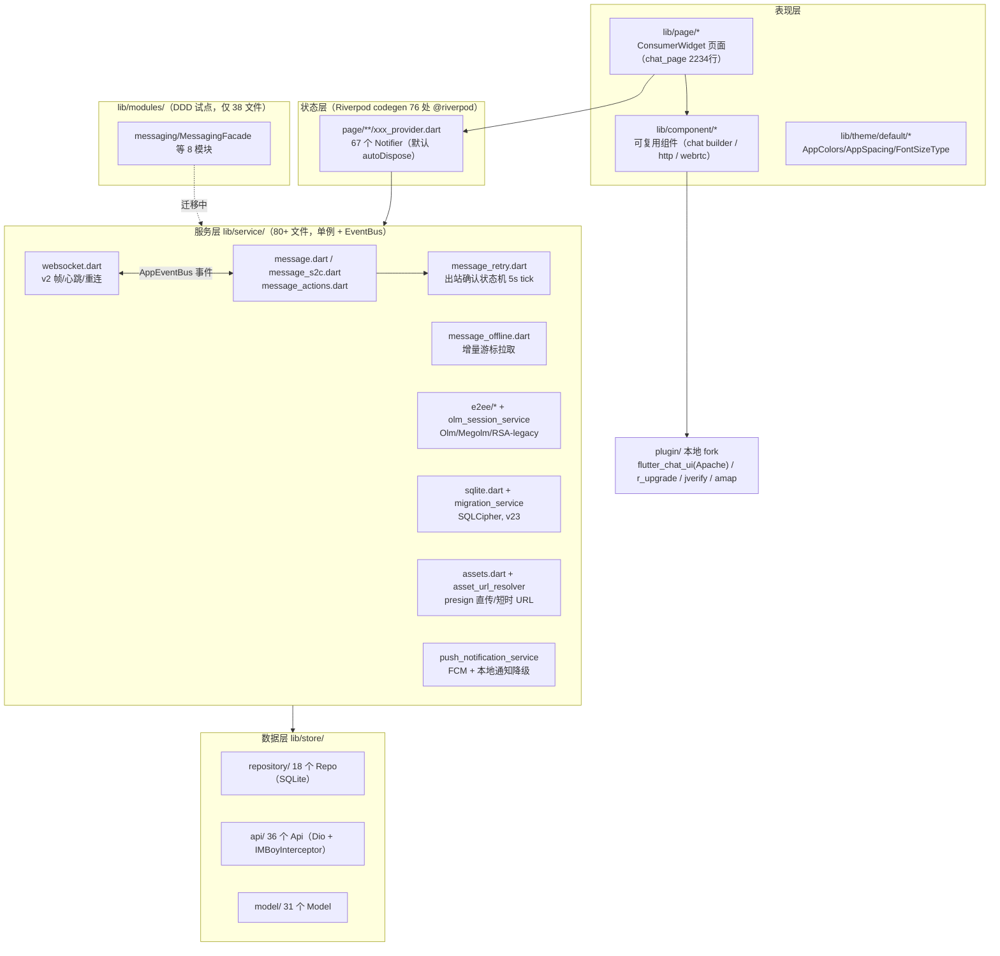
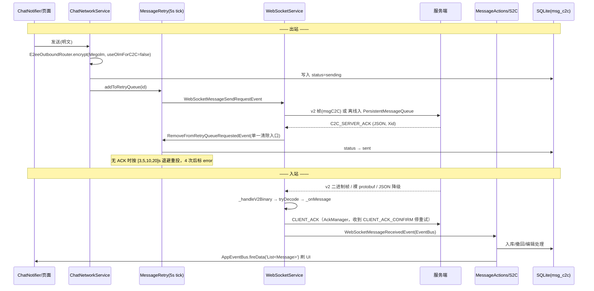

# imboyapp Flutter 客户端深度架构评审

> 评审日期：2026-07-22 | 评审对象：`imboyapp/`（Flutter 3.8+，flutter_riverpod 3.3.1，go_router 17，sqflite_sqlcipher，schema v23）
> 方法：Fact-based 只读评审，全部结论引用 `文件:行号`。代码基线：lib/ 共 794 个 dart 文件、约 23.7 万行（含 i18n 生成物约 5.2 万行）。

---

## 0. 客户端分层架构图

## 0.1 消息收发数据流

---

## 1. 整体架构与分层

**职责**：page（视图）→ provider（状态）→ service（业务/连接）→ store（Repo/Api/Model），另有 `lib/modules/` DDD 试点与 `lib/plugins/`、`lib/capabilities/` 插件契约层。

**设计现状**
- 分层清晰可辨，service 层通过 `AppEventBus`（`lib/service/event_bus.dart`）解耦：WebSocketService、MessageRetry、MessageService 互不直接引用（`websocket.dart:126-143`、`message_retry.dart:59-96`）。
- GetX 已 100% 清除（`grep "package:get/" lib` = 0），与 CLAUDE.md 声明一致。
- `lib/modules/` 8 个 DDD 模块合计仅 38 个 dart 文件，而实际业务重心仍在 `lib/page/` + `lib/service/`（如 `chat_provider.dart` 通过 `MessagingFacade.instance`（`chat_provider.dart:126`）桥接），是**双架构并存的迁移中间态**。

**优点**
- 事件总线单向解耦 + `EventSubscriptionManager` 统一订阅生命周期（`websocket.dart:43`、`message_retry.dart:17`）。
- 服务层文件普遍带高质量"事故注释"（如 `websocket.dart:561-565` ACK 帧契约、`message_retry.dart:269-272` TOCTOU/CAS），可维护性极好。

**问题**
1. **双状态体系**：核心运行时（WS/Retry/Message/Ack）是手写单例 + EventBus，不在 Riverpod 图内；UI 状态在 Riverpod。跨界靠 `AppEventBus.fireData([...], 'List<Message>')` 字符串标记事件（`message_retry.dart:446`），无类型安全，事件流向无法静态追踪。
2. **巨型文件违反自身规范**（CLAUDE.md "文件 < 800 行"）：`chat_page.dart` 2234 行、`message.dart` 1576 行、`message_repo_sqlite.dart` 1435 行、`message_s2c.dart` 1404 行、`websocket.dart` 1249 行、`chat_provider.dart` 1215 行等 10+ 个文件超标。
3. **文档漂移**：根 CLAUDE.md 声称 "SQLite schema v21"，实际 `sqlite.dart:41` 已是 `_dbVersion = 23`；`lib/service/CLAUDE.md` 仍写 "sqlite.dart (v9)"。

**风险等级：P2**（结构可用，但双架构与巨文件持续抬高变更成本）

---

## 2. 状态管理（Riverpod）

**现状**
- 76 处 `@riverpod/@Riverpod` 注解、67 个 codegen Notifier；仅 6 处遗留 `StateNotifierProvider/ChangeNotifierProvider`；显式 `keepAlive` 12 处（如 `group_list_provider.dart:44`、`active_conversation_notifier.dart:45`）。
- **关键事实：codegen `@riverpod` 默认即 autoDispose**。历史上已因此产生两个真 bug（QA#33 隐私设置"只 read 不 listen 数据丢失"、QA#21 "build() 覆盖 state"）。修复采用"注释+订阅持有"防御：`chat_input.dart:133`（"mentionNotifierProvider 是 autoDispose：必须持有订阅使其存活"）、`chat_input.dart:194`（"先建立订阅再加载，防止 autoDispose 在加载完成后立即销毁 state"）、`bind_mobile_provider.dart:82`。

**是否系统性问题？——是，但已从"未知陷阱"降级为"已知陷阱"**。67 个默认 autoDispose 的 Notifier 中，任何新增"页面 `ref.read` 触发异步加载"的代码仍会复现同款 bug；当前防线只有注释与开发者记忆，**没有 lint/custom_lint 规则做机制性拦截**。

**其他发现**
- `ChatNotifier` 是重量级命令式 Notifier：13+ 个实例字段（Timer×4、StreamSubscription×7、service×4，`chat_provider.dart:60-105`），`build()` 只返回 `const ChatState()`（`chat_provider.dart:156`），真实初始化靠页面调 `initChatService/loadMoreMessages`——本质是把旧 GetXController 平移进 Riverpod，`build()` 未承担声明式初始化职责。Riverpod 3.x 下 Notifier 随 rebuild 重建，`late final _audioHandler`（`chat_provider.dart:64,121`）不会二次赋值崩溃，但该模式对 rebuild 的鲁棒性完全依赖"该 provider 从不被 invalidate"这一隐式假设。
- 死表达式残留：`chat_provider.dart:240` `(_chatService?.messages.length ?? 0) > 0;`（无副作用语句，重构遗留）。

**风险等级：P1**（autoDispose 陷阱无机制防御，复发概率高）

---

## 3. 网络层（Dio / WebSocket / 出站确认状态机）

### 3.1 Dio + IMBoyInterceptor
- 公开存储/预签名请求跳过 JWT 注入的修复完整且带可测函数：`isPublicStorageRequest`（`http_interceptor.dart:17-20`）按 host 判定、`isPresignedRequest`（`:28-30`）按 `X-Amz-Signature` 判定，`onRequest` 双条件跳过（`:49-56`），注释完整记录 nginx→3900→Garage SigV4 400 的根因。**已知坑已根治并防回归**。

### 3.2 WebSocket 客户端（`lib/service/websocket.dart`）
- v2 子协议协商 + 回退（`:344-350`）；v2 二进制心跳 seq uint16 回绕（`:495-505`）；v1 文本 ping/pong + 20s pong 超时判死（`:507-533`）；指数退避无限重连 + 后台暂停省电（`:60-63`、`:994-999`）；连接竞态用 Completer 互斥（`:310-316`）；`_flushMessageQueue` 限速 + 失败即判僵尸连接主动重连（`:891-925`）；裸 protobuf/无帧头旁路兜底解析（`:650-682`）。整体质量高。
- **问题 A（脆弱契约）**：`_onMessage` 中 `action.endsWith('_ACK')` 过滤（`websocket.dart:774`）与 `_handleMessageAck` 的 action-ACK 清除（`:825`）都是**大小写敏感**匹配大写 `_ACK`，而真实动作名是小写 `message_revoke_ack/message_edit_ack`（`message_actions.dart:426,572`）。小写 ack 能到达 MessageActions 纯粹因为"大小写不匹配"，语义靠巧合成立：后端若规范化大写，撤回/编辑确认会在 WS 层被吞且不入任何处理器。
- **问题 B**：`_encodeV2BusinessFrame` 对每条出站消息做一次 `jsonDecode` 仅为提取 type（`:479-492`），高频路径重复解析（调用方已有结构化数据），属性能小疣。

### 3.3 出站确认状态机（`lib/service/message_retry.dart`）
- 单一状态机、5s 扫描节拍对齐 `RetryPolicy.messageSendRetryIntervals [3,5,10,20]s`（`:116-118`）；CAS 条件更新防状态覆盖（`:374-384`，注释引 QA#32 群消息卡"发送中"根因）；`_isScanning` 互斥防双扫描双发（`:47-49`）；启动扫描 DB 中 sending/pendingRetry/error 消息回填队列（`:148-217`）；与离线队列 B×D 去重（`websocket.dart:1094-1102 shouldEnqueueOffline`）。设计闭环完整。
- **问题**：重试队列纯内存（`:34`），App 被杀后依赖启动扫描重建，但扫描只看"每表最近 100 条"（`:178`）——高频用户的失败消息若被挤出前 100 条将永不重试（DB 状态停留 pendingRetry，无 UI 兜底提示路径经此扫描恢复）。

**风险等级：P1**（3.2-A 契约脆弱点 + 3.3 扫描窗口截断；主链路本身健壮）

---

## 4. 本地数据库（SQLCipher / 迁移 / 消息表）

**设计**：`sqlite.dart` 单例 + `synchronized` 双锁；DB 按 `${env}_${uid}.db` 分账号（`:137`），uid 漂移强制关旧重开防跨账号写入（`:93-101`，E2EE-015 纵深防御）；初始化失败 5s 冷却防刷屏（`:83-84`）；RETURNING 支持运行时探测（`:63-70`）。消息表 msg_c2c/c2g/c2s/s2c 四表 + FTS5 影子表 + 8 索引（`embedded_schema_scripts.dart:193-217,359-374`），conversation_uk3 维度索引齐全。

**问题**
1. **三镜像手工同步（已知坑，仍在役且已现漂移证据）**：DDL 同时存在于 `embedded_schema_scripts.dart`（权威，`:15,378,1712` 三个常量）与 `assets/migrations/{baseline_schema,upgrade,downgrade}.sql`（"人类可读参考副本"）。文件头 ponytail 注释（`embedded_schema_scripts.dart:12-16`）承认手工同步并给出"改动频繁再上生成脚本"的升级路径。但 CLAUDE.md 已落后两个版本（v21 vs v23），证明**同步纪律已经在失效**——镜像若漂移，排障者读参考副本会得出错误 schema 结论。
2. **降级脚本覆盖断层 + 静默成功**：升级脚本覆盖到 v23（`upgrade.sql:1330`、embedded 同步），降级脚本最高只到 v18→v17（`embedded_schema_scripts.dart` kDowngradeScriptSql 末块 `PRAGMA user_version = 17`；`downgrade.sql:322` 同）。而 `migration_service.dart:179-185` 对 `scripts.isEmpty` **返回 success**——从 v23 降级安装旧版 App 时，v19~v23 区间无脚本，迁移"成功"但 schema 仍是 v23 形状，旧代码随后按旧 schema 读写必然运行时报错，且无快照回滚触发。
3. **列类型声明与模型契约不符（QA#31 同类隐患）**：`msg_c2c.id INTEGER NOT NULL`（`embedded_schema_scripts.dart:195`），但 `MessageModel.id` 契约是 String Xid（CLAUDE.md 明文）。SQLite 类型亲和下非数字串会原样存 TEXT 而"碰巧工作"，但这正是 v22 迁移修复的 `user_collect.kind_id INTEGER→TEXT`（"String Xid 被归零致收藏坏死"，`sqlite.dart:37` 注释）的同款结构：声明与用途背离，靠亲和性侥幸。
4. `migration_service.dart:205-208` 全局忽略 "duplicate column" 错误——对幂等重跑友好，但会掩盖"版本号与实际 schema 脱节"这一类真问题（与问题 2 叠加时尤其危险）。

**风险等级：P1**（问题 2+3 属数据完整性隐患；问题 1 是持续性维护税）

---

## 5. E2EE 客户端

**设计**：协议插件化做得干净——`e2ee/e2ee_protocol.dart` 定义 `ProtocolSuite`/Registry，`olm_protocol.dart`(110 行)/`megolm_protocol.dart`(100 行)/`rsa_legacy_protocol.dart`(124 行) 各自实现，`E2eeOutboundRouter.encrypt` 统一补通用信封并校验 suite 一致（`e2ee_outbound_router.dart:19-27`）；`capability_negotiator.dart:81` 安全等级排序 `['olm','megolm','rsa-oaep']`。合计仅 2538 行，小而清晰。

**现状与风险**
1. **Olm C2C 发送侧被硬编码关闭**：`chat_network_service.dart:562` `static const bool useOlmForC2C = false`，注释明确"后端未部署前不读取此常量，不得把 claim 404 后的 Megolm 发送冒充 Olm PASS"（与后端 B.3 未 push 的阻塞一致）。当前 C2C 实际走 Megolm（`chat_network_service.dart:540-548`），RSA 仅 decrypt-only 读历史。**门控诚实，但"Olm-only cutover"尚未达成，发布叙事不得宣称 Olm 已启用**。
2. **AGPL 许可门（未解决）**：`imboyapp/pubspec.yaml:221-222` 依赖 `flutter_vodozemac: ^0.5.0` + `vodozemac: ^0.5.0`（AGPL-3.0），7 个源文件直接 import（`olm_session_service.dart`、`group_session_service.dart`、`e2ee/olm_protocol.dart` 等）。对"可售化/私有化交付"的商业模式，AGPL 传染性是**发布前必须裁决的法务闸门**（开源整个 App / 购买商业授权 / 更换绑定，三选一）。
3. 密钥备份走 Matrix 4S 路线（`e2ee_server_backup_service.dart`/`e2ee_local_backup_service.dart` 存在，设备信任事件 `trust_event_client.dart:174` 行接 `/e2ee/trust/record`），与后端 B.3.3 对齐。

**风险等级：P0（仅第 2 点，许可合规）；功能面 P2**

---

## 6. Push 推送

**设计**：`push_notification_service.dart` 仅 271 行：自动探测 Firebase 配置，FCM 初始化整体 15s 超时 + 异常降级本地通知（`:64-79`），token 获取单独超时（`:105-113`），前台消息手动展示本地通知（`:216` 起）。

**问题**：**推送通道单一依赖 FCM**。注释自认"Huawei/中国设备访问 Google FCM 可能无限等待"（`:64`）——即国内 Android 设备大概率降级为"仅本地通知"，**离线场景收不到任何推送**（无厂商通道：无华为/小米/OPPO/vivo push，pubspec 中 jverify 只做号码认证不做推送）。对以国内私有化部署为目标客群的 IM 产品，这是核心能力缺口，属产品级而非代码级问题。

**风险等级：P2**（代码正确；能力缺口需产品决策）

---

## 7. Storage / 附件 presign 直传

**设计**：三层职责清晰——
- `AssetsService.isObjectKey`（`assets.dart:102-106`）以 `u<digits>/` 前缀识别 object_key；`viewUrl` 同步层对 object_key 原样透传（`:157-162`），legacy 完整 URL 走 `v` 参数 3600s 时效判断 + 重签（`:163-185`）。
- `AssetUrlResolver`（`asset_url_resolver.dart`）把 presign 解析下沉到 async 下载边界：TTL 缓存 540s（600s 签发提前 60s 失效，`:45-46`）、并发合并 in-flight（`:76-82`）、`invalidate/clear` 钩子（`:122-128`）、fetcher/时钟双注入可测（`:52-57`）。
- 渲染纪律（`cachedImageProvider`/`Avatar`/`IMBoyCacheManager` 内置授权）在 CLAUDE.md 与 plugin fork 中落实（音/视频 builder 补 `validateImageData: false`，`imboyapp/plugin/flutter_chat_ui/packages/flyer_chat_audio_message/lib/src/flyer_chat_audio_message.dart:117-121`、`imboyapp/plugin/flutter_chat_ui/packages/flyer_chat_video_message/lib/src/flyer_chat_video_message.dart:84-88`——对应"大叉叉"真机事故的根修）。

**问题**：`viewUrlAsync`（`assets.dart:122-155`）与 `viewUrl`（`:157-205`）是近乎逐行重复的双实现（仅 authData 同步/异步之差），违反 DRY；且文件内残留大段注释掉的 debugPrint（`:180,191-197`）。"禁止直接使用裸 URL"仍是**约定防御**，没有 lint 拦截 `Image.network`/`CachedNetworkImage` 直用。

**风险等级：P2**

---

## 8. 消息同步 / 离线 / ACK / 撤回编辑链路

**设计**
- 离线拉取：`message_offline.dart` 带 `c2c_last_msg_at` 增量游标（`:41-53`，D4 修复）、in-flight 合并（`:54`）、分页节流（`:351`）、批量入库 `batchInsertOfflineMessages`（`:494`）、按批回 ACK（`:514`）；注释明确对齐服务端 msg_delivery 按设备送达语义（`:253`）。
- 入站收据：`AckManager` CLIENT_ACK + CONFIRM/ERROR 分流，ERROR 用 `ackRejected` 不记成功 RTT（`websocket.dart:847-858`）。
- 撤回链路：请求方发 `message_revoke` 并入重试队列（`message_actions.dart:834-859`）；接收方 `_processRevokeRequest` 落库+回 `message_revoke_ack`（`:390-440`）；请求方 `_processRevokeAck` 收 ack 后 `convertMessageToRevoked` + `fireData(['List<Message>'])` 刷 UI + 更新会话（`:330-388`）。**此前"ack UI 不更新"缺口在当前代码中已有完整闭环**（收 ack→改库→取回→fire UI 事件），残余风险移至第 3.2-A 的大小写契约脆弱点与后端部署状态。
- 编辑链路对称（`:443-533`），`edited_at/is_edited` 入 payload（`:510-512`）。

**问题**：撤回/编辑 ack 依赖**对端在线回 ack**（接收方处理后才回 `message_revoke_ack`，`message_actions.dart:417-440`）；对端长期离线时请求方重试 4 次即标 error——撤回是否最终生效取决于服务端离线撤回语义（后端曾有 revoke_offline_msg 崩溃史），客户端无"服务端已受理"的中间态展示。

**风险等级：P2**

---

## 9. 设计系统与 i18n

**现状**
- Token 体系完备：`lib/theme/default/` 下 app_colors/app_spacing/app_radius/app_shadows/app_sizes/app_breakpoints/font_types 全套（目录清单），AppColors 注释质量高（如 `app_colors.dart:38-39` 解释 overlayWhiteTransparent 与黑底透明的插值灰边差异）。
- **残留量化**：theme 外硬编码 `Colors.white/black/red/...` 仍有 **128 处**（top：`component/video/video_controller.dart` 10 处、`message_red_packet_builder.dart` 8 处、qrcode 三页 17 处）；`Color(0x...)` 直写 4 处；`fontSize: 数字` 12 处。token 化"最后一公里"未完成，且无 lint 禁止新增。
- i18n：slang 10 语言目录齐全（`assets/i18n/` ar-SA…zh-Hant），带 `_missing_translations.yaml/_unused_translations.yaml` 审计产物与自写 `i18n_audit.rb`（因 slang apply 在 namespaces 模式失效）。E2EE 错误消息已走 t.xxx（`chat_network_service.dart:571-583`）。

**风险等级：P3**（收敛中，无功能风险）

---

## 10. plugin/ fork 插件维护风险

| Fork | 许可 | 状态与风险 |
|---|---|---|
| `plugin/flutter_chat_ui`（flyer_chat workspace，8 个消息组件 path 依赖，`imboyapp/pubspec.yaml:271-286`） | Apache-2.0（LICENSE 首行） | **整个上游 workspace（含 examples）vendored 进主仓**；已带本地补丁（validateImageData ×2）。上游活跃演进，rebase 成本随时间累积；无补丁清单文档，补丁靠 commit 历史（`76fa983b/d4fdecca`）追溯 |
| `plugin/r_upgrade` | Apache-2.0 | 保留区禁改（CLAUDE.md），冻结即策略，风险可接受 |
| `plugin/jverify`（^3.1.7 override 到本地） | 商业 SDK 包装 | 极光认证，中国大陆专用；SDK 升级需手动搬运 |
| `plugin/amap_flutter_location_plus` | 高德 | 社区 fork 的 fork（`imboyapp/pubspec.yaml:138-141`），上游 `xiejeep/...` 单人维护，弃更风险最高 |

另：`imboyapp/pubspec.yaml:212-233,312-322` 记录了 riverpod/mockito/analyzer 的**版本 pin 连环锁**（mockito 已被迫移除）——codegen 工具链升级已进入"手工解扣"状态，Flutter 大版本升级时将集中爆发。

**风险等级：P2**

---

## 11. 问题汇总表

| # | 等级 | 模块 | 问题 | 证据 |
|---|------|------|------|------|
| 1 | **P0** | E2EE/法务 | flutter_vodozemac (AGPL-3.0) 与商业售卖冲突未裁决 | `imboyapp/pubspec.yaml:221-222`；7 文件 import |
| 2 | **P1** | 数据库 | 降级脚本止于 v18→17，`scripts.isEmpty` 返回 success → v23 降级"静默成功"但 schema 未降 | `embedded_schema_scripts.dart`(kDowngradeScriptSql 末块=17)、`migration_service.dart:179-185` |
| 3 | **P1** | 数据库 | msg_c2c.id 声明 INTEGER 实存 String Xid，QA#31（v22 kind_id 归零）同类隐患 | `embedded_schema_scripts.dart:195`、`sqlite.dart:37` |
| 4 | **P1** | 数据库 | DDL 三镜像手工同步已现漂移（CLAUDE.md v21 vs 代码 v23） | `embedded_schema_scripts.dart:12-16`、`sqlite.dart:41` |
| 5 | **P1** | 状态管理 | @riverpod 默认 autoDispose，历史两次真 bug，现仅注释防御无 lint 门禁 | `chat_input.dart:133,194`、`bind_mobile_provider.dart:82` |
| 6 | **P1** | 网络 | `action.endsWith('_ACK')` 大小写敏感过滤，撤回/编辑 ack 到达处理器靠大小写巧合 | `websocket.dart:774,825` vs `message_actions.dart:426,572` |
| 7 | **P1** | 出站确认 | 启动重试扫描仅每表前 100 条，溢出者永不重试 | `message_retry.dart:178` |
| 8 | P2 | 架构 | EventBus 单例体系与 Riverpod 双状态体系并存，字符串标记事件无类型安全 | `message_retry.dart:446` |
| 9 | P2 | 架构 | 10+ 文件超自定 800 行红线（chat_page 2234） | wc -l 实测 |
| 10 | P2 | E2EE | Olm C2C 发送侧硬编码关闭，cutover 未达成 | `chat_network_service.dart:562` |
| 11 | P2 | Push | 推送单通道 FCM，国内设备降级后无离线推送 | `push_notification_service.dart:64-79` |
| 12 | P2 | Storage | viewUrl/viewUrlAsync 双实现重复；裸 URL 禁令无 lint | `assets.dart:122-205` |
| 13 | P2 | 消息链路 | 撤回/编辑确认依赖对端在线回 ack，离线场景无中间态 | `message_actions.dart:390-440` |
| 14 | P2 | 插件 | flutter_chat_ui 整 workspace vendored、amap fork 弃更风险、codegen 版本连环 pin | `imboyapp/pubspec.yaml:138-141,212-233,271-286` |
| 15 | P2 | 迁移 | duplicate column 错误全局吞掉，可掩盖版本/Schema 脱节 | `migration_service.dart:205-208` |
| 16 | P3 | 设计系统 | theme 外硬编码颜色 128 处 + fontSize 12 处，token 化未收口 | grep 实测 |
| 17 | P3 | 代码卫生 | 死表达式 `(...length ?? 0) > 0;`；出站帧重复 jsonDecode | `chat_provider.dart:240`、`websocket.dart:479-492` |

## 12. 三条最重要的架构级建议

1. **把"约定防御"升级为"机制防御"**（针对 #5/#6/#12/#16）：引入 custom_lint 规则集——禁止裸 `Image.network`、强制 keepAlive 显式声明、禁止 theme 外 `Colors.*`。这个代码库最大的系统性风险不是某个 bug，而是"每条铁律都只写在注释和 CLAUDE.md 里"。
2. **消灭 DDL 三镜像**（#2/#3/#4）：以 embedded 常量为唯一真源，写一个 dart 脚本从常量生成 .sql 参考副本并在 CI diff 校验；同时为 v19~v23 补齐降级脚本或让 `migrate()` 对无脚本降级**显式失败**而非返回 success。
3. **裁决 AGPL 与 Push 通道两个产品级闸门**（#1/#11）：均非代码问题，但都会在"私有化售卖"这一步一票否决；应在下一个发布里程碑前完成决策，而非继续技术推进。
