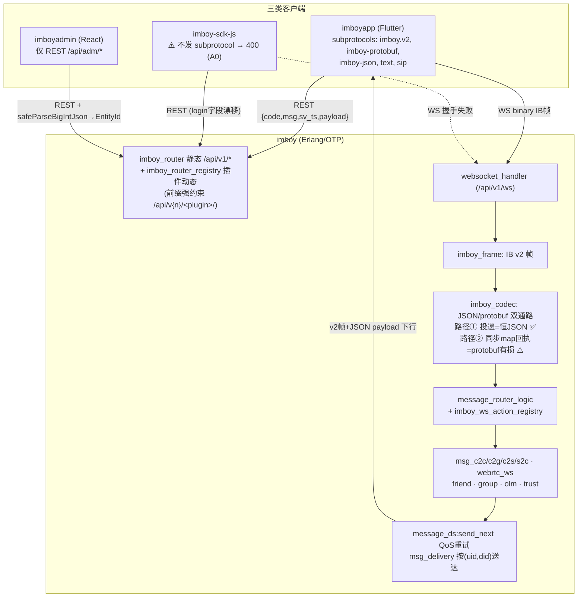
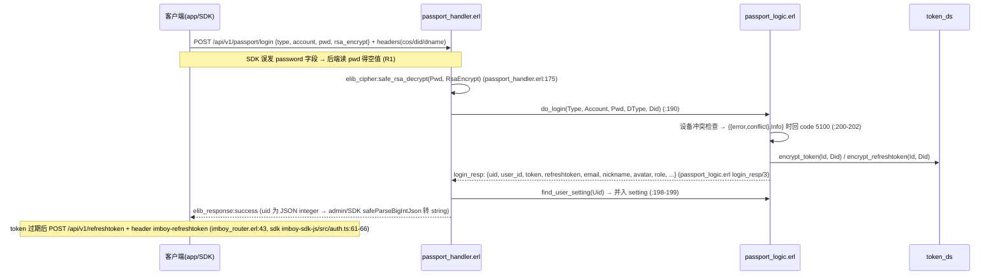
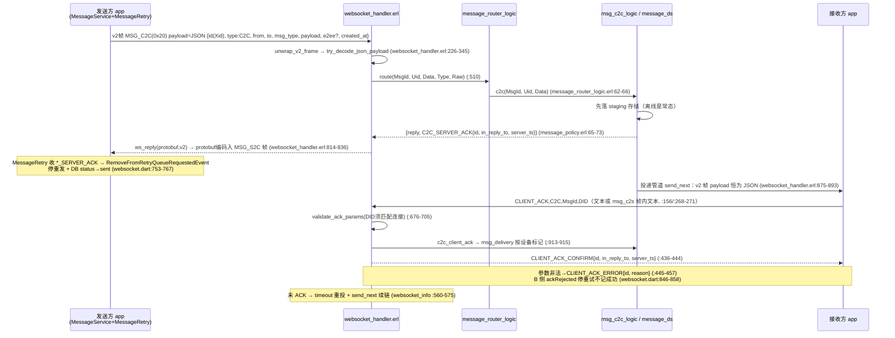
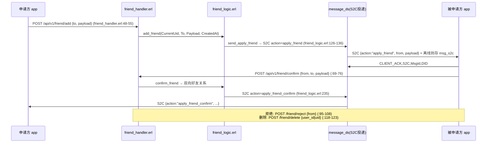
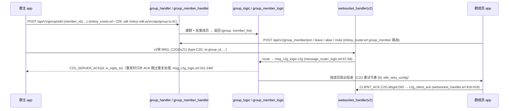
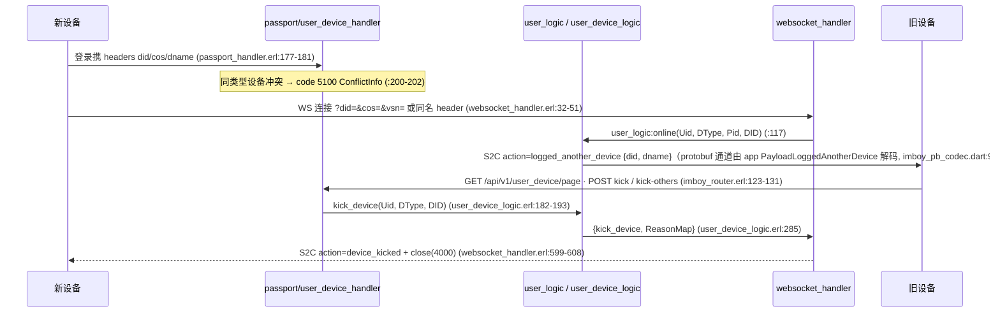
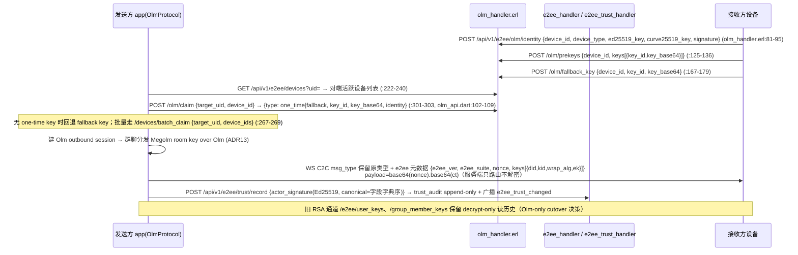

# IMBoy 三仓协议契约端到端评审 / Protocol Contract Review

> **评审日期**: 2026-07-22（第二轮核验合并：修正 2 处事实错误、增补 9 项发现，见 §8 增补行与 §4/§5 修订注）
> **方法**: Fact-based 只读评审，全部结论引用 `文件:行号`
> **范围**: imboy（Erlang 后端）· imboyapp（Flutter）· imboyadmin（React）· imboy-sdk-js（TS SDK）
> **重点**: 同一契约在三端定义是否对齐（REST / WebSocket v2 帧 / protobuf / 消息类型枚举 / ACK 语义 / TSID）

---

## 0. 总体结论

| 协议域 | 一致性评级 | 摘要 |
|--------|-----------|------|
| WS v2 二进制帧 | ★★★★☆ | 三端字节级对齐（magic/ver/flags/type/len），版本守护三端一致；app 独有 0x28 帧类型后端不识别 |
| protobuf 同源性 | ★★☆☆☆ | 后端 `proto/imboy.proto` 与 `src/imboy.proto` 一致，但 **app 生成物含 proto 中不存在的枚举值**（C2CH 系）；SDK 完全不走 protobuf |
| ACK 语义 | ★★★☆☆ | CLIENT_ACK/CONFIRM/ERROR 闭环完整；但 **C2S_SERVER_ACK 与 C2G_ERROR 在 protobuf 通道丢 type/丢字段**（WEBRTC 同类问题已修，C2S/C2G_ERROR 未修）；SDK WS 无法握手且确认语义张冠李戴 |
| REST 契约 | ★★★☆☆ | app↔后端高度对齐；**SDK 多处字段名/端点漂移**（login `password` vs `pwd`、quick_login 参数、e2ee 已删端点）；**默认 `ws_url` 配置指向已不存在的 `/ws` 路由**；OpenAPI 仅覆盖 ~130/278 路由 |
| 消息类型枚举 | ★★★☆☆ | C2C/C2G/C2S/S2C 三端一致；C2CH 系为 app 单侧幻影契约 |
| TSID 传输 | ★★★★★ | 后端 JSON integer → Dart 原生 int64 / admin+SDK `safeParseBigIntJson`→string，策略一致且实现同构 |

---

## 0b. 协议总览图 / Protocol Diagram

---

## 1. WebSocket v2 帧协议（framing 层）

### 职责与设计
9 字节定长头 `[Magic:2=0x4942][Ver:1=2][Flags:1][Type:1][Len:4 BE]` + 变长 payload。三处实现：

- 后端: `imboy/src/lib/imboy_frame.erl` + `imboy/include/imboy_frame.hrl`
- Flutter: `imboyapp/lib/service/protocol/imboy_frame.dart`
- SDK: `imboy-sdk-js/src/protocol/imboy-frame.ts`

子协议协商: `imboy.v2` → protobuf+v2 framing；`imboy-protobuf` → protobuf 裸帧；其余 → JSON（`imboy_codec.erl:172-183`）。App 按优先级请求 `['imboy.v2','imboy-protobuf','imboy-json','text','sip']`（`websocket.dart:343-350`）。

### 优点
- **版本守护三端一致**：Ver≠2 直接拒收——`imboy_frame.erl:130-133`（`{error, unsupported_version}`）、`imboy_frame.dart:203-205`、`imboy-frame.ts:167-169`，防止 v3 帧被按 v2 误解析。
- **T14 ERROR 帧已落地**：解帧失败/未知帧类型不再静默丢弃，回 `FRAME_TYPE_ERROR(0x06)` UTF-8 reason（`websocket_handler.erl:233-237`、`290-294`；`imboy_frame.erl:259-263`）。
- ACK 方向编码进 flags bit4-3，修复了历史上硬编码 C2C 导致 C2G/S2C 走错清理路径的 bug（`imboy_frame.hrl:36-47`、`imboy_frame.dart:30-53`、`imboy-frame.ts:49-74` 三端对齐）。
- Flags 位定义（CMP/ENC/ACK/DIR/PRI）三端逐位一致。

### 问题

| # | 问题 | 证据 | 等级 |
|---|------|------|------|
| W1 | **app 独有帧类型 `msgC2CH=0x28`**，后端 `imboy_frame.hrl:66-73`（0x20-0x27）与 SDK `imboy-frame.ts:36-43` 均无此值。app 若以 type=C2CH 发送（`websocket.dart:465-471` 的 `_msgTypeMap` 已挂接），后端 `dispatch_v2_frame` catch-all 回 `unsupported_frame_type:40` ERROR 帧（`websocket_handler.erl:290-294`） | `imboy_frame.dart:79` | P2 |
| W2 | 后端 JSON 路由层对未知 `type`（如 C2CH）**静默 `ok` 丢弃**，与 T14 "不静默丢弃" 方针自相矛盾 | `message_router_logic.erl:85-89` | P3 |

---

## 2. Protobuf 同源性（三端是否同一 .proto）

### 事实链
1. 后端权威 proto：`imboy/proto/imboy.proto`（360 行）；`imboy/src/imboy.proto` 与其**逐字节相同**（diff 为空，实测 2026-07-22）。后端生成物 `imboy/src/imboy_pb.erl` 的 `MsgDirection` = `{UNSPECIFIED,C2C=1,C2G=2,C2S=3,S2C=4,WEBRTC_*=10..13,C2C_SERVER_ACK=20,C2G_SERVER_ACK=21,CLIENT_ACK=22,CLIENT_ACK_CONFIRM=23}`（`imboy_pb.erl:54`），与 proto 一致。
2. App 生成脚本 `imboyapp/scripts/regen_protobuf.sh:8` 指向 `../imboy/src/imboy.proto`。
3. **但 app 已提交的生成物与该 proto 不一致**：`imboyapp/lib/service/protocol/imboy.pbenum.dart` 含 `C2CH=5`（:30）、`C2CH_SERVER_ACK=24`（:53-54）、`S2CAction.C2CH_DEL_EVERYONE=14`（:151-152）——这三个值在 `proto/imboy.proto` 的 `MsgDirection`（:76-96）与 `S2CAction`（:103-121）中**均不存在**。即 app 生成物来自一个已分叉/未提交的 proto 版本，与后端生成物不同源。
4. SDK 不使用 protobuf（`imboy-sdk-js/CLAUDE.md`: 无运行时依赖），仅 JSON + v2 帧。

### 风险
- proto 中值 5、14、24 目前空缺；若后端未来把这些值分配给**别的语义**，app 旧生成物会把新枚举值解读成 C2CH 系 → 静默语义错位（枚举冲突是 protobuf 最难排查的一类事故）。
- `proto/imboy.proto` 与 `src/imboy.proto` 双份拷贝虽当前一致，但无 CI 校验强制同步，属漂移温床。

| # | 问题 | 证据 | 等级 |
|---|------|------|------|
| P1 | app protobuf 生成物含 proto 中不存在的枚举值（C2CH=5 / C2CH_SERVER_ACK=24 / C2CH_DEL_EVERYONE=14），三端不同源 | `imboy.pbenum.dart:30,53,151` vs `proto/imboy.proto:76-121` | P2 |
| P2 | 仓内 proto 双拷贝（`proto/` 与 `src/`）无一致性门禁 | 两文件路径 | P3 |

---

## 3. IMBoyMessage 编解码与 in_reply_to（T14/T15）

### 已证实的已知问题（复核确认仍存在）
**`to_pb_map` 丢弃 `in_reply_to`**：`imboy_codec.erl:214-228` 的字段白名单只有 id/type/from/to/msg_type/action/e2ee/payload/created_at/server_ts/expire_secs/conv_seq；proto `IMBoyMessage`（`proto/imboy.proto:28-68`）也**没有 in_reply_to 字段**。后端 T15 在 JSON 错误帧/确认帧中注入 `in_reply_to`（`websocket_handler.erl:367,439,451,664-668`；`msg_c2s_logic.erl:200-213`；`webrtc_ws_logic.erl:50-55`），但凡走 `ws_reply(protobuf, ...)` 同步回复路径（`websocket_handler.erl:814-818`）该字段即被剥掉。

**缓解现状**：app 关联 ACK 用的是 `id` 字段（后端 CONFIRM/ERROR 均回显 `id=MsgId`，且 app 有多字段名兜底提取 `websocket.dart:726-744`），所以 in_reply_to 丢失目前**未造成功能性断裂**——它是"契约声明了但 protobuf 通道兑现不了"的规范性缺口。

### 新发现：C2S_SERVER_ACK 在 v2/protobuf 通道丢 type（P1）
- `msg_c2s_logic.erl:198-213`：C2S 消息落库后以 **map** 形式 `self() ! {reply, #{<<"type">> => <<"C2S_SERVER_ACK">>, ...}}` 回执。
- `websocket_handler.erl:541-544`：map 形式的 reply 走 `ws_reply(Protocol, Framing, Msg)`；v2 连接 protocol=protobuf → `imboy_codec:encode(protobuf, ...)`。
- `imboy_codec.erl:255-268` 的 `msg_direction_to_enum/1` **没有 `C2S_SERVER_ACK` 分支**（proto 枚举也无此值），落入 catch-all → `'MSG_DIRECTION_UNSPECIFIED'`。
- App 侧 `websocket.dart:758` 用 `messageType.endsWith('_SERVER_ACK')` 判定回执、`imboyapp/lib/service/message.dart:356` 分发 `_receiveServerAck` —— type 变成 `MSG_DIRECTION_UNSPECIFIED` 后两处均不命中 → **C2S 出站消息（收藏备份等）在 imboy.v2 连接上永远收不到回执 → MessageRetry 按 [3,5,10,20]s 重发 4 次到上限**。
- **同类问题 WEBRTC_SERVER_ACK 已修**：`webrtc_ws_logic.erl:44-56` 显式改为 `self() ! {reply, jsone:encode(Ack)}`（JSON 预编码走 `encode_delivery_frame_v2`，`websocket_handler.erl:875-893` 保证 v2 帧 payload 恒为 JSON），注释明说"不能 {reply, Map}——该路径对 protobuf 客户端走枚举编码会丢 type"。**C2S 路径未同步此修复**。修法与 webrtc 完全一致（一行 `jsone:encode`），或给枚举补值+codec 分支。

### 新发现：C2G_ERROR 在 v2/protobuf 通道整条语义蒸发（P1，第二轮核验增补）
群聊四条拒绝分支——消息限流（`msg_c2g_logic.erl:68-75`）、被禁言（:86-93）、@all 无管理员权限（:112-120）、非群成员（:128-135）——均以 map 形式回 `{reply, #{<<"type">> => <<"C2G_ERROR">>, <<"error">> => ..., <<"code">> => ...}}`：

- `C2G_ERROR` 不在 `MsgDirection` 枚举与 `msg_direction_to_enum`（`imboy_codec.erl:255-268`）→ type 归零为 `MSG_DIRECTION_UNSPECIFIED`；
- `error`/`code` 不在 `to_pb_map` 白名单（`imboy_codec.erl:214-228`）→ **字段直接丢弃**。

结果：v2 客户端只收到一个空壳 UNSPECIFIED 帧——被禁言/非成员用户发群消息表现为"永远发送中 → 重试 4 次 → 误标失败"，**无任何失败原因提示**。比 C2S_SERVER_ACK 更重：不仅丢 type，连错误载荷也蒸发。修法同 webrtc 先例（JSON 预编码），或与 §3 根因一并收敛（见 §9 观察 1）。

### v2 帧 payload 的"JSON 恒定"约定
投递管道（离线/重试/异步推送）在 v2 连接上**刻意**不用 protobuf 而恒用 JSON payload（`websocket_handler.erl:875-893`，理由：protobuf-dart 把 bytes payload 暴露成 base64 导致 E2EE `ciphertext.split('.')` 解析失败）。而**同步回复**（route 返回 `{reply, Map}`）仍走 protobuf 编码（`websocket_handler.erl:814-818`）。同一连接上两条下行路径编码策略不同——app 靠 `ImboyPbCodec.tryDecode` + JSON fallback 双路解码兜住（`imboy_pb_codec.dart:16-36`），能跑但增加了排障复杂度，也正是 C2S_SERVER_ACK 问题只出现在同步路径的原因。

---

## 4. ACK 语义与消息类型枚举

### 三端 ACK 矩阵

| ACK 形态 | 后端 | imboyapp | imboy-sdk-js |
|----------|------|----------|--------------|
| 文本 `CLIENT_ACK,{Type},{MsgId},{DID}` | `websocket_handler.erl:156-157,353-398` | AckManager 经 `websocket.dart` | `websocket.ts:201-204 sendTextAck` ✅ |
| v2 0x03 二进制 ACK（8B uint64 + DIR flags） | `websocket_handler.erl:247-264` | `imboy_frame.dart:288-294`（仅数字 msgId 场景） | `imboy-frame.ts:212-223` 有实现，但见 A1 |
| CLIENT_ACK_CONFIRM / CLIENT_ACK_ERROR（JSON，含 id+in_reply_to） | `websocket_handler.erl:363-397` | `websocket.dart:823-860`（CONFIRM→ackConfirmed；ERROR→ackRejected） | `websocket.ts:253-256`（仅 CONFIRM，**无 ERROR 分支**） |
| `C2C/C2G_SERVER_ACK` | `message_policy.erl:65-73` / `msg_c2g_logic.erl:331-348`（枚举内，type 保全） | `imboyapp/lib/service/message.dart:356 _receiveServerAck` ✅ | 靠上层 `message` 事件自理 |
| `C2S_SERVER_ACK` | `msg_c2s_logic.erl:200-213` — **protobuf 通道丢 type（见 §3）** | 期待 `_SERVER_ACK` 后缀，收不到 | — |
| `WEBRTC_SERVER_ACK` | `webrtc_ws_logic.erl:44-56` JSON 预编码 ✅ | `imboyapp/lib/service/message.dart:348-354` ✅ | — |
| `C2CH_SERVER_ACK` | **后端不存在**（grep 全仓无产出点） | `imboyapp/lib/service/message.dart:1163-1182` 有完整处理分支 | — |
| 重试节奏 | 服务端投递重试 `elib_retry_config.erl` | `retry_policy.dart` 发消息 [3,5,10,20]s | `websocket.ts:35` `ACK_RETRY_INTERVALS_MS=[3,5,10,20]s` ✅ 两端一致 |

### 送达语义补充（第二轮核验增补）

- **按设备送达（T03/P0-1）**：C2C/S2C 的 CLIENT_ACK 按 `(uid, did)` 标记 `msg_delivery`，全部活跃设备确认后才删主行（`msg_ack_logic.erl:24-32`）；**C2G 仍是 per-uid timeline 标记**（`msg_ack_logic.erl:31`，代码注释自认"V7 多端未读串扰另行立项"）→ 群聊多端场景一端 ACK 即视为该用户已送达，另一端离线重连依赖 sync 游标兜底（P2）。
- **staging 生命周期纪律正确**：ACK 路径不提前 unstage，防"接收方 ACK 快于 worker 落库 → 群消息永不落正式表"（`msg_ack_logic.erl:45-49` 注释完整记录了事故模式）。
- **服务端重试续链**：定时器在设备 WS 进程内 fire，续链用白名单 `[DID]+true` 只针对当前设备（`websocket_handler.erl:555-575`），修复过单设备重试链首跳断裂 bug。

### SDK 专属问题（第二轮核验修订：A0/A4 增补，A1/A2 事实修正）

| # | 问题 | 证据 | 等级 |
|---|------|------|------|
| A0 | **SDK WS 根本无法握手**：`connect()` 不带任何子协议（`new WebSocket(url)`，`websocket.ts:143`），而后端对缺失 `Sec-WebSocket-Protocol` 头**直接回 HTTP 400**（`websocket_ds.erl:28-31` `check_subprotocols(undefined, ...)`），连接永远升级不了。SDK 的全部 WS 功能（心跳/重连/ACK/事件）当前对着真实后端都跑不起来 | `websocket.ts:143` vs `websocket_ds.erl:28-31` | **P1** |
| A1 | SDK `sendBinaryAck` 是死信（A0 修复后仍然成立的潜伏缺陷）：发送裸 8 字节 buffer（无 IB 帧头）；若未来以 JSON 子协议连上，`handle_legacy_binary` 对 JSON 协议的 binary 帧直接忽略（`websocket_handler.erl:216-219`）；若以 imboy.v2 连上，无帧头字节 `unwrap_v2_frame` 报 bad_magic 回 ERROR 帧。SDK 自己的 `ImboyFrame.ack()`（`imboy-frame.ts:212`）从未被 `sendBinaryAck` 调用。另外 Xid 字符串 id 会使 `BigInt(msgId)` 直接抛异常（`websocket.ts:211`） | `websocket.ts:210-218` | P1 |
| A2 | **（事实修正）** SDK 监听 `action === 'token_refresh_required'`（`websocket.ts:258-261`）——该 action 后端不存在；但**原评审所称的正名 `please_refresh_token` 在后端同样没有任何发送方**（全仓仅剩 `message_ds.erl:167` 注释与 proto 枚举 `proto/imboy.proto:109`，无产出代码）。现役 token 过期语义是：WS 握手对过期 token **直接 401 + `x-token-error: expired` 拒绝**（`websocket_ds.erl:83-97`），刷新只走 HTTP `POST /api/v1/refreshtoken`（`passport_handler.erl:250-253`；app 侧互斥刷新 `http_client.dart:223-242`）。因此这不只是 SDK 改名能修的问题：`imboy/CLAUDE.md` 宣称的 "WS token 过期仍响应成功 → S2C 8s 内刷新" 流程已整体死亡（文档漂移），app 侧 `message_s2c.dart:265,697` 与 `imboy_pb_codec.dart:99-101` 也是死处理器 | `websocket.ts:258`、`websocket_ds.erl:83-97`、全仓 grep 无发送方 | P1（SDK 死事件）+ P2（三处死契约/文档漂移） |
| A3 | SDK 无 `CLIENT_ACK_ERROR` 分支：收据被服务端拒绝时无停止重试/上报路径（app 侧有 ackRejected 语义，`websocket.dart:846-858`） | `websocket.ts:240-269` | P2 |
| A4 | **SDK 出站确认语义张冠李戴**：`sendWithAck` 发业务消息后等待 `CLIENT_ACK_CONFIRM`（`websocket.ts:177-183` 注释自述 + `:253` 唯一清除分支），但后端对业务消息的确认是 `*_SERVER_ACK`（C2C：`message_policy.erl:70-76`；C2G：`msg_c2g_logic.erl:331-351`）；`CLIENT_ACK_CONFIRM` 只确认入站 CLIENT_ACK 收据（`websocket_handler.erl:436-444`）。即使 A0 修复，SDK 每条业务消息也会按 [3,5,10,20]s 重发满 4 次并报超时（后端 staging 幂等兜底不重复投递，但纯浪费且 SDK 端永远"发送失败"） | `websocket.ts:177-183,253` vs `message_policy.erl:70-76` | **P1** |

### 消息方向枚举三端总表

| 值 | proto/后端 | app 生成物 | SDK(JSON 字符串) | 一致? |
|----|-----------|-----------|------------------|-------|
| C2C/C2G/C2S/S2C = 1/2/3/4 | ✅ | ✅ | ✅（字符串） | ✅ |
| C2CH = 5 | ✗ 无 | ✅ 有 | ✗ | ❌ app 单侧 |
| WEBRTC_* = 10-13 | ✅ | ✅ | 字符串 `webrtc_*`（小写，`imboy_codec.erl:263-266` 做映射） | ✅ |
| C2C/C2G_SERVER_ACK = 20/21 | ✅ | ✅ | 字符串 | ✅ |
| CLIENT_ACK/CONFIRM = 22/23 | ✅ | ✅ | 字符串 | ✅ |
| C2CH_SERVER_ACK = 24 | ✗ 无 | ✅ 有 | ✗ | ❌ app 单侧 |
| C2S_SERVER_ACK / WEBRTC_SERVER_ACK | **仅 JSON 字符串存在，无枚举值** | 依赖 JSON 通道 | — | ⚠️ 见 §3 |

ContentType（TEXT..E2EE = 1..8）三端一致（`proto/imboy.proto:98-108` / `imboy.pbenum.dart:82-100` / `imboy_codec.erl:286-305`）。JSON-only 内容类型 `agent_task`/`a2a_task_update`/`stream_delta` 刻意不进 proto（`imboy_codec.erl:307-316`），app 侧同样在最入口短路（`imboyapp/lib/service/message.dart:334-346`），契约对齐。

---

## 5. REST 契约

### 5.1 app ↔ 后端：整体对齐
- 登录：app 发 `pwd`/`rsa_encrypt`/`type`（`passport_notifier.dart:436,443,471-472`）↔ 后端 `passport_handler.erl:169-181` 读同名字段 ✅
- 好友：`/api/v1/friend/{add,confirm,reject,delete,list,move,...}`（`imboy_router.erl:201-216`）↔ `friend_handler.erl` 兼容 `user_id`/`uid` 双名（:118-123） ✅
- Olm E2EE：app `olm_api.dart` 的 `device_id/ed25519_key/curve25519_key/signature/keys/key_id/key_base64/target_uid` 与 `olm_handler.erl:81-179,267-303` 逐字段一致 ✅

### 5.2 SDK ↔ 后端：多处漂移

| # | 问题 | 证据 | 等级 |
|---|------|------|------|
| R1 | **SDK login 发 `password`，后端只读 `pwd`**（`maps:get(<<"pwd">>, ...)` 默认空）→ 空密码进 `safe_rsa_decrypt`，登录必败。且 SDK 不传 `rsa_encrypt`，后端默认 `?RSA_ENCRYPT_YES`（`<<"1">>`，`imboy_const.hrl:130`）会把明文密码当 RSA 密文解密 | `passport.ts:9-13,53-55` vs `passport_handler.erl:170-175` | **P1** |
| R2 | **SDK quickLogin 发 `{mobile, code}`，后端 quick_login 期待 `{service, operator, token}`**（jverify 运营商一键登录语义）→ service 为空直接回"未指定登录服务" | `passport.ts:38-43,60-63` vs `passport_handler.erl:214-229`、`passport_logic.erl:41-43` | **P1** |
| R3 | **SDK e2ee 引用已删除端点**：`/api/v1/e2ee/transfer/create`、`/transfer/accept`、`/social/decrypt_shard`（`e2ee.ts:52,68,84`）在 `imboy_router.erl` 中已不存在（E2EE 托管统一 Matrix-4S 后删除，路由仅剩 `:137-164` 所列）→ 调用即 404 | `e2ee.ts:52-84` vs `imboy_router.erl:137-164` | **P1** |
| R4 | SDK friend/group/message/user 端点抽查（friend list/add/confirm/delete/move、group add/edit/dissolve/member、msg offline/pin/forward/reaction/history/read_stats、conversation online/mine/delete）与路由表逐条对上 | `friend.ts` `group.ts` `message.ts` vs `imboy_router.erl:84-105,201-263` | ✅ |

### 5.2b 配置与契约文档面（第二轮核验增补）

| # | 问题 | 证据 | 等级 |
|---|------|------|------|
| R5 | **默认 `ws_url` 指向不存在的 `/ws` 路由**：`config/sys.config:51` 为 `wss://dev.imboy.pub/ws`，`imboy_env.erl:14` 的 IMBOY_WS_URL 示例同为 `/ws`，但 router 全表**没有** `/ws` 或 `/api/ws` 路由（唯一 WS 路由是 `/api/v1/ws`，`imboy_router.erl:80`）。客户端会缓存服务端 init 下发的 wsUrl（`index_handler.erl:54`、`imboyapp/lib/config/init.dart:479-488`、`imboyapp/lib/config/env.dart:84-103`）→ 任何未显式设置 IMBOY_WS_URL 的部署会给客户端下发 404 的 WS 地址 | `sys.config:51` vs `imboy_router.erl:80` | **P1** |
| R6 | **OpenAPI 覆盖率仅 ~47%**：`api/openapi.yaml` info.description 自述 "router 278 条 /api/v1/* 路由为权威，本文件当前覆盖约 130 条，其余 148 条待补全"——契约文件不能作为完整对账基线；lint 门禁 `.redocly.lint-ignore.yaml` 已就位但只保证已写部分的质量 | `api/openapi.yaml` 头部 | P2 |
| R7 | 路由前缀治理现状良好：静态路由收口 `/api/v1/*`（白名单例外见 `src/api/CLAUDE.md`）；插件动态路由强约束 `/api/v{n}/<plugin>/` 前缀、违者拒注册并热重载合并 dispatch（`imboy_router_registry.erl:19-20,66-70,107-122`）——历史"注册表与全站不一致"风险已被前缀门禁收敛 | 同左 | ✅ |

### 5.3 admin ↔ 后端
admin 走独立面 `/api/adm/*`（`imboyadmin/src/services/api/client.ts:6`），不与 app/SDK 共用 `/api/v1` 契约；TSID 经 axios `transformResponse` 注册的 `safeParseBigIntJson` 统一转 string（见 §6）。本轮抽查未发现 admin 面契约漂移（历史 6 位微秒时间戳问题已修，见项目记忆）。

---

## 6. TSID 传输契约

**契约**: 后端以 JSON integer 传 64-bit TSID（`elib_tsid`，`[sign:1][ts:42][node:10][seq:11]`，ID 直接以 integer 返回，`src/lib/CLAUDE.md`）。

| 端 | 策略 | 证据 | 评价 |
|----|------|------|------|
| imboy 后端 | 生成+以 integer 下发；WS protobuf 入站 `from/to` integer→binary 归一化 | `websocket_handler.erl:897-909` | 权威源 |
| imboyapp | Dart int 原生 64-bit，无精度问题；WS v2 契约 `from/to` 为 String TSID（`service/CLAUDE.md`）；`MessageModel.id` 是 Xid string 不是 TSID | — | ✅ |
| imboyadmin | `safeParseBigIntJson.ts:19-22` 正则把 ≥16 位整数加引号后 `JSON.parse`，类型层 `EntityId = string` | `lib/safeParseBigIntJson.ts:10-25` | ✅（TSID 以 2025 纪元起算最小 ≈17 位，16 位阈值安全） |
| imboy-sdk-js | 同款正则实现（"与 imboyadmin 行为一致"），`HttpClient` 文本读取后统一走它 | `imboy-sdk-js/src/client.ts:42-58,156-158` | ✅ |

**结论**: 四处一致，且 admin/SDK 用的是同构实现，是全项目契约治理最好的一块。
**小缺口（P3）**: 两份 `safeParseBigIntJson` 是复制品而非共享包，正则修 bug 时需双改（如未来需处理字符串内含 16 位数字的边界）。
**增补缺口（P2，第二轮核验）**: "Dart int 原生 64-bit 无精度问题"只对移动/桌面端成立——**Flutter Web 构建（`kIsWeb` 路径真实存在且被维护，`websocket.dart:352-357`；仓内有 `scripts/verify_web_shell.sh`）中 Dart int 就是 JS double**，HTTP JSON 直接 `jsonDecode` 的 TSID 在 >2^53 时丢精度，imboyapp 仓内没有 `safeParseBigIntJson` 等价的解析层。若 Web 端是发布目标，需在 HTTP 解析层补同款防护。

---

## 7. 协议序列图（基于真实代码）

### 7.1 登录流 Login

### 7.2 消息收发流 Message（含 ACK，imboy.v2 连接）

### 7.3 好友流 Friend

### 7.4 群流 Group

### 7.5 设备流 Device

### 7.6 E2EE 密钥协商流（Olm 主线）

**增补（第二轮核验，P2→发布前应处理）**：proto 的 `E2EEMeta`/`E2EEDeviceKey` 仍是 RSA 时代字段集 `{ver, suite, nonce, keys[{did, kid, wrap_alg, ek}]}`（`proto/imboy.proto:128-155`；`imboy_codec.erl:336-377` 的 e2ee 转换同款）——**没有 room-key-over-Olm 的 `keys[].olm{type, body}` 子对象**（客户端已在用：`group_session_service.dart:224-240` `attachOlmWraps`、套件 `MEGOLM.V1` `group_session_service.dart:21-24`）。当前能工作是因为 room_key 走 JSON 通路且 payload 对服务端不透明；但任何 e2ee 元数据一旦流经 protobuf 编码路径（§3 路径②）会把 olm 包裹剥掉，且三端 codegen 若启用将固化旧契约。接收侧防降级（`OlmAuthenticationException`，`olm_session_service.dart:58-62,391`；`group_session_service.dart:413`）与服务端 opaque 路由（EUnit `c2g_e2ee_room_key_relayed_opaque` 锁定）两道纪律已到位。

---

## 8. 问题汇总表

| # | 域 | 问题（一句话） | 证据 | 等级 | 修复建议 |
|---|-----|---------------|------|------|---------|
| 1 | WS/ACK | C2S_SERVER_ACK 在 imboy.v2 同步回复走 protobuf 枚举编码，枚举无此值 → type 变 UNSPECIFIED，C2S 出站消息收不到回执、重发到上限 | `msg_c2s_logic.erl:198-213` + `imboy_codec.erl:255-268` + `websocket_handler.erl:814-818` | **P1** | 照 `webrtc_ws_logic.erl:44-56` 改 JSON 预编码（`{reply, jsone:encode(Ack)}`） |
| 2 | REST/SDK | SDK login 发 `password`（后端读 `pwd`）且缺 `rsa_encrypt=0` → SDK 登录必败 | `passport.ts:9-13` vs `passport_handler.erl:170-175` | **P1** | SDK 改字段名 + 显式 rsa_encrypt |
| 3 | REST/SDK | SDK quickLogin `{mobile,code}` vs 后端 `{service,operator,token}`（jverify 语义）→ 必败 | `passport.ts:38-43` vs `passport_handler.erl:218-229` | **P1** | SDK 删除或改造该方法 |
| 4 | REST/SDK | SDK e2ee 引用已删端点 transfer/create、transfer/accept、social/decrypt_shard → 404 | `e2ee.ts:52-84` vs `imboy_router.erl:137-164` | **P1** | 随 Matrix-4S/Olm 化同步删改 |
| 5 | WS/SDK | **（修正）SDK WS 无法握手**：连接从不协商子协议，后端对缺失子协议头直接 400；sendBinaryAck 死信/BigInt 抛异常为其下游潜伏缺陷 | `websocket.ts:143,210-218` vs `websocket_ds.erl:28-31` | **P1** | connect 补 `['imboy.v2','imboy-json','text']`；删除或重写 sendBinaryAck |
| 6 | WS/SDK | **（修正）** SDK 监听 `token_refresh_required` 不存在；且 `please_refresh_token` 后端**同样零发送方**——WS 侧 token 刷新链整体死亡，现役为握手 401+`x-token-error` + HTTP refreshtoken；CLAUDE.md "8s 刷新"叙述漂移 | `websocket.ts:258`、`websocket_ds.erl:83-97`、全仓无发送方 | **P1**(SDK)+P2(死契约×3) | SDK 改订阅 401 语义；删 app/proto 死处理器或恢复该流程；修 CLAUDE.md |
| 7 | protobuf | app 生成物含 proto 不存在的枚举值（C2CH=5/C2CH_SERVER_ACK=24/C2CH_DEL_EVERYONE=14），三端不同源；值位未来复用即语义错位 | `imboy.pbenum.dart:30,53,151` vs `proto/imboy.proto:76-121` | P2 | 以 proto 为准重跑 `regen_protobuf.sh` 或把 C2CH 正式进 proto |
| 8 | WS | app `_msgTypeMap` 挂接 0x28(C2CH) 帧与 `C2CH_SERVER_ACK` 处理分支，后端零支持（JSON 路由对 C2CH 静默丢弃、v2 帧回 ERROR） | `websocket.dart:469` `imboyapp/lib/service/message.dart:1163` vs `message_router_logic.erl:85-89` | P2 | 删 app 死代码或补后端 |
| 9 | WS/T15 | `to_pb_map` 无 in_reply_to（proto 亦无字段）→ protobuf 通道 T15 契约无法兑现（当前靠 id 回显兜底） | `imboy_codec.erl:214-228`、`proto/imboy.proto:28-68` | P2 | proto 加 `string in_reply_to = 13` |
| 10 | WS/SDK | SDK 无 CLIENT_ACK_ERROR 处理分支（app 有 ackRejected 语义） | `websocket.ts:240-269` | P2 | 补分支 |
| 11 | WS | 同一 v2 连接同步回复走 protobuf、投递管道恒走 JSON，双编码策略并存靠客户端双路解码兜底 | `websocket_handler.erl:814-818` vs `:875-893` | P2 | 收敛为单一编码（建议全 JSON payload） |
| 12 | WS | JSON 路由层未知 type 静默 `ok`，与 T14 不静默方针矛盾 | `message_router_logic.erl:85-89` | P3 | 回 invalid_message_type |
| 13 | 工程 | `proto/imboy.proto` 与 `src/imboy.proto` 双拷贝无 CI 一致性门禁 | 两文件 | P3 | CI diff 门禁 |
| 14 | TSID | admin 与 SDK 的 `safeParseBigIntJson` 为复制实现，修 bug 需双改 | `imboyadmin/src/lib/safeParseBigIntJson.ts` / `imboy-sdk-js/src/client.ts:42-58` | P3 | 观察即可（SDK 无依赖约束下复制合理） |
| 15 | WS/ACK | **C2G_ERROR 在 v2 通道整条蒸发**：type 枚举缺失归零 + `error`/`code` 被 `to_pb_map` 丢弃 → 禁言/非成员/限流/@all 拒发全部静默，客户端只见"发送失败"无原因 | `msg_c2g_logic.erl:68-135` + `imboy_codec.erl:214-228,255-268` | **P1** | 同 #1，JSON 预编码或收敛路径② |
| 16 | WS/SDK | SDK `sendWithAck` 等 `CLIENT_ACK_CONFIRM`，后端业务确认是 `*_SERVER_ACK` → 每条消息重发满 4 次并报超时（后端幂等兜底不重复投递） | `websocket.ts:177-183,253` vs `message_policy.erl:70-76` | **P1** | SDK 改按 `*_SERVER_ACK`（以 id 关联）清队 |
| 17 | 配置 | 默认 `ws_url` 指向已不存在的 `/ws` 路由（router 仅 `/api/v1/ws`），未设 IMBOY_WS_URL 的部署给客户端下发 404 WS 地址 | `sys.config:51`、`imboy_env.erl:14` vs `imboy_router.erl:80`；下发链 `index_handler.erl:54` + `imboyapp/lib/config/init.dart:479-488` + `imboyapp/lib/config/env.dart:84-103` | **P1** | 改默认值 + 部署 preflight 校验 ws_url 路径 |
| 18 | ACK/送达 | C2G ACK 仍 per-uid（非 per-device），群聊多端一端 ACK 即视为送达，离线端靠 sync 兜底 | `msg_ack_logic.erl:31` | P2 | 按注释既定计划立项 V7 |
| 19 | E2EE/proto | proto `E2EEMeta` 无 `keys[].olm{type,body}` 子对象，与 room-key-over-Olm/Olm-only 演进脱节；protobuf 路径会剥掉 Olm 包裹 | `proto/imboy.proto:128-155` vs `group_session_service.dart:224-240,572` | P2 | proto 增补 olm 子消息后再启用 codegen |
| 20 | REST 文档 | OpenAPI 自述仅覆盖 ~130/278 路由，非完整对账基线 | `api/openapi.yaml` info.description | P2 | 按 router 权威表补全 + oasdiff 门禁 |
| 21 | TSID | Flutter Web 构建（kIsWeb 路径在维护中）Dart int 即 JS double，HTTP JSON TSID >2^53 丢精度，无 safeParseBigIntJson 等价层 | `websocket.dart:352-357`、`scripts/verify_web_shell.sh` 存在 | P2 | Web 为发布目标则在 http_parse 层补防护 |
| 22 | WS 帧 | cowboy `max_frame_size` 2 MiB < 帧协议名义上限 16 MiB，大载荷在外层被断连，三端 16 MiB 承诺失真 | `websocket_handler.erl:62` vs `imboy_frame.hrl:25`/`imboy_frame.dart:126` | P3 | 文档写明实际上限或对齐两值 |
| 23 | 设备流 | 多端登录为"通知不互踢"（`logged_another_device` 仅提醒，新旧设备并存在线；互踢须显式调 kick API），与常见 IM 单端互踢语义不同，契约文档未写明 | `user_server.erl:104-118`（只发消息）、kick 路由 `imboy_router.erl:130-131` | P3 | 契约文档明示该产品语义 |

---

## 9. 三个最重要的观察

1. **"枚举外类型走 protobuf 编码即丢 type/丢字段"是本协议的系统性陷阱，且集中在非快乐路径**：JSON 通道允许任意 type 字符串（C2S_SERVER_ACK、WEBRTC_SERVER_ACK、C2G_ERROR、C2CH…），protobuf 枚举是闭集、`to_pb_map` 是字段白名单。webrtc 已被咬过一次并打了 JSON 预编码补丁；C2S_SERVER_ACK 是同一伤口复发；C2G_ERROR 更把错误载荷整体蒸发。异步投递通路早已因真实事故（E2EE base64）改为"v2 帧 + 恒 JSON payload"（`websocket_handler.erl:875-893`），**唯独同步 `{reply, Map}` 路径（`ws_reply(protobuf, v2, ...)`，:814-818）还在做有损转换——把它对齐成 JSON 化，一处改动消除整类缺陷**，且与客户端"pb 先试 + JSON 兜底"双路解码（`websocket.dart:637-645`）天然兼容。发布前审计应优先扫"非快乐路径 × v2 编码"矩阵。
2. **imboy-sdk-js 是"文档同源、实现失联"的一端，且从未跑通端到端**：帧编解码字节级对齐做得很好，但握手（无子协议 → 400）、登录（password/pwd、quickLogin 参数）、确认语义（sendWithAck 等错帧）、事件名（token_refresh_required）、已删端点（e2ee transfer/social）说明 SDK 没有任何一条真实链路被集成验证过。SDK 是对外售卖面——发版门禁必须加一条最小 E2E 冒烟：对本地后端跑 登录 → WS 握手 → 发一条 C2C → 收 C2C_SERVER_ACK → 回 CLIENT_ACK → 收 CONFIRM。
3. **主链质量显著高于边路与文档**：C2C 正常路径（staging-first、幂等重发、per-device 送达、撤回竞态兜底、客户端 CAS 状态机、trust canonical 签名）沉淀扎实；漂移集中在错误路径（#1/#15）、旁路端（SDK、Flutter Web、C2CH）与配置/文档（ws_url 默认值、"8s 刷新"叙述、OpenAPI 130/278、proto 生成物分叉）。治理抓手：`regen_protobuf.sh + git diff --exit-code` 进 app CI、proto 双拷贝 diff 进后端 CI、OpenAPI 按 router 权威表补全 + oasdiff 门禁、deploy preflight 校验 ws_url 路径存在于路由表。
