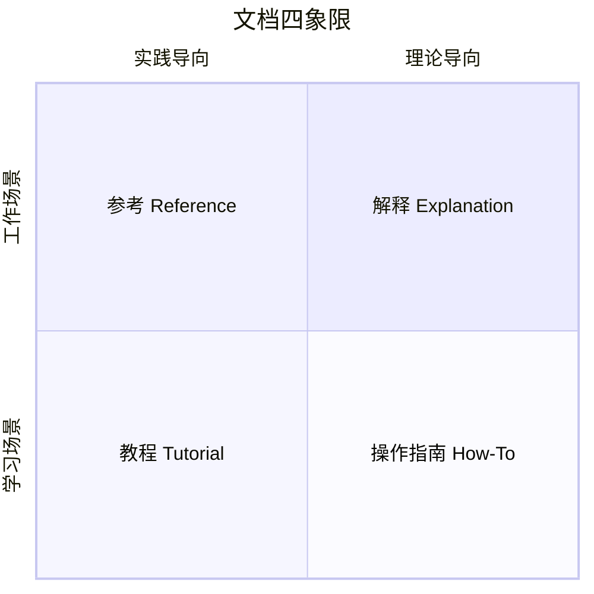

# IMBoy 文档体系建设方案

> **版本**：v1.0 · **最后更新**：2026-07-24 · **维护者**：文档负责人（待任命）
> **适用范围**：imboy（后端主仓）、imboyapp、imboyadmin、imboy-sdk-js、imboy-plugin-marketplace、erlang_migrate

本文档是 IMBoy 全项目文档体系的总纲：现状审计、目标架构、目录规范、治理机制与落地路线图。

---

## 1. 现状审计（2026-07-24）

### 1.1 资产盘点

| 仓库 | 文档现状 | 主要问题 |
|------|---------|---------|
| `imboy/` | docs/ 下 **207 个 md**，30+ 个一级目录；有 ADR（4 篇）、CONVENTIONS.md、standards/、openapi.yaml + swagger-ui | 目录野蛮生长，新旧混杂；无统一分类法；查找靠运气 |
| `imboyapp/` | README + docs/（adr、FAQ、module_map 等）；根目录散落 `TEST.md`、`TEST_1.md`、`QA_PRO_CLICK_TEST_REPORT.md` 等临时文件 | 根目录杂物多；文档与报告混放 |
| `imboyadmin/` | README + 4 篇 API 契约文档 | 契约文档平铺无目录；无用户指南 |
| `imboy-sdk-js/` | 仅 README（质量尚可，有快速开始） | **无 API 参考文档**；无教程 |
| `imboy-plugin-marketplace/` | 仅 README | 无插件开发指南 |
| `erlang_migrate/` | README + CHANGELOG | 无使用指南 |

### 1.2 核心问题（按严重度排序）

1. **P0 — 没有面向读者的信息架构**：207 篇文档按"写作时的主题"堆在 30+ 个目录里，没有区分"教新手"和"供查阅"。新成员 onboarding 靠口口相传。
2. **P0 — API 参考未发布**：`api/openapi.yaml` 存在但没有生成可读站点，前端/移动端靠读 Erlang 源码猜契约。
3. **P1 — 知识只存在于代码和聊天记录**：E2EE 密钥轮换、WebSocket 协议、TSID 跨端约定等关键设计没有"解释型"文档（CONVENTIONS.md 是好的开始，但孤木不成林）。
4. **P1 — 文档无质量门禁**：没有 lint、没有死链检查、没有 review 流程，过期文档无人发现。
5. **P2 — 各仓 README 风格不一**，缺少统一的"5 秒测试"标准（是什么/为什么用/怎么开始）。

### 1.3 已有的好基础（不要推倒重来）

- `docs/CONVENTIONS.md` — 工程约定，质量高，直接保留为「参考」类标杆
- `docs/adr/` — ADR 机制已跑通（4 篇），继续沿用
- `docs/standards/` — api-format、error-codes 等标准文档，归入「参考」
- `api/openapi.yaml` — API 文档真源已存在，缺的是发布流水线
- `docs/guides/operations/`、`docs/guides/release/` — 运维与发布文档，归入「操作指南」

---

## 2. 目标架构：Divio 四象限

采用 [Divio Documentation System](https://documentation.divio.com/)，所有文档归入四类，**永不混写**：



| 类型 | 读者状态 | 回答的问题 | imboy 实例 |
|------|---------|-----------|-----------|
| **教程 Tutorial** | 新手，跟着做 | "教我做出第一个东西" | 「15 分钟跑通私有化部署」「用 SDK 发出第一条消息」 |
| **操作指南 How-To** | 有目标的使用者 | "怎么完成 X" | 「如何备份/恢复 PostgreSQL」「如何配置 E2EE」 |
| **参考 Reference** | 工作中查阅 | "X 的参数/行为是什么" | REST API 参考、WebSocket 协议、错误码表、CONVENTIONS |
| **解释 Explanation** | 想理解原理 | "为什么这样设计" | 四层架构设计理由、E2EE 密钥轮换设计、TSID 选型 |

**判断口诀**：教技能→教程；办事情→指南；查事实→参考；讲道理→解释。

---

## 3. 目录规范

### 3.1 imboy 主仓 docs/ 目标结构

```
imboy/docs/
├── README.md                  # 文档门户首页（索引 + 导航）
├── CONVENTIONS.md             # （保留原位，软链到 reference/）
│
├── tutorials/                 # 【教程】学习导向，步骤完整，有预期输出
│   ├── quickstart-backend.md
│   ├── quickstart-deploy.md
│   └── first-message-with-sdk.md
│
├── guides/                    # 【操作指南】任务导向
│   ├── operations/            #   ← 现 docs/guides/operations/ 迁入
│   ├── release/               #   ← 现 docs/release/ 已迁入
│   ├── migrations/            #   ← 现 docs/guides/migrations/ 迁入
│   ├── e2ee/                  #   ← 现 docs/guides/e2ee/ 迁入
│   └── plugin/                #   ← 现 docs/plugin/ 已迁入 reference/plugin/
│
├── reference/                 # 【参考】信息导向
│   ├── api/                   #   ← 由 api/openapi.yaml 生成，CI 产出
│   ├── websocket-protocol.md
│   ├── error-codes.md         #   ← 现 standards/error-codes.md 迁入
│   ├── api-format.md          #   ← 现 standards/api-format.md 迁入
│   └── tsid-conventions.md
│
├── explanation/               # 【解释】理解导向
│   ├── architecture/          #   ← 现 architecture/overview.md 等迁入
│   ├── four-layer-design.md
│   └── e2ee-design.md
│
├── adr/                       # 架构决策记录（独立机制，保留）
├── standards/                 # 工程标准（过渡期保留，逐步迁 reference/）
├── legal/ brand/ compliance/  # 法务/品牌/合规（业务文档，不进四象限）
├── documentation-system/      # 本方案 + 规范 + 模板
└── archive/                   # 过期文档（只进不出，保留历史）
```

**迁移原则**：
- **渐进式**，不搞大爆炸重写。Phase 1 只建骨架 + 门户索引；旧文档原地保留，搬迁一篇登记一篇。
- 每篇被迁移的文档头部加 `> **类型**：指南 · **读者**：运维 · **最后验证**：2026-08-01` 元信息行。
- `archive/` 只进不出：过期文档移入而非删除。

### 3.2 其他仓库文档归属

| 仓库 | 必含文档 | 归属 |
|------|---------|------|
| `imboyapp/` | README、docs/guides（构建/调试/发布）、docs/adr | 仓内 docs/ |
| `imboyadmin/` | README、docs/guides、docs/api-contracts/（现有契约文档收编入目录） | 仓内 docs/ |
| `imboy-sdk-js/` | README、docs/tutorials/、docs/reference/（由 TypeDoc 生成） | 仓内 docs/ |
| `imboy-plugin-marketplace/` | README、docs/plugin-development.md（插件开发指南） | 仓内 docs/ |
| `erlang_migrate/` | README（含完整用法）、CHANGELOG | README 自足即可 |

**跨仓契约文档的唯一真源原则**：API 契约以 `imboy/api/openapi.yaml` 为唯一真源；`imboyadmin/docs/api-contracts/` 只存放后端尚未建模的"契约草案"，建模完成后删除草案，避免双写漂移。

### 3.3 每篇文档的必备元信息

```markdown
> **类型**：教程 | 指南 | 参考 | 解释
> **读者**：后端开发 | 移动端 | 运维 | 插件开发者 | 外部集成者
> **适用版本**：≥ v2.3.0
> **最后验证**：2026-07-24（在此日期前文中命令/代码确认可运行）
```

---

## 4. 读者入口地图

不同角色的"第一屏"入口，由 `docs/README.md` 门户页承载：

| 我是谁 | 我想 | 入口文档 |
|--------|------|---------|
| 新加入的后端工程师 | 跑起本地环境 | tutorials/quickstart-backend.md |
| 运维 / 私有化部署客户 | 部署一套生产环境 | tutorials/quickstart-deploy.md |
| 前端 / 移动端开发 | 调通一个 API | reference/api/ + CONVENTIONS.md |
| SDK 使用者（外部） | 集成 IM 能力 | imboy-sdk-js README → tutorials/first-message-with-sdk.md |
| 插件开发者 | 开发并上架插件 | imboy-plugin-marketplace/docs/plugin-development.md |
| 架构评审 / 技术买家 | 理解系统设计 | explanation/architecture/overview.md + adr/ |
| 值班运维 | 处理线上问题 | guides/operations/（备份恢复、节点控制、诊断） |

---

## 5. 治理机制

### 5.1 文档负责人制（Docs Owner）

- 每个一级目录指定 1 名 owner，负责该目录的准确性与季度审查。
- PR 修改了代码且影响文档 → PR 模板 checklist 强制勾选「文档已更新 / 无需更新」。
- 破坏性变更（breaking change）→ 必须先有迁移指南，才允许合并。这是硬门禁。

### 5.2 文档评审节奏

| 活动 | 频率 | 产出 |
|------|------|------|
| 新增文档 review（随 PR） | 每次 PR | 工程准确性 + 写作规范双重 review |
| 高流量文档复查 | 每季度 | 刷新「最后验证」日期，归档过期内容 |
| 全量死链 + lint 检查 | 每次 CI | 见 docs-as-code.md |
| 文档健康度审计 | 每半年 | 审计表：URL / owner / 准确性评分 / 最后验证日期 |

### 5.3 质量门禁（CI 强制）

1. markdownlint 通过（`.markdownlint.json` 统一配置）
2. 死链检查通过（lychee）
3. 新增/修改文档必须含元信息头（脚本校验）
4. `api/openapi.yaml` 变更 → 必须重新生成 reference/api/（CI 检查生成物是否同步）

详见 [docs-as-code.md](./docs-as-code.md)。

---

## 6. 落地路线图

详细任务拆解见 [roadmap.md](./roadmap.md)。概览：

| 阶段 | 周期 | 目标 | 验收标准 |
|------|------|------|---------|
| **Phase 1 骨架** | 第 1-2 周 | 建四象限目录 + 门户页 + 写作规范 + 模板库 | 新结构合入主干；门户页可导航到全部现有文档 |
| **Phase 2 止血** | 第 3-5 周 | 补齐 P0 缺口：3 篇快速上手教程 + API 参考自动生成 | 新人 15 分钟跑通本地环境；openapi.yaml 变更自动发布 |
| **Phase 3 流水线** | 第 6-8 周 | CI 质量门禁 + 文档站点上线（VitePress） | docs.imboy 站点可访问；lint/死链检查拦截坏 PR |
| **Phase 4 深化** | 持续 | 存量文档迁移归位、解释型文档补齐、SDK 教程 | 迁移登记完成率 ≥ 80%；每季度复查机制运转 |

---

## 7. 配套文件

- [writing-guide.md](./writing-guide.md) — 写作规范（所有文档作者必读）
- [docs-as-code.md](./docs-as-code.md) — 工具链与 CI 流水线方案
- [roadmap.md](./roadmap.md) — 分阶段任务拆解与验收标准
- [templates/](./templates/) — 五套可复用模板（README / 教程 / 指南 / 参考 / ADR）
