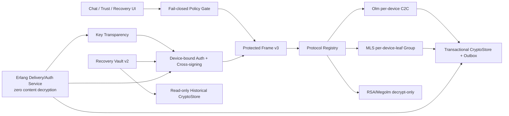

# IMBoy 行业顶级 E2EE 实施与验收计划

> **状态**：Proposed execution plan
> **基线日期**：2026-07-20
> **架构输入**：ADR 14–19；未获人工签字前只允许评审、Spike 和修复已确认漏洞，不把提案当作已发布协议
> **范围仓库**：`imboy`（后端/文档）、`imboyapp`（Flutter/Rust crypto core）；Web 互操作实现需单独建仓/选仓时再次确认
> **目标**：先消除可被实际利用的 P0 缺口，再完成可验证 C2C，最后用 MLS 达到群聊顶级基线。任何阶段不得以“代码已写”代替验收证据。
> **Claude Code 执行入口**：逐任务操作、依赖、命令、证据和停止条件见 `21-claude-code-execution-playbook.md`；执行者不得只凭本文阶段描述直接跨任务编码。

本计划的 `GA-C2C/GA-Top-Tier` 声明只覆盖已验收的消息、控制消息和附件内容；音视频通话、推送正文、端侧索引与流量元数据需独立威胁模型和验收。

---

## 1. 当前事实基线

### 1.1 已有可复用能力

- Flutter 使用维护中的 vodozemac，已有 Olm/Megolm 基础、Protocol Registry 和三套件读取路径。
- 后端保持 E2EE payload 零解密，已有 identity/OTK、原子 claim、trust audit 和设备 API 基础。
- 合规私钥已从服务端 schema/API 下线。
- 00–13 已提供协议抽象、设备概念、capability、metadata 与威胁模型文档，可作为迁移历史。

### 1.2 阻止“顶级”声明的实际差距

| Gap | 当前落点 | 风险 | 优先级 |
|---|---|---|---|
| C2C 默认仍走 Megolm/开关关闭 Olm | `imboyapp/lib/page/chat/chat/services/chat_network_service.dart` | 单聊没有默认 per-device Double Ratchet | P0 |
| room-key 收端可 Olm 失败后回 RSA | `imboyapp/lib/service/group_session_service.dart` | 恶意服务端删除/替换字段制造降级/伪造 | P0 |
| 外层路由/展示字段未统一认证 | `imboyapp/lib/service/e2ee_service.dart`、`imboyapp/lib/service/message.dart` | 消息跨上下文复制或语义篡改 | P0 |
| 登录 token 未强绑定 DID，body DID 可参与授权 | `imboy/src/ds/auth_ds.erl`、`src/api/olm_handler.erl` | 同账号设备越权覆盖密钥 | P0 |
| strict/compliance 初始化或取钥失败可继续 | `e2ee_service.dart`、`group_session_service.dart`、`compliance_key_service.dart` | 安全策略 fail-open | P0 |
| logout 未完整清除 E2EE/DB keys | `imboyapp/lib/store/repository/user_repo_local.dart`、`imboyapp/lib/service/storage_secure.dart` | 换号/失窃后残留秘密 | P0 |
| 备份仅覆盖 RSA、DID 语义冲突、parser/资源界限不足 | `imboyapp/lib/service/e2ee_local_backup_service.dart` | 无法可靠恢复、可能克隆身份或 DoS | P0/P1 |
| trust event freshness/唯一性不足 | `e2ee_trust_logic.erl`、migration 44 | 重放/回滚审计不闭环 | P0 |
| OTK 仅粗粒度限流 | OTK claim handler/logic | 可耗尽预密钥并诱发 fallback | P1 |
| 无 cross-signing/key transparency | 客户端/后端均缺 | 攻陷服务端可静默替换首次身份 | P1 |
| ratchet、消息/outbox 非统一事务 | Flutter stores/services | 崩溃导致状态重用/分叉 | P1 |
| 群聊长期为 Megolm | `group_session_service.dart` | sender-key 群 PCS 不足 | P2/GA-Top-Tier blocker |

基线若在实施前变化，每个 Slice 必须重新 `rg`、运行测试并更新本表；禁止依赖 handoff 文本推断代码状态。

---

## 2. 目标架构



核心事件顺序：

```text
验证策略/设备/透明度
  -> 构造并规范化 Protected Header
  -> 协议加密
  -> 原子提交 ratchet/epoch + outbox + dedupe
  -> 发送已提交密文
  -> 接收方精确路由一次
  -> 解密并比对 inner/outer context
  -> 原子提交 crypto state + plaintext/message state
```

---

## 3. 团队与工期假设

以下是**投入估算，不是发布日期承诺**：

- 2 名资深 Flutter/Rust/密码学工程师；
- 1 名 Erlang/PostgreSQL 工程师；
- 1 名安全 QA/自动化工程师；
- 产品、安全负责人可在 2 个工作日内完成阶段签字；
- 外部安全审计档期单独采购。

在上述条件下，核心工程约 `26–42 engineer-weeks`（**这是投入量 effort，非日历工期、不设截止日**）。推进由退出门 `G0→G5` 状态驱动：一个阶段的门绿了才进下一阶段。若只有一名全栈工程师，投入量相应放大，并优先停在 `GA-C2C`，不要并行开发 MLS。

---

## 4. 阶段总览与发布门

> 推进由**退出门 G0→G5 状态驱动**，非日历。「相对投入」为 effort 量级（engineer-weeks 等价，仅供排序与容量粗估，不设截止日）。

| 阶段 | 目标 | 相对投入(effort) | 可发布等级 | 退出门 |
|---|---|---:|---|---|
| S0 | ADR 签字、基线冻结、测试骨架 | XS | Preview | G0 |
| S1 | 关闭所有 P0 可利用缺口 | S | Preview / Strong Preview 候选 | G1 |
| S2 | Device-bound auth + Protected Frame + Olm C2C + 事务存储 | M | Strong Preview | G2 |
| S3 | Cross-signing + transparency + Recovery Vault v2 | M | GA-C2C 候选 | G3 |
| S4 | MLS Spike、实现与 Megolm 迁移 | L | GA-Top-Tier 候选 | G4 |
| S5 | 独立审计、红队、灰度与 GA | M + 审计排期 | GA-C2C / GA-Top-Tier | G5 |

允许 S3 的 transparency 后端与 Recovery UI 并行；S4 只能在 S2 的 CryptoStore 和 ADR 16 credential binding 完成后进入生产实现。

---

## 5. S0 — 治理与可证伪测试地基

### S0.1 ADR 评审

**交付物**

- ADR 14–19 的签字记录、未解决异议和 decision owner。
- 当前产品等级明确为 `Preview`；README/应用文案不得超标。
- 00/08 等历史 ADR 只在签字后加 superseded 标记。

**验收 G0-A**

- 产品、移动端、后端、安全、发布五方签字完成。
- 每个“Must”都有测试 ID；每个测试有 owner、运行环境和证据路径。

### S0.2 Critical 测试骨架

**仓库/落点**

- `imboyapp/test/service/e2ee/`：Protected Frame mutation、fail-closed、logout、backup/resource tests。
- `imboy/test/`：device-bound auth、trust replay、OTK exhaustion、透传契约。
- CI：Critical 测试单独 job，禁止 skip；归档真机/interop/fuzz summary。

**验收 G0-B**

- 先写能复现当前缺口的 failing tests，并给每项 Gap 绑定测试名。
- CI 能区分“功能失败”与“测试未运行/被 skip”；两者均阻断安全发布。

---

## 6. S1 — P0 Closure

S1 目标是消除现在即可利用的错误路径，不等待完整新架构。

### S1.1 禁止 Strict 隐式 fallback

**Flutter ownership**

- `group_session_service.dart`：Strict 下 Olm room-key 缺失/失败直接拒绝；RSA 仅 legacy 版本读取。
- `e2ee_service.dart`、`chat_network_service.dart`：策略未初始化或无共同强套件时拒发；不把 `useOlmForC2C=false` 当安全成功。
- `compliance_key_service.dart`：无有效受信清单、过期或拉取失败都 fail-closed。

**验收**

- 删除 `olm`、替换 `sid`、让 Olm 解密失败时，RSA unwrap 调用次数为 0。
- strict/compliance 的初始化失败、超时、离线过期均拒发。
- optional 的明文发送必须是显式 UI 行为，wire/本地记录带 `unencrypted` 标记。

### S1.2 Context Binding Guard

复用 ADR 15 的 canonical CBOR/Protected Frame v3 编码做第一个纵向 Slice：对现有可使用 AAD 的 AES-GCM 路径绑定 header hash；Olm/Megolm 加密 `header + payload` 并在解密后比对。不得另造一次性临时 wire 格式；S2 在同一 v3 格式上完成所有业务路由和迁移。

**验收**

- 逐项篡改 `id/from/to/type/msg_type/gid/sender_did/session_id` 全部拒绝。
- 测试必须调用真实生产路由，而非只测试 AES helper。

### S1.3 Device ownership hotfix

**Erlang ownership**

- 登录/刷新流程取得并固定 DID；identity/OTK/trust 写端点从认证上下文取 DID。
- 在完整 session 表迁移前，至少要求 token DID 与 body DID 一致并验证设备 active。
- trust event 增 `event_id/issued_at/expires_at` 唯一性与时间窗。

**验收**

- A token 操作 B DID 返回 403，identity/OTK/trust 表均无变化。
- 同 trust event 重放 100 次只产生一项语义变化；过期和未来事件拒绝。

### S1.4 Logout 与本地秘密清理

**Flutter ownership**

- 建立 `E2eeSecretInventory`，枚举 RSA、Olm account/pickle key/session、Megolm、MLS 预留、backup/recovery、SQLCipher key、合规 cache。
- logout/account switch 以单一服务清理；失败时阻断进入另一账号并显示本地安全错误。

**验收**

- logout 前逐类写 canary，logout 后所有安全存储 key read 为 null。
- 旧 SQLCipher DB 在无旧 key 时打不开；新账号不能查询旧账号 crypto rows。
- Android/iOS 真机进程重启后结论不变。

### S1.5 Backup parser hotfix

- 修正 notes 布局的 writer/reader 一致性；在任何 KDF/大分配前加入文件、字段、KDF 参数上限。
- v1 恢复不得覆盖物理 DID；UI 改为“legacy 历史密钥恢复”。

**验收**

- notes 0/1/上限、截断/尾部垃圾均有测试。
- 超大文件和极端迭代参数在 KDF 前拒绝；10,000 fuzz 样本无 crash/OOM。

### G1 出口

- 上述 P0 测试全部绿色，Critical 0 skip。
- 两仓静态分析/单元测试通过；真机 logout 与 fail-closed 通过。
- 安全 reviewer 对 diff 做专项复核。
- **仍保持 Preview**：S1 不足以声明顶级。

---

## 7. S2 — 认证信封、Olm C2C 与事务存储

### S2.1 Protected Frame v3

**Flutter ownership**

- 新增 canonical CBOR codec、`ProtectedFrameV3`、严格 parser 与错误 taxonomy。
- 重构 `E2eeSessionProtocol` 输入输出，使 context 为必填不可绕过。
- send/receive 只使用验证后的 inner header 落库/展示。

**Erlang ownership**

- WS/HTTP 只做有界结构校验并原样透传，不能裁剪未知字段或重建 canonical bytes。
- 对 `meta_version=3` 增加 contract fixtures。

**验收**：PF3-01..10 全部通过；Flutter 与独立 codec 生成完全相同的 bytes/hash。

附件必须同时通过 ATT-01..05：独立 content key、分块 AEAD、descriptor 绑定、对象替换/块重排拒绝和临时明文清理。Garage 授权 URL 不能替代内容加密。

### S2.2 C2C per-device Olm fan-out

- 对端每个 active、未撤销、manifest 验证通过的设备建立/复用独立 Olm session。
- 每设备产生独立 ciphertext；发送者自己的其他设备也作为显式目标，支持多端同步。
- C2C 新消息禁止 Megolm/RSA；任何目标设备无共同强套件时，Strict 默认整条拒发，产品若要“发给其余设备”需另行 ADR。
- 收到身份 version 变化时旧 session 不用于新发送，用户完成验证后重建。

**验收**

- 2 账号 × 各 3 设备端到端；每个目标设备的 ciphertext/session 均独立，发送设备自身不重复 fan-out。
- 撤销一设备后不能领取 OTK或收到新密文；其余设备正常。
- OTK 耗尽只使用协议允许的 signed fallback prekey 或拒发，不进入 RSA/Megolm/明文。
- 泄漏某 ratchet state 后完成 DH ratchet，旧状态不能解密恢复后的消息。

### S2.3 Transactional CryptoStore

**目标 schema/抽象**

```text
transaction {
  crypto_state(version, hash, encrypted_blob),
  outbox(message_id, immutable_ciphertext, status),
  inbox_dedupe(message_id, protocol_position),
  message_state(message_id, status)
}
```

- 单 writer/串行 actor 管理每个 crypto state；业务 service 不直接写 pickle。
- 加密后先原子提交 state + immutable outbox，再发送。
- 解密后原子提交新 state + dedupe + message，再展示/ACK。
- 备份/恢复只能通过 store snapshot API，不能复制打开中的 DB 文件。

**验收**

- 对所有事务边界做 10,000 次 kill/restart 注入：key reuse、rollback、双重业务提交为 0。
- 网络重试复用原密文；不再次推进 ratchet。
- 并发同会话发送由 actor 串行化，无 lost update。

### G2 出口

- PF3、Olm 多设备、CryptoStore 崩溃测试全绿。
- C2C 性能满足 ADR 14；最低 Android/iOS 真机均通过。
- 可进入 `Strong Preview`，但尚不能 `GA-C2C`：服务端密钥替换仍需 S3 完整防御。

---

## 8. S3 — Device Trust、Transparency 与 Recovery

### S3.1 Device-bound auth 正式化

- PostgreSQL 增 device session、operation idempotency、manifest/revocation schema；迁移支持灰度和回滚。
- 旧 token 在限定窗口换取 device-bound token；无法证明 DID 的会话只读，不能写密码学材料。
- API 契约、OpenAPI、Flutter client 同步更新。

**验收**：DT-01..04、DT-08..11 通过；迁移前后并发登录/刷新不产生无 DID 写权限。

### S3.2 Cross-signing 与透明度

- 实现 Account Master/device-signing 生命周期、新设备 QR 授权、撤销和账号根 reset。
- 实现 append-only Merkle log、signed tree head、inclusion/consistency proof 和独立 monitor。
- Protected Frame gossip 最近 tree head 摘要。

**验收**：DT-05..07/10/12 通过；split view 演练可复现、可阻断、可留证。

### S3.3 Recovery Vault v2

- 先实现 v2 writer/reader + ArchivedCryptoStore，再做 v1 一次性 importer。
- 新设备恢复始终生成新 DID/Olm/MLS identity；恢复根只用于 cross-sign。
- Strict 默认 `identity_only`；`history_recoverable` 仅用户明确选择，并使用只读历史 store。
- 新备份默认随机 Recovery Key；口令模式 Argon2id 以真机基准选参数。

**验收**：RV2-01..10（含 RV2-02A）通过；identity-only 不携带历史 key，history-recoverable 历史可读；两者未来都使用 fresh session 且不克隆设备。

### G3 出口

- DT/RV 全部 Critical 测试绿色；根 reset、设备丢失、恢复、撤销四条真机旅程通过。
- 独立 monitor 已运行并演练 split view。
- S2/S3 范围完成外部安全审计，Critical/High 清零后可候选 `GA-C2C`。

---

## 9. S4 — MLS 群聊

### S4.0 Spike（先做，禁止直接产品化）

- 在 `imboyapp/packages/imboy_crypto` 隔离 Rust PoC。
- 比较至少一个成熟 Rust MLS 实现和一套独立互操作实现。
- 输出 ABI/FFI、state persistence、性能、许可证、维护、安全响应与 fuzz 报告。

**Go/No-Go**：ADR 19 §3 每一项必须 Go。任一关键项 No-Go，停止生产实现并评估替代库；不得自研协议补洞。

### S4.1 MLS core + credential binding

- 冻结 cipher suite/profile。
- FFI 只暴露 typed opaque handles/bytes 和稳定错误码；Dart 不接触内部 secret tree。
- leaf credential 验证 ADR 16 Device Manifest 和透明度 proof。

### S4.2 Delivery Service

- 实现 KeyPackage、Welcome、ordered handshake、application ciphertext 的存储转发、幂等、配额与保留期。
- 所有写 API device-bound；服务端不生成 Commit、不导出 group secret。

### S4.3 状态机、群业务与迁移

- 将群成员/设备变更映射为受授权 Proposal/Commit。
- MLS state 接入 Transactional CryptoStore/outbox。
- 新群灰度，再迁移既有 Megolm 群；Megolm 只读历史。

### S4.4 真机/互操作/对抗

- 执行 MLS-01..14、1/10/100/1000 设备曲线、前后台/升级/弱网/乱序/分叉/kill injection。
- 与独立 MLS 实现双向互操作，不以自身 round-trip 替代。

### G4 出口

- MLS-01..14 全绿、Critical 0 skip，性能符合 ADR 14。
- 迁移/紧急停止 runbook 演练通过。
- 仍是 `GA-Top-Tier 候选`，必须通过 S5 外审。

---

## 10. S5 — 独立验证、灰度与 GA

### S5.1 外部审计范围

- Protected Frame/canonical encoding 和所有 downgrade 路径；
- Olm session/OTK/device binding/cross-signing/transparency；
- Recovery Vault、KDF、secret inventory/logout；
- MLS core、FFI、credential、state transaction、迁移；
- Compliance manifest/wrap 和服务端零私钥；
- 日志、crash reporting、备份、数据库与构建供应链。

**退出条件**：Critical/High 未修复为 0；Medium 有 owner、风险接受人和期限；修复回归由独立方复核。

### S5.2 红队场景

1. 恶意服务端替换设备 identity/capabilities/透明度 proof；
2. 删除 Olm/MLS 字段诱导 RSA/Megolm/明文；
3. 同账号设备 A 越权操作设备 B；
4. OTK/KeyPackage 耗尽与重放；
5. 跨会话/跨群复制密文和外层字段置换；
6. 恢复包 KDF/长度/CBOR parser DoS；
7. MLS fork、Welcome 替换、epoch rollback；
8. logout 后文件系统/安全存储/内存残留取证；
9. compliance key 替换、过期、策略 rollback；
10. CI/依赖包替换与 FFI 恶意输入。

### S5.3 灰度

```text
internal dogfood
  -> 1% 新会话
  -> 5%
  -> 25%
  -> 100% 新会话
  -> 既有会话迁移
```

每一级至少覆盖约定的活跃消息量和 7 天稳定窗口；若产品规模不足，以预设最小事件数 + 14 天代替。自动停止条件：认证篡改被接受、key reuse、state rollback、跨成员泄密、无法安全回滚，任一 >0。

### G5 最终验收

| 类别 | 最终标准 |
|---|---|
| 机密性 | DB、对象存储、网络抓包、日志无消息明文/私钥/content key |
| 附件 | ATT-01..05 全通过；对象替换/块乱序被拒，存储侧只有密文 |
| 完整性 | Protected Frame mutation matrix 100% 拒绝 |
| 身份 | device-bound/cross-sign/transparency 攻击矩阵 100% 阻断或告警 |
| FS/PCS | Olm/MLS 泄漏-恢复测试可重复通过 |
| 群成员 | 新成员不可读旧、移除成员不可读新，100% 通过 |
| 恢复 | fresh DID + 历史可读 + 无活跃 ratchet clone |
| 可靠性 | 10,000 次故障注入 0 key reuse/rollback/重复业务提交 |
| 互操作 | 独立实现双向 100% |
| 性能 | ADR 14 最低真机 p95/p99/内存预算全通过 |
| 审计 | Critical/High 0；Critical tests 0 skip |
| 运维 | 灰度停止、回滚、根轮换、设备撤销、透明度分叉 runbook 均演练 |

只有 C2C 范围达到表中对应门禁，可发布 `GA-C2C`；只有 MLS 群范围也达到，才可发布 `GA-Top-Tier`。

---

## 11. 跨仓实施顺序与提交纪律

每个 Slice 独立完成以下闭环，不把多个安全边界混在一个提交：

```text
read accepted ADR
  -> reproduce/failing test
  -> smallest implementation
  -> unit + integration + static analysis
  -> adversarial/negative test
  -> security review
  -> update evidence manifest
  -> commit
  -> next slice
```

建议提交顺序：

1. `docs(e2ee): accept ADR 14-19 security target`（仅签字后）；
2. `test(e2ee): add P0 failing security guards`；
3. `fix(e2ee): fail closed and remove strict legacy fallback`；
4. `fix(auth): bind crypto writes to authenticated device`；
5. `fix(e2ee): purge complete secret inventory on logout`；
6. `fix(backup): bound legacy parser and prevent DID restore`；
7. `feat(e2ee): add Protected Frame v3`；
8. `feat(e2ee): enable per-device Olm C2C`；
9. `feat(e2ee): add transactional CryptoStore`；
10. `feat(e2ee): add cross-signing and key transparency`；
11. `feat(e2ee): add Recovery Vault v2`；
12. `spike(e2ee): evaluate MLS mobile core`；
13. MLS 子 Slice 按 core/backend/state/migration 分开。

后端与客户端协议变更使用同一 fixture 版本，但分别在各自仓库提交；每个提交信息记录 counterpart commit，避免半部署。

---

## 12. 每个 Slice 的验收清单

- [ ] 对应 ADR 已接受，或该 Slice 明确只属于不改变协议的漏洞修复
- [ ] 测试先复现旧行为并在修复后变绿
- [ ] 正向、篡改、重放、回滚、资源上限、并发/崩溃至少覆盖适用项
- [ ] 未增加 RSA/明文/陈旧 key/未知 suite fallback
- [ ] 未把私钥、明文、完整密文、恢复口令写入日志/遥测
- [ ] 数据迁移含 up/down 或前向补救方案、备份与回滚演练
- [ ] Flutter `analyze`、相关 tests、最低 Android/iOS 真机通过
- [ ] Erlang compile、EUnit、真实 PostgreSQL 并发/迁移测试通过
- [ ] 协议 fixture/interop 通过，版本和 hash 已归档
- [ ] 安全 reviewer 审核并关闭发现
- [ ] 文档、错误码、用户文案、runbook 与实现一致

---

## 13. 证据清单（Release Evidence Manifest）

每个候选发布必须生成一份不含秘密的 manifest：

```text
release/version/commit ids
accepted ADR versions
dependency lock + SBOM hashes
unit/integration/critical test counts and skips
real-device model/OS/performance results
interop implementation/version/vector hashes
fuzz corpus/run count/crash count
crash-consistency run count/failures
migration/rollback rehearsal id
external audit report id and open findings
canary metrics window and stop-trigger count
approver identities and timestamps
```

Manifest 存入受 Git 跟踪的发布证据目录；CI 只引用 hash/摘要，不包含密钥、用户数据或生产 PII。

---

## 14. 立即下一步

按风险和依赖，下一次编码只启动 **S0.2 + S1.1**：

1. 在真实生产路由上补齐“删除 Olm 不得回 RSA”“策略未初始化必须拒发”的 failing tests；
2. 做最小 fail-closed 修复；
3. 跑 Flutter 单测/analyze 与 Android/iOS 真机验证；
4. 安全 review 后独立提交并停止，等待是否进入 S1.2。

不要先开启 Olm 全量发送，也不要先写 MLS；在 context、device ownership 和状态事务未闭环前扩大新协议流量只会扩大不可验证状态。
