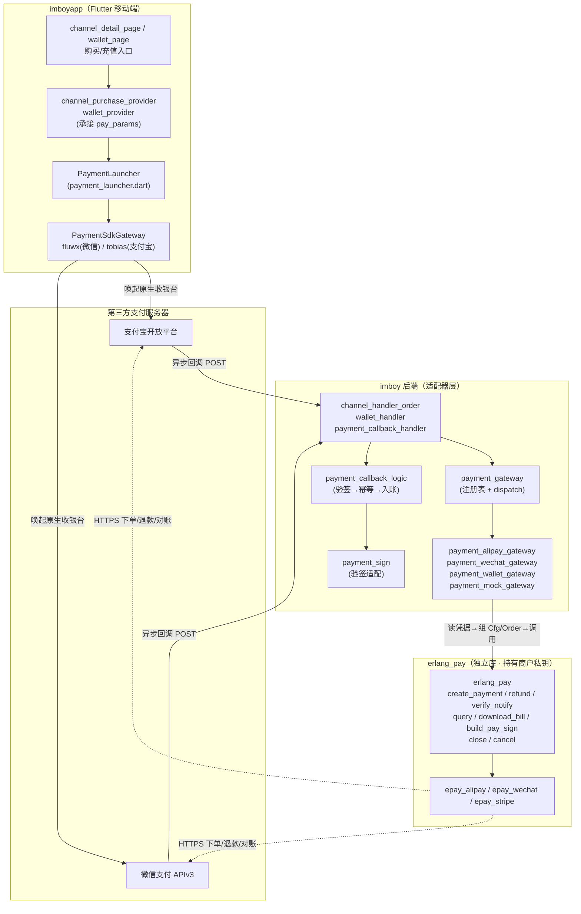
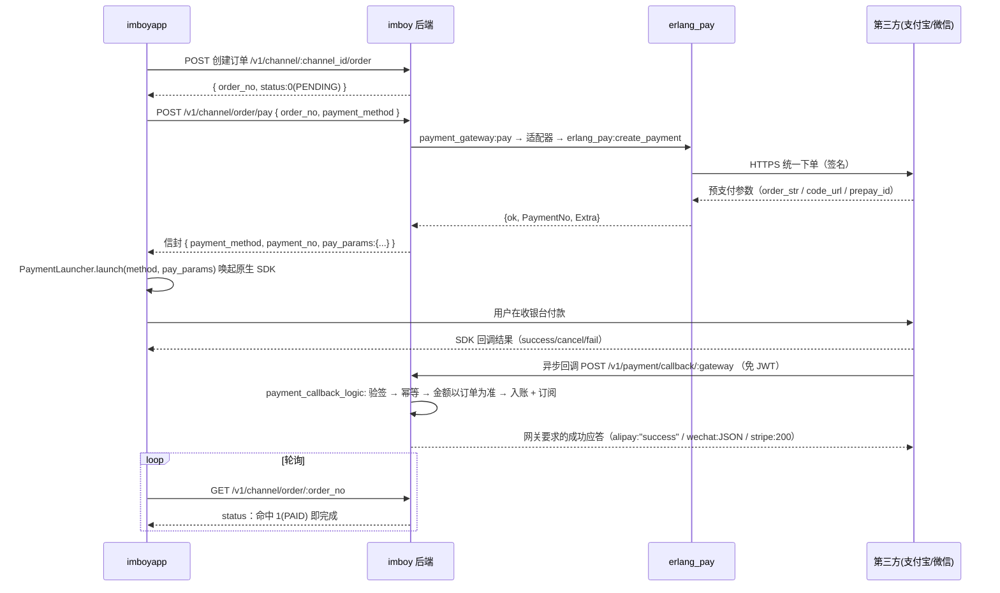

> [imboy.pub 根目录](../../../CLAUDE.md) > [imboy 后端](../../CLAUDE.md) > **支付 / Payment** > **S4 支付宝/微信真实支付对接**

# S4：支付宝/微信真实支付对接（两端对接文档）/ Alipay & WeChat Real Payment Integration

> **状态 / Status**：联调准备就绪（代码全绿，零真机验证）/ Ready for joint debugging (all green, no real-device verification)
> **最后更新 / Last updated**：2026-06-16 CST
> **受众 / Audience**：后端、前端、运维三方据此并行推进真实联调。

---

## 文档目的 / Purpose

本文档把「支付宝 / 微信真实支付」的三端（后端 imboy、移动端 imboyapp、运维/用户）职责、数据契约、配置清单一次说清，使三方可**并行**推进，最终汇合到真机联调。

凡涉及商户凭据、回调域名、应用签名登记等**外向/不可逆操作**，运维/用户须本人确认后执行（参见第 5、7 章）。

### 本轮已落地实现 / Landed in this round

| 仓库 | 提交 | 内容 |
|------|------|------|
| `imboy` | `ccdbf28` | 支付网关统一信封 + `notify_url` 配置 |
| `imboyapp` | `48b94e7f` | fluwx/tobias 接入 + `PaymentLauncher` |
| `erlang_pay` | `e06909e` | `epay_wechat` H1/H2 安全修复 |
| `erlang_pay` | — | 三网关 `create_payment`/`refund`/`verify_notify`/`query`/`download_bill`/`build_pay_sign`/`close`/`cancel` 已实现 |

---

## 1. 概述与职责分层 / Overview & Layered Responsibilities

支付能力按**三层 + 客户端**切分，凭据隔离是核心约束：**商户私钥只存在 erlang_pay 层**，绝不越层、绝不下发客户端。



### 各层职责边界

| 层 | 模块 | 职责 | 凭据 |
|----|------|------|------|
| **erlang_pay**（独立库） | `erlang_pay` + `epay_alipay`/`epay_wechat`/`epay_stripe` | 统一下单签名、回调验签解密、查单、对账、退款。真实密码学/HTTP 全在此层 | **商户私钥只在此层** |
| **imboy 适配器** | `payment_alipay_gateway` / `payment_wechat_gateway` / `payment_stripe_gateway` / `payment_wallet_gateway` / `payment_mock_gateway` | 实现 `payment_gateway` behaviour：读 `IMBOY_*` 凭据 → 组 `Cfg`/`Order` → 调 erlang_pay → 翻译响应。**纯适配层，不含密码学** | 仅从 `application:get_env` 读取，传递给 erlang_pay |
| **imboy 注册表** | `payment_gateway`（注册表 + dispatch） | `method → 实现模块` 路由；内置 `mock`/`wallet`，第三方由 `sys.config` 的 `payment_gateways` 注册 | — |
| **imboy 回调** | `payment_callback_handler`（HTTP 入口） + `payment_callback_logic`（业务） + `payment_sign`（验签） | 验签 → 幂等 → 金额以订单为准 → 入账 → 落流水 | — |
| **imboyapp** | `PaymentLauncher` / `PaymentSdkGateway` / `PaymentConfig` | 用后端返回的预支付参数唤起原生收银台，监听结果，轮询订单状态 | 仅 appId / Universal Link（半公开，编译期注入） |

**关键约束**：imboy 适配器是「凭据无关」的纯翻译层——新增网关只需新建 `payment_xxx_gateway.erl` 实现 behaviour + 在 `sys.config` 注册，无需改 `payment_gateway` 的 dispatch 逻辑（解除多任务并行编辑冲突）。

---

## 2. 端到端时序 / End-to-End Sequence

`createOrder → payOrder(payment_method) → 后端 payment_gateway:pay 分发`。两条路径：

### 2.1 钱包支付（即时入账）

```
前端 payOrder(method="wallet")
  → 后端 payment_gateway:pay
    → payment_wallet_gateway 即时扣款入账（幂等键 WPY_<OrderNo>）
  ← 信封 { payment_method: "wallet", payment_no, pay_params: {} }
前端：订单已 paid，无需唤起 SDK
```

### 2.2 第三方支付（异步回调）



> **重要**：第三方支付以**后端异步回调**为入账权威，前端 SDK 回调只用于 UI 反馈（成功/取消/失败），最终结果以**轮询订单状态**为准。SDK 回 `success` 但回调尚未到达时，前端应继续轮询。

### 2.3 后端回调入账内部流程

`payment_callback_logic:handle/3`：

1. **验签**：`payment_sign:verify(Gateway, RawBody, Headers)`。sandbox 直通；live 复用 `erlang_pay:verify_notify`，并透出解密明文（微信加密回调必需，取代 handler 解析的明文）。
2. **提取**：从回调归一化字段取 `gateway_payment_no` / `biz_order_no`；`biz_type` 由订单号前缀推导（`RCH`=充值 / `CH`=频道），回调不带也能判定。
3. **金额以订单为准**：`enrich_from_order` 从业务订单反查 `user_id`/`amount`/`currency`，**不信任回调金额**。
4. **双层幂等**：
   - `payment_transaction` UNIQUE(`gateway`, `gateway_payment_no`)（回调级）。
   - `wallet_transaction.reference_no` UNIQUE（入账级，`reference_no` = `trade_no`）。
   - 任一命中重复都不会重复加钱。
5. **入账**（按 `biz_type`）：
   - `1` 充值：`recharge_order_ds:credit_in_tx`（**单事务**：订单状态 + 钱包余额 + 流水原子完成，取代历史两步非原子写法）。
   - `2` 频道订单：`channel_order_ds:pay` + `channel_ds:subscribe`。
6. **落流水**：`payment_transaction` status=1，记 `gateway_payment_no`/`notify_data`/`paid_at`。

---

## 3. 统一信封契约 / Unified Envelope Contract（核心）

后端 `payOrder` / `payRecharge` 成功响应的 `payload`（Erlang 端 binary key；前端 JSON 收到 string key）：

```json
{
  "payment_method": "alipay | wechat | wallet | mock",
  "payment_no": "<网关支付单号>",
  "pay_params": { }
}
```

### 3.1 `pay_params` 按网关 / 字段表

| payment_method | 场景 | `pay_params` 内容 | 前端动作 |
|----------------|------|-------------------|----------|
| `alipay` | App 支付 | `{"order_str": "<支付宝 App 支付请求串>"}` | `tobias.pay(order_str)` |
| `wechat` | Native（扫码） | `{"code_url": "weixin://..."}` | 展示二维码 |
| `wechat` | JSAPI / App | `{"prepay_id": "wx..."}` ⚠️见下 | 见 3.3 |
| `wallet` | 即时入账 | `{}` | 无需唤起，订单已 paid |
| `mock` | 本地联调即时入账 | `{}` | 无需唤起 |

充值（recharge）路径的信封额外含 `order_no` / `amount` / `status`（+ mock 即时入账时含 `balance`）供前端轮询。

### 3.2 字段精确说明

| 字段 | 类型 | 说明 |
|------|------|------|
| `payment_method` | string | 与请求 `payment_method` 一致 |
| `payment_no` | string | 网关支付单号。支付宝形如 `ALIPAY_<OrderNo>`，微信形如 `WECHAT_<OrderNo>`（适配器加前缀，退款时 `strip_prefix` 去前缀） |
| `pay_params` | object | 透传给客户端唤起 SDK 的预支付参数；wallet/mock 为空对象 |

### 3.3 ⚠️ 微信 JSAPI/App 二次签名缺口（联调前必读）

后端微信适配器 `create_payment` 当前对 Native 返回 `code_url`，对 JSAPI/App 返回 `prepay_id`。但**唤起 App 收银台需完整二次签名**：`appId` / `partnerId` / `prepayId` / `package` / `nonceStr` / `timeStamp` / `sign`。

- **当前状态**：后端仅透传 `prepay_id`，**二次签名端点未补**（erlang_pay 已有 `build_pay_sign/3` 原语，imboy 侧端点待接）。
- **前端容错**：`PaymentLauncher.parseWechatParams` 校验 6 项二次签名字段，**任一缺失 → 降级 `notConfigured`（提示"即将开通"），不崩溃**。
- **联调阻塞项**：后端须新增端点调用 `erlang_pay:build_pay_sign(wechat, Cfg, #{prepay_id => ...})`，把完整 6 项签名并入 `pay_params` 后，微信 App 支付才能真正唤起。

前端 `parseWechatParams` 兼容的键名（取首个非空）：
`appid`/(配置回落)、`partnerid`、`prepay_id`|`prepayid`、`package`(默认 `Sign=WXPay`)、`noncestr`|`nonce_str`、`timestamp`|`timeStamp`|`time_stamp`、`sign`、`signtype`（可选）。

### 3.4 第三方回调归一化字段（后端内部约定）

回调 map（handler 透传、`payment_callback_logic:extract` 用 `pick/2` 兼容各网关私有字段）：

| 统一字段 | 候选键（pick 顺序） | 必填 | 说明 |
|----------|---------------------|------|------|
| `gateway_payment_no` | `gateway_payment_no` / `transaction_id`(微信) / `trade_no`(支付宝) / `payment_intent`(Stripe) | 是 | 第三方支付单号 |
| `biz_order_no` | `biz_order_no` / `out_trade_no` | 是 | 业务订单号（`RCH*`/`CH*`） |
| `biz_type` | 订单号前缀推导（`RCH`→1 / `CH`→2），`biz_type` 兜底 | — | 充值=1 / 频道订单=2 |
| `user_id` / `amount` / `currency` | **不取回调，从订单反查** | — | 金额以订单为准 |

---

## 4. REST 端点与状态码 / REST Endpoints & Status Codes

| 方法 | 路径 | action | 认证 | 说明 |
|------|------|--------|------|------|
| POST | `/v1/channel/:channel_id/order` | `create_order` | JWT | 创建频道订单（价格后端定） |
| POST | `/v1/channel/order/pay` | `pay_order` | JWT | body：`order_no`、`payment_method` |
| POST | `/v1/channel/order/refund` | `refund_order` | JWT | 退款 |
| GET | `/v1/channel/order/:order_no` | `get_order` | JWT | 查单（前端轮询） |
| GET | `/v1/channel/orders/my` | `my_orders` | JWT | 我的订单 |
| POST | `/v1/wallet/recharge/order` | `recharge_order` | JWT | 创建充值订单 |
| POST | `/v1/wallet/recharge/pay` | `recharge_pay` | JWT | 支付充值订单 |
| GET | `/v1/wallet/recharge/:order_no` | `recharge_query` | JWT | 查充值订单 |
| POST | `/v1/payment/callback/:gateway` | `notify` | **免 JWT** | 第三方异步回调 |

> **回调免 JWT 机制**：`auth_middleware_api_v1.erl` 对路径前缀 `/v1/payment/callback/` 整族放行（不在 `imboy_router:open/0` 列表，而是中间件前缀匹配）。回调来自第三方服务器，无 `current_uid`，`user_id` 由回调或经 `biz_order_no` 反查。

### 4.1 回调成功应答（各网关要求不同）

| 网关 | 成功应答 | 失败应答 |
|------|----------|----------|
| `alipay` | `200` text `"success"` | `200` text `"failure"`（会重推） |
| `wechat` | `200` JSON `{"code":"SUCCESS","message":"成功"}` | `200` JSON `{"code":"FAIL","message":...}` |
| `stripe` | `200` `{"received":true}` | `400` `{"received":false}`（验签失败回 400 触发重推） |
| 其他 | 标准 JSON 信封 success | 标准 JSON 信封 error |

### 4.2 订单状态码（前后端一致）

| 状态 | 码 |
|------|-----|
| PENDING | `0` |
| PAID | `1` |
| REFUNDED | `2` |
| CANCELLED | `3` |
| EXPIRED | `4` |

---

## 5. 凭据安全边界 / Credential Security Boundary

### 5.1 后端独占（绝不下发前端）

通过 `IMBOY_*` 环境变量注入，`application:get_env(imboy, ...)` 读取：

| 网关 | 环境变量 |
|------|----------|
| 支付宝 | `IMBOY_ALIPAY_APP_ID`、`IMBOY_ALIPAY_PRIVATE_KEY`、`IMBOY_ALIPAY_PUBLIC_KEY`、`IMBOY_ALIPAY_NOTIFY_URL` |
| 微信 | `IMBOY_WECHAT_MCH_ID`、`IMBOY_WECHAT_APP_ID`、`IMBOY_WECHAT_API_V3_KEY`、`IMBOY_WECHAT_CERT_SERIAL`、`IMBOY_WECHAT_PRIVATE_KEY`(商户 API 证书私钥)、`IMBOY_WECHAT_PLATFORM_PUBLIC_KEY`(平台公钥)、`IMBOY_WECHAT_NOTIFY_URL` |
| Stripe | `IMBOY_STRIPE_*` |
| 全局 | `IMBOY_PAYMENT_MODE`（`sandbox` / `live`） |

> ⚠️ 微信 `IMBOY_WECHAT_PRIVATE_KEY` 与 `IMBOY_WECHAT_PLATFORM_PUBLIC_KEY` 为新增凭据项，上线须人工配置。
> 适配器对凭据「任一必填项为空 → 视为未配置 → 返回 `{error, <<"支付网关未配置真实凭据"/utf8>>}`」，不会用空凭据下单。

### 5.2 前端可见（半公开，非密钥）

通过 `flutter --dart-define` 编译期注入（`payment_config.dart`）：

| 变量 | 说明 |
|------|------|
| `WECHAT_APP_ID` | 微信开放平台 appId |
| `WECHAT_UNIVERSAL_LINK` | 微信 iOS Universal Link |
| `ALIPAY_APP_ID` | 支付宝 appId |
| `ALIPAY_UNIVERSAL_LINK` | 支付宝 iOS Universal Link |

缺失时 `PaymentConfig.is{Wechat,Alipay}Configured` 为 false，`PaymentLauncher` 降级 `notConfigured`（提示"即将开通"），不崩溃。

> 商户密钥、二次签名等机密**严禁**下发客户端，全部由后端持有。

> 凭据值的现实归属（appId、Universal Link 域名、商户号等）只有用户本人可核实——配置前须本人确认，不得用对话中的近似值代填。

---

## 6. 前端落点 / Frontend Touchpoints（imboyapp）

| 文件 | 职责 |
|------|------|
| `lib/service/payment_launcher.dart` | `PaymentLaunchResult{success,cancelled,failed,notConfigured}` + `launch(method, payParams)` 分发 + 结果解析（纯逻辑可单测） |
| `lib/service/payment_gateway.dart` | `PaymentSdkGateway` 抽象 + `RealPaymentSdkGateway`（fluwx/tobias 真实实现，可注入 fake） |
| `lib/config/payment_config.dart` | appId / Universal Link 编译期配置 |

### 6.1 占位替换点（待承接 pay_params 并唤起）

| 文件 | 位置 | 当前 | 应改为 |
|------|------|------|--------|
| `channel_detail_page` | `._buyAndUnlock` 第三方分支 | 占位 | 取信封 `pay_params` → `PaymentLauncher.launch` |
| `wallet_page` | 支付宝/微信 `onPressed` | 占位 | 同上 |
| `channel_purchase_provider` | `.purchase` | — | 承接 `pay_params`，按结果决定轮询 |
| `wallet_provider` | `.recharge` | — | 同上 |

### 6.2 前端结果处理约定

| `PaymentLaunchResult` | 含义 | 后续动作 |
|-----------------------|------|----------|
| `success` | SDK 报付款成功 | **继续轮询订单状态**确认入账 |
| `failed` | SDK 报错/未安装/失败码 | 继续轮询（回调可能仍成功），超时提示失败 |
| `cancelled` | 用户取消 | 中止，提示取消 |
| `notConfigured` | 方式未配置/参数不完整 | 提示"即将开通" |

支付宝 `resultStatus`：`9000`=成功、`6001`=取消。微信 `errCode`：`0`=成功、`-2`=取消。

---

## 7. Android / iOS 平台配置 / Platform Configuration

### 7.1 Android（可改，随 imboyapp 构建）

`android/app/src/main/AndroidManifest.xml`：

- `<queries>` 加被调起 App 包名：`com.tencent.mm`（微信）、`com.eg.android.AlipayGphone`（支付宝）。
- 微信回调 Activity：`WXPayEntryActivity`，包路径 `imboy.chat.wxapi`。
- 微信开放平台须登记 Android **应用签名**（release 签名的 MD5/包名），否则无法唤起。

构建时注入 appId：

```bash
flutter build apk \
  --dart-define=WECHAT_APP_ID=wx... \
  --dart-define=WECHAT_UNIVERSAL_LINK=https://<域名>/app/ \
  --dart-define=ALIPAY_APP_ID=2021... \
  --dart-define=ALIPAY_UNIVERSAL_LINK=https://<域名>/app/
```

### 7.2 iOS 禁改区手动清单（运维/用户在 Xcode 手动执行）

> ⚠️ **保留区禁止由 AI/代码改动 `ios/*`**。以下由运维/用户在 Xcode 手动执行。

1. **Info.plist**
   - `CFBundleURLTypes`：加微信 appId scheme；加支付宝 `ap<appid>` scheme。
   - `LSApplicationQueriesSchemes`：加 `weixin`、`weixinULAPI`、`alipay`、`alipays`。
2. **AppDelegate.swift**
   - `application(_:open:options:)` 与 `application(_:continue:restorationHandler:)` 转交 fluwx / tobias 处理回调。
3. **Signing & Capabilities**
   - `Associated Domains` 加 `applinks:<域名>`。
   - 服务端部署 `/.well-known/apple-app-site-association`（AASA），与微信/支付宝 Universal Link 域名一致。

---

## 8. 待办与阻塞 / TODO & Blockers（三栏）

| 后端（imboy / erlang_pay） | 前端（imboyapp） | 运维 / 用户 |
|----------------------------|------------------|-------------|
| **微信 JSAPI/App `build_pay_sign` 端点**（接 `erlang_pay:build_pay_sign`，补完整二次签名）⚠️阻塞微信 App 支付 | 真机联调（所有 SDK 唤起未真机验证） | 申请支付宝/微信/Stripe 商户凭据 |
| 主动查单（`query`）接口 + 超时补偿 | `--dart-define` 注入 appId / Universal Link | 配置 `notify_url`（必须 HTTPS，公网可达） |
| 对账任务（`download_bill`） | 占位替换点改为承接 `pay_params` + 轮询 | 微信开放平台登记 Android release 应用签名 |
| `payment_reconcile` 完善 | — | Universal Link 域名 + 部署 AASA（`/.well-known/apple-app-site-association`） |
| 配置 `payment_gateways` 注册表 + `IMBOY_PAYMENT_MODE=live` | — | iOS 原生配置（Info.plist / AppDelegate / Associated Domains，见 §7.2） |

---

## 9. 验证状态与真机验证清单 / Verification Status & Real-Device Checklist

### 9.1 当前验证状态

| 项 | 状态 |
|----|------|
| 后端 `make app` | 零错误 |
| 后端新增信封单测 | 通过 |
| 前端 `dart analyze` | 零问题 |
| 前端 `payment_launcher` 单测 | 23 通过 |
| erlang_pay | 113 EUnit + dialyzer 零 warning |
| **真机验证** | ⚠️ **零真机验证**（所有 SDK 唤起/参数流未真机跑过） |

### 9.2 真机验证清单（联调时逐项打勾）

沙箱（`IMBOY_PAYMENT_MODE=sandbox`，走 mock 即时入账）：

- [ ] 钱包支付：创建充值订单 → pay(`wallet`) → 余额即时增加、订单 PAID。
- [ ] mock 第三方：pay(`mock`) → 信封即时入账、轮询命中 PAID。

支付宝（live，真机）：

- [ ] pay(`alipay`) → 信封含 `order_str` → tobias 唤起收银台。
- [ ] 付款成功 → SDK 回 `9000` → 后端回调入账 → 轮询 PAID。
- [ ] 取消 → SDK 回 `6001` → 订单仍 PENDING。
- [ ] 异步回调验签通过、金额以订单为准、重复回调幂等不重复加钱。

微信（live，真机，**依赖二次签名端点**）：

- [ ] Native：信封含 `code_url` → 展示二维码可付款。
- [ ] App 支付：后端补完二次签名后，6 项参数齐全 → fluwx 唤起。
- [ ] 付款成功 → `errCode=0` → 加密回调解密验签 → 入账 → 轮询 PAID。
- [ ] 未配置二次签名 → 前端降级 `notConfigured`（不崩溃）。

平台唤起：

- [ ] Android：微信/支付宝可被 `<queries>` 探测并唤起；`WXPayEntryActivity` 收到回调。
- [ ] iOS：Universal Link 可达、AASA 部署、`application(open url)` 转交成功。

---

## 相关文档 / Related

- 后端 API 层：[../../src/api/CLAUDE.md](../../src/api/CLAUDE.md)
- 后端 Logic 层：[../../src/logic/CLAUDE.md](../../src/logic/CLAUDE.md)
- 前端服务层：`../../../imboyapp/lib/service/CLAUDE.md`
- erlang_pay 库研究报告：`../../../erlang_pay/docs/payment-library-research-2026-06.md`
- API 格式规范：[../standards/api-format.md](../standards/api-format.md)
- 错误码：[../standards/error-codes.md](../standards/error-codes.md)
