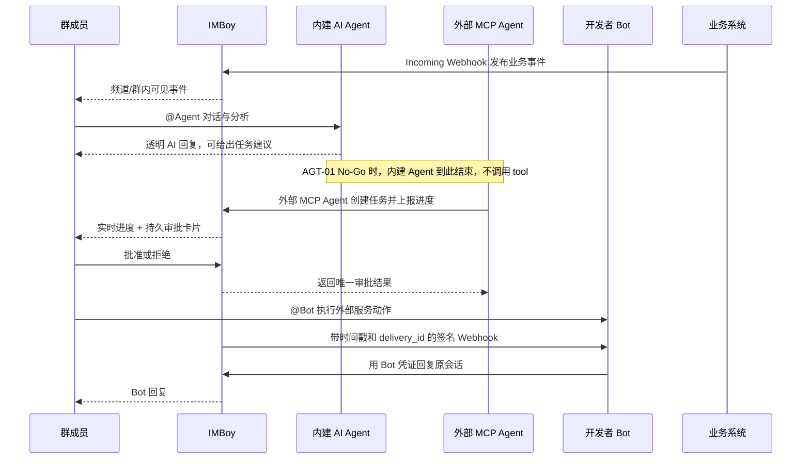
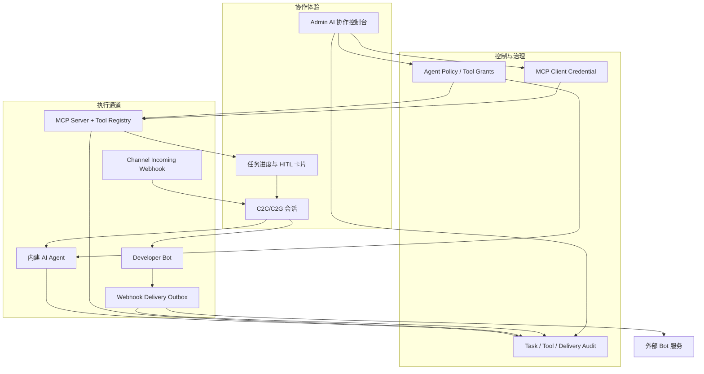
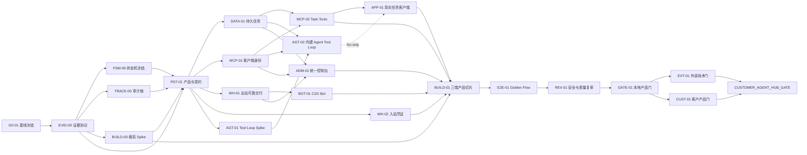

# IMBoy Agent Hub 产品收敛执行计划

版本：1.2
日期：2026-09-07
计划状态：`READY_FOR_G0_ONLY`
目标状态：`LOCAL_AGENT_HUB_GATE = PASS`
外部技术状态：`EXT_AGENT_HUB_GATE = BLOCKED_EXTERNAL`，直到真实设备、真实 MCP 客户端和客户隔离环境验证完成。
客户产品状态：`CUSTOMER_PRODUCT_GATE = BLOCKED_EXTERNAL`，直到目标用户可用性验收完成。
最终状态：`CUSTOMER_AGENT_HUB_GATE = BLOCKED_EXTERNAL`，仅当外部技术门和客户产品门均 PASS 后才可 PASS。

## 1. 结论与产品定义

本计划不再把 AI Agent、MCP、开发者 Bot、频道 Webhook 当成四个并列菜单继续堆功能，而是收敛为一个可演示、可部署、可治理的产品能力：

> **IMBoy Agent Hub：部署在客户数据域内，让人、内建 AI Agent、外部 MCP Agent 和业务 Bot 在同一个 IM 会话中协作，并由管理员统一控制工具权限、人工审批、Webhook 交付和审计证据。**

目标客户不是泛消费者，而是需要私有部署、人工介入和操作留痕的团队。第一版只打通三个高价值工作流：

1. 人在 C2C/C2G 中与透明标识的内建 AI Agent 对话。
2. 外部 Agent 通过受控 MCP Client 身份读取允许的数据、发送消息、创建任务并请求群内人工审批。
3. 外部业务系统通过 incoming webhook 把事件送入频道；开发者 Bot 通过签名 webhook 接收 C2C/C2G mention，并通过受限 API 回复。

“拳头产品”的验收不以页面数量或模块存在为准，而以一条可重复的 Golden Flow 为准：



### 1.1 五项核心冻结修订

本版本不扩 Agent Hub 功能范围，只增加五个防返工控制面：

1. `FSM-00`：把 Agent Task 状态迁移固化为机器可验证矩阵。
2. `EVID-00`：统一 `Acceptance -> evidence.json -> verifier -> PASS/FAIL`。
3. `TRACE-00`：用可信 `correlation_id` 串联 request、task、event、approval、execution、delivery。
4. `BUILD-00`：在功能实现前验证三端是否真的支持编译期物理裁剪。
5. `CUST-01`：把首次成功耗时、审批理解度和审计重建能力纳入独立客户产品门。

执行硬门：`G0-01` 可以立即启动并产出 draft evidence；随后 `EVID-00` 建立 verifier 并回验 G0；`FSM-00`、`TRACE-00`、`BUILD-00` 在 EVID-00 PASS 后可并行；`PDT-01` 必须等待四项冻结任务全部 PASS，且 `BUILD-00=Go`。在此之前不得启动任何业务实现任务。

## 2. 当前事实基线

以下结论来自 2026-09-07 对当前工作树的只读核对。执行会话仍须在自己的 Base SHA 上重新验证，不能直接引用本段代替证据。

| 能力 | 已存在 | 当前不能声称完成的边界 |
|---|---|---|
| AI Agent | 一等账号、Provider 抽象、角色版本、能力策略、知识库、C2C/C2G 回复、流式消息、管理页 | OpenAI 兼容 Provider 明确为 `tools=false`；内建 Agent 尚不能执行 MCP tools |
| MCP Server | `/api/v1/mcp`、7 个工具、SSE/session/replay、按 tool grant、审批与审计页、Agent Card | 客户端身份仍近似 `owner_uid`，一个用户一个 client；默认 `mcp_governance_enforce=false`；缺少独立、可撤销、只显示一次的 MCP 凭证 |
| Agent Task | 后端 observer、过渡态实时推送、终态持久消息、审批卡片、Flutter 渲染和审批按钮 | 状态与审批保存在 ETS；服务重启丢失；真实 task bridge 不存在，生产入口仍是 demo driver |
| 开发者 Bot | `account_type=3`、注册/启停/搜索、C2C webhook、API token 回复、管理页 | 仅 C2C；`events` 只是元数据；`api_token`/`verify_token` 可按明文查询；无持久投递、重试、死信、delivery audit；签名无 timestamp/delivery_id 防重放语义 |
| 频道 Webhook | token-as-credential、频道锁定、管理员管理、双维限流、system bot 身份 | token 仍以可查询明文存储；缺少轮换、摘要存储和迁移期双读策略 |
| 产品组合 | 后端、Flutter、Admin 已有构建期功能矩阵 | Agent/MCP/Bot/Agent Task 尚未成为可独立裁剪的完整三端产品 profile |
| 开发者体验 | Agent/Bot 指南、局部 API 契约 | 根文档声称的 `imboy-sdk-js/` 当前工作区不存在；本计划不能假设 SDK 可修改 |

需保留的现有设计边界：

- `account_type=1` 是内建 AI Agent，`2` 是频道 incoming webhook 的 system bot，`3` 是开发者 Bot；不得合并枚举语义。
- MCP tools 和内建 Agent 可以共享 tool registry/schema，但认证与授权上下文不同，不得把 Agent 冒充 MCP Client。
- E2EE 消息不允许服务端 AI、Bot webhook、MCP 搜索或任务观察读取正文；未知 E2EE 状态必须 fail-closed。
- 不建设运行时动态插件市场；继续使用单仓模块化单体、声明式注册和构建期裁剪。
- AI Agent、Bot、Webhook 的多步建号/绑定目前已经事务化；不得按旧审计重复修复。

## 3. V1 范围与非目标

### 3.1 V1 必须交付

- 独立 MCP Client 身份、凭证摘要、到期/撤销、按 tool grant，商务/Agent Hub profile 默认强制治理。
- 持久 Agent Task、事件、审批结果；服务重启后任务和审批仍可恢复。
- MCP task tools：创建任务、更新进度、请求审批、读取结果。
- Bot C2G mention webhook 和原会话回复；严格校验群成员关系、Bot 状态和目标会话。
- 出站 Bot webhook 的凭证安全、URL/egress 策略、签名防重放、持久 outbox、有界重试、死信和手工重放。
- 频道 incoming webhook 的 token 摘要存储、轮换和兼容迁移。
- Admin 统一“AI 协作”入口，复用现有 Agent/MCP/Bot 页面并补任务、交付和凭证治理。
- Flutter 用真实 task bridge 验证现有进度与审批 UI；生产构建不可暴露 demo endpoint。
- 一个配置文件选择 Agent Hub profile 后，Backend/Admin/Flutter 产物只包含并暴露所选功能。
- 全本地、无第三方依赖的 Golden Flow harness 和机器可读证据包。

### 3.2 有条件交付

内建 Agent 调用 tools 属于 V1 的增强闭环，但必须先通过 `AGT-01` spike：

- Go：复用现有 OpenAI 兼容 Provider 和 MCP tool registry，能在最多 3 轮内稳定完成 tool call，且写操作可进入 HITL。
- No-Go：Provider 兼容性需要大量特判、模型不能稳定输出结构化 tool call、或授权上下文无法保持最小权限。

No-Go 不阻断基础 Agent Hub SKU；记录决策后跳过 `AGT-02`，产品口径保持“外部 Agent 经 MCP 执行工具，内建 Agent负责对话与分析”。

Golden Flow 的必选路径始终是“内建 Agent 纯对话/分析 + 外部 MCP Agent 创建任务”。仅当 `AGT-01=Go` 时，E2E-01 才追加“内建 Agent 经受控 tool 创建同类任务”的可选支路；演示脚本不得把该支路冒充 V1 必选能力。

### 3.3 明确不做

- 不发明新协议，不实现完整 A2A/AGUI SDK，不做运行时动态插件市场。
- 不做任意工作流编排器、可视化 DAG、Agent 记忆平台或多 Agent 自主规划框架。
- 不承诺 E2EE 会话中的服务端 AI/Bot/MCP 正文能力。
- 不做 HA、跨节点一致限流、多租户 SaaS 隔离、信创或国密扩展。
- 不接真实客户系统，不使用真实 Webhook URL、真实 LLM key、生产数据或 PII。
- 不上线、不部署生产、不 push、不发信、不 @第三方、不发布任何内容。
- 不恢复或新建 `imboy-sdk-js` 仓库；是否恢复 SDK 由用户另行决定。

## 4. 全局执行协议

### 4.1 仓库与工作树

1. 工作区聚合目录不是 Git 仓库；不得依赖个人机器绝对路径。每个会话先执行下列探测协议；`IMBOY_WORKSPACE_ROOT`、`IMBOY_EVIDENCE_ROOT` 允许由环境显式覆盖。
2. 探测必须验证 `imboy`、`imboyapp`、`imboyadmin` 各自为独立 Git 仓库；无法唯一定位时标记 `blocked` 并记录 `blocker_code=workspace_not_found`，不得猜路径。
3. 任务只修改其卡片声明的仓库和文件；每个任务使用独立 branch/worktree。
4. 每个会话开始时记录解析后的路径、`Base SHA`、branch、`git status --short --branch` 和目标文件当前 owner。
5. 不 reset、clean、stash、checkout 覆盖或吸收共享工作树中的既有改动。
6. 未经用户单独确认 git author/committer 身份，不创建 commit；任何计划中的 Commit 字段都只是建议边界。
7. 不 push。需要合并时由 Coordinator 先检查迁移顺序、API 契约和交叉文件。

```bash
# 显式传入的环境变量优先；否则从当前目录向上寻找同时包含三仓的聚合目录。
if [ -z "${IMBOY_WORKSPACE_ROOT:-}" ]; then
  probe="$PWD"
  while [ "$probe" != / ]; do
    [ -e "$probe/imboy/.git" ] && [ -e "$probe/imboyapp/.git" ] && [ -e "$probe/imboyadmin/.git" ] && break
    probe="$(dirname "$probe")"
  done
  [ "$probe" != / ] || { echo "IMBoy workspace not found" >&2; exit 1; }
  IMBOY_WORKSPACE_ROOT="$probe"
fi
IMBOY_WORKSPACE_ROOT="$(cd "$IMBOY_WORKSPACE_ROOT" && pwd -P)" || exit 1
IMBOY_TMP_ROOT="${TMPDIR:-/tmp}"
IMBOY_EVIDENCE_ROOT="${IMBOY_EVIDENCE_ROOT:-${IMBOY_TMP_ROOT%/}/imboy-agent-hub}"

for repo in imboy imboyapp imboyadmin; do
  test "$(git -C "$IMBOY_WORKSPACE_ROOT/$repo" rev-parse --show-toplevel)" = "$IMBOY_WORKSPACE_ROOT/$repo" || exit 1
done
mkdir -p "$IMBOY_EVIDENCE_ROOT"
IMBOY_EVIDENCE_ROOT="$(cd "$IMBOY_EVIDENCE_ROOT" && pwd -P)" || exit 1
case "$IMBOY_EVIDENCE_ROOT/" in "$IMBOY_WORKSPACE_ROOT/"*) echo "Evidence root must be outside workspace" >&2; exit 1;; esac
export IMBOY_WORKSPACE_ROOT IMBOY_EVIDENCE_ROOT
```

### 4.2 数据库和迁移号

本计划在当前最高迁移 `00000089` 之后预留：

| 迁移 | 独占任务 | 主题 |
|---|---|---|
| `00000090` | DATA-01 | 持久 Agent Task / event / decision |
| `00000091` | MCP-01 | MCP Client 独立身份与凭证摘要 |
| `00000092` | WH-01 | Bot 凭证加固与 webhook delivery outbox |
| `00000093` | WH-02 | Channel webhook token 摘要与轮换 |

执行前 Coordinator 必须运行 G0-01 的自动占用检查并确认这些编号仍未被占用。若已占用，只允许 Coordinator 一次性重编号并更新本文档与所有任务卡；各实现会话不得自行抢号。

所有 PostgreSQL 测试使用独立 scratch DB：

```bash
: "${TASK_ID:?set TASK_ID to the assigned task card ID}"
case "$TASK_ID" in ''|*[!A-Z0-9-]*) echo "Invalid TASK_ID" >&2; exit 1;; esac
task_db_suffix="$(printf '%s' "$TASK_ID" | tr '[:upper:]-' '[:lower:]_')"
cd "$IMBOY_WORKSPACE_ROOT/imboy"
mkdir -p "$IMBOY_EVIDENCE_ROOT/_scratch/$TASK_ID"
cp config/sys.local.config "$IMBOY_EVIDENCE_ROOT/_scratch/$TASK_ID/sys.local.config"
# 只在临时副本中把 database 改为 "imboy_agent_hub_$task_db_suffix"
createdb "imboy_agent_hub_$task_db_suffix"
```

若本机实际 PostgreSQL 连接方式不同，任务标记 `blocked` 并记录 `blocker_code=local_db_unavailable` 与缺失条件，不得改共享开发库或生产库凑验收。

### 4.3 测试与证据

- 任务状态仅使用：`ready`、`blocked`、`blocked_conditional`、`blocked_external`、`blocked_decision`、`blocked_owner`、`in_progress`、`review`、`done`、`wont_do_v1`。
- 后端 EUnit 模块串行执行：`make eunit-local t=<module>`；不把裸 `make eunit t=` 的 missing config 假红当产品失败。任务卡中的模块名是计划名，执行时以 G0-01 产出的 `test-module-map.tsv` 为准；改名只能由 Coordinator 同步卡片和映射。
- 先写最小失败测试，再实现，再运行任务卡的正反例。
- 每张任务卡的每条 Acceptance 使用稳定 ID：`<TASK_ID>-A01`、`A02`……；执行会话不得合并、删除或弱化 Acceptance。
- 每个任务固定输出 `$IMBOY_EVIDENCE_ROOT/<TASK_ID>/evidence.json`，并通过 EVID-00 交付的 verifier；Markdown 报告只是人读附件，不能决定状态。
- 本地日志统一写入同一任务证据目录，不得包含 token、secret、消息正文或 PII。
- 所有 secret 证据只允许记录 `prefix`、摘要或“已生成/已撤销”的布尔事实。
- 默认 `${TMPDIR:-/tmp}` 下的证据目录是易失工作区，不是长期归档。任务 PASS 后由 Coordinator 生成 `evidence.sha256` 并复制到当前执行批次的受控归档目录；归档目录不得进入 Git、不得含 secret/PII，实际路径和保留期必须记录在 G0-01。机器重启、合并 Base 变化或 hash 不符时，相关证据作废并重跑。
- Coordinator 是唯一可以更新总状态、迁移号和 Gate 结论的角色。

`evidence.json` 的最低语义由 EVID-00 的 JSON Schema 固定；每张任务卡必须交付：

```json
{
  "schema_version": 1,
  "task_id": "<TASK_ID>",
  "status": "PASS|FAIL|BLOCKED|PARTIAL",
  "base_sha": {"imboy": "<sha-or-na>", "imboyapp": "<sha-or-na>", "imboyadmin": "<sha-or-na>"},
  "final_diff": ["<repo>:<repo-relative-path>"],
  "commands": [{"id": "cmd-01", "command": "<exact command>", "exit_code": 0}],
  "tests": {"passed": 0, "failed": 0, "skipped": 0},
  "acceptance": [{"acceptance_id": "<TASK_ID>-A01", "status": "PASS", "command_ids": ["cmd-01"], "artifact_ids": ["artifact-01"], "assertions": [], "counts": {}}],
  "artifacts": [{"id": "artifact-01", "path": "<path>", "sha256": "<hex>"}],
  "residual_risks": [],
  "commit": "<sha|not-created-no-identity-approval>"
}
```

verifier 必须 fail-closed：Schema/字段/Acceptance/命令/artifact/hash 任一缺失或不一致即 FAIL；非零命令不得支撑 PASS；`BLOCKED`、`PARTIAL` 或 Acceptance 非全 PASS 时，总结论不得为 PASS。verifier 同时输出机器可读单任务结论，GATE-01 只聚合 verifier 结果，不手工改判。

### 4.4 会话停止条件

任一条件成立即停止该任务，不扩权处理：

- 目标路径已有其他会话未合并改动，或迁移号被占用。
- 需要真实凭证、生产数据、第三方通知、设备安装、登录或外部发布。
- 需要改变 E2EE 产品语义、账号类型语义、支付责任主体或客户承诺。
- 基线已有失败且无法证明本任务零新增回归。
- 连续两轮没有新证据，或同一 blocker 重复出现。

## 5. 目标架构与关键约束



关键实现决策：

- 不引入通用 event bus。任务事件用 `agent_task_event`，Webhook 交付用专用 outbox，二者职责不同。
- 不让内建 Agent 通过 HTTP 回调自己的 MCP endpoint。若 `AGT-01` 为 Go，直接复用 tool registry/schema，走独立 `agent_tool_gate`。
- MCP tool 按调用者身份执行，绝不信任参数中的 uid；Agent tool 默认继承发起用户身份，proactive 场景无人工发起者时禁止写工具。
- 高风险/写工具必须返回 `awaiting_approval`，批准后只执行一次；拒绝、过期、重复批准都不得执行。
- 任务状态、审批、Webhook delivery 都要有幂等键和数据库唯一约束，不能只靠进程内 ETS。
- 对外副作用不宣称理论上的 exactly-once。契约统一为：IMBoy 对同一 execution 幂等键只调度一次；工具必须接收并下沉该幂等键；可证明幂等的工具允许崩溃恢复重试，不可证明幂等的工具采用 at-most-once 并在不确定结果时进入人工复核，绝不自动重复副作用。
- Webhook 默认仅允许 HTTPS 和公网目标；私有化环境只能通过部署侧精确 host/CIDR egress allowlist 开放内网服务，云元数据地址永远拒绝。本地测试可显式允许 loopback fixture。注册时和发送时都做解析/地址策略检查，防 DNS rebinding/SSRF。
- 出站连接必须使用校验通过的解析 IP 建连并保持原 Host/SNI；redirect 每跳重新解析、校验和 pin，禁止在校验后重新走未受控 DNS。
- 出站签名至少覆盖 `timestamp + delivery_id + raw_body`；接收方可按时间窗和 delivery_id 去重。

## 6. 依赖拓扑与并行波次



波次表示“完成本行退出条件后才能进入下一行”；同一行仅当依赖满足时并行，不表示行内任务可以忽略箭头顺序。PDT-01 保持单一冻结 owner 是有意取舍：牺牲少量并行度，换取 task/webhook/MCP 三份契约的一致术语和信任边界。

| Wave | 执行单元 | 最大并行度 | 退出条件 |
|---|---|---:|---|
| 0 | G0-01 | 1 | 基线、冲突路径、迁移号和任务 owner 固定 |
| 1A | EVID-00 | 1 | verifier 回验 G0-01，G0-01 与 EVID-00 均 PASS |
| 1B | FSM-00、TRACE-00、BUILD-00 | 3 | 三项均 PASS，状态/链路冻结，BUILD-00=Go |
| 2 | PDT-01 | 1 | 产品/API 契约引用四项冻结产物并通过评审 |
| 3A | DATA-01、MCP-01、WH-01、WH-02 | 4 | 四个数据/安全地基 PASS；迁移任务不得共用 DB |
| 3B | AGT-01 | 1 | Tool Loop 得出 Go/No-Go；可与 3A 同期排队但不突破总并发上限 |
| 4 | MCP-02、BOT-01、AGT-02（仅 Go）、ADM-01 | 4 | 真实后端闭环和管理面 PASS；每项依赖均满足 |
| 5 | APP-01 | 1 | 客户端真实 task path PASS |
| 6 | BUILD-01 | 1 | 三端 Agent Hub profile 物理裁剪 PASS |
| 7A | E2E-01 | 1 | 最终合并 Base 上 Golden Flow 与 runbook 证据 PASS |
| 7B | REV-01 | 1 | E2E-01 后复审，HIGH/MEDIUM 阻断清零 |
| 7C | GATE-01 | 1 | REV-01 后聚合本地证据并判定 |
| 8 | EXT-01、CUST-01 | 人工控制 | 用户分别授权外部技术验证和目标用户产品验收 |

本计划不提供日历工时承诺：共享脏工作树、scratch DB、真机构建和外部授权会使小时估算失真。调度以任务卡和 Gate 为单位；Coordinator 只用实际命令时长与 blocker 证据更新吞吐，不用估时覆盖未完成验收。

## 7. 独占文件与交叉边界

| 任务 | 仓库 | 独占路径 |
|---|---|---|
| G0-01 | 三仓只读 | 不修改产品文件；只写 `$IMBOY_EVIDENCE_ROOT` |
| FSM-00 | `imboy` | `docs/api-contracts/agent_hub_task_state_machine.{md,json}`、状态矩阵 verifier/tests |
| EVID-00 | `imboy` | `docs/testing/agent-hub-evidence.schema.json`、`scripts/verify_agent_hub_task_evidence.py`、对应 tests |
| TRACE-00 | `imboy` | `docs/api-contracts/agent_hub_correlation_contract.md`、trace contract verifier/tests |
| BUILD-00 | 三仓只读为主 | 现有 feature artifact verifier 的最小探针、BUILD-00 决策与证据；不新增 Agent Hub feature |
| PDT-01 | `imboy` | `docs/api-contracts/agent_hub_*`（不含前三项冻结文件）、Agent Hub ADR、本计划裁决区 |
| DATA-01 | `imboy` | migration 90；新 `agent_task_*_repo/ds/logic`；现有 observer/handler 及其测试 |
| MCP-01 | `imboy` | migration 91；`mcp_client_*`、MCP auth middleware、治理 handler/logic/tests |
| MCP-02 | `imboy` | `imboy_mcp_tools.erl`、task tool tests、MCP task contract |
| WH-01 | `imboy` | migration 92；`bot_repo/ds` 凭证路径；`bot_webhook_delivery_*`、`bot_webhook_logic.erl`、worker/tests |
| WH-02 | `imboy` | migration 93；`channel_webhook_*` 及 tests |
| BOT-01 | `imboy` | Bot C2G routing、`bot_logic/handler`、Bot webhook event tests |
| AGT-01 | `imboy` | 仅 spike/test/decision 文档；不改生产行为 |
| AGT-02 | `imboy` | `imboy_llm*` tool callback、`agent_tool_*`、`ai_agent_reply/group_reply`、tests |
| ADM-01 | `imboyadmin` | AI 协作 nav/page/API/tests；现有频道 webhook 凭证 rotate/list UI；不改后端 |
| APP-01 | `imboyapp` | 现有 agent task UI/API/event state、integration tests；禁止 `ios/*`、`macos/*` |
| BUILD-01 | 三仓 | 产品 feature generator、manifest、三端生成物和对应 tests |
| E2E-01 | `imboy` | 新 `scripts/agent_hub_*`、fixtures、Agent Hub 本地复现 runbook；复用 EVID-00 verifier，不改业务逻辑 |
| REV-01 | 三仓只读 | 不修改；发现问题退回原任务 owner |
| GATE-01 | 三仓只读 | 只聚合不可变 evidence/hash；不修改产品文件 |
| EXT-01、CUST-01 | 外部人工 | 不写仓库；只在获授权的受控证据位置产出脱敏结果 |

共享文件 `src/imboy_router.erl`、`src/imboy.app.src`、`config/product-feature-manifest.json` 只能由 Coordinator 在依赖任务完成后串行整合，子任务提交不得顺手格式化或重排这些文件。

## 8. 任务卡索引

任务卡已外置，主计划只保留产品冻结决策、全局协议、依赖拓扑和边界。执行会话必须只领取一张卡，并读取本文 §4 全局执行协议、§6 依赖拓扑、§7 独占边界；不得从旧聊天或主计划历史副本恢复卡片内容。任务卡中的 Actions、Verify、Acceptance 和 Stop 是该任务的权威执行入口。

| Task | Status | Dependencies | 权威任务卡 |
|---|---|---|---|
| G0-01 | `ready` | 无 | [G0-01](tasks/G0-01.md) |
| FSM-00 | `blocked` | G0-01 draft evidence 完成、EVID-00=PASS | [FSM-00](tasks/FSM-00.md) |
| EVID-00 | `blocked` | G0-01 draft evidence 完成 | [EVID-00](tasks/EVID-00.md) |
| TRACE-00 | `blocked` | G0-01=PASS、EVID-00=PASS | [TRACE-00](tasks/TRACE-00.md) |
| BUILD-00 | `blocked` | G0-01=PASS、EVID-00=PASS | [BUILD-00](tasks/BUILD-00.md) |
| PDT-01 | `blocked` | FSM-00=PASS、EVID-00=PASS、TRACE-00=PASS、BUILD-00=Go | [PDT-01](tasks/PDT-01.md) |
| DATA-01 | `blocked` | PDT-01、FSM-00、TRACE-00 | [DATA-01](tasks/DATA-01.md) |
| MCP-01 | `blocked` | PDT-01、TRACE-00 | [MCP-01](tasks/MCP-01.md) |
| WH-01 | `blocked` | PDT-01、TRACE-00 | [WH-01](tasks/WH-01.md) |
| WH-02 | `blocked` | PDT-01、TRACE-00 | [WH-02](tasks/WH-02.md) |
| AGT-01 | `blocked` | PDT-01、FSM-00、TRACE-00 | [AGT-01](tasks/AGT-01.md) |
| MCP-02 | `blocked` | DATA-01、MCP-01、FSM-00、TRACE-00 | [MCP-02](tasks/MCP-02.md) |
| BOT-01 | `blocked` | WH-01、TRACE-00 | [BOT-01](tasks/BOT-01.md) |
| AGT-02 | `blocked_conditional` | AGT-01=Go、DATA-01、MCP-01、FSM-00、TRACE-00 | [AGT-02](tasks/AGT-02.md) |
| ADM-01 | `blocked` | DATA-01、MCP-01、WH-01、WH-02、TRACE-00 | [ADM-01](tasks/ADM-01.md) |
| APP-01 | `blocked` | MCP-02、TRACE-00；AGT-02 若执行则一并接入 | [APP-01](tasks/APP-01.md) |
| BUILD-01 | `blocked` | BUILD-00=Go、MCP-02、BOT-01、WH-02、ADM-01、APP-01；AGT-02 为可选 | [BUILD-01](tasks/BUILD-01.md) |
| E2E-01 | `blocked` | BUILD-01、EVID-00、TRACE-00 | [E2E-01](tasks/E2E-01.md) |
| REV-01 | `blocked` | E2E-01、EVID-00 | [REV-01](tasks/REV-01.md) |
| GATE-01 | `blocked` | REV-01、EVID-00；AGT-02 仅在 AGT-01=Go 时要求完成 | [GATE-01](tasks/GATE-01.md) |
| EXT-01 | `blocked_external` | GATE-01=PASS、用户明确授权设备/账号/外部动作 | [EXT-01](tasks/EXT-01.md) |
| CUST-01 | `blocked_external` | GATE-01=PASS、用户明确授权目标用户参与和联系方式使用 | [CUST-01](tasks/CUST-01.md) |

## 9. 会话启动模板

其他会话接任务时使用以下模板，替换 `<TASK_ID>`：

```text
执行计划：imboy/docs/planning/ai-agent-mcp-bot-webhook-product-convergence-plan-2026-09.md
权威任务卡：imboy/docs/planning/tasks/<TASK_ID>.md

只执行这张权威任务卡。先读取根 AGENTS.md、目标仓规则、计划 §4/§6/§7 和依赖任务证据；不要读取其他任务卡。
开始前执行 §4.1 路径探测，并输出解析路径、Base SHA、dirty paths、目标文件 owner、依赖状态和迁移号检查。
使用独立 worktree/scratch DB；不 reset/clean/stash，不覆盖其他会话改动。
先写失败测试，再最小实现，再运行任务卡全部正反验收。
只修改任务卡独占文件；共享 router/app.src/manifest 交给 Coordinator。
未经用户确认 git 身份不 commit；不 push、不部署、不联系第三方、不使用真实凭证。
结束时生成 $IMBOY_EVIDENCE_ROOT/<TASK_ID>/evidence.json，运行 EVID-00 verifier，再报告 PASS/FAIL/BLOCKED/PARTIAL；不用局部测试冒充 Gate。
```

### 9.1 ZCode + GLM-5.3 连续执行提示词

下面的提示词允许 GLM-5.3 对本地、可逆、范围内技术决策直接裁决，不取消 AGENTS.md 的外向操作硬边界。遇到硬边界时不发起人工确认，而是记录 BLOCKED 并继续其他可执行任务。

```text
你是 IMBoy Agent Hub 收敛计划的 Coordinator 和执行者，主决策模型使用 GLM-5.3。

权威计划：$IMBOY_WORKSPACE_ROOT/imboy/docs/planning/ai-agent-mcp-bot-webhook-product-convergence-plan-2026-09.md
任务卡：$IMBOY_WORKSPACE_ROOT/imboy/docs/planning/tasks/<TASK_ID>.md
工作区：先执行计划 §4.1 探测；可用 IMBOY_WORKSPACE_ROOT 覆盖（聚合目录，不是 Git 仓库）
证据根目录：先执行计划 §4.1 探测；可用 IMBOY_EVIDENCE_ROOT 覆盖

目标：严格按依赖执行到 LOCAL_AGENT_HUB_GATE 可判定为止。不要扩展 V1，不要跳过 Gate，不要用 mock/静态 marker/局部测试替代计划要求的证据。

自主决策规则：
1. 对所有本地、可逆、任务卡范围内的技术分歧，不向我提问。GLM-5.3 直接选择安全、最小、复用现有代码、测试最充分且回滚成本最低的方案，记录 decision/rationale/residual_risks 后继续。
2. 信息不足时先只读检索代码、AGENTS.md、依赖证据和当前工作树；能由仓库事实解决就自行解决。普通测试失败必须定位根因并在任务范围内修复，不把选择题抛给我。
3. 严格按 G0-01 draft evidence -> EVID-00 回验 -> (FSM-00,TRACE-00,BUILD-00) -> PDT-01 -> 后续拓扑执行。四项冻结未全 PASS 或 BUILD-00 非 Go 时，禁止 PDT-01 和业务实现。
4. 每次只认任务卡声明的独占文件。共享 router/app.src/manifest 由 Coordinator 串行整合。保留所有既有 dirty changes；禁止 reset、clean、stash、覆盖或夹带无关修改。
5. 每条 Acceptance 必须映射到 $IMBOY_EVIDENCE_ROOT/<TASK_ID>/evidence.json，并运行统一 verifier。verifier 非 PASS 就不能把任务标 PASS。Base 变化后旧证据标 superseded 并重跑。
6. 不创建 commit（除非我另行明确确认 git author/committer 身份），不 push、不部署生产、不访问生产数据、不安装设备、不使用真实凭证、不联系或通知第三方。
7. 若遇到联系方式、第三方影响、生产/发布、真实账号/设备/客户环境、不可逆外向操作等 AGENTS.md 强制人工确认边界，不要在本轮向我询问，也不要执行；将对应任务记为 BLOCKED_EXTERNAL，写清需要的授权，然后继续所有不依赖该任务的本地工作。
8. 若同一阻断连续两轮没有新证据，停止该任务，写 evidence.json；不要无限重试。若无其他可执行任务，输出总状态、首个未满足依赖、已完成任务证据路径和下一次恢复命令。

立即开始：先只执行 G0-01 并产出 draft evidence，再执行 EVID-00 回验；二者 PASS 后按最大安全并行度推进 FSM-00、TRACE-00、BUILD-00。每个任务结束都输出：Task、Status、Base SHA、Final diff、Commands、Tests、Evidence、Acceptance mapping、Residual risks、Commit 状态。不要先写长计划复述。
```

## 10. Coordinator 合并顺序

1. 先结算 G0-01，再合并 FSM-00、EVID-00、TRACE-00 和 BUILD-00；四项未冻结不得合并 PDT-01。
2. 合并 PDT-01 契约，确认只引用冻结状态/证据/trace 真源，不接受 prose 分叉。
3. 按迁移号 90、91、92、93 串行合并，并在空 scratch PG 做完整 up。
4. 合并 DATA/MCP/Webhook 后端逻辑，集中处理 router/app.src，不接受各分支重复修改。
5. 合并 MCP-02、BOT-01；AGT-02 只在 Go 时进入；ADM-01 必须包含 WH-02 频道 webhook UI。
6. 合并 Admin、Flutter，再执行 BUILD-01 生成三端产物。
7. Coordinator 完成最后一次集成后，重新分派 E2E-01 owner 在最终 Base 重跑；原证据标 superseded，不手工搬用。
8. REV-01 清零阻断后才结算 GATE-01；EXT-01 与 CUST-01 分别获得人工授权后独立执行。

每次合并前执行：

```bash
git status --short --branch
git diff --cached --name-status
git diff --check
```

## 11. 最终验收矩阵

| 验收维度 | 自动化证据 | LOCAL Gate | EXT 技术门 | CUSTOMER 产品门 |
|---|---|---|---|---|
| Task 状态机 | JSON 矩阵 + 合法/非法迁移 verifier | PASS | 真机状态回读 | 审批理解度 |
| Evidence 协议 | Schema + 单任务/gate verifier | 全任务 PASS | 外部 evidence PASS | 指标 evidence PASS |
| correlation 审计链 | 六类实体 trace verifier | 100% 可重建 | 真实 MCP/真机链路 | 10 分钟内人工重建 |
| 内建 Agent 对话 | EUnit + fake LLM + local protocol | PASS | 真机可见 | 首次成功流程可理解 |
| 内建 Agent tools | Spike；Go 时 tool-loop tests | Go 完成或 No-Go 明示 | 仅产品声称支持时实测 | 不作独立指标 |
| MCP 身份/授权 | credential/grant/revoke/expiry/rate-limit 负例 | PASS | 真实 MCP client | 审批请求来源可理解 |
| Agent Task/HITL | DB 并发、重启、协议 harness | PASS | 真机审批与回读 | TTFS/理解度达标 |
| Bot C2C/C2G | 本地 receiver + reply context | PASS | 可选客户 Bot fixture | 不作独立指标 |
| Outbound Webhook | retry/dead/replay/SSRF/IP-pin fixture | PASS | 客户网络策略确认 | delivery 可重建 |
| Incoming Webhook | digest/rotate/channel lock | PASS | 客户系统联调 | request 可重建 |
| E2EE 边界 | 正反契约测试 | fail-closed PASS | 客户知情确认 | 已知限制签署 |
| 三端裁剪 | BUILD-00 probe + base-only/selected 产物检查 | PASS | 交付包复验 | 不作独立指标 |
| 审计与隐私 | trace 关联 + 精确扫描/宽扫描分诊 | PASS | 脱敏证据 PASS | correlation 完整率 100% |

## 12. 完成定义

只有以下全部成立，计划才可标记工程完成：

- FSM-00、EVID-00、TRACE-00、BUILD-00 在 PDT-01 前冻结且均 PASS，BUILD-00=Go。
- V1 必选任务全部通过，AGT-01 条件任务有明确结论。
- 真实 task bridge 已替代 demo 作为验收入口，ETS 不再是审批真源。
- MCP 默认治理、Bot/Webhook 可靠交付和 incoming token 摘要均有负例证明。
- 一个 manifest 能产出 Agent Hub 组合，并由物理 artifact 证明 base-only 不包含对应能力。
- Golden Flow 从空 scratch 环境可重复，最终合并 Base 的证据可由独立 verifier 判定，request 到 outcome 可按 correlation_id 完整重建。
- E2E-01 有明确 runbook owner、最终 Base 重跑证据和可复核归档，易失或旧 Base 证据未冒充当前证据。
- `LOCAL_AGENT_HUB_GATE`、`EXT_AGENT_HUB_GATE`、`CUSTOMER_PRODUCT_GATE` 分开报告，没有用 mock、静态检查、内部演练或计划文档替代外部/客户证据。

工程完成只要求 `LOCAL_AGENT_HUB_GATE=PASS`。最终产品对客户可声明完成还必须同时满足 `EXT-01=PASS` 与 `CUST-01=PASS`，即 `CUSTOMER_AGENT_HUB_GATE=PASS`。

完成本计划并不自动授权 commit、push、部署、设备安装、外部联调或发布。

## 13. 执行 Base SHA 与 Coordinator 裁决记录（PDT-01 补记）

> 本节仅补记执行时点事实与裁决，不更新任务状态、不改写 §5 冻结契约与 §7 独占边界。

### 13.1 Base SHA（PDT-01 结算时点，2026-09-07）

| 仓库 | HEAD |
|---|---|
| imboy | bb293766d59ec93aeebedbb5ed33bee2ba4dc202 |
| imboyapp | 6bb86db8eab4bf963af30a84693cb1d88d539898 |
| imboyadmin | 3ad1ba09d130aa78f99c32d5f867597158eb3286 |

执行期并行会话持续提交（imboy 当日 c6554852→0e979c70→bb293766 等），全部与
Agent Hub 触达文件零交集；按既有先例（交付 hash 不变 + 新口径复验绿）更新
base_sha 保留证据，不作废。

### 13.2 裁决记录

| # | 裁决 | 依据 |
|---|---|---|
| 1 | BUILD-00=No-Go 的唯一列明修复路径由 BUILD-00R 执行：后端编译期物理裁剪（生成器 per-feature 宏+排除清单、Makefile 覆写 ERLC_EXCLUDE_PATHS+prune 钩子、三处 form 级 ifdef 门控），不动 vendored erlang.mk | 任务卡 BUILD-00 "No-Go 时先另行修复构建架构"；用户"继续"授权自主实施；BUILD-00R 双矩阵+物理探针正反闭环后 BUILD-00 证据标 superseded |
| 2 | LOCAL_AGENT_HUB_GATE 于 2026-09-07 机器判定 PASS（G0-01/EVID-00/FSM-00/TRACE-00/BUILD-00R PASS，BUILD-00 SUPERSEDED 跳过）；判定命令 `verify_agent_hub_task_evidence.py --gate $IMBOY_EVIDENCE_ROOT` | §12 完成定义之 LOCAL Gate 条件；verifier gate 输出归档于证据根 gate-verdict.json 与 .Codex/agent-hub-evidence-archive/GATE/ |
| 3 | EVID-00 证据在 BUILD-00R 升级 verifier（gate 跳过 SUPERSEDED + superseded_by）后按重验流程刷新：33→40 测试全绿、交付物 hash 据实更新、语义未弱化 | §4.3 证据语义（Base/交付变化→重验而非冒用） |
| 4 | 归档双门重验闭环（2026-09-08）：EXT-01 本地 A02 实测驱动的源码修复（digest_hex 导出、agent_task live_status 回读、adm create/grants-set 路由）使 4 任务（MCP-01/DATA-01/MCP-02/WH-02）源码 artifacts 哈希漂移→已刷新+decision 留痕；7 份 evidence.sha256 清单失真（含自引用怪味/缺失引用）→重生成；21 清单 0 失真 + verifier 19 PASS（BUILD-00 SUPERSEDED exit=1 预期） | §4.3 重验而非冒用；归档保持 gate 可重跑语义（`*/evidence.json` 主名 + 双基准清单校验） |
| 5 | router 归属既成事实（2026-09-08）：并行合规批次 R-04（imboy c652af88）以整文件方式收编 `src/imboy_router.erl` 工作树 diff（+443/-358），本计划全部 router 行（BUILD-00R feature 门 include、channel webhook rotate、adm mcp/bot deliveries 路由、moment 编译期裁剪 helper）随之入库，git 历史归属记在 R-04 名下（其 message 未提及）。处置：不重写他人提交；本计划行逐一验证在位且 `make compile` 绿，正确性不受影响；后端提交分组中 C3/C4/C5/C7 不再含 router；adm mcp create/grants-set 的 handler 实现待 C3 提交（HEAD 为「路由先行」中间态，独立构建时该两端点优雅降级）。后续 R-04.1（imboy 489a70d7 / imboyadmin 2f7e550 / imboyapp 8c8818e4，申诉链前后端收尾）与本计划触达文件零交集 | 交付完整性以代码在位+编译绿+归档快照为准；git 归属污染如实记录不回改（他人提交）；证据归档已快照化免疫源码演进（裁决 4 延伸） |
| 6 | 延续 Base 重跑轮（2026-09-08）：易失证据根清空后在当前 Base 重建全部机器判定。Wave0/1 五任务（G0-01/EVID-00/FSM-00/TRACE-00/BUILD-00R）复验 PASS、BUILD-00 保持 SUPERSEDED 跳过，`verify_agent_hub_task_evidence.py --gate` exit 0（LOCAL_AGENT_HUB_GATE 恢复，构成同裁决 2）；PDT-01 四交付物与归档快照哈希一致后复验结算。执行 Base：imboy 2e6c950d / imboyapp 95ec0080 / imboyadmin 969505a7（imboy 自 e56174e8 前移系兄弟 e2ee 提交、零交集，沿用 13.1 先例记执行时点 HEAD） | §4.3 重验而非新建；迁移 90-93 归属（=§4.2 指定任务、哈希一致）、§7 owner 归档锚定、AGT-02 模块映射等裁定见 G0-01 evidence.json；归档刷新事故与修复见 archive/ARCHIVE-INCIDENT-2026-09-08.md |
