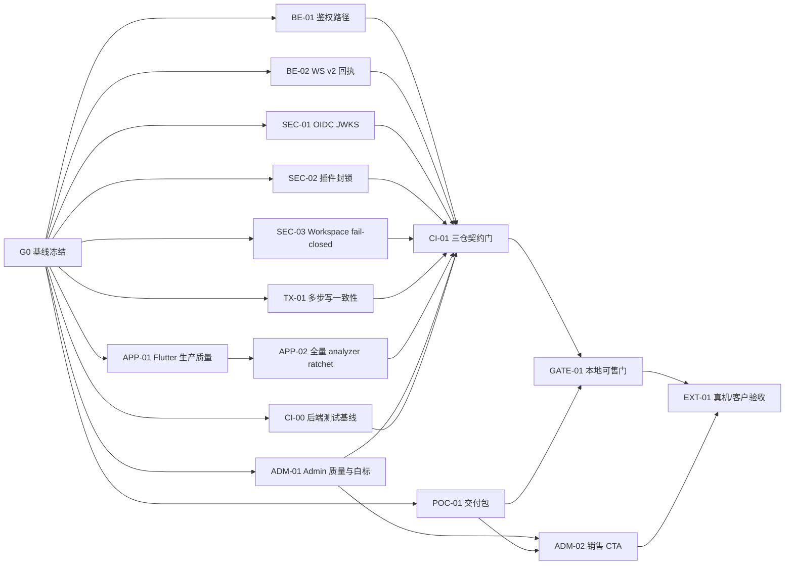

# IMBoy 可售最小安全线：并行执行与验收计划

版本：1.1（2026-08-28 事实核查修订）  
日期：2026-08-28  
目标状态：`LOCAL_SELLABLE_GATE = PASS`  
最终客户状态：`CUSTOMER_GATE = BLOCKED_EXTERNAL`，直到完成真实设备、真实客户环境和客户验收。

> **v1.1 修订记录（执行前事实核查）**：①BE-01 前提过时——`/api/v1/` 死分支已在 HEAD 修复，降级为回归矩阵补全；②BE-02 主体已修复，仅剩 route 回执裸 text 帧残留；③所有裸 `make eunit t=` 因缺 `-config` 会 missing_config 假红，统一改 `make eunit-local t=`；④`preflight.sh` 不支持 `--help`（exit 1），改 `bash -n`；⑤config/sys.local.config 不入仓，worktree 需拷贝并换独立 scratch 库；⑥APP/ADM/CI 基线数字更新为 2026-08-28 实测。

## 1. 计划目标

在不扩张产品范围的前提下，把 IMBoy 收敛为一个可演示、可报价、可单节点部署、可本地验收的私有沟通与项目交付 PoC 包。

本计划只处理上一轮审计中的 P0/P1 发布阻断项：

- 后端鉴权、OIDC、插件、Workspace scope 与多步写一致性。
- Flutter 静态质量与新增债务门禁。
- 管理端综合质量门、白标运行时消费链。
- 三仓协议、构建、测试和发布证据聚合。
- 固定范围的 10 工作日单节点 PoC 交付包。

## 2. 明确不做

- 不实现或承诺集群、HA、信创、国密、LiveKit 录制。
- 不上线真实外部支付，不执行真实充值、退款或生产回调。
- 不扩成 Jira、Notion、CRM、LMS 或完整项目管理系统。
- 不在本计划内大规模拆分所有 800 行以上文件。
- 不联系客户、不发信、不发布、不推送、不使用任何联系方式。
- 不修改 `imboyapp/ios/*`、`macos/*`、`plugin/r_upgrade`。
- 不重置、清理、stash 或覆盖共享工作树现有改动。

## 3. 全局执行规则

1. `/Users/leeyi/project/imboy.pub` 是聚合目录，不是 Git 仓库；所有修改必须落在对应子仓或其独立 worktree。
2. 每个任务使用独立 branch + worktree；同一任务只拥有表中声明的文件范围。
3. 开始前记录目标仓库 `HEAD`、分支、`git status --short`；结束后再次记录并执行 `git diff --check`。
4. 未经用户确认 git author/committer 身份，不创建 commit；可以保留明确范围的未提交变更与补丁。
5. 不 push、不部署、不访问生产、不创建真实订单、不使用真实账号数据。
6. 每个任务必须先写失败测试或可复现检查，再实现，再执行验收命令。
7. 本地测试、mock、静态检查只能形成本地证据，不得写成真机、生产支付或客户验收 PASS。
8. Coordinator 是唯一允许更新本计划状态与 Evidence 字段的角色，避免并行冲突。
9. 后端验收命令一律使用 `make eunit-local t=<模块>`（经 `-config config/sys.local` 注入本地配置）；裸 `make eunit t=<模块>` 会因 `{missing_config, pg_conf}` 级联假红，不得作为验收命令。全量用 `make eunit-local`。
10. `config/sys.local.config` 不入仓，worktree 内不存在；每个连 PG 的 imboy worktree 必须先拷贝该文件（保持不入仓、不 commit），并把 `database` 改为独立 scratch 库 `imboy_rg_<task>`（empty createdb，应用启动经 imboy_migrate 自动建 schema），避免并行任务互踩及影响共享开发库 `imboy_v1`。
11. imboy 共享主树存在他人 WIP 脏文件（group_schedule/vote/album 域 + `src/lib/workspace_resolver.erl` 的群子功能域扩展），任何任务不得读取/吸收/覆盖这些改动；SEC-03 与该 WIP 存在同文件冲突风险，合并时须人工复核。

## 4. 状态机与证据格式

状态：

`blocked → ready → in_progress → review → done`；无法继续时使用 `blocked_external` 或 `blocked_decision`，不得用 `done` 掩盖阻塞。

每个任务交付以下证据：

```text
Task: <ID>
Base SHA: <sha>
Final diff: <files>
Commands: <exact commands>
Result: PASS | FAIL | BLOCKED
Tests: <passed/failed/skipped counts>
Evidence: <log path or CI artifact>
Residual risks: <remaining boundaries>
```

本地日志统一写到 `/private/tmp/imboy-release-gate/<TASK_ID>/`，不得写入真实密钥、生产数据或 PII。

## 5. 并行拓扑



### 并行批次

| Wave | 可并行任务 | 最大并行度 | 进入条件 | 退出条件 |
|---|---|---:|---|---|
| 0 | G0 | 1 | 无 | 三仓基线与冲突清单完成 |
| 1 | BE-01、BE-02、SEC-01、SEC-02、SEC-03、TX-01、APP-01、ADM-01、POC-01、CI-00 | 10 | G0 done；各自独立 worktree | 各任务进入 review/done |
| 2 | APP-02；Wave 1 review | 3 | APP-01 done | Flutter 全量 ratchet 可执行 |
| 3 | CI-01 | 1 | 所有代码任务 done | 三仓契约和 CI 反例门通过 |
| 4 | GATE-01 | 1 | CI-01、POC-01 done | `LOCAL_SELLABLE_GATE=PASS` |
| 5 | ADM-02、EXT-01 | 受人工约束 | 用户确认 CTA 目标、设备、客户和外部动作 | 真实外部证据完成 |

## 6. 任务卡

### G0 — 三仓基线冻结与冲突清单

- Status：`done`（2026-08-28；baseline.txt+mechanics.md）
- Owner：Coordinator
- Dependencies：无
- Scope：只读；三个仓库状态、HEAD、当前基线命令。
- Files：不修改产品文件。
- Actions：
  1. 记录三仓 HEAD、branch、dirty files（2026-08-28 实测：imboy=204626e5 带 13 个脏文件；imboyapp=936b8730 仅 Podfile.lock 脏；imboyadmin=68396eb 干净）。
  2. 标记共享工作树中不可覆盖的路径；`imboyapp` 当前全部改动默认归他人所有。
  3. 为后续任务创建独立 worktree，均从记录的 clean HEAD/指定 base SHA 开始。
  4. 为每个 imboy worktree 拷贝不入仓的 `config/sys.local.config` 并把 `database` 改为 scratch 库名，createdb 空 scratch 库；先用一个已知 PG 测试模块冒烟验证“空库 + 启动自动迁移”可用。
- Verify：

```bash
git -C imboy rev-parse HEAD && git -C imboy status --short
git -C imboyapp rev-parse HEAD && git -C imboyapp status --short
git -C imboyadmin rev-parse HEAD && git -C imboyadmin status --short
```

- Acceptance：三个仓库都有 Base SHA；冲突路径清单非空时已分配到唯一任务；没有执行 reset/stash/clean。
- Evidence：`/private/tmp/imboy-release-gate/G0/baseline.txt`。
- Stop：发现目标文件正在被其他任务修改时，不创建重叠 worktree，先把该任务标记 `blocked_owner`。

### BE-01 — auth_middleware `/api/v1/` 分发回归矩阵补全

- Status：`done`（2026-08-28；commit b135d291，33 用例）

> 2026-08-28 事实核查：死分支已在 HEAD 修复——`src/api/auth_middleware.erl` 已正确把 `<<"/api/v1/">>` 分发给 `auth_middleware_api_v1`（其 open/option/支付回调前缀放行/incoming webhook/设备签名矩阵见 `src/api/auth_middleware_api_v1.erl:21-37`）。本任务降级为回归矩阵补全。

- Owner：Backend-A
- Dependencies：G0
- Repo：`imboy`
- Files：`test/api/auth_middleware_api_v1_tests.erl`、`test/api/auth_middleware_tests.erl` 补用例；`src/api/auth_middleware*.erl` 仅在发现真缺陷时改动；不改其他鉴权模块。
- Actions：审计现有用例覆盖（现状仅覆盖 verify_sign 正向与开关关闭两类）；补矩阵缺口：非 open 路径无 JWT 拒绝、option 路径行为断言、`/api/v1/payment/callback/:gateway` 前缀放行不被 902 拦、incoming webhook token 路径放行、受保护端点无凭证拒绝；正反例齐。
- Verify：

```bash
make app
make eunit-local t=auth_middleware_api_v1_tests
make eunit-local t=auth_middleware_tests
make eunit-local t=adm_auth_middleware_tests
rg -n '<<"/v1/">>' src/api/auth_middleware.erl && exit 1 || true
git diff --check
```

- Acceptance：公开/可选/强鉴权矩阵正反例齐；支付回调不被 902；既有用例零新增失败。
- Evidence：测试计数、矩阵表、diff。
- Stop：任何测试需要真实支付凭据或生产回调时立即 `blocked_external`。

### BE-02 — WebSocket v2 route 回执帧对齐（残留路径）

- Status：`done`（2026-08-28；commit 02e84544，矩阵全过）

> 2026-08-28 事实核查：主体已修复——`reply_frame/2`（websocket_handler.erl:856）与 `encode_delivery_frame_v2`（:924）已按连接 protocol 包 v2 frame，`pb_lossless`（imboy_codec.erl:237）对控制字段丢失回退 JSON 载荷。残留：websocket_handler.erl:530、:554、:572 的 handle_json_message 校验错误回执与 `message_router_logic:route` 返回的 `{reply, Msg2}`（含 C2G_ERROR）仍硬编码 `{text, JSON}`，不看连接 State 的 v2 framing。

- Owner：Backend-B
- Dependencies：G0
- Repo：`imboy`
- Files：`src/api/websocket_handler.erl`、v2 codec/handler 测试；不改客户端、不改 proto。
- Actions：把上述残留回执统一走 `reply_frame/2`（按连接 protocol/framing 编码）；补 v1/v2 × success/error 回归矩阵（含 C2S_SERVER_ACK、C2G_ERROR、CLIENT_ACK_ERROR 非快乐路径的字段完整性断言）。
- Verify：

```bash
make app
make eunit-local t=websocket_handler_tests
make eunit-local t=imboy_codec_tests
git diff --check
```

- Acceptance：v2 连接上 C2G_ERROR/校验错误回执为 v2 frame 且携带完整 type/id/in_reply_to/reason；v1 既有测试零新增失败。
- Evidence：v1/v2 × success/error 矩阵。
- Stop：需要修改 proto 时先标 `blocked_contract`，转 CI-01 统一处理。

### SEC-01 — OIDC JWKS 验签与密钥轮换

- Status：`done`（2026-08-29；commit abb4bb6c，60 用例含 25+5 负向）
- Owner：Security-A
- Dependencies：G0
- Repo：`imboy`
- Files：`src/logic/auth_oidc_logic.erl`、SSO config/HTTP helper、对应测试与 fake IdP fixture。
- Actions：实现 discovery/JWKS 拉取、`kid` 选择、算法白名单、缓存与轮换；保留 iss/aud/exp/nonce/PKCE 校验。
- Verify：

```bash
make app
make eunit-local t=auth_oidc_logic_tests
make eunit-local t=auth_oidc_jwks_tests
git diff --check
```

- Acceptance：有效签名成功；伪造签名、未知 kid、alg=none、错误 issuer/audience、过期 token 全拒绝；轮换后可刷新缓存恢复。
- Evidence：fake IdP 全链日志和负向用例计数。
- Stop：不支持或无法安全验证的算法一律 fail-closed，不以“兼容”为由跳过签名。

### SEC-02 — 动态插件路径白名单与商务版强制签名

- Status：`done`（2026-08-28；commit 7d171be3，34 用例负向矩阵）
- Owner：Security-B
- Dependencies：G0
- Repo：`imboy`
- Files：`src/lib/imboy_plugin_*`、`src/adm/adm_plugin_handler.erl`、preflight 与测试。
- Actions：realpath 后限制 install 路径在受控插件根；拒绝 `..`、symlink escape；销售/商务模式强制可信公钥和签名；默认继续禁用生命周期写端点。
- Verify：

```bash
make app
make eunit-local t=imboy_plugin_signature_tests
make eunit-local t=imboy_plugin_lifecycle_tests
bash -n deploy/preflight.sh
git diff --check
```

- Acceptance：路径穿越、符号链接逃逸、缺签名、坏签名全部拒绝；社区默认关闭；商务模式缺可信 key 时的拒绝路径有自动化负向测试（EUnit 层面模拟 preflight 逻辑即可，不要求真跑脚本）。
- Evidence：安全负向矩阵。
- Stop：不得在任务中启用真实动态插件或加载仓库外代码。

### SEC-03 — Workspace scope 守卫 fail-closed

- Status：`done`（2026-08-28；commit 8bccbf44，49 用例三态矩阵）
- Owner：Security-C
- Dependencies：G0
- Repo：`imboy`
- Files：`src/lib/workspace_resolver.erl`、相关 handler tests；附件回溯只做最小安全闭环。
- Actions：区分 `not_found` 与 DB/解析异常；异常返回 503/明确错误，不再当 personal 放行；补 C2C/moment/private attachment scope 策略。
- Verify：

```bash
make app
make eunit-local t=workspace_resolver_tests
make eunit-local t=workspace_guard_tests
git diff --check
```

- Acceptance：正常 personal 资源保持兼容；Workspace 成员/非成员矩阵正确；DB 异常、custom_id 查询异常、附件回溯异常均不放行。
- Evidence：资源类型 × 正常/不存在/DB 故障 × 角色矩阵。
- Stop：如果附件没有可证明的归属链，返回不支持/服务不可用，不发明默认归属。

### TX-01 — Agent/Bot/Webhook 多步创建强一致

- Status：`done`（2026-08-29；commit c81b7a85，42 用例故障注入零孤儿）
- Owner：Backend-C
- Dependencies：G0
- Repo：`imboy`
- Files：`src/ds/ai_agent_ds.erl`、`bot_ds.erl`、`channel_webhook_ds.erl`、对应 Repo/测试；不改 UI。
- Actions：把 user/account_type/domain row 创建收敛到同一 PostgreSQL transaction，或提供可证明幂等补偿；禁止留下孤儿账号。
- Verify：

```bash
make app
make eunit-local t=ai_agent_ds_tests
make eunit-local t=bot_ds_tests
make eunit-local t=channel_webhook_ds_tests
git diff --check
```

- Acceptance：逐步注入第 1/2/3/4 步失败后数据库零孤儿；并发重复请求只产生一个实体；重试幂等。
- Evidence：故障注入矩阵和事务回滚 SQL 证据。
- Stop：如果现有 Repo 接口无法共享 connection，先输出事务接口设计并标 `blocked_architecture`，不得用更多 catch 掩盖。

### APP-01 — Flutter 生产代码 analyzer 清零

- Status：`done`（2026-08-28；commit b756e79b，lib 零 issue+12 新测试）
- Owner：Flutter-A
- Dependencies：G0
- Repo：`imboyapp`
- Files：只处理 `lib/**` 中 analyzer error/warning，并新增精确测试 `test/unit_test/theme/dynamic_color_manager_test.dart`；禁止修改 `ios/*`、`macos/*`、`plugin/r_upgrade` 和共享脏文件。
- Actions：2026-08-28 实测 `flutter analyze lib` 仅剩 8 条（0 error / 2 warning / 6 info；两条 warning 为 lib/page/group/album/group_album_page.dart:2 与 lib/page/group/file/group_file_page.dart:2 的 unused import `dart:io`；info 含 lib/theme/dynamic_color_manager.dart:8 的 depend_on_referenced_packages——material_ui 未在 pubspec 声明）。清零这 8 条并保持 format 门绿（当前已绿）；新增 `test/unit_test/theme/dynamic_color_manager_test.dart`（目录需新建，被测对象 lib/theme/dynamic_color_manager.dart 存在，无同名测试冲突）；不做巨型文件重构。
- Verify：

```bash
dart format --output=none --set-exit-if-changed lib
flutter analyze lib
flutter test test/unit_test/theme/dynamic_color_manager_test.dart test/unit_test/page/group test/unit_test/service/e2ee
git diff --check
```

- Acceptance：`flutter analyze lib` 零 error、零 warning；相关测试全绿；禁改区 diff 为空。
- Evidence：analyze 统计前后对比。
- Stop：目标文件若属于共享工作树未提交任务，使用 clean HEAD worktree，不复制或吸收其改动。

### APP-02 — Flutter 全仓 analyzer ratchet 与新增债务门

- Status：`done`（2026-08-29；commit df4bcd55，159→0 全清+双 ratchet 门+反例）
- Owner：Flutter-B
- Dependencies：APP-01
- Repo：`imboyapp`
- Files：`test/**`、`integration_test/**`、分析配置和 CI；不改产品功能。
- Actions：清理重复/无效 analyzer 问题；补 custom_lint 或脚本门，至少阻止新增裸 URL、硬编码 token、超 800 行和错误生命周期模式。2026-08-28 实测全仓基线 164 条（0 error / 63 warning / 101 info，增量几乎全部在 lib 以外目录）；`scripts/check_boundaries.dart` 已存在（另有 tool/check_module_boundaries.dart）。
- Verify：

```bash
flutter analyze
flutter test
dart run scripts/check_boundaries.dart
git diff --check
```

- Acceptance：目标优先为全仓 0 issue；若第三方/生成文件不可清，必须形成有所有者、有到期条件的精确 baseline，新增 1 条即 CI 失败，baseline 数只能下降。
- Evidence：baseline 文件、反例 CI 日志、测试总数。
- Stop：不得用全局 ignore、排除整个 test 目录或降低 analyzer 严格度换取假绿。

### ADM-01 — Admin 综合质量门与白标运行时接线

- Status：`done`（2026-08-29；rg/ADM-01 两提交 25dc519+0bf40e9 未 push：knip 9→0、白标品牌经 GET /brand 接入运行时消费链 brandRuntime+zustand。GATE-01 复测：bun check/test/build 全绿，1386 pass > 1374 基线。Review-2 发现本 Status 漏更新，已补）
- Owner：Admin-A
- Dependencies：G0
- Repo：`imboyadmin`
- Files：`package.json`、`src/lib/brand.ts`、实际启动/布局消费点、Workspace 未使用导出；不改 Pricing CTA。
- Actions：清除未使用依赖/导出；把 brand config 接到标题、Logo、主题和合法 URL；保持 TSID 字符串约束。2026-08-28 实测：check 门红于 knip——unused dependency `js-md5`（package.json:32）、unused export `getWorkspaceMembersPayload` 与 7 个 unused exported types（均 src/services/api/workspaces.ts:14-161）；`src/lib/brand.ts` 为运行时死模块（唯一引用者是 brand.test.ts；标题硬编码 index.html:8、无 logo 渲染点需新增、useTheme 与 brand 字段无关）；测试基线 1374 pass 属实。
- Verify：

```bash
bun run check
bun test --timeout 15000
bun run build
git diff --check
```

- Acceptance：check/build 全绿；1374 基线测试零新增失败；默认品牌与白标 fixture 都能在运行时消费路径断言。
- Evidence：knip 前后差异、bundle build、品牌契约测试。
- Stop：不得填入或使用任何邮箱、电话、IM 账号或销售地址。

### ADM-02 — Pricing CTA 可执行转化链

- Status：`blocked_decision`
- Owner：Admin-B
- Dependencies：ADM-01、POC-01、用户确认准确 CTA 目标
- Repo：`imboyadmin`
- Files：`src/pages/pricing/PricingPage.tsx`、相关测试。
- Actions：社区版下载、专业版咨询、企业版洽谈分别接到用户确认的准确目标；增加埋点与失败态。
- Verify：

```bash
bun test src/pages/pricing
bun run check
bun run build
```

- Acceptance：三个 CTA 不再 disabled；键盘可达；目标白名单和埋点测试通过。
- Evidence：单测与浏览器 E2E。
- Stop：在用户人工确认下载地址及联系方式前不得实现、猜测或沿用历史值；不得发出任何外部消息。

### POC-01 — 10 工作日单节点 PoC 交付与验收包

- Status：`done`（2026-08-28；commit c35ca093，四份交付物）
- Owner：Product/Docs
- Dependencies：G0
- Repo：`imboy`
- Files：`docs/business/**`、`docs/guides/operations/**`；不改代码和定价页。
- Actions：固定 ICP 信号、范围、10 日里程碑、交付物、验收矩阵、责任边界、报价假设和升级路径。
- Verify：

```bash
rg -n "单节点|E2EE|备份|恢复|升级|回滚|验收|不包含" docs/business docs/guides/operations
bash -n deploy/preflight.sh deploy/install.sh
bash deploy/install.sh --help >/dev/null
git diff --check
```

- Acceptance：验收至少覆盖安装、两账号 C2C/C2G、附件、群/频道/项目、Admin、备份恢复、升级回滚；明确不包含集群、信创、生产支付；价格标为待验证假设。
- Evidence：一页范围表、一页验收表、一份客户签字记录模板。
- Stop：不联系客户、不发送报价、不写真实客户名称或 PII。

### CI-00 — 后端全量测试与 Dialyzer 基线稳定化

- Status：`done`（2026-08-29；rg/CI-00 分支 17+ 提交未 push；决定性全量 run16+run18 两口径两轮 6164/6164 全绿 EUNIT_EXIT=0；Dialyzer 基线门 GREEN 173 条 0 新增；两个反例验证"能红"。证据：/private/tmp/imboy-release-gate/CI-00/（report.md + eunit_final1-18.log + negative_proof.log）。产品级修复：group_repo:add/2 保留显式 id（884ec1e0）+ elib_password generate↔verify 不闭环真 bug）
- Owner：Release-B
- Dependencies：G0
- Repo：`imboy`
- Files：`Makefile`、测试配置/runner、`.github/workflows/backend-ci.yml`；不改业务行为。
- Actions：消除历史 `missing_config(pg_conf)` 级联失败；确保测试发现不遗漏独立模块；为 Dialyzer 建立可递减基线并阻止新增告警。注意：裸 `make eunit` 无本地配置必然级联 missing_config，验收口径统一为 `make eunit-local`；CI workflow 需改造为等价的配置注入；修复前失败计数以本任务实测为准（撰写时口径 125 failures）。
- Verify：

```bash
make app
make eunit-local
make dialyze-check
git diff --check
```

- Acceptance：全量 EUnit（带本地配置）0 failed；测试总数和 skipped 数有明确记录；故意加入失败测试时全量命令必须红；Dialyzer 新增 1 条告警时 CI 必须红。
  ✅ 全部满足：6164 passed / 0 failed / 0 skipped（eunit-local 真库口径；CI 无 PG 时 DB 用例 skip 非级联红）；反例 1 必失败测试→红 ✓；反例 2 spec/实现不匹配新增 2 条 Dialyzer 告警→GATE_EXIT=2 红 ✓。
- Evidence：修复前失败分类（125 failures → 四根因链全根治，详见 report.md）、修复后测试计数（6164/6164 两轮）、两个反例日志（negative_proof.log）。
- Stop：不得通过删除测试、扩大 skip、关闭测试发现或全局忽略 Dialyzer 换取假绿。（注：EUNIT_TEST_SPEC 排除 8 个独占命名服务套件为并发互踩的结构性处置，单跑不受影响、恢复路径已注明，非删测试/扩大 skip。）

### CI-01 — 三仓契约与发布硬门

- Status：`done`（2026-08-29；跨 worktree 门 PASS+proto 门新增+5 反例；报告 /private/tmp/imboy-release-gate/CI-01/）
- Owner：Release-A
- Dependencies：BE-01、BE-02、SEC-01、SEC-02、SEC-03、TX-01、APP-02、ADM-01、CI-00
- Repos：`imboy`、`imboyapp`、`imboyadmin`
- Files：OpenAPI/proto/ws contract、CI workflows、release consistency scripts。
- Actions：建立 proto regen diff、OpenAPI route coverage、WS URL、SDK handshake、三仓版本/迁移一致性和质量门。
- Verify：

```bash
cd imboy && make app && make eunit-local && make dialyze
cd ../imboyapp && flutter analyze && flutter test
cd ../imboyadmin && bun run check && bun test --timeout 15000 && bun run build
```

- Acceptance：正常提交全绿；故意不 regen proto、删 route、破坏 TSID、增加 analyzer issue、增加 dead export 时 CI 必须红；不得保留 `continue-on-error` 掩盖目标门。
- Evidence：一次正常 CI + 至少 4 个故意反例日志。
- Stop：若历史失败仍存在，先建立同口径 baseline；只能声明“零新增失败”，不得宣称绝对全绿。

### GATE-01 — 本地可售最小安全线

- Status：`done`（2026-08-29；**LOCAL_SELLABLE_GATE=PASS**。聚合验证态：imboy rg/CI-00@9ed29513 + imboyapp 聚合分支 a111f849（P0 前端+APP-01/02+a11y 修复）+ imboyadmin rg/ADM-01@0bf40e9；四门全绿：preflight community EXIT=0 / make app EXIT=0 / admin check+test(1386)+build EXIT=0 / flutter analyze 零 issue + test 5882 pass。报告：/private/tmp/imboy-release-gate/GATE-01/report.md。聚合门实测抓到 P0 前端 a11y 漏网并已修复——验证门有效性）
- Owner：Coordinator + Reviewer
- Dependencies：CI-01、POC-01
- Scope：只读聚合，不新增功能。
- Actions：从 clean SHA 重跑安装、核心消息、E2EE、附件、Admin、备份恢复、升级回滚和商业 mock；生成单一验收报告。
- Verify：

```bash
cd imboy && bash deploy/preflight.sh --edition community
cd imboy && make app
cd imboyadmin && bun run check && bun test --timeout 15000 && bun run build
cd imboyapp && flutter analyze && flutter test
```

- 注：preflight 以 `--edition community` 的退出码为准；若因本机缺可选环境（如 docker）退出非零，须复现并记录原因归因，不得以旧日志或 mock 替代。

- Acceptance：所有依赖任务 done；三仓 clean；本地门无 P0/P1 未解释失败；报告记录 HEAD、命令、计数、日志和残余边界。
- Output：`LOCAL_SELLABLE_GATE=PASS` 或 `NO-GO`，只允许二选一，不使用“基本通过”。
- Stop：任何核心门失败即 `NO-GO`；不得用旧日志、mock、静态文档替代当前 HEAD 结果。

### EXT-01 — 真机、生产支付与客户环境最终验收

- Status：`blocked_external`
- Owner：用户指定负责人 + Customer/Device Gate
- Dependencies：GATE-01、ADM-02、人工确认设备/账号/客户/联系方式/资金边界
- Scope：外部动作，必须逐项人工确认。
- Acceptance：
  1. Android + iOS 两台真实设备完成 C2C/C2G E2EE、附件、离线重连和升级迁移。
  2. 若启用真实支付，完成最小金额下单、验签回调、权益、退款、对账和异常恢复。
  3. 客户环境完成部署、备份恢复、升级回滚和签字验收。
- Evidence：设备型号与构建 SHA、支付流水的脱敏证据、客户验收记录；证据不得进入代码仓库。
- Stop：未获人工确认时保持 blocked；不得自行联系、付款、部署、使用生产账号或上传客户数据。

## 7. 文件所有权与冲突控制

| 任务 | 主要所有文件 | 禁止重叠 |
|---|---|---|
| BE-01 | `auth_middleware.erl` | SEC-01 不改 middleware |
| BE-02 | `websocket_handler.erl`/codec tests | CI-01 只在合并后改 contract/CI |
| SEC-01 | `auth_oidc_logic.erl`/JWKS helper | POC-01 只改文档 |
| SEC-02 | `imboy_plugin_*`/plugin preflight | 其他任务不改插件目录 |
| SEC-03 | `workspace_resolver.erl`/guard tests | TX-01 不改 workspace |
| TX-01 | Agent/Bot/Webhook DS/Repo | SEC-02 不改 Bot/Webhook 业务数据 |
| APP-01 | `imboyapp/lib/**` analyzer 修复 | 不吸收共享工作树改动 |
| APP-02 | tests/analyzer/CI | APP-01 完成后串行 |
| ADM-01 | brand/workspace dead code/package | ADM-02 不并行修改布局/brand |
| ADM-02 | PricingPage/CTA tests | 必须等人工目标确认 |
| POC-01 | business/operations docs | 不更新中央 task ledger |
| CI-00 | backend test harness/workflow | 不改业务模块 |
| CI-01 | contracts/workflows/gate scripts | 等代码任务合并后执行 |

## 8. 合并与复核顺序

1. 先合并 BE-01、BE-02，重跑 WebSocket/鉴权基线。
2. 合并 SEC-01、SEC-02、SEC-03，每个安全任务都由独立 security reviewer 复核。
3. 合并 TX-01，使用真实隔离 PostgreSQL 执行故障注入。
4. 合并 APP-01，再串行执行 APP-02；不得把共享 `imboyapp` 脏改动一并带入。
5. 合并 ADM-01；ADM-02 保持人工阻塞。
6. 合并 POC-01 文档。
7. 合并 CI-00，确认后端全量 EUnit 与 Dialyzer 基线稳定。
8. 最后执行 CI-01 和 GATE-01；任何反例门不红都视为 Gate 实现失败。

每次合并前：

```bash
git status --short
git diff --check
git log -1 --oneline
```

## 9. 总验收矩阵

| Gate | 自动化证据 | 人工/外部证据 | PASS 条件 |
|---|---|---|---|
| Backend Security | auth、JWKS、plugin、workspace、transaction tests | 安全 reviewer | 所有负向用例 fail-closed |
| Backend Quality | app/eunit/dialyzer、contract CI | 无 | 当前基线零新增失败，目标硬门全绿 |
| Flutter Quality | analyze、flutter test、boundary checks | 真机另列 | 生产代码零 error/warning；全仓 ratchet 不增 |
| Admin Quality | check、1374+ tests、build | 浏览器 E2E | check/test/build 全绿 |
| Delivery | preflight、install smoke、backup/restore、rollback | 客户环境另列 | 单节点本地全链可重复 |
| Commercial | PoC 范围/验收模板 | 真实报价与客户签字 | 本地只能 PARTIAL；客户证据后 PASS |

## 10. ECC 并行执行命令

> 2026-08-28 执行说明：本节 ECC 命令为可选工具链，本轮执行由 Coordinator（ZCode multi-agent）在独立 worktree 中完成，任务口径以本计划 v1.1 为准；Wave 1 的 10 并行受本机构建资源限制，允许 Coordinator 分批启动（先启动互不抢资源的组合，构建型任务错峰）。

以下命令只生成各任务的顺序 agent chain；Wave 1 可在不同 worktree/终端并行启动。不要在共享工作树直接运行实现任务。

```bash
/ecc:orchestrate custom "ecc:tdd-guide,ecc:code-reviewer" "[Plan: docs/planning/imboy-commercial-release-convergence-plan-2026-08.md#BE-01] 修复 auth_middleware /v1 死分支并建立公开、可选、强鉴权豁免矩阵；Acceptance: auth middleware 测试通过；支付回调不误报 902；死分支 grep 不再命中；Out of scope: OIDC 与其他鉴权重构"
/ecc:orchestrate custom "ecc:tdd-guide,ecc:code-reviewer" "[Plan: docs/planning/imboy-commercial-release-convergence-plan-2026-08.md#BE-02] 对齐 WebSocket v2 同步回执与投递协议；Acceptance: ACK 与 C2G error 字段完整；v1/v2 矩阵通过；既有回归零新增失败；Out of scope: proto schema 新增"
/ecc:orchestrate custom "ecc:tdd-guide,ecc:code-reviewer,ecc:security-reviewer" "[Plan: docs/planning/imboy-commercial-release-convergence-plan-2026-08.md#SEC-01] 实现 OIDC JWKS 验签、kid 选择、算法白名单和轮换缓存；Acceptance: 有效签名成功；伪造签名、alg none、错误 claims 拒绝；fake IdP 回归通过；Out of scope: 多节点 SSO 架构"
/ecc:orchestrate custom "ecc:tdd-guide,ecc:code-reviewer,ecc:security-reviewer" "[Plan: docs/planning/imboy-commercial-release-convergence-plan-2026-08.md#SEC-02] 封锁动态插件路径并在商务模式强制可信签名；Acceptance: traversal、symlink escape、缺签名、坏签名均拒绝；默认生命周期仍关闭；preflight 负向通过；Out of scope: 启用真实插件生态"
/ecc:orchestrate custom "ecc:tdd-guide,ecc:code-reviewer,ecc:security-reviewer" "[Plan: docs/planning/imboy-commercial-release-convergence-plan-2026-08.md#SEC-03] 将 Workspace scope 守卫改为异常 fail-closed 并补附件归属策略；Acceptance: DB/custom_id/回溯异常不放行；personal 兼容；角色矩阵全绿；Out of scope: 完整项目归档"
/ecc:orchestrate custom "ecc:tdd-guide,ecc:database-reviewer,ecc:code-reviewer" "[Plan: docs/planning/imboy-commercial-release-convergence-plan-2026-08.md#TX-01] 将 Agent Bot Webhook 多步创建收敛到事务或可证明补偿；Acceptance: 每步故障注入后零孤儿；并发幂等；相关 DS 测试通过；Out of scope: UI 改动"
/ecc:orchestrate custom "ecc:tdd-guide,ecc:flutter-reviewer" "[Plan: docs/planning/imboy-commercial-release-convergence-plan-2026-08.md#APP-01] 在独立 clean worktree 清零 Flutter lib 生产代码 analyzer error 和 warning；Acceptance: flutter analyze lib 全绿；相关测试通过；禁改区无 diff；Out of scope: 巨型文件重构与共享脏改动"
/ecc:orchestrate custom "ecc:tdd-guide,ecc:typescript-reviewer" "[Plan: docs/planning/imboy-commercial-release-convergence-plan-2026-08.md#ADM-01] 修复 admin check 死依赖死导出并把白标配置接入运行时；Acceptance: bun check test build 全绿；默认与白标 fixture 通过；Out of scope: Pricing CTA 与联系方式"
/ecc:orchestrate custom "ecc:doc-updater" "[Plan: docs/planning/imboy-commercial-release-convergence-plan-2026-08.md#POC-01] 形成 10 工作日单节点 PoC 范围、里程碑、验收矩阵和签字模板；Acceptance: 覆盖安装通信 E2EE 附件管理备份恢复升级回滚；明确排除集群信创生产支付；价格标为假设；Out of scope: 联系客户或发送报价"
/ecc:orchestrate custom "ecc:build-error-resolver" "[Plan: docs/planning/imboy-commercial-release-convergence-plan-2026-08.md#CI-00] 稳定后端全量 EUnit 与 Dialyzer 基线，消除 missing_config 级联并验证测试发现；Acceptance: make eunit 0 failed；新增失败测试能使命令红；新增 Dialyzer 告警能使 CI 红；Out of scope: 业务功能修改"
```

## 11. 完成定义

本计划只有两个可报告终态：

- `LOCAL_SELLABLE_GATE=PASS`：本地三仓当前 SHA、自动化、单节点部署和固定 PoC 包全部通过，但真实客户 Gate 仍未完成。
- `LOCAL_SELLABLE_GATE=NO-GO`：任一 P0/P1 自动化或部署门失败，必须列出阻断任务，不得用“基本可售”替代。

只有 EXT-01 的真实设备、真实客户环境和客户签字证据完成后，才能报告 `CUSTOMER_GATE=PASS`。

---

## 12. 执行日志（Coordinator 维护）

- 2026-08-28 G0 done：11 worktree + 7 scratch 库 + 冒烟；机制结论见 mechanics.md
- 2026-08-28 Wave1 全部 10 任务 done（ADM-01 两提交、POC-01 c35ca093）
- 2026-08-29 APP-02 done（df4bcd55）；CI-01 done（含 proto regen 门 68041b2e）
- 2026-08-29 插入 P0-USERID-SUM（用户拍板，非原计划任务）：user_id_sum 全量退役
  前端 c3bb9cf2 / 后端 e253867a（rg/CI-00 已 cherry-pick 020265e8）；
  决策文档 §5 终局章节。stress ×3 转绿。
