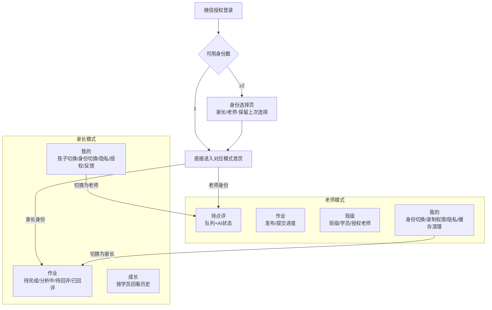
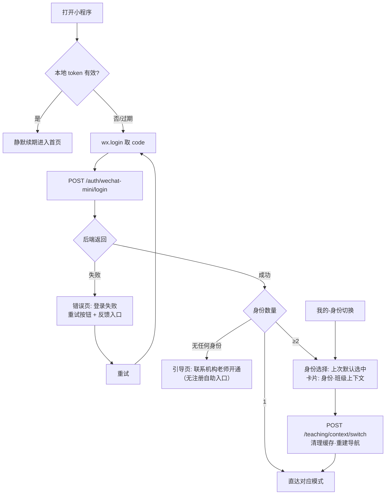
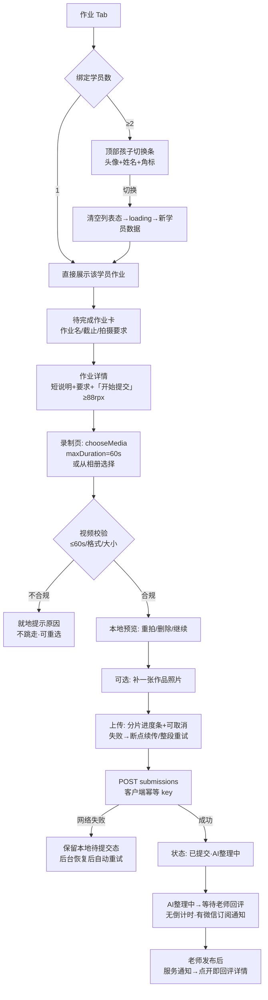
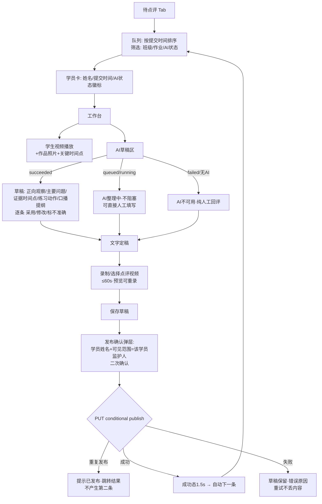
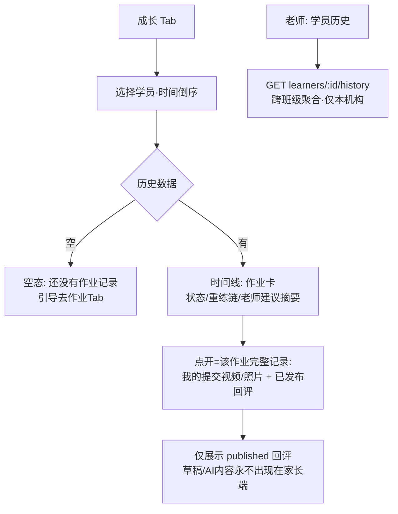

# 墨芽习字小程序：角色化 UX 原型与品牌资产规格（Step 3 交付）

> 状态：设计规格草稿，供 Step 13/14/15（moya 实现）作为输入
>
> 日期：2026-09-09
>
> 对应计划：`docs/plans/2026-09-09-moya-calligraphy-ai-review-execution-plan.md` §8、Step 3
>
> 证据目录：`docs/plans/evidence/moya-calligraphy-ai-review/STEP-03/`（含头像候选 SVG/PNG）
>
> 关联合规输入：`docs/plans/2026-09-09-moya-compliance-verification.md`（拍摄 60 秒上限、隐私指引配置门禁）

---

## 1. 信息架构（映射计划 §8.1）

同一 AppID，登录后由后端 `GET /api/v1/moya/contexts` 返回可用身份；单身份直达，多身份保留上次选择；"我的"顶部常驻身份切换。



导航规则：底部 Tab 数量家长 3 / 老师 4；身份切换后清理不属于新上下文的页面栈与缓存（MOYA-ROLE-01）；无权限入口不可见，直接访问路由仍被后端拒绝。

---

## 2. 关键流程（UX-01：全部流程无需功能说明即可走查）

### 2.1 登录与身份切换



边界：token 刷新失败次数达上限 → 退出到登录错误页，保留最后上下文便于恢复；切换身份期间所有请求排队直至新 context 生效。

### 2.2 家长：孩子切换 → 拍摄 → 上传 → 提交 → AI 等待



边界（来自 Step 2 合规核验）：拍摄上限定 60 秒（`wx.chooseMedia` maxDuration 上限）；超时长相册视频同样按 ≤60s 校验拒绝并提示原因。

### 2.3 老师：待点评队列 → 工作台 → AI 草稿核对 → 发布



### 2.4 重练闭环（老师要求重练 → 家长新 attempt）

```mermaid
flowchart TD
    A[老师发布回评时勾选 需重练] --> B[家长收到: 已回评·含重练标记]
    B --> C[回评详情底部:<br/>去重练(主) · 看回评(次)]
    C --> D[重练入口直达原作业提交页<br/>自动标注 attempt No.]
    D --> E[新提交=新 submission 记录]
    E --> F[旧回评与旧提交不修改不删除<br/>时间线可见]
    F --> G[成长页: 该作业显示<br/>第1次→第2次 状态链]
```

### 2.5 历史回看（家长-成长页 / 老师-学员历史）



### 2.6 关键页面文字线框

**家长-作业详情/提交页（竖版）**

```
┌──────────────────────────────┐
│ ← 作业详情          [孩子:豆豆▾]│  ← 多孩时显示切换条
├──────────────────────────────┤
│ 「第3课 横的写法」             │  ← 作业名 40rpx 墨黑
│ 截止 周四 20:00 · 王老师       │  ← 辅助 24rpx
│ ┌──────────────────────────┐ │
│ │ 要求: 拍摄约1分钟(≤60s)    │ │  ← 拍摄要求卡
│ │ 练习纸平放·手部入镜        │ │
│ └──────────────────────────┘ │
│                              │
│ ┌──────────────────────────┐ │
│ │      [+ 拍摄练习视频]      │ │  ← 主按钮 ≥88rpx 高
│ └──────────────────────────┘ │
│ ┌──────────────────────────┐ │
│ │ (+ 可选: 添加作品照片)     │ │  ← 次按钮 88rpx
│ └──────────────────────────┘ │
│ 提交后仅王老师和机构可见       │  ← 隐私提示 24rpx 灰
├──────────────────────────────┤
│ [作业] [成长] [我的]           │
└──────────────────────────────┘
```

**老师-回评工作台（竖版）**

```
┌──────────────────────────────┐
│ ← 回评            豆豆·第2次   │
├──────────────────────────────┤
│ ┌──────────────────────────┐ │
│ │      学生练习视频          │ │  ← video 组件
│ │      (0:48/0:55)          │ │
│ └──────────────────────────┘ │
│ 作品照片 ▸ 缩略图横滑          │
│ ── AI 观察 [徽标: 已整理✓] ── │
│ ✓ 起笔藏锋稳定      [采用][改] │
│ ! 横画收笔上扬不足  [采用][改] │
│   → 证据 0:32  [采用][改]     │
│ ▸ 口播提纲 3 条               │
│ ⚠ 需人工特别核对: 执笔姿势     │
│ ── 我的回评 ─────────────────│
│ 重点问题 [输入框]              │
│ 练习动作 [输入框]              │
│ [录制点评视频 ≤60s]            │
│ ☐ 需要重练                    │
│ ┌──────────────────────────┐ │
│ │      发布给豆豆家长 →      │ │  ← 印章红主按钮
│ └──────────────────────────┘ │
└──────────────────────────────┘
```

---

## 3. 异步步骤状态矩阵（UX-02）

每个异步步骤五态齐备；全部在页面内联表达，不弹整屏遮罩（除发布确认）。

| 步骤 | loading | success | empty | error | retry |
|---|---|---|---|---|---|
| 家长-作业列表 | 骨架屏 | 卡片列表+状态分组 Tab 徽标 | "还没有作业"插画+文案 | 顶部黄条"加载失败" | 黄条内"重试"按钮；下拉刷新 |
| 家长-视频上传 | 分片进度条+百分比+取消 | 缩略图+绿勾 | （不适用：入口即动作） | 红条"上传失败"+原因 | 断点续传或整段重试；退出保留待提交态 |
| 家长-提交 | 按钮转"提交中…"禁用 | 状态卡"已提交·AI 整理中" | （不适用） | 就地错误+保留已上传附件 | 同幂等 key 重试，不产生重复记录 |
| 家长-AI/老师等待 | 状态徽标"分析中"（无倒计时） | "待回评"→"已回评"徽标+红点 | （不适用） | "整理遇到问题·不影响老师回评"文案（AI 失败对家长不可感知为错误） | 无需用户动作（自动人工降级）；提供"联系老师"入口 |
| 家长-回评播放 | 播放器 loading | 自动横屏全屏播放 | （不适用） | "视频暂时无法播放"+原因 | "重新加载"；持续失败显示老师文字版回评 |
| 家长-成长历史 | 骨架屏 | 时间线 | "还没有记录"引导 | 黄条+重试 | 同列表 |
| 老师-队列 | 骨架屏 | 卡片+AI 徽标筛选 | "全部回评完成"正反馈空态 | 黄条+重试 | 同列表 |
| 老师-AI 草稿 | 徽标"整理中"·工作台可用 | 结构化草稿逐条可操作 | "无 AI·直接人工回评"引导 | "AI 整理失败"徽标+直接人工入口 | 无自动重试；老师可点"重新整理"一次（新任务） |
| 老师-草稿保存 | 自动保存指示"已保存"轻提示 | "草稿已保存"toast | （不适用） | "保存失败·内容保留本地" | 自动本地暂存+手动重保存 |
| 老师-点评视频上传 | 同家长上传 | 绿勾+预览 | （不适用） | 红条+原因 | 重试/重录 |
| 老师-发布 | 按钮禁用+spinner | 成功态 1.5s→自动下一条 | （不适用） | 错误原因（含"已发布"冲突→跳结果） | 保留草稿原地重试 |
| 登录/上下文切换 | 全屏品牌色 loader（唯一全屏态） | 进入首页 | 无身份→引导页 | 错误页 | 显式重试按钮 |

通用规则：empty 态必须给下一步动作；error 态文案包含"数据是否丢失"的明确说明；retry 不得重复副作用（幂等）；所有徽标/文案不使用"AI 打分""AI 老师等权威表述。

---

## 4. 视觉 Token 规格表

### 4.1 色彩

| Token | Hex | 用途 | 对比度（vs 纸白） |
|---|---|---|---|
| `--ink` 墨黑 | `#26221C` | 主文字、笔画元素、Tab 激态 | ≈15:1（AAA） |
| `--paper` 纸白 | `#FAF6EE` | 页面背景 | — |
| `--sprout` 芽绿 | `#7FA85C` | 主操作按钮、成长/成功语义、品牌绿 | ≈2.9:1（仅用于大色块/图形，按钮文字用白+加粗校验） |
| `--sprout-light` 嫩芽 | `#9CC069` | 辅助图形、浅强调、选中底色 | — |
| `--sprout-deep` 深绿 | `#5F8A43` | 叶脉细节、按下态、链接 | ≈4.6:1（AA） |
| `--seal` 印章红 | `#C3272B` | 发布等关键主按钮、待办红点、危险/撤回 | ≈5.8:1（AA） |
| `--grid` 田字格灰 | `#D9D2C0` | 分隔线、禁用底、背景格 | 装饰用，不承载文字 |
| `--ink-60` | `#26221C` 60% 透明 | 次要文字 | ≈7:1 |
| `--ink-40` | `#26221C` 40% 透明 | 辅助文字/时间戳 | ≈4.5:1（AA 下限，禁止再浅） |

规则：红绿不同时用于同一行文字；"印章红"只做主行动与警示，不做大面积背景；语义色盲兼容：成功不只靠绿色（附图标/文字）。

### 4.2 字号 / 间距 / 触控（750rpx 设计稿 = 375pt）

| Token | 值 | 用途 |
|---|---|---|
| 字号-大标题 | 40rpx / 600 | 页面标题、作业名 |
| 字号-正文 | 28rpx / 400 | 列表主文案 |
| 字号-辅助 | 24rpx / 400 | 时间、说明、隐私提示（不低于此） |
| 字号-数字强调 | 48rpx / 700 | 进度百分比、attempt 序号 |
| 行高 | 1.5 倍字号 | 全局 |
| 间距-基础栅格 | 8rpx 的倍数（16/24/32/48） | 全局 |
| 页边距 | 32rpx | 左右统一 |
| 卡片圆角 | 16rpx | 统一 |
| 触控目标 | **≥88rpx（44pt）**最小边长 | 所有可点元素（微信平台建议下限），含"采用/修改"小操作（用内边距撑足） |
| 主按钮高 | 88–96rpx | 拍摄/发布/重试 |
| 安全区 | 底部 Tab 上方 24rpx + 全面屏 home 条适配 | — |

长名称规则：孩子姓名/作业名超长时省略号+悬浮完整名（老师端含重名学员时附班级后缀）。

---

## 5. 头像资产（BRAND-01）

### 5.1 已有资产盘点（只读，未修改 moya 仓任何文件）

| 文件 | 尺寸 | 大小 | 判定 |
|---|---|---|---|
| `moya/moyalogo_144X144.png` | 144×144 PNG | 21,972 B（约 21.5KB） | < 2MB ✓ |
| `moya/moyalogo_256X256.png` | 256×256 PNG | 68,291 B（约 66.7KB） | 高清源 ✓ |

视觉评估（AI 视觉模型对照 §8.4，2026-09-09）：纸白底 ✓；粗壮墨色笔画带飞白 ✓；两片对生绿芽 ✓；虚线田字格 ✓（144 下几乎不可见，属"隐约"允许范围）；印章红小方章 ✓；无文字 ✓；圆形裁切基本适配，**风险点：红章贴近圆形裁切边缘**。结论：**硬指标全部达标，可保留使用**；是否替换由用户决定。

### 5.2 新增 3 个候选（STEP-03/assets/，全部内容收在中心安全圆内）

| 候选 | 构思 | 文件 | 圆形裁切验证（视觉模型评分） |
|---|---|---|---|
| A「悬针竖·双芽」 | 优化版现状：红章内收、笔画块面加大 | `moya-candidate-a.svg` + `_144.png`(3.4KB) + `_256.png` + `_144_circle_preview.png` | **8/10**：全部元素完整无裁切、无文字，红章完整 |
| B「一画·右芽」 | "一"字长横右端生芽，写字从一笔一画开始 | `moya-candidate-b.svg` + 同上系列 | 7.5/10：横画完整，绿芽细节小尺寸下有限 |
| C「墨点·抽芽」 | 极简大块面，小尺寸辨识度路线 | `moya-candidate-c.svg` + 同上系列 | 7/10：右上红章有贴边裁切观感，可再内收 |

验证方法：`rsvg-convert` 转 PNG → `sips` 确认 144×144 → PIL 圆形蒙版生成 `_circle_preview.png` → AI 视觉模型逐个评估。全部 PNG 均为 144×144、几 KB 量级（远小于 2MB）、无文字、无敏感元素。

推荐排序：**A（首选）> C（微调红章下移后可并列）> B**。最终采用哪个（含保留现有 logo）由用户人工确认；确认后按 §8.4 要求以 144 PNG 交付并保留 SVG 高清源。

---

## 6. 小程序介绍文案（BRAND-01）

- 字数限制：第三方来源一致为 **4–120 字**（官方公开文档未载，已于合规报告 §5 列为待人工核验项，以 mp 后台实际校验为准）。
- 计划 §8.4 基线稿：**73 字** ✓ 合规。
- **最终推荐稿（89 字）**：

> 墨芽习字为书法机构提供作业回课工具：老师发布练字作业，家长提交练习视频与作品照片，老师录制视频回评并给出练习建议，成长记录可追溯。AI仅辅助老师整理点评草稿，不直接面向学员输出。

推荐理由：首句点明"机构工具"属性以匹配非学科培训类目审核语境；明确 AI 边界（仅草稿、不面向学员）呼应产品红线 D-10；提及"视频"以与所选类目一致、避免"介绍与功能不符"驳回。

---

## 7. 给后续 Step 的依赖输出

1. → Step 12：视觉 token 表（§4）作为 moya `design/tokens` 的唯一来源；隐私指引配置门禁见合规报告 §1.6。
2. → Step 13：登录/身份切换流程（§2.1）+ 全屏 loader 唯一性规则（§3 末行）。
3. → Step 14：家长流程（§2.2/2.4/2.5）+ 文字线框（§2.6）+ 拍摄 ≤60s 硬约束 + 状态矩阵家长行。
4. → Step 15：老师流程（§2.3）+ 工作台线框 + 状态矩阵老师行 + "重新整理一次"交互。
5. → Step 18：介绍文案推荐稿（§6）直接用于发布包。
