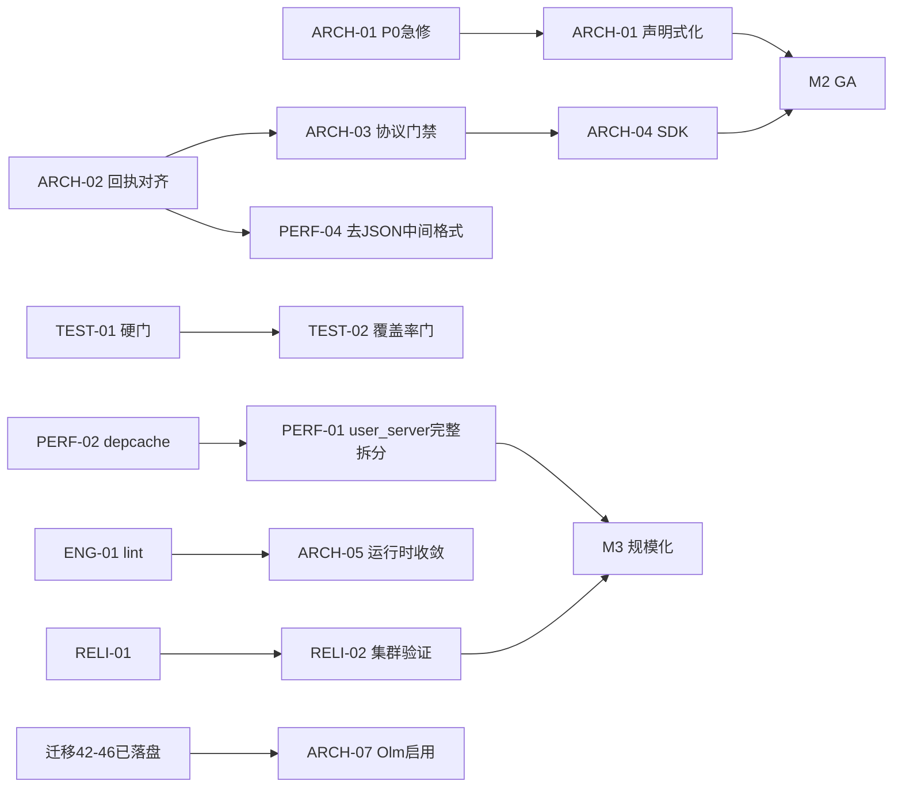

# IMBoy 演进推进序列（依赖/状态驱动，非日历）

> 配合 `architecture-roadmap.md`（总纲）与各专项文档 · 修订 2026-07-22
> **执行模型**：本路线**不设日历截止日**。任务由**前置依赖 + 出口闸门**驱动——做完一波的闸门才解锁下一波；波次内按"当前哪些任务已解锁"取任务。适配"loop 查状态 → 开新会话接着做"的推进方式：每次开工只需查**上一闸门过没过、哪些前置已满足**，而非看日期。
> 任务编号跨文档唯一；字段详情见专项文档。工作量为**相对 effort（pd=人日等价工作量，非日历工期）**。

---

## 里程碑（就绪条件驱动，无目标日期）

| 里程碑 | 进入条件（前置） | 出口标准（闸门绿=达成） |
|---|---|---|
| **M1 可售最小安全线** | 无（立即可启动） | 5 个发布阻断项清零；能对外私有化交付且无越权/无法务风险 |
| **M2 1.0 GA** | M1 达成 | SDK 端到端通；CI 全硬门；协议契约门禁就位；权限收口 |
| **M3 规模化就绪** | M2 达成 | 单节点吞吐提升一个量级；消息热路径去单进程；集群正确性达标 |
| **M4 平台化** | M3 达成 | IM+Agent 职责分离；E2EE 收敛；多租户隔离达标；可观测闭环 |

> 里程碑是**状态**不是**日期**：达成 = 其出口标准全绿。快则数波、慢则更多波，不卡死。

---

## Wave 0 · 稳定化 / 解阻断（→ M1）

**进入条件**：无。**主题**：清阻断项，达可售最小安全线。不引入新架构，只做急修 + 兜底。

| 任务 | 出口（完成判据） | 相对 effort |
|---|---|---|
| ARCH-01 P0-1 前缀急修 + 豁免矩阵测试 | 支付回调/webhook 免签恢复生效 | S |
| ARCH-02 WS 回执路径对齐 | C2S ACK / C2G 错误在 v2 可达 | S |
| PERF-02 depcache ACK 定时器改并发 ETS 表(write_concurrency) | 消息热路径不过单进程 call | M |
| PERF-01 user_server 上下线卸载（急修部分）| 离线检查改阈值查询，不拉 5000 行 | S |
| SEC-01 计费 9 端点补归属校验 | 任意 JWT 无法操作他租户账单 | S |
| SEC-02 钱包借记补 frozen/status + 表级 CHECK | 冻结资金不可花 | S |
| SEC-00 AGPL 法务裁决（产品决策）| vodozemac 授权路径定案 | 决策 |
| SEC-03 首启向导 401 修复（在 TASKS.md 并入 W1-ARCH-01 执行） | 全新部署可初始化 | S |

> **Wave 0 闸门（= M1）**：GATE-W0 追踪的 7 项（ARCH-01/ARCH-02/PERF-02/PERF-01/SEC-01/SEC-02/SEC-00）全绿 + 一轮真机回归。SEC-03 setup 401 在 TASKS.md 并入 W1-ARCH-01，不单列 GATE-W0 依赖。闸门绿才进 Wave 1。

---

## Wave 1 · GA 硬化（→ M2）

**进入条件**：Wave 0 闸门绿。**主题**：协议/可靠性/权限收口，软门变硬门，SDK 复活。

| 任务 | 出口 | 前置 | effort |
|---|---|---|---|
| ARCH-01 鉴权声明式化（完整）| 鉴权属性路由单一声明 | ARCH-01 P0 急修 | L |
| ARCH-03 协议 CI 门禁（proto/OpenAPI/ws_url）| 契约漂移 PR 阶段拦截 | ARCH-02 | M |
| ARCH-04 SDK 对齐 + E2E 冒烟 | SDK 端到端通，进发版门禁 | ARCH-03 | M |
| TEST-01 后端 full-eunit + dialyzer 收紧为硬门 | continue-on-error 移除 | — | M |
| TEST-02 三仓覆盖率阈值门 | 覆盖率可验证 | TEST-01 | M |
| TEST-03 admin Playwright E2E 进 CI | 前端回归自动化 | — | S–M |
| TEST-05 排查 integration_test.yml（CRITICAL）| 确认是否曾运行 / 修复或删冗余 | — | M |
| ENG-01 Flutter custom_lint | 约定变 lint 硬门 | — | M |
| ENG-02 Flutter DDL 单一真源 + CI 校验 | schema 三镜像不再手工同步 | — | M |
| SEC-04 JWT 吊销 + 密码 KDF 升级 + 密钥拆分 | 会话可吊销，口令抗暴力破解 | — | L |
| RELI-01 message_retry 全量扫描 + 集群 syn Pid 修复 | 失败消息不丢，集群不崩 | — | M |

> **Wave 1 闸门（= M2）**：SDK E2E 绿 + CI 全硬门 + P1 台账清零。

---

## Wave 2 · 规模化（→ M3）

**进入条件**：Wave 1 闸门绿。**主题**：并发热路径重构，集群正确性，E2EE 收敛启动。

| 任务 | 出口 | 前置 | effort |
|---|---|---|---|
| PERF-01 user_server 完整拆分（上下线 DB 写与 fanout 异步化）| 上下线不串行化 | PERF-02、Wave0 急修部分 | L |
| PERF-03 C2G 扇出异步化 | 大群发送不阻塞发送者进程 | — | M |
| PERF-04 投递管道去 JSON 中间格式 | protobuf 客户端零 re-encode | ARCH-02 | M |
| PERF-05 连接池真超时 + prepared statement 缓存 | 慢查询不占死池，不盲重试 | — | M |
| PERF-06 statement_timeout 全链路 | 慢查询有界 | — | S |
| ARCH-05 Flutter 运行时收敛（分期）| 手写单例纳入 Riverpod 图 | ENG-01 lint | XL |
| ARCH-07 Olm-only cutover 客户端启用（分期）| 新 C2C 走 Olm | 迁移 42–46 已落盘 | L |
| RELI-02 集群模式端到端验证 | 多节点消息投递正确 | RELI-01 | M |

> **Wave 2 闸门（= M3）**：压测证明单节点吞吐提升一个量级 + 集群回归绿。

---

## Wave 3 · 平台化（→ M4）

**进入条件**：Wave 2 闸门绿。**主题**：平台职责分离，多租户成熟，可观测闭环，长期债清理。

| 任务 | 出口 | effort |
|---|---|---|
| ARCH-06 后端平台职责分离（监督子树拆分）| Agent/MCP/插件故障隔离 | L |
| ARCH-07 收尾 + RSA 写路径下线 | 密钥体系统一 | L |
| ENG-03 巨型文件拆分（chat_page.dart 2234 行等 12+）| 消息主链路文件达标 | L |
| SEC-05 多租户隔离审计 + TimescaleDB 生命周期治理 | 租户隔离达标，归档链一致 | L |
| ENG-04 ADR 补齐 + 死资产清理（liveRoom）| 决策可追溯，无死设施 | M |
| OBS-01 可观测闭环（SLA 告警联动）| 平台级 SLA 可度量 | M |

> **Wave 3 闸门（= M4）**：平台级 SLA 达标 + 多租户隔离审计通过。

---

## 依赖关系（真正的驱动器 — loop 取任务看这张图）

> **每次开工的判断法**：一个任务"可做"当且仅当它所有前置箭头的上游都已绿。没有前置的任务随时可取。

**硬约束（顺序不可违反）**：
1. ARCH-01 P0-1 前缀急修**最先**（支付回调当前生产失效）。
2. PERF-02（depcache）**先于** PERF-01 完整拆分（depcache 是更独立的单点）。
3. ENG-01 lint **先于** ARCH-05 运行时收敛（先建门禁再迁移，防复发）。
4. ARCH-02 回执对齐 **先于** ARCH-03 协议门禁 **先于** ARCH-04 SDK。

---

## 相对工作量（effort，非日历）

| 波次 | 相对总量（pd 等价，仅供排序不锚定日期）| 说明 |
|---|---|---|
| Wave 0 | ~30 | 全为急修/兜底，可并行压缩 |
| Wave 1 | ~60 | 门禁 + SDK + 收口 |
| Wave 2 | ~90 | 热路径重构，含 XL 的运行时收敛 |
| Wave 3 | ~70 | 平台化 + 长期债 |

> pd 是**相对工作量**用于波次内排序与容量粗估，**不换算成日历日期、不设截止日**。实际进度由闸门状态决定：查"上一闸门绿没绿"即知当前可做什么。
