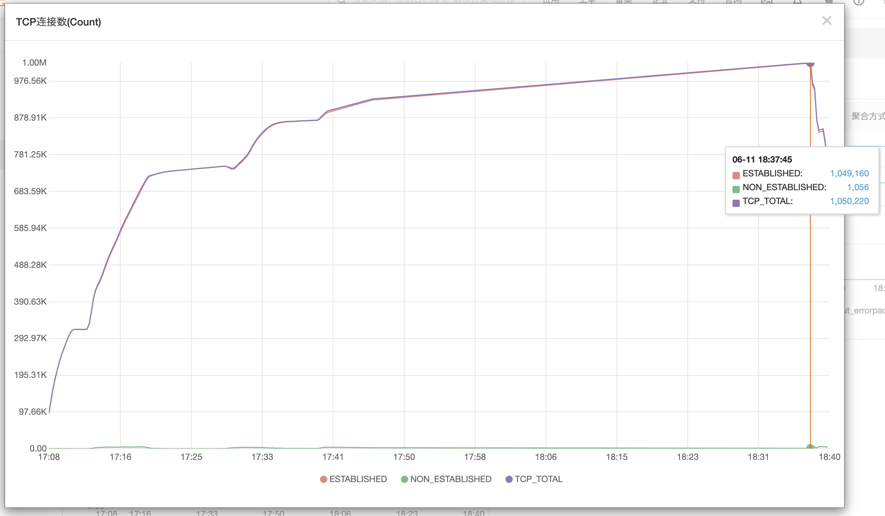
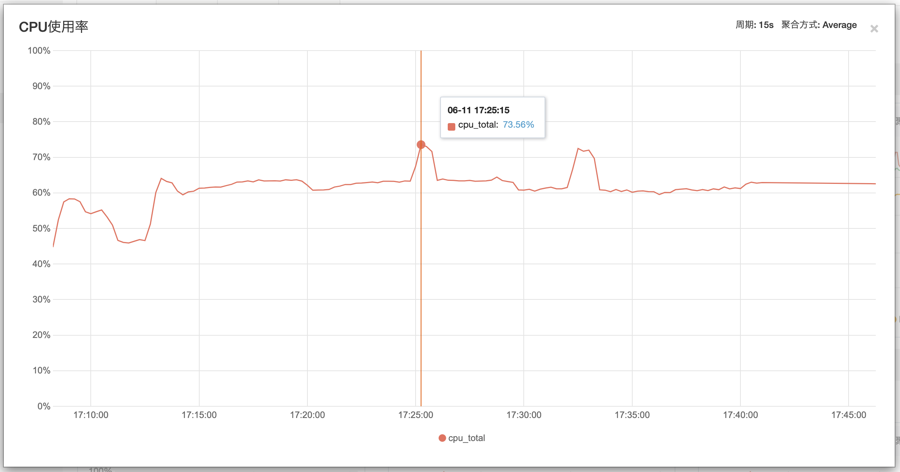
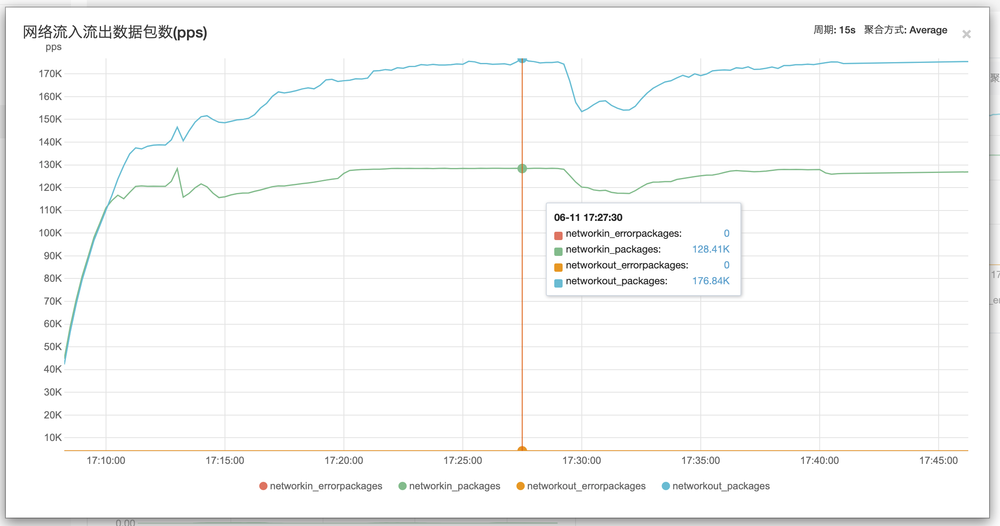
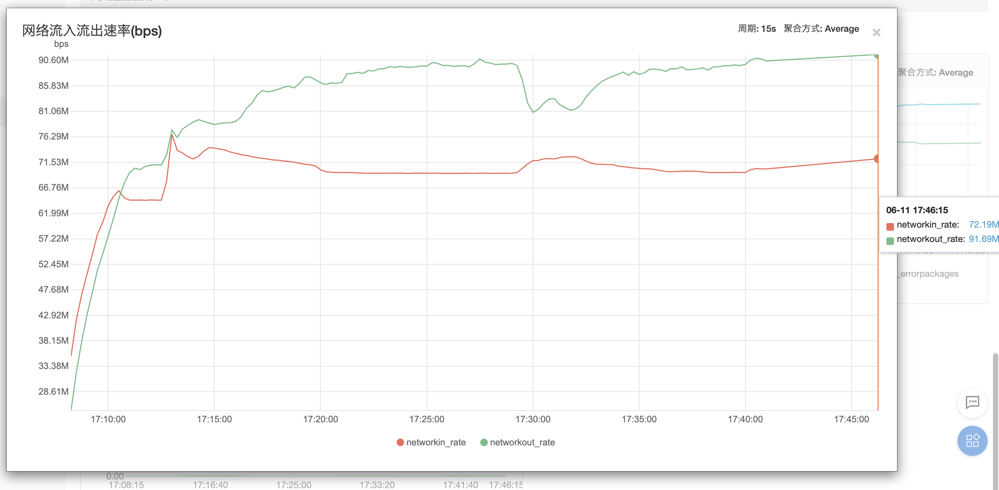

# 测试环境

## 系统环境
CentOS Linux release 8.1.1911 (Core)

## 网络的拓扑图
无

## 客户端环境
客户端 17台阿里云服务器 CentOS8 2CPU 4G内存；带宽（上行12Mb/s 下行1000Mb/s）

## 服务端环境
CentOS8 阿里云 8核16G ecs.sn1ne.2xlarge主机；带宽（上行12Mb/s 下行1000Mb/s）

# 测试工具
* 自制Erleng websocket 客户端 [wsc1.erl](https://gitee.com/imboy-pub/imboy-api/blob/main/test/wsc1.erl)；
* 自制Erleng websocket 客户端 [wsc2.erl](https://gitee.com/imboy-pub/imboy-api/blob/main/test/wsc2.erl)；
* 阿里云监控平台

# 测试场景
websocket在线，执行时长90min，TCP并发数100W+，不涉及Tps（sec），成功率 99.8994%

# 测试结果

## 服务端 TCP连接数(Count)


## 服务端 内存使用量 (总量16G)


## 服务端 CPU使用率


## 服务端 网络流入流出数据包数(pps)


## 服务端 网络流入流出速率(bps)


# 其他

服务器CPU使用率 top 500% 左右

服务端内存10G左右

erlang虚拟机配置
```
[root@launch-master test]# cat config/vm.args
-name test@127.0.0.1
-setcookie test
-heart

+K true
+A 1024
+P 20480000
+Q 20480000
+S 6
+MSe true
```


停服务器之前的Socket链接、内存占用情况
```
[root@launch-master ~]# free -h
              total        used        free      shared  buff/cache   available
Mem:           15Gi        10Gi       3.8Gi       0.0Ki       1.4Gi       6.0Gi
Swap:            0B          0B          0B
[root@launch-master ~]# netstat -n | awk '/^tcp/ {++S[$NF]} END {for(a in S) print a, S[a]}'
SYN_RECV 346
ESTABLISHED 1030314
FIN_WAIT1 540
FIN_WAIT2 702
TIME_WAIT 33
[root@launch-master ~]# ps aux|grep cloudmonitor
root      1897  0.0  0.0  23020  3264 ?        Ss   16:58   0:00 /usr/local/cloudmonitor/bin/argusagent -d
root      1899  5.6  0.1 970604 19468 ?        Sl   16:58   3:29 /usr/local/cloudmonitor/bin/argusagent
root      4800  0.0  0.0  12320  1068 pts/0    S+   17:59   0:00 grep --color=auto cloudmonitor
[root@launch-master ~]# free -h
              total        used        free      shared  buff/cache   available
Mem:           15Gi        10Gi       3.7Gi       0.0Ki       1.4Gi       5.7Gi
Swap:            0B          0B          0B
[root@launch-master ~]# netstat -n | awk '/^tcp/ {++S[$NF]} END {for(a in S) print a, S[a]}'
SYN_RECV 864
ESTABLISHED 1043283
FIN_WAIT1 1209
FIN_WAIT2 1163
SYN_SENT 1
TIME_WAIT 150
[root@launch-master ~]# free -h
              total        used        free      shared  buff/cache   available
Mem:           15Gi        10Gi       3.6Gi       0.0Ki       1.4Gi       5.3Gi
Swap:            0B          0B          0B
[root@launch-master ~]# ps aux|grep cloudmonitor
root      1897  0.0  0.0  23020  3264 ?        Ss   16:58   0:00 /usr/local/cloudmonitor/bin/argusagent -d
root      1899  6.2  0.1 970604 19884 ?        Sl   16:58   4:45 /usr/local/cloudmonitor/bin/argusagent
root      4840  0.0  0.0  12320  1076 pts/0    S+   18:14   0:00 grep --color=auto cloudmonitor
[root@launch-master ~]# netstat -n | awk '/^tcp/ {++S[$NF]} END {for(a in S) print a, S[a]}'
SYN_RECV 498
ESTABLISHED 1054101
FIN_WAIT1 937
FIN_WAIT2 1017
SYN_SENT 2
TIME_WAIT 67
[root@launch-master ~]# netstat -n | awk '/^tcp/ {++S[$NF]} END {for(a in S) print a, S[a]}'
SYN_RECV 686
ESTABLISHED 1051642
FIN_WAIT1 991
FIN_WAIT2 1139
SYN_SENT 2
TIME_WAIT 114
[root@launch-master ~]# netstat -n | awk '/^tcp/ {++S[$NF]} END {for(a in S) print a, S[a]}'
SYN_RECV 523
ESTABLISHED 1053550
FIN_WAIT1 1038
FIN_WAIT2 1143
TIME_WAIT 80
[root@launch-master ~]# netstat -n | awk '/^tcp/ {++S[$NF]} END {for(a in S) print a, S[a]}'
SYN_RECV 502
ESTABLISHED 1053268
FIN_WAIT1 999
FIN_WAIT2 1036
SYN_SENT 1
```
